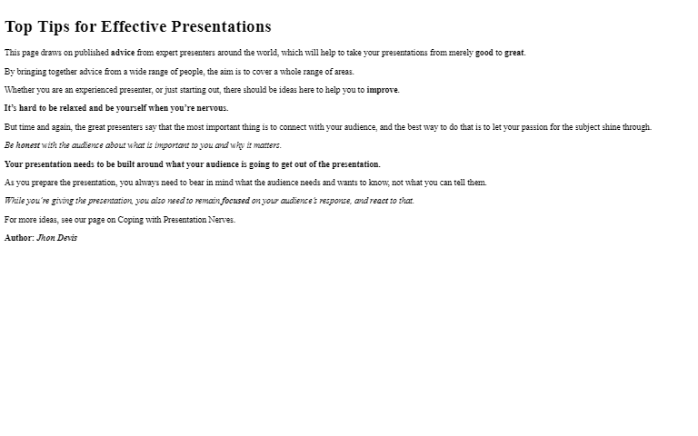

# Exercise: Introduction to HTML and CSS

Problems for exercises and homework for the [\"HTML and CSS\" course @
SoftUni](https://softuni.bg/trainings/3122/html-and-css-september-2020).

## 01\. Simple HTML Page

Create a web page like the following:

### Constraints

-   Change the document **title** to *Simple HTML Page*

-   Use **paragraph** tag for plain text and **strong** tag for bold
    text

## 02\. Tags Cardio - Paragraphs

Create a web page like the following:

### Constraints

-   Change the document **title** to **Paragraphs**

-   Use the **h1** tag for heading

-   Use **p** tags for each line of the text

-   See the screenshot and use **strong** and **em** tags where needed

## 03\. Single Article Page

Create a web page like the following:

### Constraints

-   Change the document **title** to **Single Article Page**

-   Create an **article** with several items inside

    -   Use **h2** and **h4** tags for headings

    -   Use **p** tags for the text

    -   Use **img** tag for the photo

## 04\. Tags Cardio - Lists

Create a web page like the following:

### Constraints

-   Change the document **title** to **Lists**

-   Add **section** with two articles inside (for each list)

-   Each article must have a **h2** heading

    -   Use **ul** for unordered list

-   Add four list items

    -   Use **ol** **reversed** for ordered reversed list

-   Add three **list** items

## 05\. Tags Cardio - Nested Lists

Create a web page like the following:

### Constraints

-   Change the document **title** to **Nested** **Lists**

-   Use **h2** tag for heading

-   Use different types for **ordered** and **unordered** lists

-   See the screenshot and use different type attribute as **circle**,
    **disc** etc.

## 06\. Tags Cardio - Table

Create a web page like the following:

### Constraints

-   Change the document **title** to **Checkout tablе**

-   Use **h2** tag for heading

-   Use **table** tag to create a table

-   Use **tr** tag for rows

-   Use **th** and **td** tags for columns

-   Use **span** tag with value **checked** for checked items
