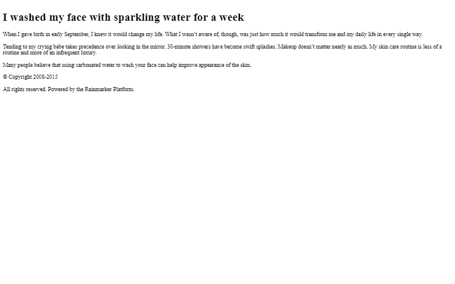
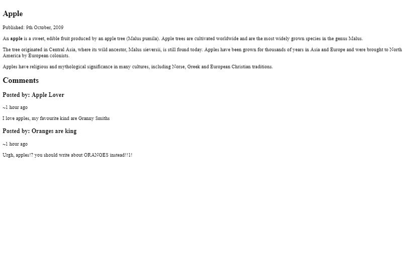
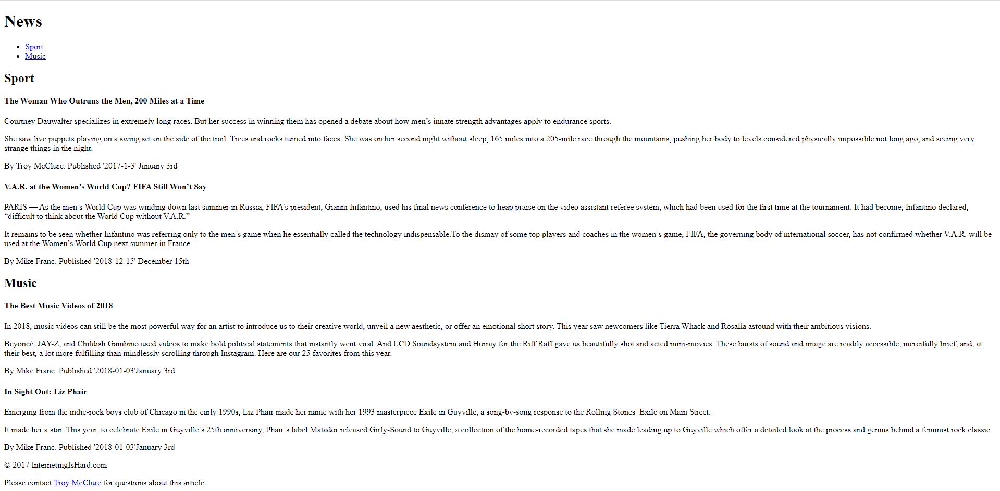
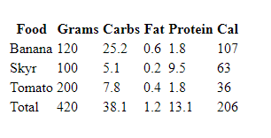
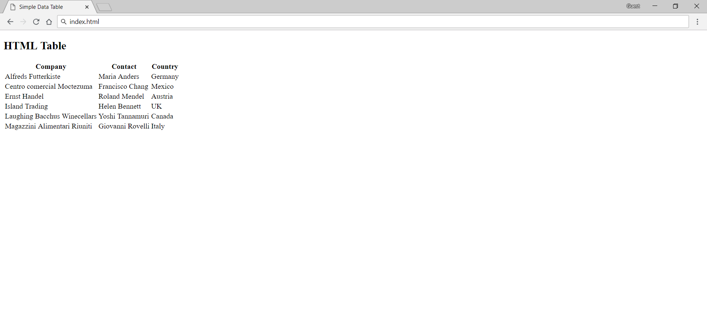
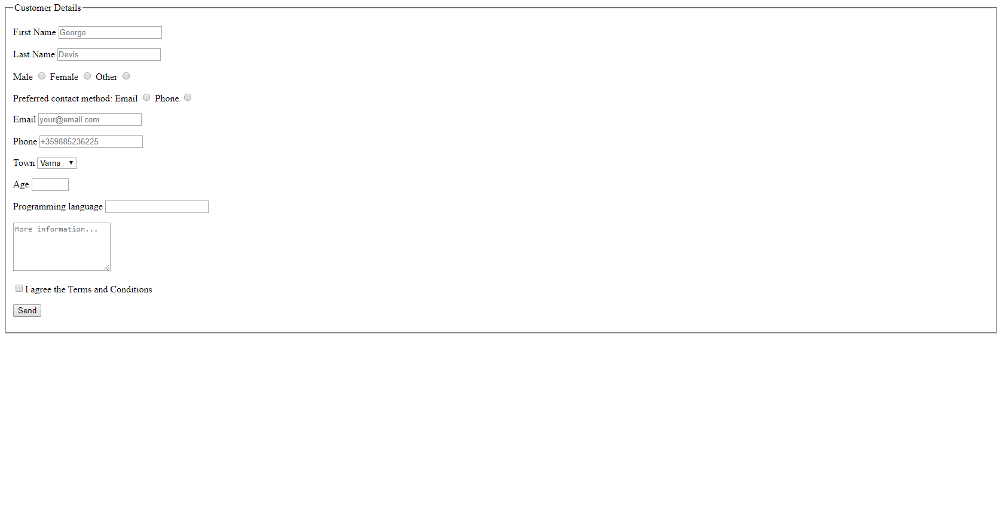
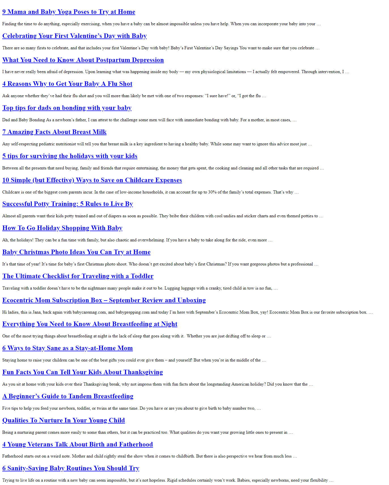
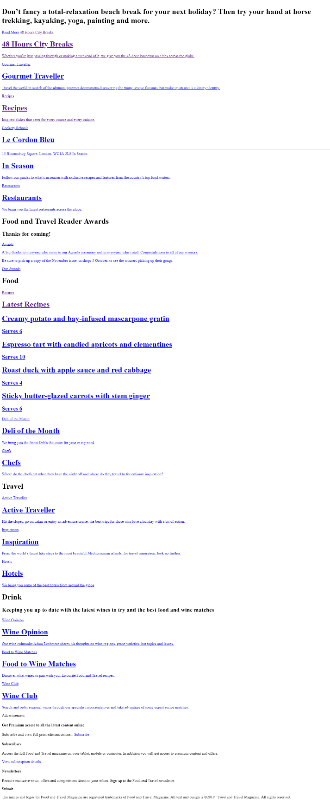
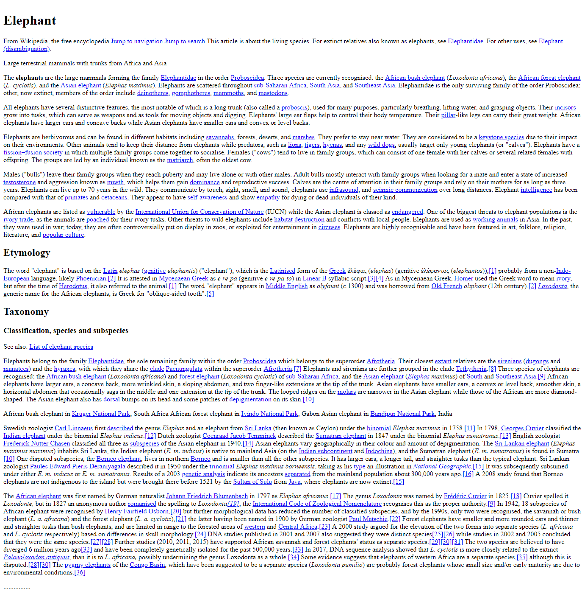
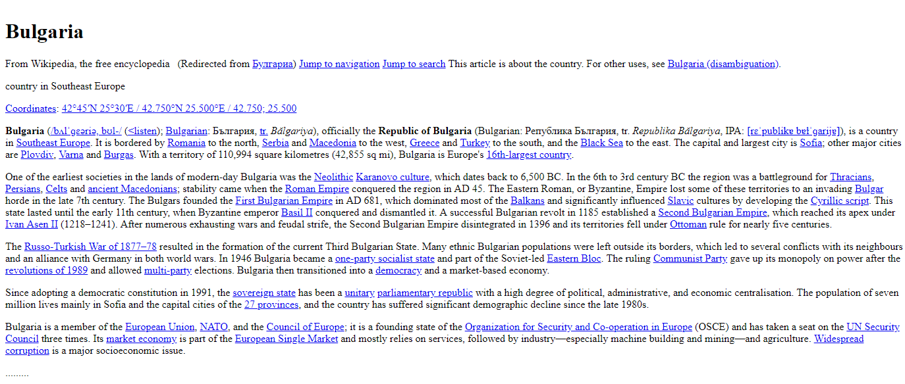

# Exercise: HTML Structure

Problems for exercises and homework for the [\"HTML and CSS\" course @
SoftUni](https://softuni.bg/trainings/3122/html-and-css-september-2020).

## 01\. Semantic Tags

Create a web page like the following:

### Constraints

-   The title should be \"**Semantic Tags**\"

-   Add **header** tag for the header section

-   Use **h1** tag for the heading

-   Add **main** tag for the main content

-   Create two paragraphs inside (**p** tag)

-   Use **footer** tag for the last section

-   Create two paragraphs inside (**p** tag)

## 02\. Semantic Article Page

Create a web page like the following:

### Constraints

-   The title should be \"**Semantic Article Page**\"

-   Use **article** tag to create an article

    -   The article has header with **h1** heading and a **paragraph**
        for the published date inside

-   Use **p** tag to create 3 paragraphs after the **header**.

    -   The paragraphs contain the article content *(info for apple)*

    -   Use **b** tag where is needed

-   Use **section** tag to create the \"**Comment section**\"

    -   Add **two articles** inside the section

    -   Each **article** has a **heading (h2)** for the **title**

    -   Each **article** has **two paragraphs** for the **time** and the
        **comment**

## 03\. Semantic Blog Layout

Create a web page like the following:

### Constraints

-   The title should be \"**Semantic Blog Layout**\"

-   Use **header** tag for the header section

    -   Use **h1** tag for the heading

    -   Use **nav** tag for the navigation with an unordered list
        (**ul**) inside

        -   Create two **list** items with **anchor** (**a**) tags
            inside

-   Use **main** tag for the page main content

    -   Create two **sections** in the main. Each section has:

        -   A header with **h2** heading

        -   Two articles with **h4** heading and three **p** tags inside

        -   For the dates use **time** tag

-   Use **footer** tag with **two** paragraphs Inside

    -   Use **anchor** tag for the name in the last sentence

##  04\. Semantic Tables

Create a web page like the following:

### Constraints

-   The title should be \"**Semantic Tables**\"

-   Use **h1** tag for the heading

-   Use **table** tag to create a table

    -   Use **thead** tag for table head

    -   Use **tbody** tag for table body

    -   Use **tfoot** tag for table footer

-   Use **tr** tag for rows

-   Use **th** and **td** tags for columns

## 05\. Tags Cardio - DataTable

### Constraints

-   Change the document **title** to \"**Simple** **Data** **Table\"**

-   Use **h2** tag for heading

-   Use **table**, **thead**, and **tbody** tags to create table

-   Use **tr** tag for rows

-   Use **th** and **td** tags for columns

## 06\. Tags Cardio - Forms

Create a web page like the following:

### Constraints

-   Change the document **title** to \"**Forms\"**

-   Use a **form** tag

-   Use a **fieldset** tag with **legend** - \"**Customer**
    **Details**\"

-   Each **input** tag should have a **label** and should be inside a
    **div**

    -   The **first** input field must be **focused**

    -   The **3rd** and the **4th** input rows should be of
        **type=\"radio\"**

    -   The **5th** input tag should be of **type=\"email\"**

    -   The **7th** label should have **select** tag and **option** tags
        with the city name values

    -   The **8th** label should have input tag with **type=\"number\"**
        (with **min value** - 18 and **max value** - 70)

    -   The **9th** label should have **datalist** tag and **option**
        tags with the languages type value

    -   The **10th** label should have **textarea** tag with **5 rows**
        and **20 columns**

    -   The **11th** label should have input tag with
        **type=\"checkbox\"** that is **checked**

    -   The **12th** label should have input tag with
        **type=\"submit\"**

-   The **placeholders** are obligatory

##  07\. Clean Up Baby Magazine

Open <https://www.babycaremag.com/> and copy the HTML code of the
website. Open the copied code in your IDE and clean it up.

### Constraints

-   Remove all **link**, **script** and **meta** tags

-   Leave only the **title** in the **head tag**

-   Clean up all **CSS**

-   Remove all **div**, **table**, **tbody**, **tr**, **th**, **td**,
    **ul**, **ol**, **li,** **span**, **label**, **dl**, **dd** tags

-   Leave only **headings** and **p** tags in the body

    -   Remove all **class**, **id**, **style** attributes in headings
        and paragraphs

    -   Remove all **img** tags from paragraphs

    -   Leave only the text and **a** tags in the paragraphs

-   Remove **title**, **class** attributes from the **a** tags

-   Only **articles** should remain in your HTML file. Each article must
    have:

    -   A **h2** tag with **a** tag inside with the article title

    -   A **paragraph** with the article text

    -   You must delete everything else in the body tag

### Hints:

To download the HTML code, click **Ctrl+S** and save the files.

## 08\. Clean Up - Magazine

Open <https://foodandtravel.com/> and copy the HTML code of the website.
Open the copied code in your IDE and clean it up.

### Constraints

-   Remove all **link**, **script** and **meta** tags

-   Leave only the **title** at the **head**

-   Clean up all **CSS**

-   Remove all **div**, **table**, **tbody**, **tr**, **th**, **td**,
    **ul**, **ol**, **li**, **span**, **label**, **dl**, **dd** tags

-   Leave only **headings** and **p** tags in the body

    -   Remove all **class**, **id**, **style** attributes in headings
        and paragraphs

    -   Remove all **img** tags from paragraphs

    -   Leave only the **text** and the **a** tags in the paragraphs

-   Remove **title**, **class** attributes from the **a** tags

-   The first text on your page must be the title **\"Don\'t fancy a
    total-relaxation\...\"**

### Hints:

To download the HTML code, click **Ctrl+S** and save the files

## 09\. Clean Up - Wiki Elephant

Open <https://en.wikipedia.org/wiki/Elephant> and copy the HTML code of
the website. Open the copied code in your IDE and clean it up.

### Constraints

-   Remove all **link**, **script** and **meta** tags

-   Leave only the **title** at the **head**

-   Clean up all **styles (CSS)**

-   Remove all **div**, **table**, **tbody**, **tr**, **th**, **td**,
    **ul**, **ol**, **li**, **span**, **label**, **dl**, **dd** tags

-   Leave only **headings** and **p** tags in the body

    -   Remove all **class**, **id**, **style** attributes in headings
        and paragraphs

    -   Remove all **img** tags from paragraphs

    -   Leave only the **text** and the **a** tags in the paragraphs

-   Remove **title**, **class** attributes from the **a** tags

## 10\. Clean Up - Wiki Bulgaria

Open <https://en.wikipedia.org/wiki/Bulgaria> and copy the HTML code of
the website. Open the copied code in your IDE and clean it up.

### Constraints

-   Remove all **link**, **script** and **meta** tags

-   Leave only the **title** at the **head**

-   Clean up all **styles (CSS)**

-   Remove all **div**, **table**, **tbody**, **tr**, **th**, **td**,
    **ul**, **ol**, **li**, **span**, **label**, **dl**, **dd** tags

-   Leave only **headings** and **p** tags in the body

    -   Remove all **class**, **id**, **style** attributes in headings
        and paragraphs

    -   Remove all **img** tags from paragraphs

    -   Leave only the **text** and the **a** tags in the paragraphs

-   Remove **title**, **class** attributes from the **a** tags

-   Delete everything under the text with title \"**Sports\"**
