# Exercise: CSS & Typography

Problems for exercises and homework for the [\"HTML and CSS\" course @
SoftUni](https://softuni.bg/trainings/3122/html-and-css-september-2020).

## 01\. My First CSS Document

Create a web page like the following:

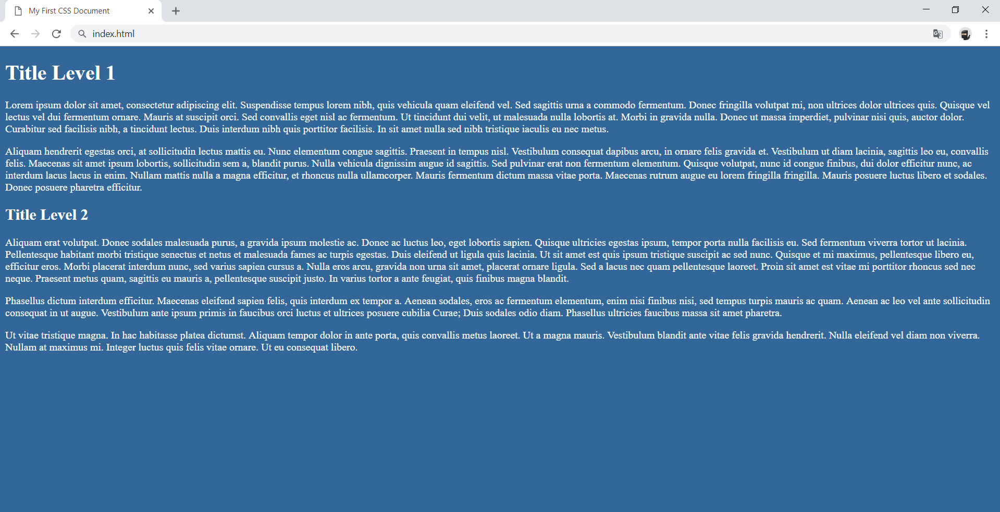

### Constraints

-   Change the document **title** to \"**My First CSS Document**\"

-   Use **h1** and **h2** tags for headings

-   Use background with color - **rgb(51, 102, 153)**

-   Use white **color** for text

## 02\. Style Lists

Create a web page like the following:

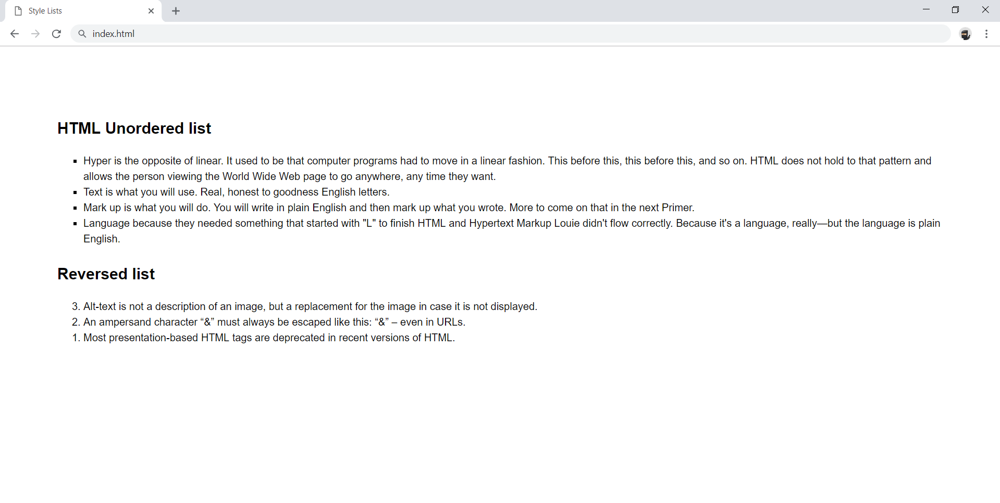

### Constraints

-   Change the document **title** to \"**Style Lists**\"

    -   Use **font-family: Helvetica, sans-serif**, with **font-size:
        16px** and **line-height: 1.5**

-   Add section with two articles inside (for each list)

-   Each article must have a **h2** heading

-   Use **ul** for unordered list

    -   Add **4** list items

-   Use **ol reversed** for ordered reversed list

    -   Add **3** list items

## 03\. Styling Tables

Create a web page like the following:

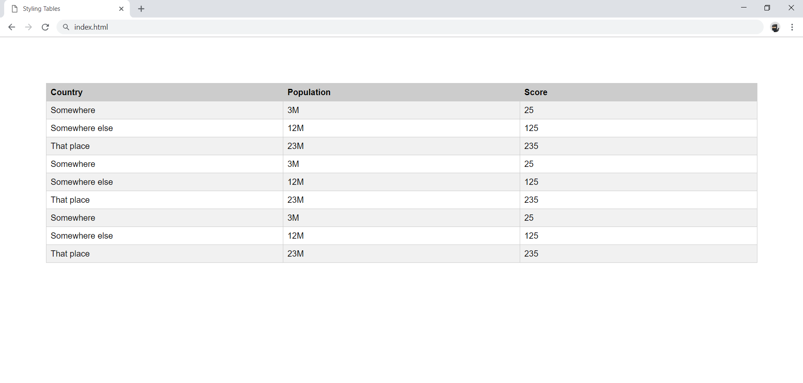

### Constraints

-   Change the document **title** to \"**Styling Tables\"**

-   Use **table** tag

    -   Use **thead** and **tbody** tags

    -   Style the odd **tr** tags with background: **rgb(241, 241,
        241)**

    -   The **table**, **td** and **th** tags must have

        -   Border width - **1px**

        -   Border color - **rgb(221, 221, 221)**

        -   Border style - **solid**

-   When you **hover** the table row, the following styles must be
    updated:

    -   Background: **rgb(0, 0, 0)**

    -   Text color: **rgb(255, 255, 255)**

## 04\. Buttons CSS

Create a web page like the following:

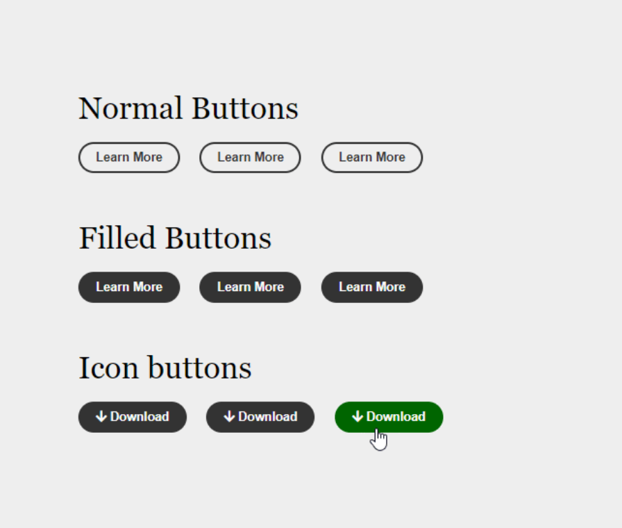

### Constraints

-   Create an **\"index.html\"** file with title - **\"Buttons CSS\"**

-   Use **h2** tag for headings

-   Create 9 buttons on 3 rows with class **button**

    -   For the first button in each row use **a** tag

    -   For the next two buttons in the row use **button **tags

    -   The buttons in the second and the third row should have class
        - **fill**

    -   Every last button in the row should have class - **hover**

-   You must use the following three colors:

    -   green(rgb(0, 102, 0))

    -   white(rgb(251, 251, 251))

    -   gray(rgb(51, 51, 51))

-   Use **FontAwesome** for this task. Import it in your CSS, with
    the **\@import** rule.

### Hints

-   Change the **cursor** property
    to [pointer](https://www.w3schools.com/cssref/pr_class_cursor.asp)

-   Change the **outline** property
    to [none](https://www.w3schools.com/Css/css_outline.asp)

## 05\. Fonts Speciment - Cormorant + Lato

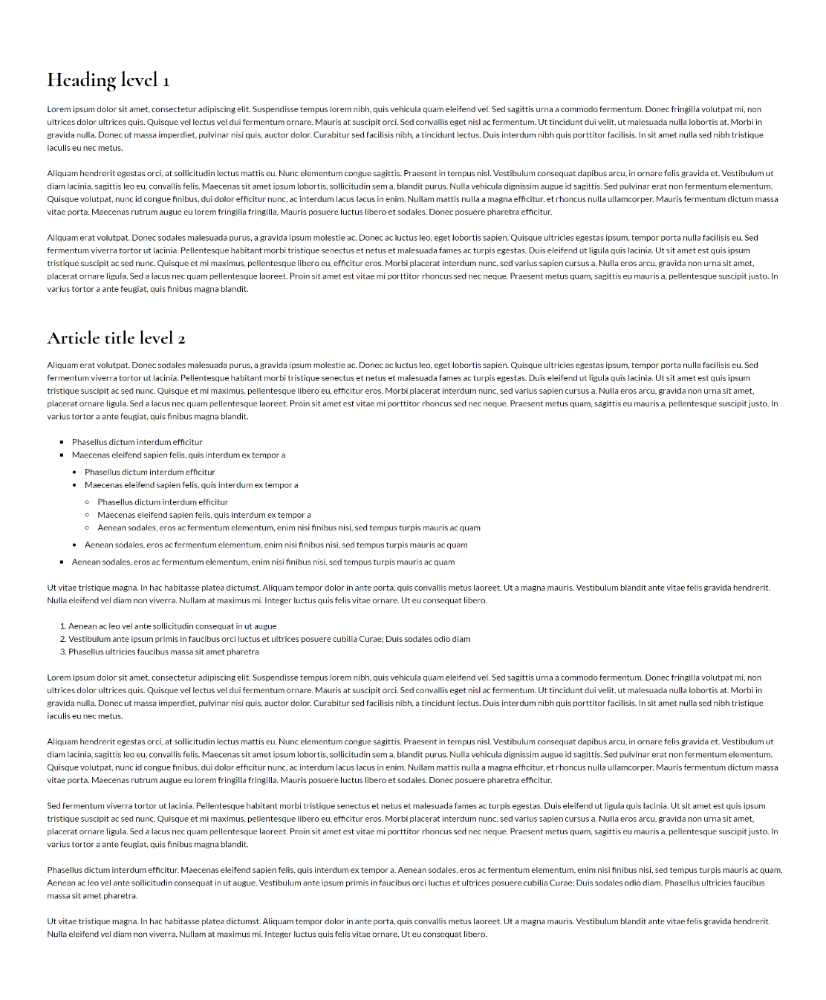

### Constraints

-   Create an **index.html** file with **Fonts Speciment Cormorant +
    Lato** title

-   Use **Lato, sans-serif** font-family for the document

    -   Make the **font-size** 16px

    -   Change the **line-height** to 1.5

-   Use **Cormorant, serif** font-family for the headings

    -   Change the **line-height** to 1.2

    -   Change the font weight to **bold**

## 06\. Fonts Speciment - Great Vibes + Raleway 

Create a web page like the following:

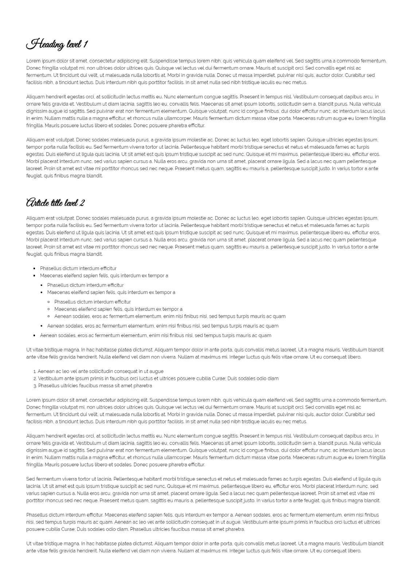

### Constraints

-   Create an **index.html** file with \"**Fonts Speciment Great Vibes +
    Raleway**\" title

-   Use **Raleway,** **sans-serif** font-family for the document

    -   Make the **font-size** 16px

    -   Change the **line-height** to 1.5

-   Use **Great Vibes,** **cursive** font-family for the headings

    -   Change the **line-height** to 1.2

    -   Change the font weight to **bold**

## 07\. Contrasting Colors

Create a web page like the following:

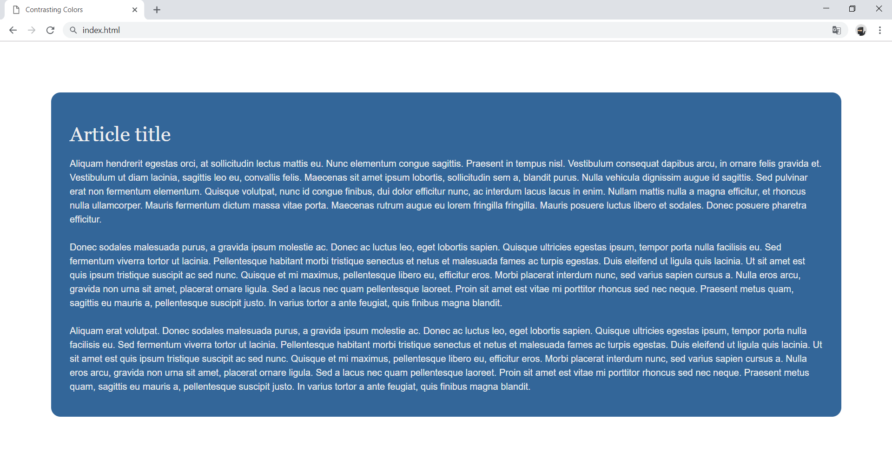

### Constraints

-   The document title should be \"**Contrasting Colors\"** 

-   Create an **article** inside the body

    -   Make the background with **rgb(51, 102, 153)** color

    -   Set the border radius to **1rem**

-   Use **Helvetica, sans-serif** font-family for the document

    -   Make the **font-size** 16px

    -   Change the **line-height** to 1.5

-   Use **Georgia, serif **font-family for the headings

## 08\. Icon Font Buttons

Create a web page like the following:

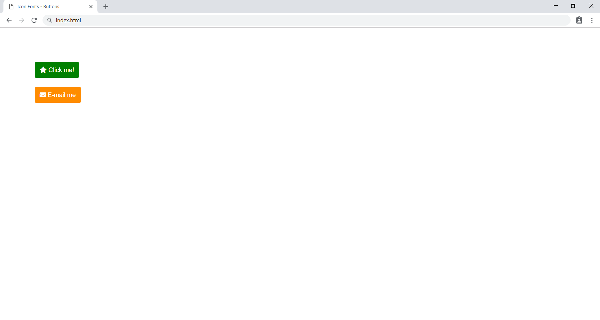

### Constraints

-   The document title should be \"**Icon Fonts - Buttons**\"

-   Each of the **paragraphs** should have exactly
    1 **anchor** (*\<***a***\>*)

-   Each of the **anchors** should have exactly one **icon
    element** (\<**i**\>)

-   The **first anchor** should have text - \"**Click me!**\"

-   The **second anchor** should have text - \"**E-mail me**\"

-   The **page** should be styled, exactly like the provided screenshot

-   Use **FontAwesome** for this task. Import it in your CSS, with
    the **\@import** rule

## 09\. Icon Font List

Create a webpage like the following:

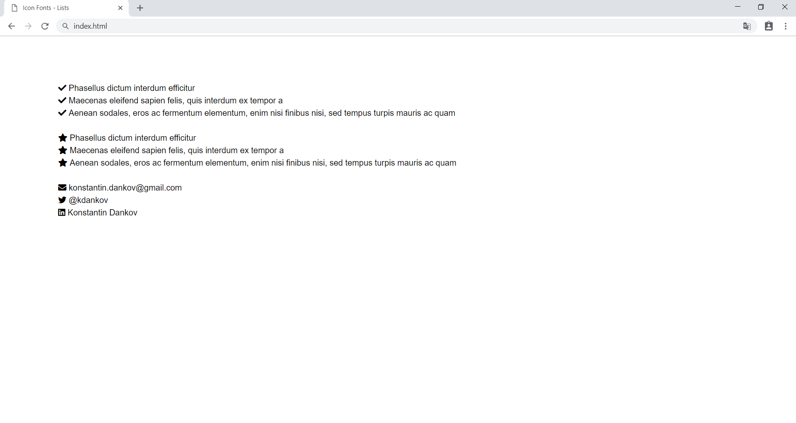

### Constraints

-   The **title** of the document should be \"**Icon Fonts - Lists**\"

-   The **unordered lists** should have class - \"**icons**\"

-   Each of the **unordered lists** should have exactly 3 **list
    items** (**li**)

-   Each of the **list items** should have exactly one **icon
    element** (**i**)

-   The **page** should be styled, exactly like the provided screenshot

-   Use FontAwesome for this task. Import it in your CSS, with
    the **\@import** rule

## 10\. Create Typography CSS

Create a web page like the following:

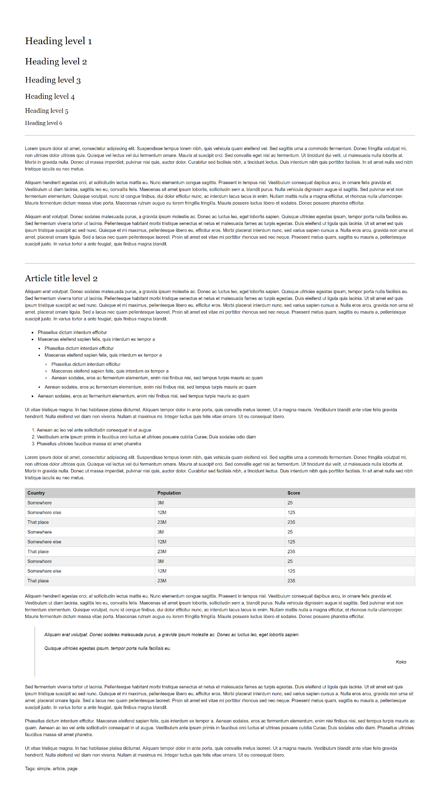

### Constraints

-   Create an **\"index.html\"** and **\"style.css\"** files

-   Change the document **title** to \"**Typography**\"

-   Use **Helvetica, sans-serif** font-family for the document

    -   Make the **font-size** 16px

    -   Change the **line-height** to 1.5

-   Use **Georgia, serif** font-family for the headings

-   Use headings from **h1** to **h6**

-   Create a HTML **table** and style it

-   Use **blockquote** tag

    -   Style its left border with **rgb(221,221,221)** color

    -   Style its font to **italic**

-   Use **hr** tag for the horizontal lines

## 11\. Font Speciment PT Sans

Create a web page like the following:

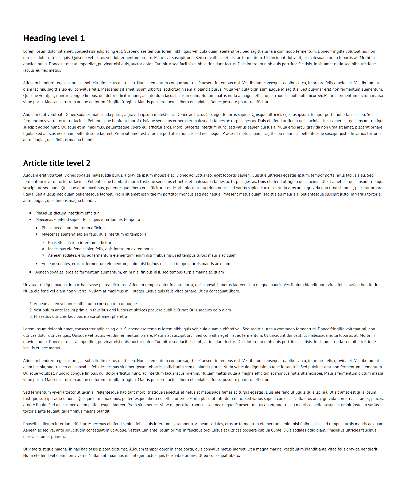

### Constraints

-   Create an **index.html** file with **Fonts Speciment PT Sans** title

-   Create an HTML page which holds an **article**

-   Use **h1** and **h2** tags for headings

-   Use **ul** and **ol** tags for lists

-   Use **PT Sans** font-family for the document

-   Make the **font-size** 16px

-   Change the **line-height** to 1.5
