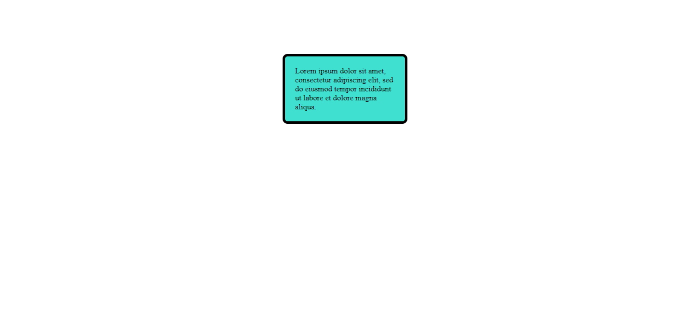
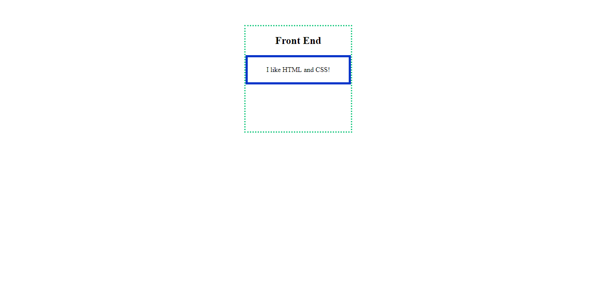
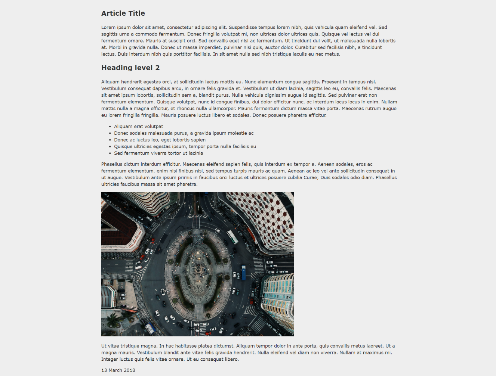
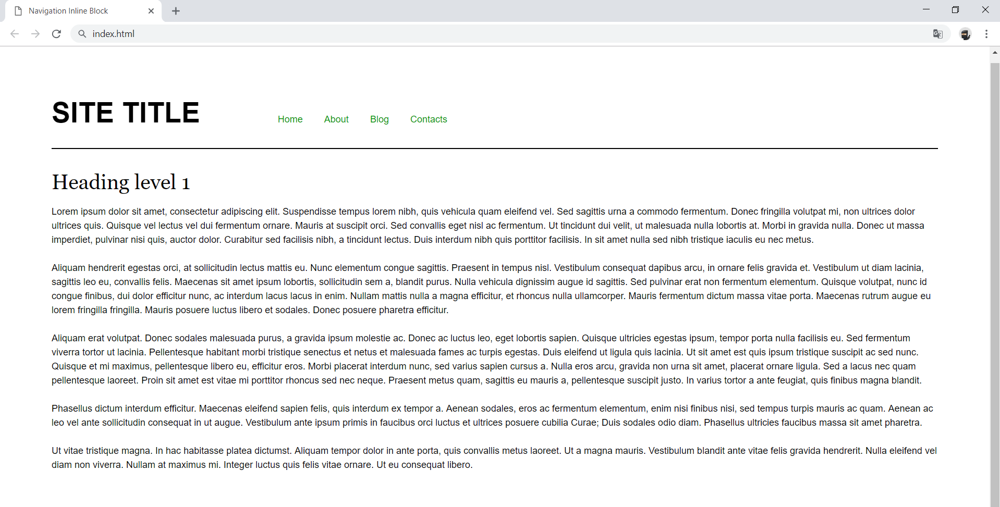
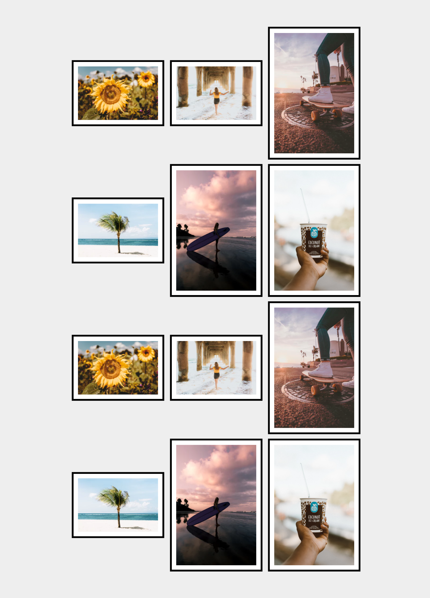
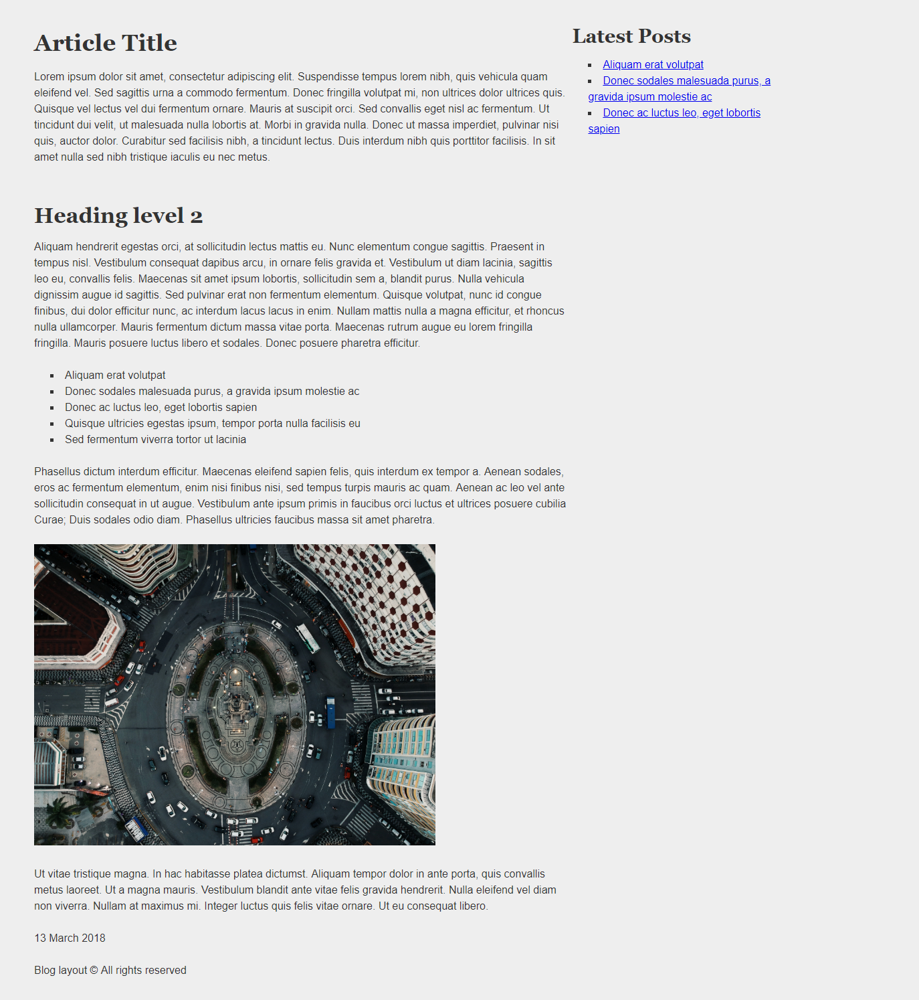

# Exercise: CSS Box Model

Problems for exercises and homework for the [\"HTML and CSS\" course @
SoftUni](https://softuni.bg/trainings/3122/html-and-css-september-2020).

## 01\. Box Model Container

Create a web page like the following:

### Constraints

-   Change the document **title** to \"**Box Model Container**\"

-   Use **p** tag to create a paragraph

-   Set the paragraph **width: 200px;**

-   Set **padding** and **margin**

-   Set **5px solid border** with **border-radius**

-   Use **rgb(64, 224, 208)** color for the background

-   Try to center the container with **margin: auto**

## 02\. Box-sizing

Create a web page like the following:

### Constraints

-   Change the document **title** to \"**Box Sizing**\"

-   Use **section** tag to create a section. In the section you have:

    -   **h1** heading with content \"**Front End**\"

    -   **paragraph** with content \"**I like HTML and CSS!** \"

-   The section has **width** **250px**, **height** **250px** and
    **border**

-   The paragraph has **width 100%**, **border** and **padding**
    **20px** on all sides

## 03\. Simple Article Page

Create a web page like the following:

### Constraints

-   Change the document title to \"**Simple Article Page**\"

-   Use **article** tag to create an article

    -   Divide the article content
        into **header**, **section** and **footer** tags

-   Use background with color - **rgb(238, 238, 238)**

-   Use **rgb(51, 51, 51) **color for the text

##  04\. Navigation Inline Block

Create a web page like the following:

### Constraints

-   Change the document title to \"**Navigation Inline Block**\"

-   Divide your content into **header** and **main** tags

-   Create a navigation bar 

    -   Add four list items in **nav** tag with **a** tags inside

    -   Add **display:** **inline-block;** style for each item in
        the **nav**

## 05\. Photo Gallery Inline Block

Create a web page like the following:

### Constraints

-   Change the document title to \"**Photo Gallery Inline Block**\"

-   Create unordered list with class **gallery** (**ul.gallery**) 

-   Add list items with images inside

-   The list items must have

    -   Border width - **0.4rem**

    -   Border color - **black**

    -   Border style - **solid**

## 06\. Blog Layout Inline Block

Create a web page like the following:

### Constraints

-   Change the document title to \"**Blog Layout Inline Block**\"

-   Use **article** tag to create an article

    -   Divide the article content into header, section and footer tags

-   Use **aside** tag to create aside for the **Latest** **Posts**

-   Use background with color - **rgb(238, 238, 238)**

-   Use **rgb(51, 51, 51)** color for the text
