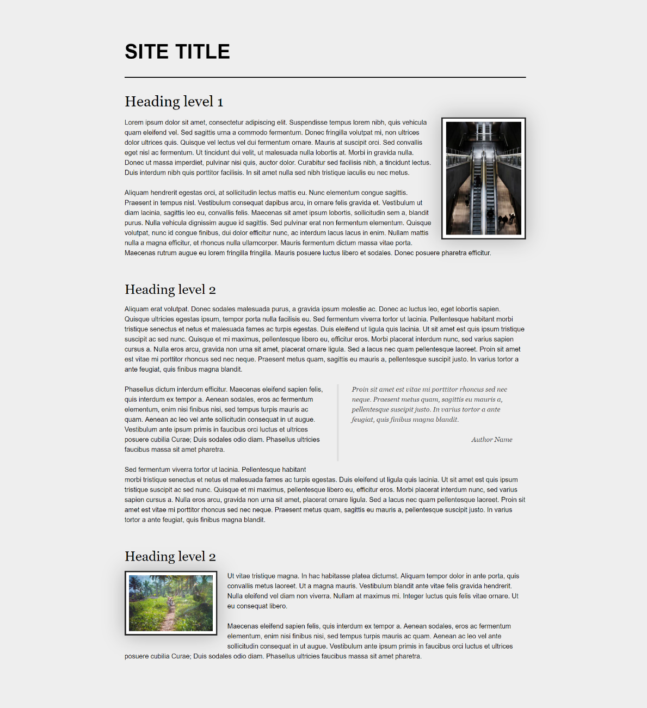
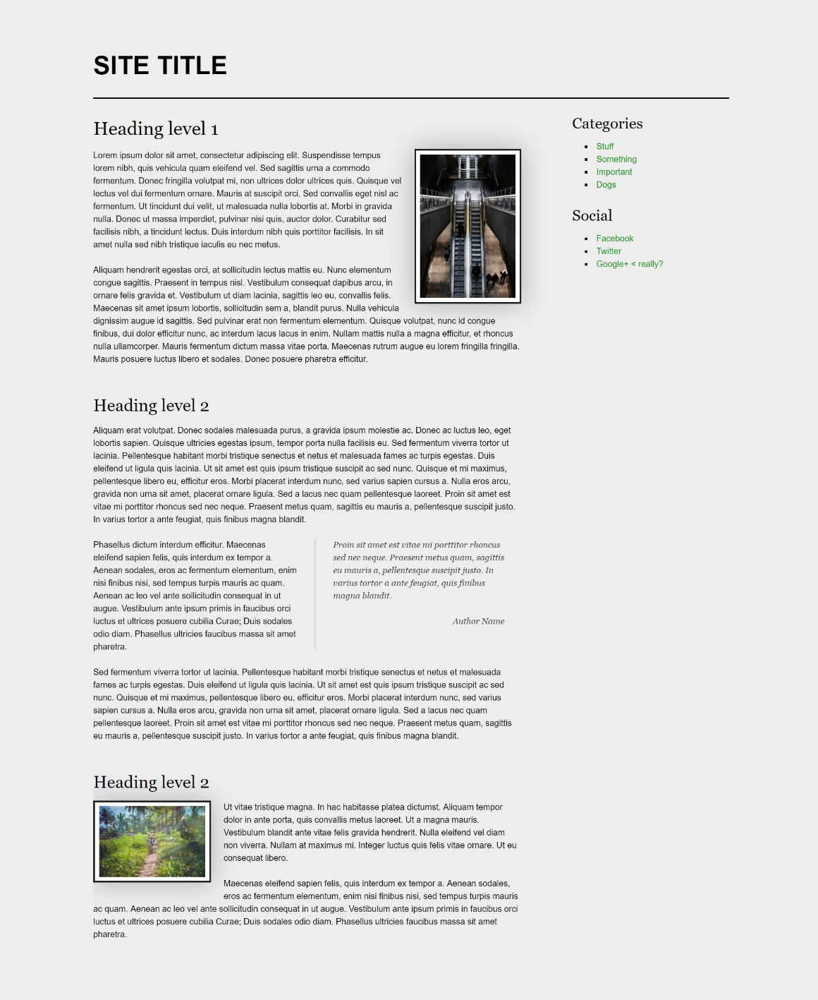
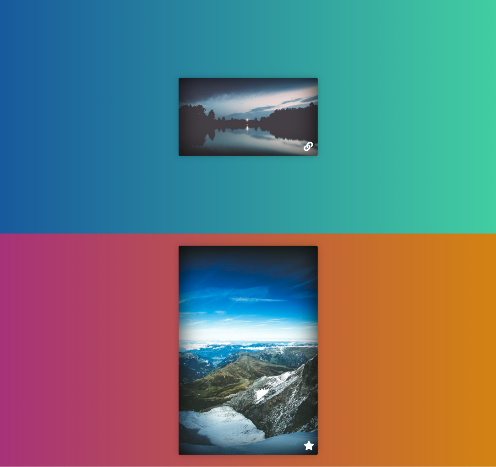
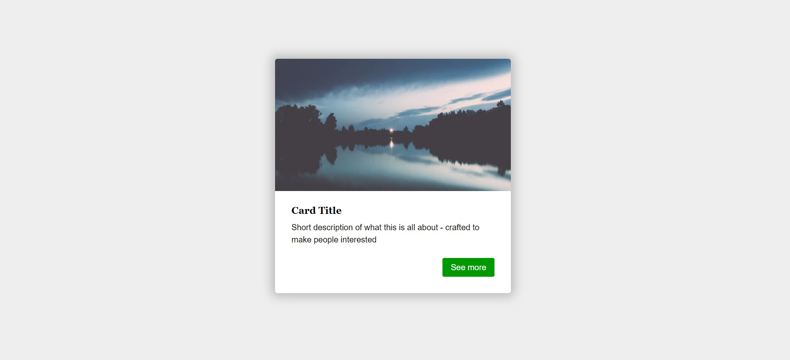
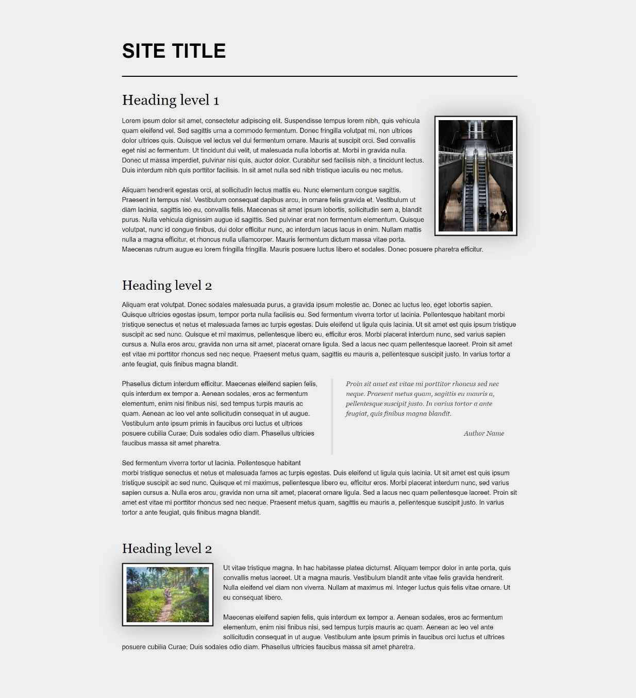

# Exercise: Position & Float

Problems for exercises and homework for the [\"HTML and CSS\" course @
SoftUni](https://softuni.bg/trainings/3122/html-and-css-september-2020).

# 01\. Article with Quotes and Media

You can take an old solution of this task and modify them to match the
requirements. Create a web page like the following:

### Constraints

-   Divide your content into **header** and **main** tags

-   The entire page font should have the following properties:

    -   Size - **16px**

    -   Line height - **1.5**

    -   Font family - **Helvetica, sans-serif**

-   Add class site-title to the paragraph in the
    header (**p.site-title**)

    -   Change the display property to **inline-block**

    -   Set the font weight to **bold**

-   Transform the text to **uppercase**

## 02\. Blog Layout - Float

Create a web page like the following:

### Constraints

-   Change the document **title** to \"**Blog Layout - Float**\"

-   Divide your content into **header**, **main** and **aside** tags

    -   Create a paragraph inside the **header** for the site title

    -   Create an **article** inside the **main**

    -   Create two sections inside the **aside**

        -   The sections should have a **h3** heading and a navigation
            - **nav** with **ul**, **li** and **a** elements

-   Use **rgb(238, 238, 238)** for body background

-   Use **rgb(255, 255, 255)** for image background and **rgba(0, 0, 0,
    0.25)** for image box shadow

-   Use font family **Georgia, serif** for the blockquote

-   Use font family **Georgia, serif** with size **1em/1.2** for the
    headings

-   Use **float** property to position the first image on the right

-   Use **float** property to position the second image on the left

## 03\. Position Playground

Create a web page like the following:

### Constraints

-   Change the document title to \"**Positioning Playground**\"

-   Import [[Font Awesome]{.underline}](https://fontawesome.com/) into
    your **CSS** file

-   Add two container units **(divs)** with class **viewport** inside
    the body

    -   Inside each one add section with
        class **card** *(***section.card***)*

        -   Change the display property to **block**

        -   Try to center the section with position
            property **absolute**

## 04\. Center Position and Transform

Create a web page like the following:

### Constraints

-   Change the document title to \"**Center Position and Transform**\"

-   Create section with two **divs**

    -   Look the screenshot for the inner items

-   Use **rgb(238, 238, 238)** for body background

-   Use **rgb(255, 255, 255)** for card background

-   Use **rgb(0, 153, 0)** for card button background

-   Use font **Georgia, serif** with size **1em/1.2** for the headings

-   Set the image position property to **absolute**

## 05\. Floating Images and Quotes

Create a web page like the following:

### Constraints

-   Change the document title to \"**Floating Images and Quotes**\"

-   Create a **header** with **h1** inside

-   Add an **article** and look the screenshot for some insight for the
    other items inside

-   Use color - **rgb(238, 238, 238) **for body background

-   Use color - **rgb(255, 255, 255)** for image background
    and **rgba(0, 0, 0, 0.25)** for image box shadow

-   Use font family **Georgia, serif** for the blockquote and headings
