# Exercise: Flexbox

Problems for exercises and homework for the [\"HTML and CSS\" course @
SoftUni](https://softuni.bg/trainings/3122/html-and-css-september-2020).

## 01\. Flexbox Layout

Create a web page like the following:

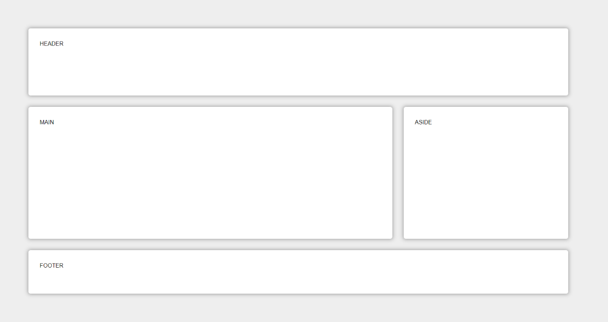

### Constraints

-   Change the document **title** to \"**Flexbox Layout**\"

-   Create **header**, **main**, **aside** and **footer** elements

-   Set to the body display property **flex**

-   Each element must have **flex grow**, **flex shrink** and **flex
    basis**

## 02\. FlexModel Articles

Create a web page like the following:

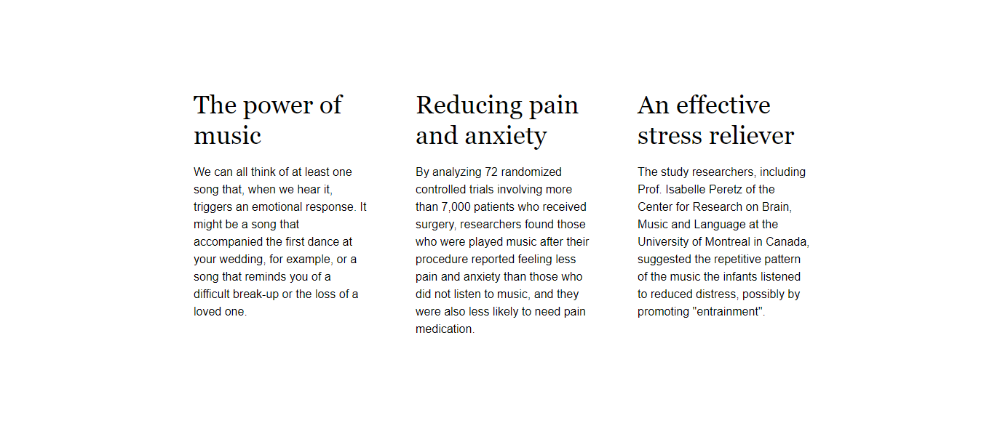

### Constraints

-   Change the document **title** to \"**Articles**\"

-   Create a **section** with three articles inside

-   The article should have a **h2** title and a paragraph (**p**)

-   Fonts

    -   Font family **Helvetica, sans-serif **with font size **16px**
        and line height **1.5** for the **html**

    -   Font family **Georgia, serif **with font size **2em** and line
        height **1.2** for the headings

-   Change the **section** display property to **flex** and
    set **justify-content: space-between**

-   Set on the section **max-width 70vw**

## 03\. ABC Game

Create a web page like the following:

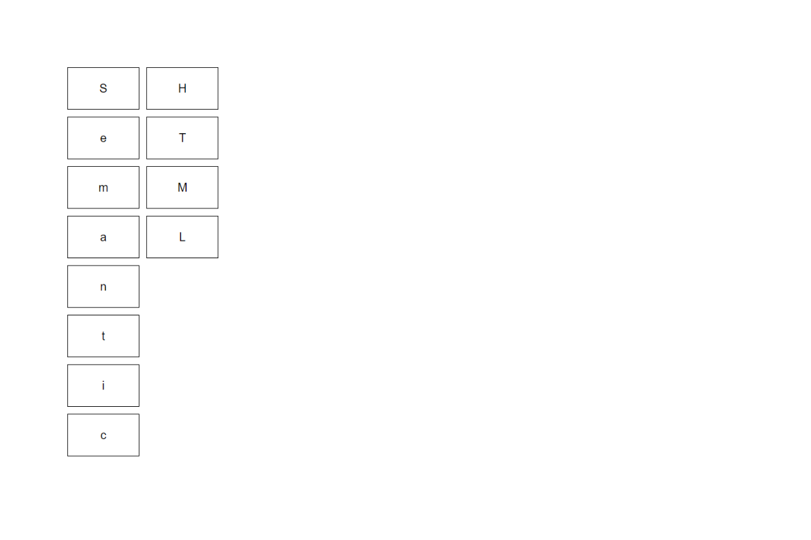

### Constraints

-   Change the document **title** to \"**ABC Game**\"

-   Create a **section** with three articles inside

-   Create a **div** with class **container** and twelve **span** tags
    inside

-   Type the letters in the **spans** EXACTLY as they are in the
    file **text.txt**

-   Use font-family: **Helvetica, sans-serif**, with **font-size: 20px**

-   Change the **div** display property to **flex** and align the items
    in center

-   Set on the **div** **max-width: 15vw** and **height 35rem**

-   The **span** must have

    -   Border width - **1px**

    -   Border color - **black**

    -   Border style - **solid**

-   To arrange the letters, use the **flex property order**

## 04\. Calendar

Create a web page like the following:

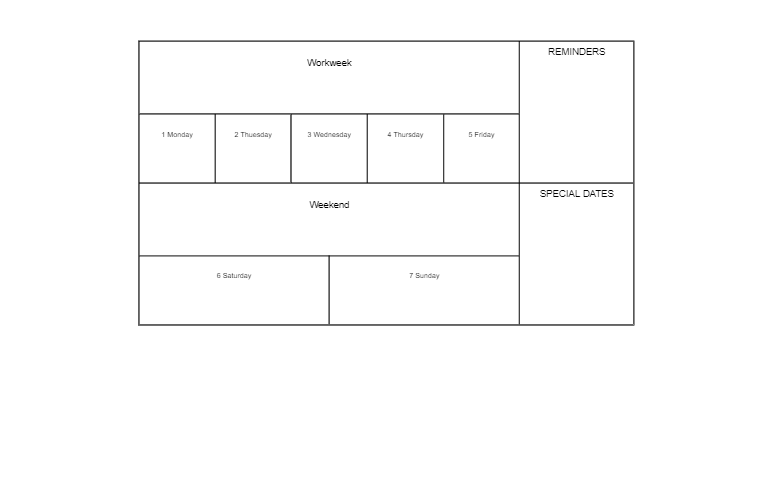

### Constraints

-   Change the document title to \"**Calendar**\"

-   Create a **div** with class container and two sections inside

    -   First **section** has class **week**

    -   Second **section** has class **notes**

-   Use **span** tags for all content

-   Change the **div** and **sections** display property to **flex** and
    align the items in **center**

-   Set on the **div** **max-width 65vw**

-   The span must have

    -   Border width - **1px**

    -   Border color - **black**

    -   Border style - **solid**

-   For the section with class notes use the
    property **flex-direction column**

-   Set on all HTML elements the property **box-sizing: border-box**

## 05\. Navigation Flexbox

Create a web page like the following:

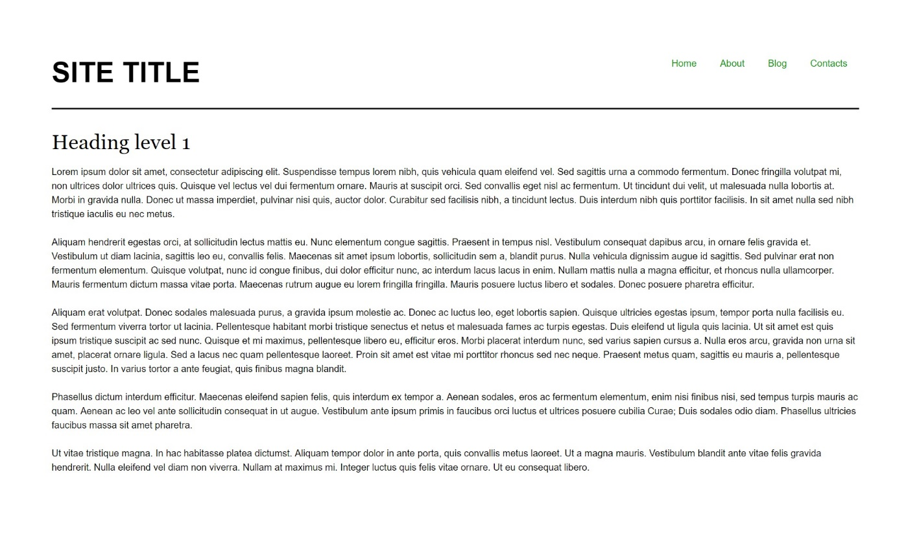

### Constraints

-   Change the document title to \"**Navigation - Flexbox**\"

-   Divide the body into **header** and **main** tag

-   The underline in the **header** must have

    -   Border width - **2px**

    -   Border color - **rgb(0, 0, 0)**

    -   Border style - **solid**

-   The display property of the header must be **flex**

-   The unordered list in the header must have **display**
    property **flex**

-   The anchors text color in the navigation must be **rgb(0, 153, 0)**

## 06\. Photo Gallery - Flexbox

Create a web page like the following:

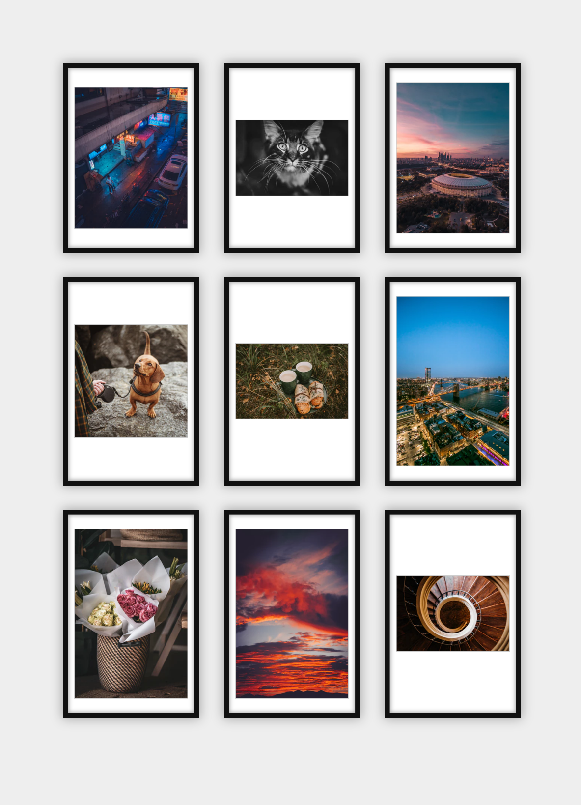

### Constraints

-   Change the document title to \"**Photo Gallery - Flexbox**\"

-   Add section with class **gallery** (**section.gallery**)

-   Add unordered list with list items and images inside

-   Change the **body**, **ul** and **li** display property to **flex**

-   Use font **Georgia,** **serif **with size **1em/1.2 **for the
    headings

## 07\. Blog Layout - Flexbox

Create a web page like the following:

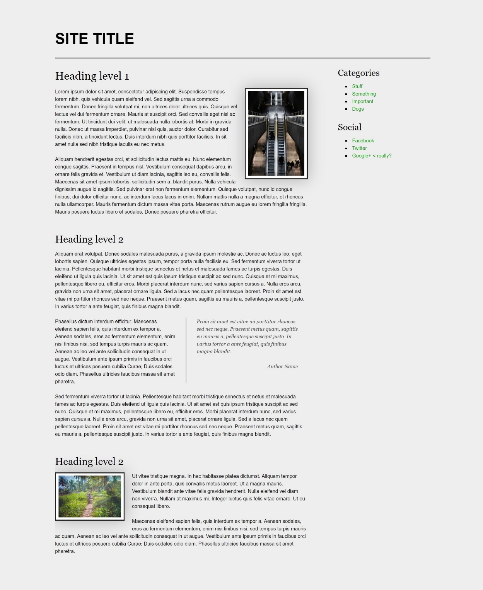

### Constraints

-   Change the document title to \"**Blog Layout - Flexbox**\"

-   The entire content must be in **div** container with
    class page (**div.page**)

-   The page container (**div**) must be **flexed** and **wrapped**

-   Body background color must be **rgb(238, 238, 238)**

-   Image background color should be **rgb(255, 255, 255)**

-   Blockquote font family must be **Georgia, serif**

-   The anchors text color in the aside section must be **rgb(0, 153,
    0)**

-   Page headings font family must be **Georgia, serif**

## 08\. Sticky Footer - Flexbox

Create a web page like the following:

> 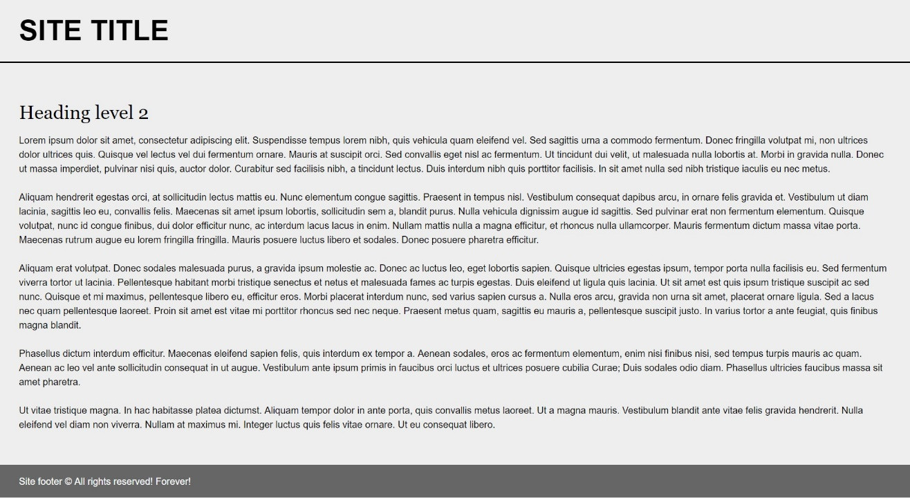

### Constraints

-   Change the document title to \"**Sticky Footer - Flexbox**\"

-   Divide your content into **header**, **main** and **footer** tags

-   The body must have **flex** display property

-   The body background must be **rgb(238, 238, 238)**

-   Set height to the body: **100vh**

-   The **footer** should be at the bottom of the page

    -   The **footer** text color must be **rgb(255, 255, 255)**

    -   The **footer** background color must be **rgb(102, 102, 102)**

## 09\. Center Flexbox

> Create a web page like the following:
>
> 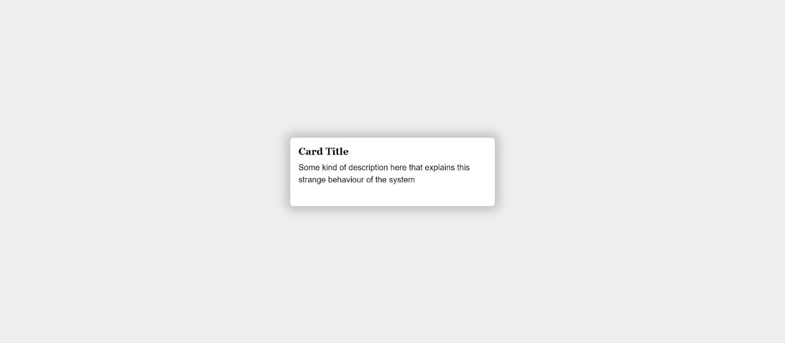

### Constraints

-   Change the document title to \"**Center Flexbox**\"

-   The document background color must be **rgb(238, 238, 238)**

-   The body display property must be **flex**

-   The content must be placed into div with class card (**div.card**)

    -   The **div** background color must be **rgb(255, 255, 255)**

## 10\. Expanding Flex Cards

> Create a web page like the following:
>
> 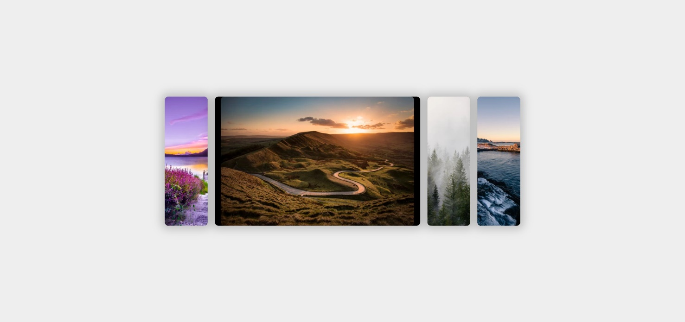

### Constraints

-   Change the document title to \"**Expanding Flex Cards**\"

-   Body background color must be **rgb(238, 238, 238)**

-   The body display property must be **flex**

    -   Align the items in **center**

-   The entire page content must be inside **section** with class
    named **container** (**section.container**)

-   The container display property must be **flex**

## 11\. Cards with CSS Columns and Flexbox

> Create a web page like the following:
>
> 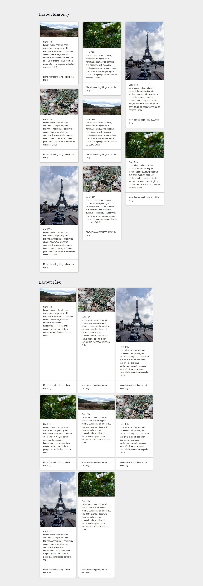

### Constraints

-   Change the document title to \"**Cards with CSS Columns and
    Flexbox**\"

-   Body background color must be **rgb(238, 238, 238)**

-   The content should be divided in two parts:

    -   First part is container unit (**div**) with
        classes **cards-layout** and **masonry**

    -   Second part is container unit (**div**) with
        classes **cards-layout** and **flex**

-   Use **h2** for the heading
