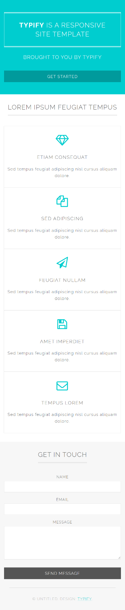

# HTML & CSS Exam - 01\.11\.2020

## 01\. Medium

Create a Web page (HTML5 + CSS3) that looks and behaves like the
screenshot below:

### Output

The output should be valid **HTML5** + **CSS3** + **images** that
implement the above web page.

### Constraints

-   Use font **\'Georgia\'** for the heading

-   Use font **\'Helvetica\'** for the text

-   The site should open correctly in the latest version of Chrome

## 02. Typify

You are given an unresponsive website (**HTML** + **CSS** + images).
Your task is to **make the site responsive**.

The site layout should change according to the browser viewport / screen
size.

You need to implement 1 layout: **width \<= 600px**. The figures below
represent this layout:

### Output {#output-1 .list-paragraph}

The output should be valid **HTML5** + **CSS3** + **images** that
implement the above responsive site.

### Constraints {#constraints-1 .list-paragraph}

-   You are **NOT** allowed to change the given **HTML** and **CSS**

## 03\. Fees Landing Page

Create a Web page (HTML5 + CSS3 + images) that looks and behaves like
the screenshot below:

You are given the above screenshots + all required images.

### Output

The output should be valid **HTML5** + **CSS3** + **images** that
implement the above web page.

### Constraints

-   Use font **\'Montserrat\'** for the headings

-   Use font **\'Lato\'** for the text

-   The site should open correctly in the latest version of Chrome
