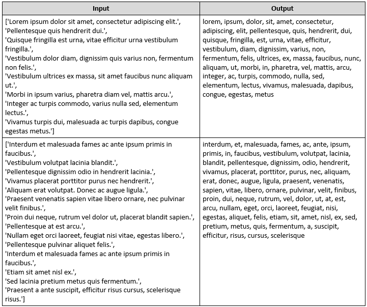

Lab: Advanced Objects 
=============

Problems for in-class lab for the ["JavaScript Advanced" course \@
SoftUni](https://softuni.bg/courses/js-advanced). Submit your solutions in the
SoftUni judge system at <https://judge.softuni.bg/Contests/1799/Lab-Objects>.

01\. Towns to JSON
-------------

You're tasked to create and print a JSON from a text table. You will receive
input as an array of strings, where each string represents a row of a table,
with values on the row encompassed by pipes **"\|"** and optionally spaces. The
table will consist of exactly 3 columns **"Town"**, **"Latitude"** and
**"Longitude"**. The **latitude** and **longitude** columns will always contain
**valid numbers**. Check the examples to get a better understanding of your
task.

### Input

The **input** comes as an array of strings – the first string contains the
table’s headings, each next string is a row from the table.

### Output

-   The **output** should be an array of objects wrapped in
    **JSON.stringify()**.

-   **Latitude** and **longitude** must be parsed to **numbers,** and
    represented till the **second digit after the decimal point**!

### Examples

02\. Score to HTML
-------------

You are given a JSON string representing an array of objects, parse the JSON and
create a table using the supplied objects. The table should have 2 columns
**"name"** and **"score"**, each object in the array will also have these keys.

Any text elements must also be **escaped** in order to ensure no dangerous code
can be passed.

### Input

The **input** comes as array with a single string argument (the array of objects
as a JSON).

### Output

The **output** should be printed on the console - a table with 2 columns -
**"name"** and **"score"**, containing the values from the objects as rows.

03\. From JSON to HTML Table
-----------------------

You’re tasked with creating an HTML table of students and their scores. You will
receive a single string representing an **array of objects**, the **table’s
headings** should be equal to the **objects’ keys**, while **each object’s
values** should be a **new entry** in the table. Any **text values** in an
object should be **escaped**, in order to avoid introducing dangerous code into
the HTML.

### Input

The **input** comes as array with a **single string argument** (the array of objects).

### Output

The **output** should be printed on the console – for each **entry row** in the
input print the **object representing it**.

### Note:

Object’s **keys** will always be the **same.**

### HTML

You are provided with an HTML file to test your table in the browser.

### Examples

04\. Sum by Town
-----------

You’re tasked with calculating the total sum of income for a number of Towns.
You will receive an array of strings representing towns and their incomes, every
**even** index will be a **town** and every **odd** index will be an **income**
belonging to that town. Create an object that will hold all the **towns as
keys** and their **total income** (the sum of their incomes) **as values** to
those keys and print it as a JSON.

### Input

The **input** comes as an array of strings - each even index is the name of a
town and each odd index is an income belonging to that town.

### Output

The **output** should be printed on the console - JSON representation of the
object containing all towns and their total incomes.

### Examples

05\. Count Words in a Text
---------------------

You are tasked to count the number of words in a text using an object as an associative array, any combination of letters, digits and \_ (underscore) should be counted as a word. The words should be stored in the object as properties - the **key** being the **word** and the **value** being the **amount of times the word is contained in the text**.

### Input

The **input** comes as an array of strings containing one entry - the text whose
words should be counted. The text may consist of more than one sentence.

### Output

The **output** should be printed on the console - the JSON representation of the
object containing the words.

### Examples

06\. Populations in Towns
--------------------

You have been tasked to create a register for different **towns** and their
**population**.

### Input

The **input** comes as array of strings. Each element will contain data for a
town and its population in the following format:

“**{townName} \<-\> {townPopulation}**”

If you receive the same town twice, **you should add** the **given population**
to the **current one**.

### Output

As **output**, you must print all the towns, and their population.

### Examples

07\. City Markets
------------

You have been tasked to follow the sales of products in the different towns. For
every town you need to keep track of all the products sold, and for every
product, the amount of total income.

The **town** and **product** are both **strings**. The **amount of sales** and
**price for one unit** will be **numbers**. Store all towns, for every town,
store its products, and for every product, its amount of **total income**. The
total income is calculated with the following formula - **amount of sales \*
price for one unit**. If you receive as input a town you already have, you
should just **add** the **new product** to it.

### Input

The **input** comes as array of strings. Each element will represent data about
a product and its sales. The format of input is:

{town} -\> {product} -\> {amountOfSales} : {priceForOneUnit}

### Output

As **output** you must print every town, its products and their total income in
the following format:

“Town – {townName}

\$\$\${product1Name} : {productTotalIncome}

\$\$\${product2Name} : {productTotalIncome}

...”

The **order of output** for each of those entries is - by **order of entrance**.

### Examples

08\. Lowest Prices in Cities
-----------------------

You will be given several towns, with products and their price. You need to find
**the lowest price** for **every product** and **the town it is sold at** for
that price.

### Input

The **input** comes as array of strings. Each element will hold data about a
**town**, **product**, and **its price** at that town. The **town** and
**product** will be **strings**, the **price** will be a **number**. The input
will come in the following format:

{townName} \| {productName} \| {productPrice}

If you receive the same **town** and **product more than once,** you should
**update** the **old value** with the **new one**.

### Output

As **output** you must print **each product** with its **lowest price** and
**the town** at which the product is **sold at that price**. If **two towns
share** the **same lowest price**, print the one that was **entered first**.  
The output, for every product, should be in the following format:

**{productName} -\> {productLowestPrice} ({townName})**

The **order of output** is - **order of entrance**. See the examples for more
info.

### Examples

09\. Extract Unique Words
--------------------

Write a JS function that **extracts** all **UNIQUE** words from a **valid
text**, and **stores them**. Ensure that there are **NO duplicates** in the
stored words. Once you find a word, there is no need for you to store it again
if you meet it again in the text. You also need to make all characters from the
words you’ve stored - **lowercase**.

The **input** comes as array of strings. Each element will represent a sentence.

The **output** is all of the unique words you’ve found, each with each,
**separated** by a **coma and a space**, printed in the order in which you’ve
found them.

### Examples

