Exercises: Objects
==================

Problems for exercises and homework for the ["JavaScript Advanced" course \@
SoftUni](https://softuni.bg/courses/js-advanced). Submit your solutions in the
SoftUni judge system at
<https://judge.softuni.bg/Contests/1800/Exercise-Objects>.

01\. Heroic Inventory
-----------------

In the era of heroes, every hero has his own items which make him unique. Create
a function which creates a **register for the heroes**, with their **names**,
**level**, and **items**, if they have such. The register should accept data in
a specified format, and return it presented in a specified format.

### Input

The **input** comes as array of strings. Each element holds data for a hero, in
the following format:

“**{heroName} / {heroLevel} / {item1}, {item2}, {item3}...**”

You must store the data about every hero. The **name** is a **string**, the
**level** is a **number** and the items are all **strings.**

### Output

The **output** is a **JSON representation** of the data for all the heroes
you’ve stored. The data must be an **array of all the heroes**. Check the
examples for more info.

### Examples

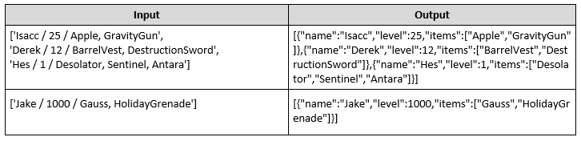

### Hints

-   We need an array that will hold our hero data. That is the first thing we
    create.

    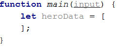

-   Next, we need to loop over the whole input, and process it. Let’s do that
    with a simple **for** loop.

    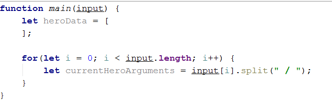

-   Every element from the input holds data about a hero, however the **elements
    from the data** we need are **separated by some delimiter**, so we just
    split each string with that **delimiter**.

-   Next, we need to take the elements from the **string array**, which is a
    result of the **string split**, and parse them.

    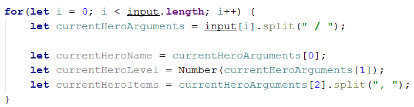

-   However, if you do this, you could get quite the error in the current logic.
    If you go up and read the problem definition again, you will notice that
    there might be a **case** where the hero **has no items**; in that case, if
    we try to take the **3rd element** of the **currentHeroArguments** array, it
    will **result in an error**. That is why we need to perform a simple check.

    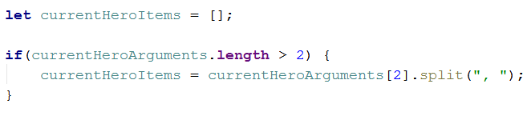

-   If **there are any items** in the **input**, the **variable** will be set to
    the **split version of them**. If not, it will just remain an **empty
    array**, **as it is supposed to**.

-   We have now extracted the needed data – we have stored the **input name** in
    a **variable**, we have parsed the **given level** to a **number**, and we
    have also **split** the **items** that the **hero holds** by their
    **delimiter**, which would result in a **string array** of elements. By
    definition, the **items** are **strings**, so we don’t need to process the
    array we’ve made anymore.

-   Now what is left is to add that data into **an object** and **add** that
    object to the **array**.

    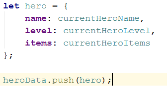

-   Lastly, we need to turn the array of objects we have made, into a JSON
    string, which is done by the **JSON.stringify()** function

    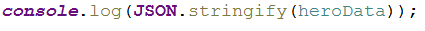

02\. JSON’s Table
------------

JSON’s Table is a magical table which turns JSON data into an HTML table. You
will be given **JSON strings** holding data about employees, including their
**name**, **position** and **salary**. You need to **parse that data** into
**objects**, and create an **HTML table** which holds the data for each
**employee on a different row**, as **columns**.

The **name** and **position** of the employee are **strings**, the **salary** is
a **number**.

### Input

The **input** comes as array of strings. Each element is a JSON string which
represents the data for a certain employee.

### Output

The **output** is the HTML code of a table which holds the data exactly as
explained above. Check the examples for more info.

### Examples

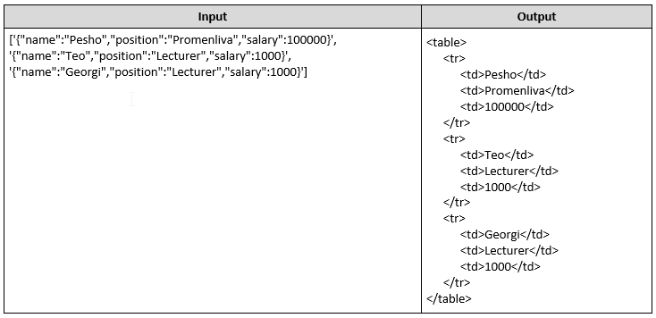

### Hints

-   You might want to **escape the HTML**. Otherwise you might find yourself
    victim to vicious JavaScript **code in the input**.

03\. Cappy Juice
-----------

You will be given different juices, as **strings**. You will also **receive
quantity** as a **number**. If you receive a juice, you already have, **you must
sum** the **current quantity** of that juice, with the **given one**. When a
juice reaches **1000 quantity**, it produces a bottle. You must **store all
produced bottles** and you must **print them** at the end.

**Note: 1000 quantity** of juice is **one bottle**. If you happen to have **more
than 1000**, you must make **as much bottles as you can**, and store **what is
left** from the juice.

**Example: You have 2643 quantity** of Orange Juice – this is **2 bottles** of
Orange Juice and **643 quantity left**.

### Input

The **input** comes as array of strings. Each element holds data about a juice
and quantity in the following format:

“**{juiceName} =\> {juiceQuantity}**”

### Output

The **output** is the produced bottles. The bottles are to be printed in **order
of obtaining the bottles**. Check the second example bellow - even though we
receive the Kiwi juice first, we don’t form a bottle of Kiwi juice until the 4th
line, at which point we have already create Pear and Watermelon juice bottles,
thus the Kiwi bottles appear last in the output.

### Examples

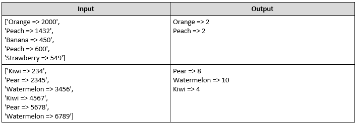

04\. Store Catalogue
---------------

You have to create a sorted catalogue of store products. You will be given the
products’ names and prices. You need to order them by **alphabetical order**.

### Input

The **input** comes as array of strings. Each element holds info about a product
in the following format:

“**{productName} : {productPrice}**”

The **product’s name** will be a **string**, which will **always start with a
capital letter**, and the **price** will be **a number**. You can safely assume
there will be **NO duplicate product input**. The comparison for alphabetical
order is **case-insensitive**.

### Output

As **output** you must print all the products in a specified format. They must
be ordered **exactly as specified above**. The products must be **divided into
groups**, by the **initial of their name**. The **group’s initial should be
printed**, and after that the products should be printed with **2 spaces before
their names**. For more info check the examples.

### Examples

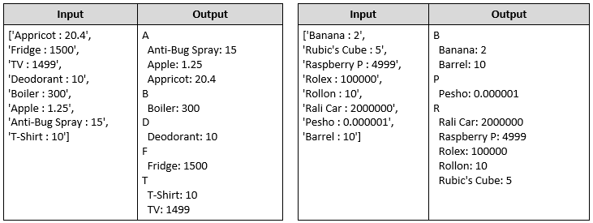

05\. Auto-Engineering Company
------------------------

You are tasked to create a register for a company that produces cars. You need
to store **how many cars** have been produced from a **specified model** of a
**specified brand**.

### Input

The **input** comes as array of strings. Each element holds information in the
following format:

“**{carBrand} \| {carModel} \| {producedCars}**”

The car **brands** and **models** are **strings**, the **produced cars** are
**numbers**. If the **car brand** you’ve received **already exists**, just add
the **new car model** to it with the **produced cars as its value**. If even the
car model exists, just **add** the **given value** to the **current one**.

### Output

As **output** you need to print - **for every car brand**, the **car models**,
and **number of cars produced** from that model. The output format is:

“{carBrand}

\#\#\#{carModel} -\> {producedCars}

\#\#\#{carModel2} -\> {producedCars}

...”

The order of printing is the order in which the brands and models first appear
in the input. The first brand in the input should be the first printed and so
on. For each brand, the first model received from that brand, should be the
first printed and so on.

### Examples

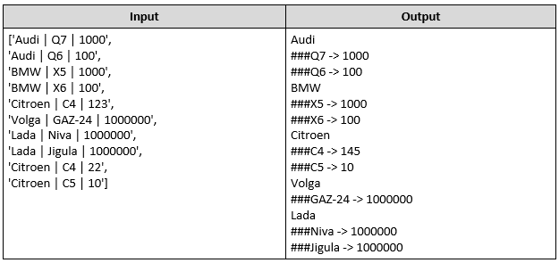

06\. System Components
-----------------

You will be given a register of systems with components and subcomponents. You
need to build an ordered database of all the elements that have been given to
you.

The elements are registered in a very simple way. When you have processed all of
the input data, you must print them in a specific order. For every System you
must print its components in a specified order, and for every Component, you
must print its Subcomponents in a specified order.

The **Systems** you’ve stored must be ordered by **amount of components**, in
**descending order**, as **first criteria**, and by **alphabetical order** as
**second criteria**. The **Components** must be ordered by **amount of
Subcomponents**, in **descending order**.

### Input

The **input** comes as array of strings. Each element holds **data** about a
**system**, a **component** in that **system**, and a **subcomponent** in that
**component**. If the given **system already exists**, you should just **add the
new component** to it. If even the **component exists**, you should just **add**
the **new subcomponent** to it. The **subcomponents** will **always be unique**.
The input format is:

“**{systemName} \| {componentName} \| {subcomponentName}**”

All of the elements are strings, and can contain **any ASCII character**. The
**string comparison** for the alphabetical order is **case-insensitive**.

### Output

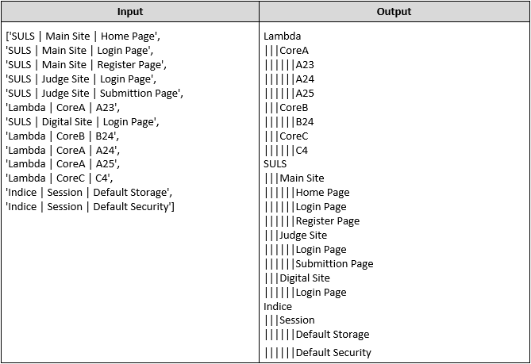

### Hints

-   Creating a sorting function with two criteria might seem a bit daunting at
    first, but it can be simplified to the following:

    -   If elements **a** and **b** are different based on the **first
        criteria**, then that result is the result of the sorting function,
        checking the second criteria is not required.

    -   If elements **a** and **b** are **equal** based on the **first
        criteria**, then the result of comparing **a** and **b** on the **second
        criteria** is the result of the sorting.

07\. Usernames
---------

You are tasked to create a catalogue of usernames. The usernames will be strings
that **may contain any ASCII** character. You **need to order** them **by their
length**, in **ascending order**, as **first criteria**, and by **alphabetical
order** as **second criteria**.

### Input

The **input** comes as array of strings. Each element represents a **username**.
Sometimes the input may contain **duplicate usernames**. Make it so that there
are **NO duplicates** in the output.

### Output

The **output** is all of the usernames, **ordered** exactly as **specified
above** – each printed on a new line.

### Examples

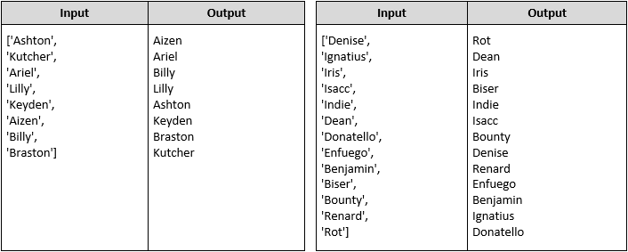

### Hints

-   Try to find a **structure** which **does NOT allow duplicates**, it will be
    best for the current problem.

08\. Unique Sequences
----------------

You are tasked with storing sequences of numbers. You will receive an unknown
amount of **arrays containing numbers** from which you must store only the
**unique** arrays (duplicate arrays should be discarded). An array is considered
the **same** (**NOT unique**) if it contains the **same numbers** as another
array**, regardless of their order**.

After storing all arrays, your program should print them back in **ascending**
order based on their **length**, if two arrays have the same length they should
be printed in **order of being received from the input**. Each individual array
should be printed in **descending order** in the format **"[a1, a2, a3,… an]"**.
Check the examples bellow.

### Input

The **input** comes as an array of strings where each entry is a JSON
representing an array of numbers.

### Output

The **output** should be printed on the console - each array printed on a new
line in the format **"[a1, a2, a3,… an]"** , following the above mentioned
ordering.

### Examples

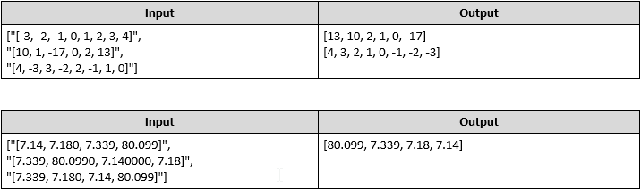

### Hints

-   Think of an easy way to compare arrays.

-   Sometimes the most obvious collection choice is not the best one.

09\. \*Arena Tier
------------

Pesho is a pro gladiator, he is struggling to become master of the Arena.

You will receive **several input lines** in one of the following formats:

"{gladiator} -\> {technique} -\> {skill}"

"{gladiator} vs {gladiator}"

The **gladiator and technique** are strings, the given **skill** will be an
integer number. You need to keep track of **every gladiator**.

When you receive a **gladiator and his technique and skill**, add him to the
gladiator pool, if he isn\`t present, else add his technique or update his
skill, only if the current technique skill is lower than the new value.

If you receive **"{gladiator} vs {gladiator}"** and both gladiators exist in the
tier, they duel with the following rules:

Compare their techniques, if they got at least one in common, the gladiator with
better total skill points wins and the other is demoted from the tier -\> remove
him.

If they don't have techniques in common, the duel isn\`t happening and both
continue in the Season.

You should end your program when you receive the command **"Ave Cesar"**. At
that point you should print the gladiators, **ordered by total skill in
desecending order, then ordered by name in ascending order**. Foreach gladiator
print their technique and skill, **ordered desecending, then ordered by
technique name in ascending order**

### Input / Constraints

You will receive an **array of strings** as a parameter to your solution.

-   The input comes in the form of commands in one of the formats specified
    above.

-   Gladiator and technique **will always be one word string, containing no
    whitespaces**.

-   Skill will be an **integer** in the **range [0, 1000]**.

-   There will be **no invalid** input lines.

-   The programm ends when you receive the command **"Ave Cesar"**.

### Output

The output format for each gladiator is:

"{gladiator}: {totalSkill} skill"

"- {technique} \<!\> {skill}"

*Scroll down to see examples.*

### Examples

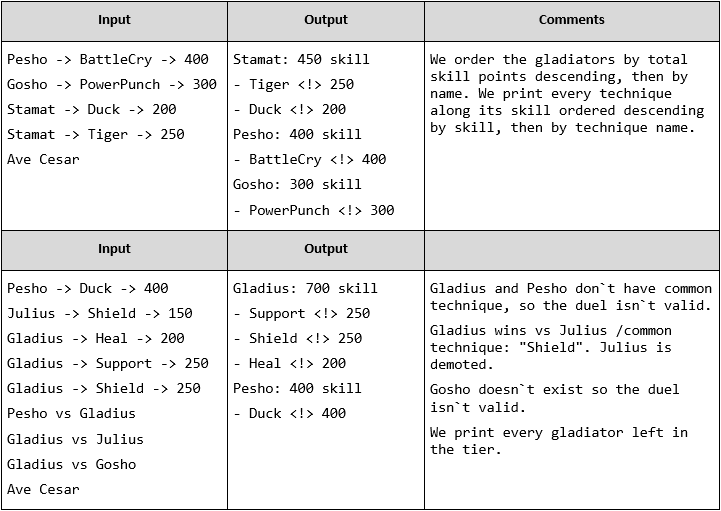

10\. \*Game of Epicness
------------------

Write a JavaScript program that **determines** the **winner** from **all
battles**. You will receive **two** arguments:

The **first** argument is an **array of kingdoms** with **generals** and their
**army** in the form of an **object** with format:

{ kingdom: String, general: String, army: Number }

Every **general** has his own **army** that fights for a certain **kingdom**.
Note that, every **kingdom’s name** is **unique,** and every general’s **name**
is **unique** in **this kingdom**. If the **general** already **exists in** this
**kingdom add** the **army** to his current one. After you go through all the
kingdoms with their generals with armies and store the information about them,
it’s time to start the battles.

The **second** argument is **matrix of strings** showing which **kingdom’s
generals** are **fighting** in this format:

**[**

**[ "{AttackingKingdom} ", "{AttackingGeneral}", "{DefendingKingdom} ",
"{DefendingGeneral}" ],**

**…**

**]**

The **first two elements** are the **names** of the **attacking general from**
certain **kingdom** and the **second two** are the **names** of the **defending
general from** certain **kingdom**. **Compare** the two general’s **armies to
determine** who **wins** and who **losses** based on who have the **larger army
wins.** The **winner’s army increases** with **10%** and the **loser’s army
decreases** with **10%.** Keep in mind to **round** them **down** if there is
any excess **army after the battle.** If there is a **draw**, **do not do
anything**. **Keep track** of the **wins** and **losses** for every general’s
battle.

Note that, **generals** from the **same kingdom cannot attack each other**.

After you finish with all battles you need to **find** which **kingdom wins**
the game. To decide that, **first order them** by all their **general’s wins
(descending)** then by their **losses (ascending),** and finally by the
**kingdom’s name** in **ascending alphabetical** order.

### Input

You will receive **two arguments –** an **array of objects** with properties and
a **matrix of strings** as shown above.

### Output

Print on the **console** the winning kingdom and **sort** the generals by their
**armies in descending** order, **formatted** as seen in the examples.

### Constraints

-   The **number** of **elements** in the **first input argument** will be in
    range **[1..100] inclusive**

-   The **number** of **elements** in the **second input argument** will be in
    range **[0..100] inclusive**

-   General’s **army** will be always an **integer** in range **[0..1,000,000]
    inclusive**

-   There **will** be **no invalid input**

-   There **will** be **no matching number** of **armies** in the **output**

### Examples

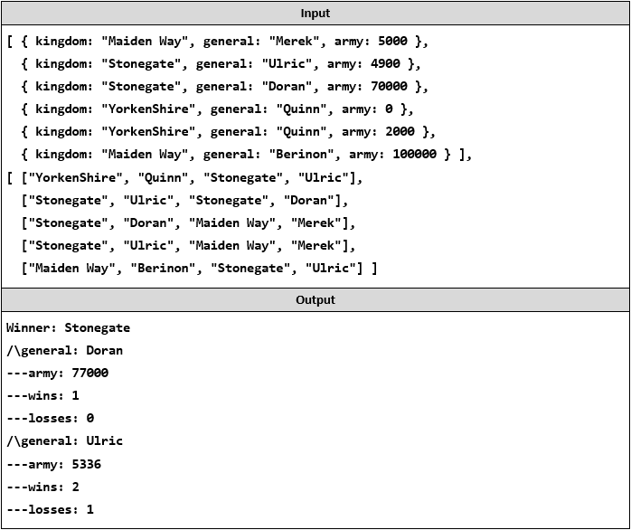