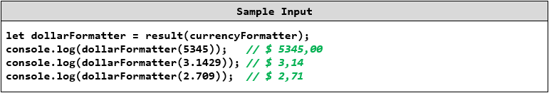

Lab: Advanced Functions
=======================

Problems for in-class lab for the ["JavaScript Advanced" course \@
SoftUni](https://softuni.bg/courses/js-advanced). Submit your solutions in the
SoftUni judge system at
<https://judge.softuni.bg/Contests/1528/Lab-Advanced-Functions>.

01\. Add
---

Write a program that keeps a number **inside its context** and **returns** new
function that **adds** a **given** number to the previous one.

### Input

Check the **examples below** to see how your code will be executed

### Output

Your function should **return** the final result .

### Examples

02\. Currency Format
---------------

Write a higher-order function that fixes some of the parameters of another
function. Your program will receive a function that **takes 4 parameters** and
**returns a formatted string** (a monetary value with currency symbol).

Your task is to **return another function** that only **takes one parameter**
and **returns** the **same formatted string**.

You will receive the following function:

Set the following parameters to fixed values:

separator: ","

symbol: "\$"

symbolFirst: true

The final parameter **value** is the one that the returned function will
receive.

### Input

You will receive a **function** parameter

### Output

You need to **return a function** that takes one parameter - **value**

### Examples

03\. Filter Employees
----------------

Write a program that filters the employees of your company. You should print the
result in a specific format. You will receive **2** parameters (**data**,
**criteria**). You should **parse** the input, find all employees that fullfil
the citeria and print them.

### Input

You will receive a **string** with all the employees, and a **criteria** by
witch you should sort the employees. If the criteria is **"all"** print all the
employees in the given format.

### Output

The output should be the **printed** on the console.

For more information check the examples.

### Examples

04\. Command Processor
-----------------

Write a program that keeps a string **inside its context** and can execute
different **commands** that modify or print the string on the console.

**append(string)** - append the given **string** at the end of the internal
string

**removeStart(n)** - **remove** the **first n** characters from the string,
**n** is an integer

**removeEnd(n)** - **remove** the **last n** characters from the string, **n**
is an integer

**print** - **print** the stored string on the **console**

### Input

Check the examples below to see how your code will be executed

### Output

Whenever you receive the command **print**, the output should be the **printed**
on the console.

### Examples

