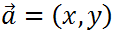

Exercise: Advanced Functions
============================

Problems for exercises and homework for the ["JavaScript Advanced" course \@
SoftUni](https://softuni.bg/courses/js-advanced). Submit your solutions in the
SoftUni judge system at
<https://judge.softuni.bg/Contests/1529/Exercise-Advanced-Functions>

01\. Sort Array
----------

Write a function that **sorts an array** with **numeric** values in
**ascending** or **descending** order, depending on an **argument** that is
passed to it.

You will receive a **numeric array** and a **string** as arguments to the first
function in your code.

-   If the second argument is **asc**, the array should be sorted in **ascending
    order** (smallest values first).

-   If it is **desc**, the array should be sorted in **descending order**
    (largest first).

### Input

You will receive a **numeric array** and a **string** as input parameters.

### Output

The output should be the **sorted array**.

### Examples

02\. Argument Info
-------------

Write a function that displays **information** about the **arguments** which are
passed to it (**type** and **value**) and a **summary** about the number of each
type in the following format:

"{argument type}: {argument value}"

Print **each** argument description on a **new line**. At the end print a
**tally** with counts for each type in **descending order**, each on a **new
line** in the following format:

**"{type} = {count}**"

If two types have the **same count**, use **order of appearance**.

Do **NOT** print anything for types that do not appear in the list of arguments.

### Input

You will receive a series of arguments **passed** to your function.

### Output

Print on the **console** the **type** and **value** of each argument passed into
your function.

### Example

03\. Functional Sum
--------------

Write a function that **adds** a number passed to it to an **internal sum** and
returns **itself** with its internal sum set to the **new value**, so it can be
**chained** in a functional manner.

### Input

Your function needs to take one **numeric argument**.

### Output

Your function needs to **return** itself with an updated context.

### Example

04\. Personal BMI
------------

A wellness clinic has contacted you with an offer - they want you to write a
program that composes **patient charts** and performs some preliminary
evaluation of their condition. The data comes in the form of **several
arguments**, describing a person - their **name**, **age**, **weight** in
kilograms and **height** in centimeters. Your program must compose this
information into an **object** and **return** it for further processing.

The patient chart object must contain the following properties:

-   **name**

-   **personalInfo**, which is an object holding their **age**, **weight** and
    **height** as properties

-   **BMI** - body mass index. You can find information about how to calculate
    it here: <https://en.wikipedia.org/wiki/Body_mass_index>

-   **status**

The status is one of the following:

-   **underweight**, for BMI less than 18.5;

-   **normal**, for BMI less than 25;

-   **overweight**, for BMI less than 30;

-   **obese**, for BMI 30 or more;

Once the BMI and status are calculated, you can make a recommendation. If the
patient is obese, add an additional property called recommendation and set it to
“**admission required**”.

### Input

Your function needs to take four arguments - **name**, **age**, **weight** and
**height**

### Output

Your function needs to **return** an **object with properties** as described
earlier. All numeric values should be **rounded** to the nearest whole number.
All fields should be named **exactly as described** (their order is not
important).  
Look at the sample output for more information.

05\. Vector Math
-----------

Write several functions for peрforming **calculations** with **vectors** in 2D
space

and collect them all in a **single object** (namespace), so they don’t pollute
the global scope. Implement the following functions:

-   **add(vec1, vec2)** - Addition of two vectors -

    

-   **multiply(vec1, scalar)** - Scalar multiplication -

    

-   **length(vec1)** - Vector length -

    

-   **dot(vec1, vec2)** - Dot product of two vectors -

    

-   **cross(vec1, vec2)** - Cross product of two vectors -

    

The math-savvy may notice that the given cross product formula results in a
scalar, instead of a vector - we’re only measuring the length of the resulting
vector, since cross product is not possible in 2D, it will exist purely in the
z-dimension. If you don’t know what this all means, ignore this paragraph, it’s
irrelevant to the solution.

### Input

Each separate function in your namespace will be tested with individual values.
It must expect **one or two arguments**, as described above, and **return** a
value. Vectors will be 2D **arrays** with format **[x, y]**.

### Output

Your program needs to **return** an object, containing **all functions**
described above. Each individual function must **return** a value, as required.
Don’t round any values.

06\. Breakfast Robot
---------------

*It’s finally the future! Robots take care of everything and man has been freed
from the mundane tasks of living. There is still worked to be done though, since
those robots need to be programmed first - we may have robot chefs, but we do
not yet have robot software developers.*

Your task is to write the management software for a breakfast chef robot - it
needs to **take orders**, keep track of available **ingredients** and output an
**error** if something’s wrong. The cooking instructions have already been
installed, so your module needs to **plug into** the system and only take care
of **orders** and **ingredients**. And since this is the future and food is
printed with nano-particle beams, all ingredients are microelements -
**protein**, **carbohydrates**, **fat** and **flavours**. The library of recipes
includes the following meals:

-   **Apple** - made with **1 carb** and **2 flavour**

-   **Lemonade** - made with **10 carb** and **20 flavour**

-   **Burger** - made with **5 carb**, **7 fat** and **3 flavour**

-   **Eggs** - made with **5 protein**, **1 fat** and **1 flavour**

-   **Turkey** - made with **10 protein**, **10 carb**, **10 fat** and **10
    flavour**

The robot receives instructions either to **restock** the supply, **cook** a
meal or **report** statistics. The input consists of one of the following
commands:

-   **restock \<microelement\> \<quantity\>** - increases the stored quantity of
    the given microelement

-   **prepare \<recipe\> \<quantity\>** - uses the available ingredients to
    prepare the given meal

-   **report** - returns information about the stored microelements, in the
    order described below, including zero elements

The robot is equipped with a quantum field storage, so it can hold an
**unlimited quantity** of ingredients, but there is no guarantee there will be
enough available to prepare a recipe, in which case an **error message** should
be returned. Their availability is checked in the **order** in which they
**appear** in the recipe, so the error should reflect the first requirement that
was not met.

Submit a **closure** that returns the management function. The management
function takes one parameter.

### Input

Instructions are passed as a **string argument** to your management function. It
will be called **several times** per session, so internal state must be
**preserved** throughout the entire session.

### Output

The **return** value of each operation is one of the following strings:

-   **Success** - when restocking or completing cooking without errors

-   **Error: not enough \<ingredient\> in stock** - when the robot couldn’t
    muster enough microelements

-   **protein={qty} carbohydrate={qty} fat={qty} flavour={qty}** - when a report
    is requested, in a single string

### Constraints

-   Recipes and ingredients in commands will always have valid names.

### Examples

07\. \*Monkey Patcher
------------------

Your employer placed you in charge of an old forum management project. The
client requests new functionality, but the legacy code has high coupling, so you
don’t want to change anything, for fear of breaking everything else. You know
which values need to be accessed and modified, so it’s time to monkey patch!

Write a program to extend a forum post record with voting functionality. It
needs to have the options to **upvote**, **downvote** and tally the **total
score** (positive minus negative votes). Furthermore, to prevent abuse, if a
post has more than 50 **total votes**, the numbers must be obfuscated – the
stored values remains the same, but the **reported** amounts of upvotes and
downvotes have a number **added** to them. This number is 25% of the **greater
number** of votes (positive or negative), rounded up. The actual numbers should
**not be modified**, just the reported amounts.

Every post also has a **rating**, depending on its score. If **positive** votes
are the overwhelming majority (\>66%), the rating is **hot**. If there is no
majority, but the balance is non-negative and **either** votes are more than
100, its rating is **controversial**. If the balance is negative, the rating
becomes **unpopular**. If the post has less than 10 **total** votes, or no other
rating is met, it’s rating is **new** regardless of balance. These calculations
are performed on the actual numbers.

Your function will be invoked with **call(object, arguments)**, so treat it as
though it is internal for the object. A forum post, to which the function will
be attached, has the following structure:

The arguments will be one of the following strings:

-   **upvote** – increase the positive votes by one

-   **downvote** – increase the negative votes by one

-   **score** – report positive and negative votes, balance and rating, in an
    array; obfuscation rules apply

### Input

Input will be passed as arguments to your function through a **call()**
invocation.

### Output

Output from the report command should be **returned** as a result of the
function in the form of an **array** of three **numbers** and a **string**, as
described above.

### Examples

