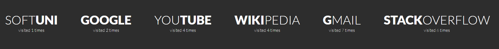

Lab: Objects and DOM
====================

Problems for in-class lab for the ["JavaScript Advanced" course \@
SoftUni](https://softuni.bg/courses/js-advanced). Submit your solutions in the
SoftUni judge system at <https://judge.softuni.bg/Contests/1801/Lab-DOM>

01\. Articles List
-------------

In this problem, you should create a JS functionality which creates articles and
appends them into some article section.

The programs in this language are called **scripts**. They can be written right
in the HTML and **executed automatically** as the page loads.

Scripts are provided and executed as a **plain text**. They don't need a special
preparation or a compilation to run.

In this aspect, JavaScript is very **different** from another language called
Java.

### Constraints:

-   **Title value** from the **title input** should be a **heading 3 element
    \<h3\>**

-   **Content text** from the **textarea element** should be a **paragraph
    \<p\>**

-   Both new created elements (**h3** and **p**) should be appended to a new
    **article element \<article\>**

-   **The current article element** should be **appended** to the section which
    has an id articles (**\#articles**)

-   You should create new **article element** only if **title** and **content
    are not empty**

-   After the button is pressed you must **clear** the **title value** and
    **text value**

### Input:

### Output:

02\. Format the Text
---------------

In this problem, you should **create a JS functionality** which **formats the
given text into paragraphs.**

When the [**Format**] button is **clicked**, you need to **format the text
inside** the **paragraph** with an **id** "**input**". The formatting is
**done** as **follows:**

-   You need to **create a new paragraph element which holds no more than 3
    sentences from the given input.**

-   If the given input contains **less** or **3 sentences**, you need to create
    only 1 paragraph, fill it with these sentences and append this paragraph to
    the div with an **id** "**output**".

Otherwise, when you have more than 3 sentences in that **input paragraph,** you
need to create enough paragraphs to get all sentences from the **input text.**

Just remember to **restrict** the **sentences** in **each paragraph to 3.**

### Example:

-   If the input paragraph **contains 2 sentences**, you need to create only **1
    paragraph** with these 2 sentences

-   If the input paragraph **contains 7 sentences,** you need to create **3
    paragraphs**  
    - The **first paragraph** must contain **the first 3 sentences**  
    - The **second paragraph** must contain **the other three sentences of the
    whole text**  
    - The **third paragraph** will contain **only the last sentence**, because
    there are no more sentences in this paragraph

**To find out how many sentences there are in the text, simply split the whole
text by '.' Also, every sentence must have at least 1 character.**

03\. Growing Word
------------

In this problem, you should **create a JS functionality** which **changes the
size and the color** of a given **paragraph** on **every click**.

Every time when we **click** on the [**CHANGE**] button, **the color** and **the
size** of **the paragraph** which contains "**Growing Word**" **should change!**

**After every click,** the current paragraph *font size* should be **changed**
to the **current font size multiplied by 2.** Also, **the color** of that
paragraph should change, depending on the **previous color**.

### Example:

-   If we click **once**, the color should be changed to **blue** and the font
    size should be **2** (First initial size)

-   If we click **twice,** the color should be changed to **green** and the font
    size should be **4** (2 \* 2)

-   If we click **three times**, the current color of that paragraph should be
    changed to **red** and the font size should be **8** (4 \* 2)

-   If our paragraph already has a **red color, on** the **next** click, the
    color should turn to **blue**. Just loop throw these three colors (blue,
    green, red) again and again and again... while you are clicking on that
    button.

04\. Visited Sites
-------------

In this problem, you should **create a JS functionality** that keeps track of
how many times a

specific site has been **visited**.

For instance, if we click **twice on the Gmail link and once on the YouTube
link**, the expected

result must be:

