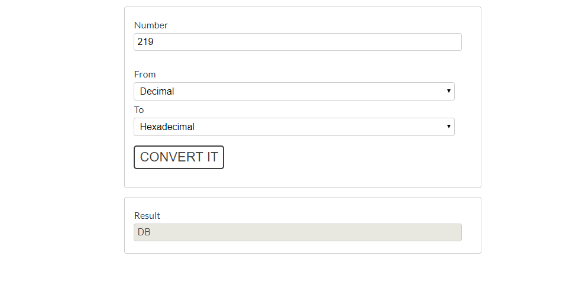
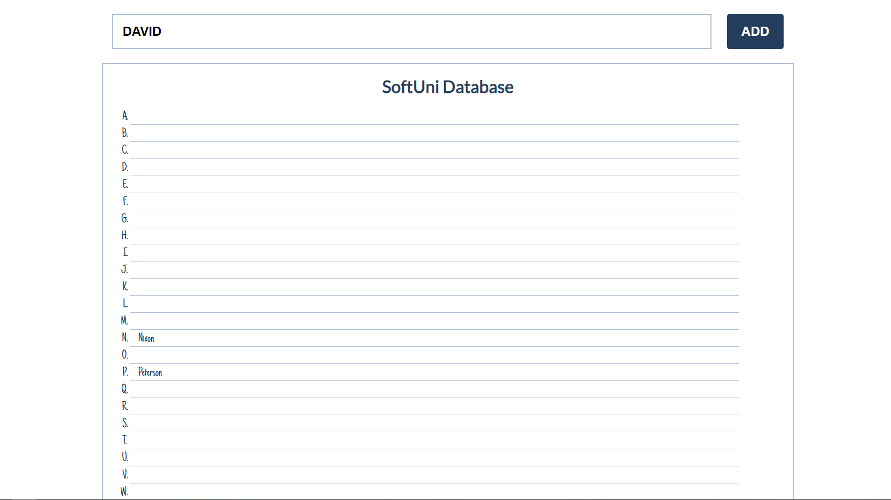

Exercise: DOM
=============

Problems for in-class lab for the ["JS Advanced" Course
\@SoftUni"](https://softuni.bg/courses/js-advanced). Submit your solutions in
the SoftUni judge system at
<https://judge.softuni.bg/Contests/1802/Exercise-DOM>

01\. Chat Room
---------

Write a **function** to create the functionality of **a chat room.**

**Note: Do not forget** to **add event listener** to the **send button!**

**The new div element with class message my-message** should contain the current
message that is about to be send.

The **current div** should be appended to the div with an
**id="chat_messages".**

*The input should be cleared on each click of the send button.*

02\. Number Convertor
----------------

Write a function that **converts** a **decimal number** to **binary** and
**hexadecimal**.

The given number will always be in **decimal format.** The "**From**" select
menu will only have a

**Decimal** option, but the "**To"** select menu will have **two options**:
**Binary** and **Hexadeicmal**.

This means that our program should have the functionality to **convert decimal**
to **binary** and

**decimal** to **hexadecimal**.

Note that "**To" select menu** by default is empty. You have to insert the two
options (**'Binary'** and **'Hexadecimal'**) inside before continue. Also they
should have **values** ('**binary**' and '**hexadecimal**').

-   When the [**Convert it**] button is **clicked**, the expected result should
    appear in the [**Result**] input field.

03\. JavaScript Quizz
----------------

Write a function that has the functionality of a quiz.

There are three **sections** that contain **one question and 2 possible
answers.**

**The right answer is only one!**

When one of the **list elements is clicked,** the next section **must appear (if
any…)**.

After all three questions have been answered, the **result div** must
**appear.** (Use **'none'** and **'block**' to hide and show the question
sections)

If all questions are answered correctly, you should prin the following message:  
"**You are recognized as top JavaScript fan!**"

Otherwise, just print "**You have {rightAnswers} right answers**".

The right answers are (**onclick, JSON.stringify() and A programming API for
HTML and XML documents**).

04\. Numpad Calculator
-----------------

Write a function that implements a calculator that has the following
functionalities:

When one of **the buttons is clicked, its value** should be shown in the
"**Expression**" **field** (**\#expressionOutput**).

For instance, if we click on the button with value **9**, the expected result
should be:

If the **current Expression** field (**\#expresisonOutput**) contains the whole
math expression (**left operand**, **operator** and **right operand**:
**Example: 9 + 2**), the expected result should be:

When the **equal sign "=" is pressed, the result of that expression** should
appear in the **Result** field (**\#resultOutput**)

Otherwise, if we create an invalid expression such as "**99 +**" (**without
second/right operand**) and we hit the equal sign "**=**", the expected result
should be:

The "**Clear**" button should **clear both Expression and Result fields
(\#expressionOutput** and **\#resultOutput)**

For instance, if we have the following expression:

And we press "**Clear**", the expected result should be:

05\. Order the names
---------------

Write a **function that orders names alphabetically**.

You will receive a **name of a student as an input**. When the "**Register**"
button is **clicked**, you should

add the given student name in the SoftUni Database, while **keeping** the
**alphabetial order**.

For instance, if we register **David,** his name should appear in the **D**
column.

If you **receive more than one name with the same starting letter**, you should
**join all names** by a

comma and a space ("**,** ").

06\. Table - Search Engine
---------------------

Write a function that **searches** in a **table** by given input.

When the "**Search**" **button** is **clicked**, go through all cells in the
table except for the first row (Student name, Student email and Student course)
and check if the given input has a match (check for both **full words** and
**single letters**).

If any of the rows contain the submitted string, add a **select class** to that
row. Note that more than one row may contain the given string.

Оtherwise, if there is no match, **nothing should happen**.

**Note:** After every search ("**Search**" button is clicked), **clear the input
field** and **remove all already selected classes** (if any) from the previous
search, in order for the **new search** to contain only the **new result**.

For instance, if we try to find **eva:**

The result should be:

If we try to find all students who have email addresses in **softuni** domain,
the expected result should be:

07\. Shopping Cart
-------------

You will be given some products that you should be able to add to your cart.
Each product will have a **name, picture** and a **price**.

When the **"Add"** button is clicked, append the current product to the
**textarea** in the following format: **"Added {name} for {money} to the
cart.\\n"**.

When the button **"Checkout"** is clicked, calculate the **total money** that
you need to pay for the products that are currently in your cart. Append the
result to the **textarea** in the following format:

**"You bought {list} for {totalPrice}."**

The list should contain only the **unique products**, separated by **", "**. The
total price should be rounded to the second decimal point.

Also, after clicking over "**Checkout**" and every from above is done you should
**disable all buttons**. (You **can't** add products or checkout again, if once
checkout button is clicked)

### Examples

08\. Furniture
---------

You will be given some furniture as an **array of objects**. Each object will
have a **name**, a **price** and a **decoration factor**.

When the **"Generate" button is clicked**, add a **new row to the table** for
each piece of furniture with **image, name, price** and **decoration factor**
(code example below).

When the **"Buy"** button is clicked, get all **checkboxes that are marked** and
show in the **result textbox** the **names** of the piece of furniture that
**were checked**, separated by a **comma** and **single space** (**", "**) in
the following format: **"Bought furniture: {furniture1} {furniture2}…"**.

On the next line, print the total price in format: **"Total price:
{totalPrice}"** (formatted to the second decimal point). Finally, print the
average decoration factor in the format: **"Average decoration factor:
{decFactor}"**

### Input Example

**[{"name": "Sofa", "img":
"https://res.cloudinary.com/maisonsdumonde/image/upload/q_auto,f_auto/w_200/img/grey-3-seater-sofa-bed-200-13-0-175521_9.jpg",
"price": 150, "decFactor": 1.2}]**

### Examples

09\. Cards
-----

Write **a function** which **checks cards**, shows which one **is greater** and
**keeps history of all hands**.

**Firstly, add click events** to **all cards**. When one of the cards is
clicked, the current background card must be changed with the
"**whiteCard.jpg**" picture (it is given in the skeleton) and the **card name
should be appended** to one of the **span** elements in the **div** with
**id="result".**

If a card **from the top side** is **clicked**, **append** the **card name** to
the **left span** (first empty **span**), otherwise **append** the card **name**
to the **right span** (second/last **span**).

When **cards** from **both sides are selected, check** which one is **greater**.
The greater card should have border "**2px solid green**" and the lower card -
"**2px solid red"**.

You should **clear** the **span elements** which **hold the current card names**
when both are selected, and the winner is selected. **After every hand,** push
the current card names in the **history div** in the following format:

[{top side card name} vs {bottom side card name} ]

10\. \*Sudomu
---------

Write a function that implements **SUDOMU** (**Sudoku inside the DOM**).

The rules are simple and they are **the same** as the **typical sudoku game**
(for more information,

click
[here](https://sudoku.com/how-to-play/sudoku-rules-for-complete%20beginners/))

If the table is filled with the **right numbers**, and the "**Quick Check**"
button is **clicked**, the

expected result should be:

The table borer should be changed to: "**2px solid green".** The **text
content** of the **paragraph**

inside the **div** with an **id** "**check**" must be "**You solve it!
Congratulations!**"

The text color of that div must be **green.**

Otherwise, when the filled table **does not solve the sudomu,** the result
should be:

The table border should be changed to: "**2px solid red**".

The **text content** of the **paragraph** inside the **div** with an **id**
"**check**" must be:

"**NOP! You are not done yet…**"

The text color of that div must be **red!**

The "**Clear**" button **clears the whole SUDOMU (removes all numbers)** and the
**paragraph**

**which contains the messages. It also removes the table border.**

