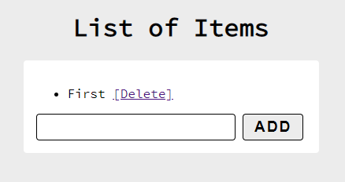
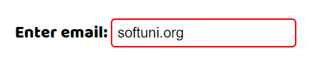

**Lab: DOM Manipulations**

Problems for in-class lab for the ["JavaScript Advanced” course \@
SoftUni](https://softuni.bg/courses/js-advanced)*"*. Submit your solutions in
the SoftUni judge system at
<https://judge.softuni.bg/Contests/1549/Lab-DOM-Manipulation>.

01\. List of Items
------------

Write a **function** that **reads** the **text** inside an input field and
**appends** the specified text to a list inside an HTML page.

Submit **only** the **addItem()** function in judge.

**Input/Output**

There will be no input/output, your program should instead **modify** the DOM of
the given HTML document.

**Examples**

02\. Add / Delete
-------------------

Extend the previous problem to display a **[Delete] link** after each list item.
**Clicking** it should **delete** the item with no confirmation.

Submit **only** the **addItem()** function in judge.

**Input/Output**

There will be no input/output, your program should instead **modify** the DOM of
the given HTML document.

**Examples**

03\. Delete from Table
---------------

Write a program that **takes** an **e-mail** from an **input field** and
**deletes** the matching row from a table. If no entry is found, an **error**
should be displayed in a **\<div\>** with ID "**results**". The error should be
"**Not found**." Submit **only** the **deleteByEmail()** function in judge.

**Input/Output**

There will be no input/output, your program should instead **modify** the DOM of
the given HTML document.

**Examples**

04\. Stopwatch
-------------

Write a **timer** that counts **minutes** and **seconds**. The user should be
able to control it with **buttons**. Clicking **[Start] starts** the
**counter.** Clicking **[Stop] resets** the timer back to **zero**. Only **one**
of the buttons should be **enabled** at a time (you cannot stop the timer, if it
is not running).

Submit only the **stopwatch()** function in judge.

**Input/Output**

There will be no input/output, your program should instead **modify** the DOM of
the given HTML document.

**Examples**

05\. Mouse Gradient
------------

Write a program that **detects** and **displays** how far along a gradient the
user has **moved** their **mouse**. The result should be **rounded down** and
displayed as a **percentage** inside the **\<div\>** with ID "**result**".

Submit **only** the **attachGradientEvents()** function in judge.

**Input/Output**

There will be no input/output, your program should instead **modify** the DOM of
the given HTML document.

**Examples**

06\. Highlight Active
------------

Write a **function** that **highlights** the **currently active** section of a
document. There will be **multiple** divs with **input fields** inside them. Set
the **class** of the **div** that contains the **currently focused** input field
to "**focus**". When focus is lost (**blurred**), **remove the class** from the
element.

Submit only the **focus()** function in judge.

**Input/Output**

There will be no input/output, your program should instead **modify** the DOM of
the given HTML document.

**Example**

07\. Dynamic Validation
--------------

Write a **function** that **dynamically validates** an **email** input field
when it is **changed**. If the input is **invalid**, apply the style
"**error**". Do **not** validate on every keystroke, as it is annoying for the
user, consider only **change** events.

A valid email is considered to be in the format:
**\<name\>\@\<domain\>.\<extension\>**

Only **lowercase Latin characters** are allowed for any of the parts of the
email. If the input is valid, **clear** the style. Submit **only** the
**validate()** function in judge.

**Input/Output**

There will be no input/output, your program should instead **modify** the DOM of
the given HTML document.

**Example**

