**Exercise: DOM Manipulations**

Problems for exercises and homework for the ["JavaScript Advanced" course \@
SoftUni](https://softuni.bg/courses/js-advanced)*"*. Submit your solutions in
the SoftUni judge system at
<https://judge.softuni.bg/Contests/1550/Exercise-DOM-Manipulations>.

01\. Subtraction
-----------

An HTML page holds **two text fields** with ids "**firstNumber**" and
"**secondNumber**". Write a function to **subtract** the values from these text
fields and display the result in the **div** named "**result**".

**HTML and JavaScript Code**

Implement the above to provide the following functionality:

-   Your function should take the values of "**firstNumber**" and
    "**secondNumber**", **convert** them to numbers, **subtract** the second
    number from the first one and then append the result to the **\<div\>** with
    **id="result"**.

-   Your function should be able to work with **any 2 numbers** in the inputs,
    not only the ones given in the example.

**Example**

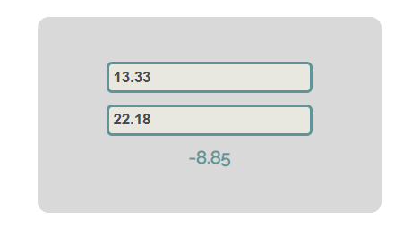

**Hints**

We see that the **textboxes** and the **div** have **id** attributes on them.  

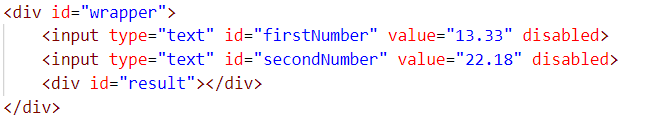

We can take the numbers directly from the input field by using the
**getElementById()** function. After we have taken the elements from the DOM,
it’s time to do the actual work. We get the values of the two **textboxes**, the
value of a textbox, as one would expect, is **text**. In order to get a
**number**, we need to use a function to **parse them**.

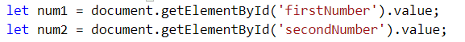

All that’s left now is to append the result to the **div**. We use the same
function to get the **result** element by id and change its **text content** to
the result of the **subtraction.**

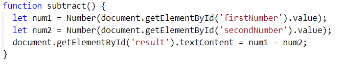

Our code is ready now. Submit only the **subtract()** function in judge.

02\. Fill Dropdown
-------------

Your task is to take values from **input** fields with **ids "newItemText"** and
**"newItemValue"**. Then you should create and append an **\<option\>** to the
**\<select\>** with **id "menu".**

**Example**

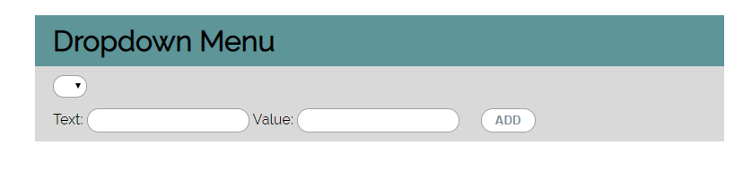

**Hints**

-   Your function should take the values of **newItemText** and
    **newItemValue**. After that you should create a new **option** element and
    set its **textContent** and its **value** to the newly taken ones.

-   Once you have done all of that, you should **append** the newly created
    **option** as a **child** to the **select** item with id **"menu".**

-   Finally, you should **clear** the value of the two **input** fields.

03\. Accordion
---------

An **html** file is given and your task is to show **more**/**less** information
by clicking a **[ADD] button** (it is not an actual button, but a **span** that
has an **onclick** event attached to it). When **[More] button** is clicked, it
**reveals** the content of a **hidden** div and **changes** the text of the
button to **[Less]**. When the same link is clicked **again** (now reading
**Less**), **hide** the div and **change** the text of the link to **More**.
Link action should be **toggleable** (you should be able to click the button
infinite amount of times).

**Example**

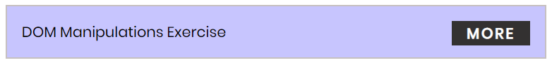

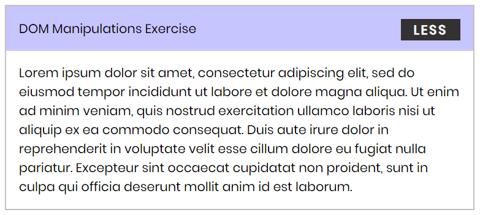

**Hints**

-   To **change** the text content of a button, you could use
    **getElementsByClassName**. However, that returns a **collection** and we
    need only **one** element from it, so the correct way is to **use
    getElementsByClassName("button")[0]** as it will return the needed span
    element.

-   After that we should change the **display style** of the div with an **id**
    "**extra**". If the display style is "**none**", we should **change** it to
    "**block**" and the **opposite**.

-   Along with all of this, we should **change** the text content of the
    **button** to **[Less]**/[**More]**.

04\. Sections
--------

You will receive an **array** of strings. For each string, create a **div** with
a **paragraph** with the **string** in it. Each paragraph is initially **hidden
(display:none)**. Add a **click event listener** to **each div** that
**displays** the **hidden** paragraph. Finally, you should **append** all divs
to the element with an **id** "**content**".

**Example**

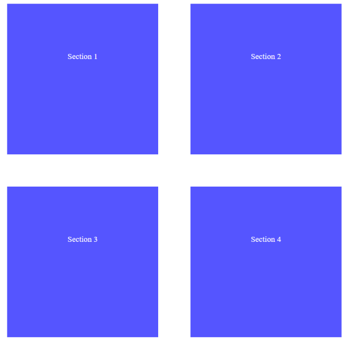

05\. Notification
------------

Write a **function** that receives a string **message** and **displays** it
inside a div with an id "**notification**" for 2 seconds. The div is initially
**hidden** and when the function is called, it must be **shown**. After 2
seconds, **hide** the div. In the example below, a notification is shown when
you **click** the button.

**Example**

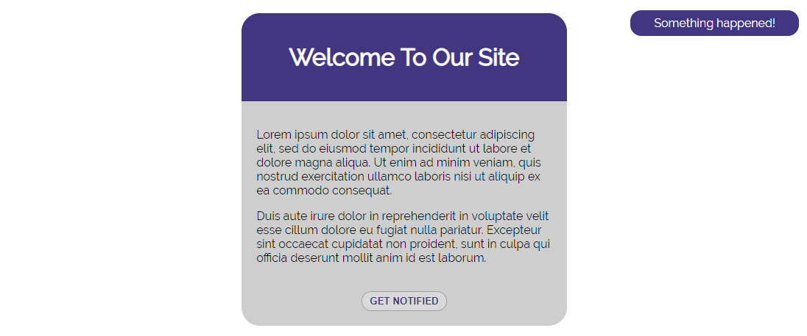

When we click the [**GET NOTIFIED**] **button**, a **div** appears in our
upper-right corner. It should **disappear** in 2 seconds.

06\. Time Converter
--------------

Create a program that **converts** different time units. Your task is to add a
**click** event listener to **all** [**CONVERT**] **buttons**. When a button is
**clicked**, read the **corresponding** input field, **convert** the value to
the **three other** time units and **display** it in the input fields.

**Example**

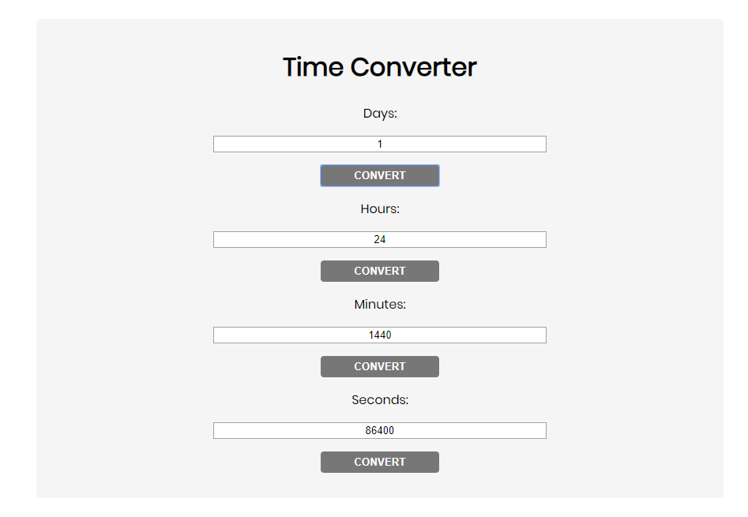

One day is equal to 24 hours/1440 minutes/86400 seconds. Whichever button we
**click,** the input fields should **change** depending on the added value on
the left. (For example, if we write 48 hours and click convert the days, the
field value should change to 2).

07\. Locked Profile
--------------

In this problem, you should **create a JS functonality** which **shows** and
**hides** the additional

information about users.

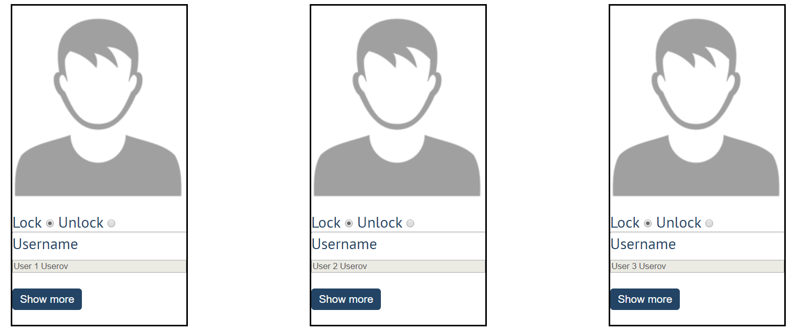

When one of the [**Show more**] **buttons** is clicked, the **hiden
information** inside the div should

be shown, only if **the profile is not locked**! If the current profile is
**locked,** nothing should

happen.

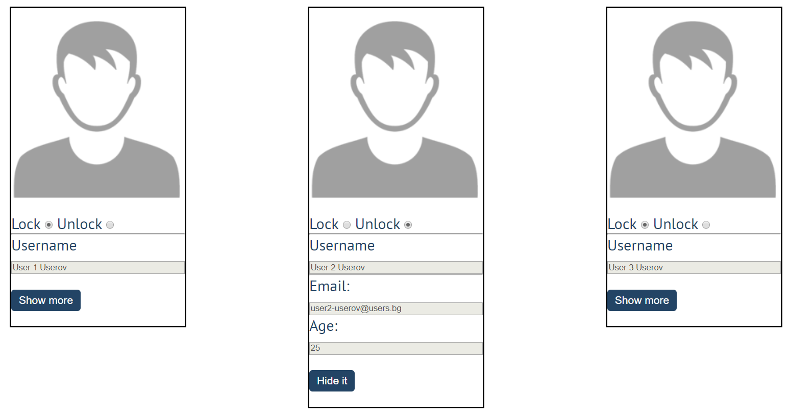

If the **hidden information is displayed** and we **lock the profile again**,
the [**Hide it**] button

should **not be working**! Otherwise, when the profile is **unlocked** and we
click on the **[Hide it]**

button, the new fields must hide again.

08\. Encode and Decode Messages
--------------------------

In this problem, you should **create a JS functonality** which **encodes and
decodes some**

**messages which travel to the network.**

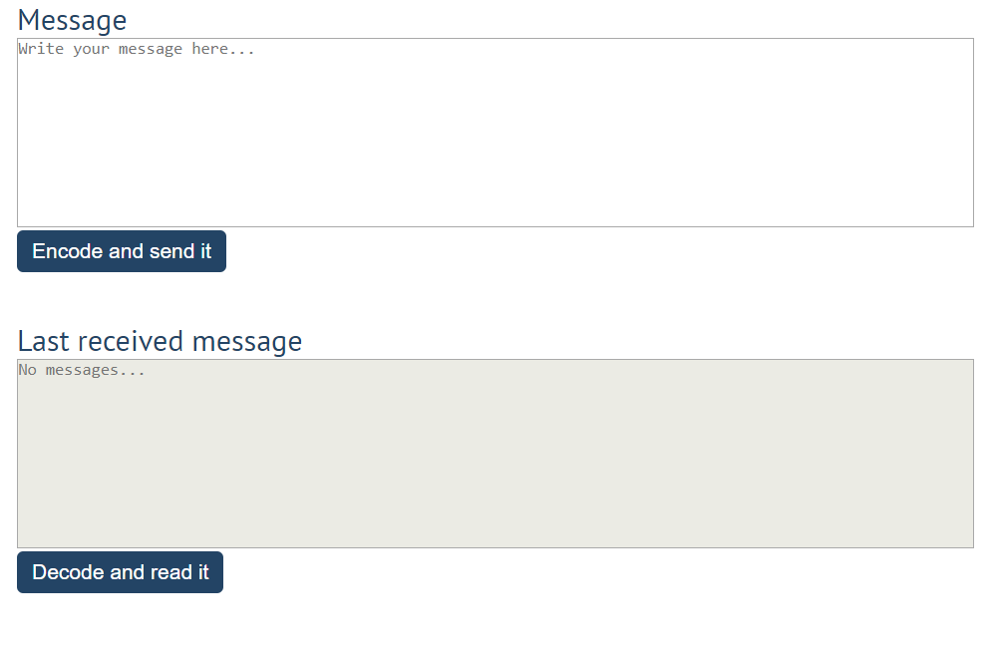

This program should contain **two functionalities**.

The first one is to **encode the given message** and **send it** to the
**receiver**.

The second one is to **decode the received message** and **read it (display
it)**.

When the [**Encode and send it**] **button** is clicked, you should get the
given message from the first textarea. When you get the current message, you
should encode it as follows:

-   **Change** the **ASCII CODE** on **every single character** in that message
    when you **add 1** to the current **ASCII NUMBER**, that represent the
    current character in that message

-   **Clear** the **sender textarea** and **append** the encoded message to the
    **receiver textarea**

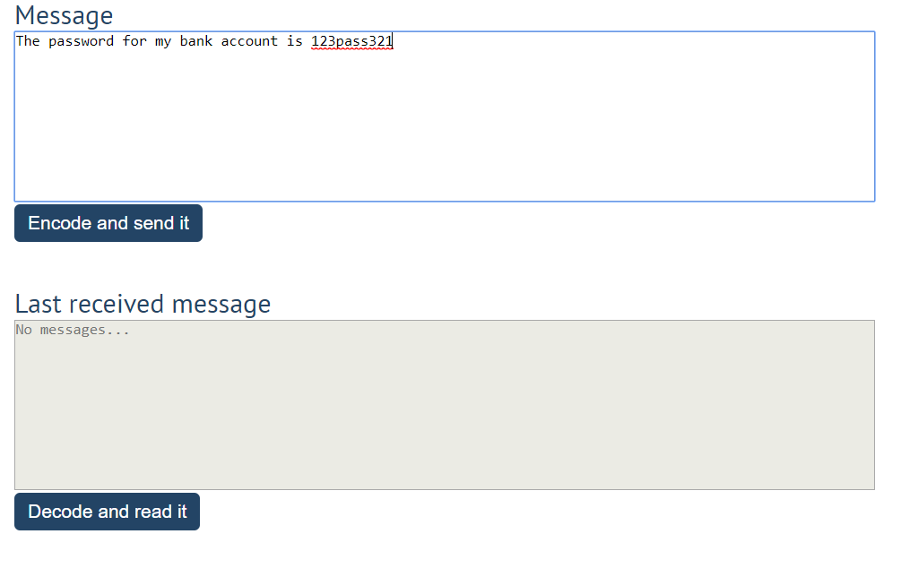

*After clicking [Encode and send it] button the result should be:*

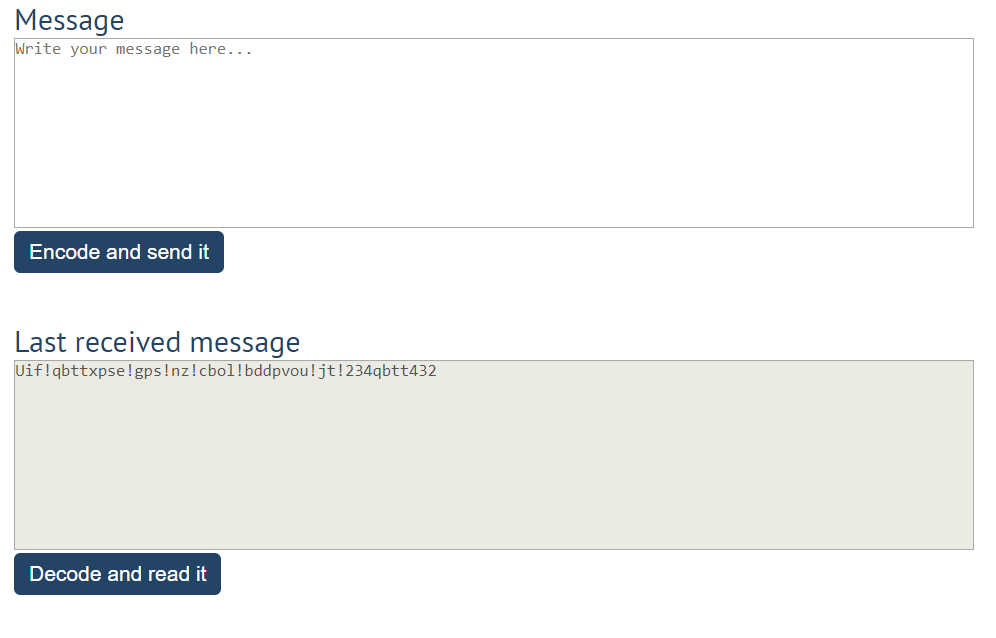

After that, when the [**Decode and read it**] **button** is clicked. You need to
get the **encoded message** from **the receiver textarea** and do the **opposite
logic** from encoding:

-   **Subtract 1** from the current **ASCII NUMBER**, that represents the
    current character in that message

-   Replace the **encoded message** with the already **decoded message** in the
    receiver textrea, to make it readable

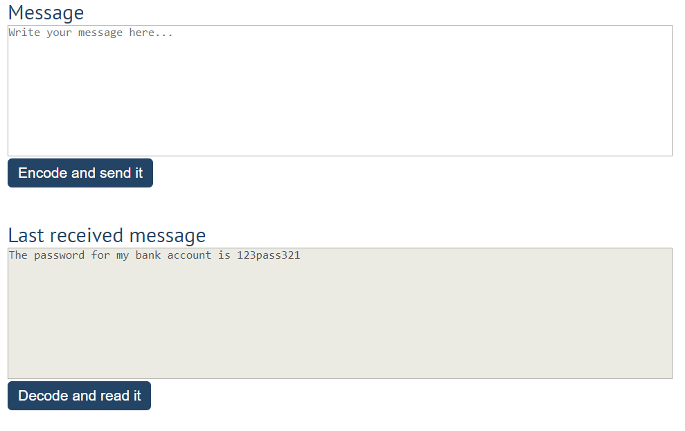

09\. \*Distance Converter
---------------------

Your task is to convert from **one** distance unit to **another** by adding a
**click** event listener to a button. When it is clicked, **read** the value
from the input field and **get** the **selected** option from the **input** and
**output** units drop downs. Then **calculate** and **display** the converted
value in the **disabled** output field.

**Example**

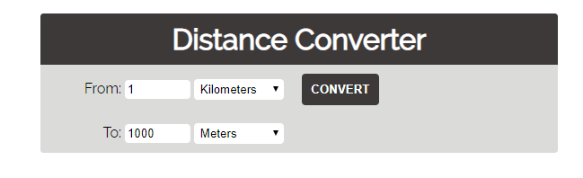

**Hints**

-   Multiply the incoming distance by the following conversion rates to convert
    to meter

-   Divide to convert from meters to the required output unit

-   To see which option is selected, read the properties of its parent:
    **value** gives you the value of the selected option (as displayed in the
    HTML), **selectedIndex** gives you the 0-based index of the selected option.
    For example, if miles are selected, **inputUnits.value** is "**mi**",
    **inputUnits.selectedIndex** is **4**. Option text is irrelevant

-   Use the following table information to do that:

| **1 km**  | **1000 m**    |
|-----------|---------------|
| **1 m**   | **1 m**       |
| **1 cm**  | **0.01 m**    |
| **1 mm**  | **0.001 m**   |
| **1 mi**  | **1609.34 m** |
| **1 yrd** | **0.9144 m**  |
| **1 ft**  | **0.3048 m**  |
| **1 in**  | **0.0254 m**  |
