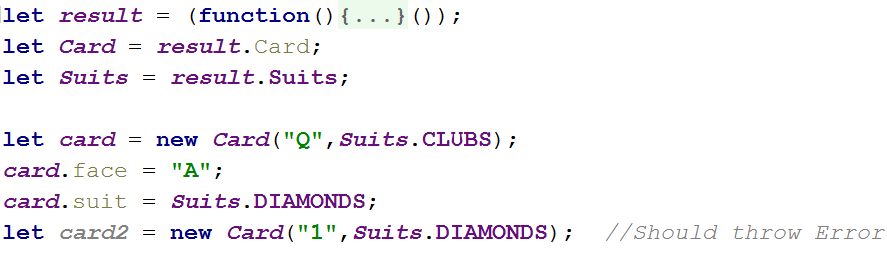

Lab: Classes
============

Problems for exercises and homework for the ["JavaScript Advanced" course \@
SoftUni](https://softuni.bg/courses/js-advanced). Submit your solutions in the
SoftUni judge system at <https://judge.softuni.bg/Contests/1533/Lab-Classes>.

Classes
=======

01\. Rectangle
---------

Write a **class** for a rectangle object. It needs to have a **width** (Number),
**height** (Number) and **color** (String) properties, which are set from the
constructor and a **calcArea()** method, that calculates and **returns** the
rectangle’s area.

### Input

The constructor function will receive valid parameters.

### Output

The **calcArea()** method should **return** a number.

Submit the class definition as is, **without** wrapping it in any function.

### Examples

| Sample Input                                                                                                                                     | Output     |
|--------------------------------------------------------------------------------------------------------------------------------------------------|------------|
| let rect = new Rectangle(4, 5, 'red'); console.log(rect.width); console.log(rect.height); console.log(rect.color); console.log(rect.calcArea()); | 4 5 Red 20 |

02\. Person
------

Write a **class** that represents a personal record. It has the following
properties, all set from the constructor:

-   firstName

-   lastName

-   age

-   email

And a method **toString()**, which prints a summary of the information. See the
example for formatting details.

### Input

The constructor function will receive valid parameters.

### Output

The **toString()**method should **return** a string in the following format:

**"{firstName} {lastName} (age: {age}, email: {email})"**

Submit the class definition as is, **without** wrapping it in any function.

### Example

| Sample Input                                                                                       |
|----------------------------------------------------------------------------------------------------|
| let person = new Person('Anna', 'Simpson', 22, 'anna\@yahoo.com'); console.log(person.toString()); |
| Output |
| Anna Simpson (age: 22, email: anna\@yahoo.com)                                                     |

03\. Get Persons
-----------

Write a function that returns an array of **Person** objects. Use the class from
the previous task, create the following instances, and return them in an array:

| First Name | Last Name | Age | Email           |
|------------|-----------|-----|-----------------|
| Anna       | Simpson   | 22  | anna\@yahoo.com |
| SoftUni    |           |     |                 |
| Stephan    | Johnson   | 25  |                 |
| Gabriel    | Peterson  | 24  | g.p\@gmail.com  |

For any empty cells, do not supply a parameter (call the constructor with less
parameters).

### Input / Output

There will be **no input**, the data is static and matches the table above. As
**output**, **return an array** with **Person instances**.

Submit a function that returns the required output.

04\. Circle
------

Write a **class** that represents a **Circle**. It has only one data property -
it’s **radius**, and it is set trough the **constructor**. The class needs to
have **getter** and **setter** methods for its **diameter** - the setter needs
to calculate the radius and change it and the getter needs to use the radius to
calculate the diameter and return it.

The circle also has a getter **area()**, which calculates and **returns** its
area.

### Input

The constructor function and diameter setter will receive valid parameters.

### Output

The **diameter()** and **area()** getters should **return** numbers.

Submit the class definition as is, **without** wrapping it in any function.

### Examples

| Sample Input | Output |
|:-------------------------------------------------------------------------------------------------------------------------------------------------------------------------------------------------------------------------------------------------------------------------------------:|------------------------------------------------------------------|
| let c = new Circle(2); console.log(\`Radius: ${c.radius}\`); console.log(\`Diameter: ${c.diameter}\`); console.log(\`Area: ${c.area}\`); c.diameter = 1.6; console.log(\`Radius: ${c.radius}\`); console.log(\`Diameter: ${c.diameter}\`); console.log(\`Area: ${c.area}\`); | 2 4 12.566370614359172 0.8 1.6 2.0106192982974678 |

05\. Point Distance
--------------

Write a JS **class** that represents a **Point**. It has **x** and **y**
coordinates as properties, that are set through the constructor, and a **static
method** for finding the distance between two points, called **distance()**.

### Input

The **distance()** method should receive two **Point** objects as parameters.

### Output

The **distance()** method should **return** a number, the distance between the
two point parameters.

Submit the class definition as is, **without** wrapping it in any function.

### Example

| Sample Input | Output |
|:----------------------------------------------------------------------------------------------:|--------|
| let p1 = new Point(5, 5); let p2 = new Point(9, 8); console.log(Point.distance(p1, p2)); | 5 |

06\. Cards
-----

You need to write an **IIFE** that results in an object containing two
properties **Card** which is a class and **Suits** which is an object that will
hold the possible suits for the cards.

The **Suits** object should have exactly these 4 properties:

-   **SPADES**: ♠

-   **HEARTS**: ♥

-   **DIAMONDS**: ♦

-   **CLUBS**: ♣

Where the key is **SPADES**, **HEARTS** e.t.c. and the value is the actual
symbol ♠, ♥ and so on.

The **Card** class should allow for creating cards, each card has 2 properties
**face** and **suit**. The **valid** faces are the following **["2", "3", "4",
"5", "6", "7", "8", "9", "10", "J", "Q", "K", "A"]** any other are considered
invalid.

The **Card** class should have **setters** and **getters** for the **face** and
**suit** properties, when creating a card or setting a property validations
should be performed, if an invalid face or a suit not in the **Suits** object is
passed an **Error** should be **thrown**.

### Screenshot

An example usage should look like this:

