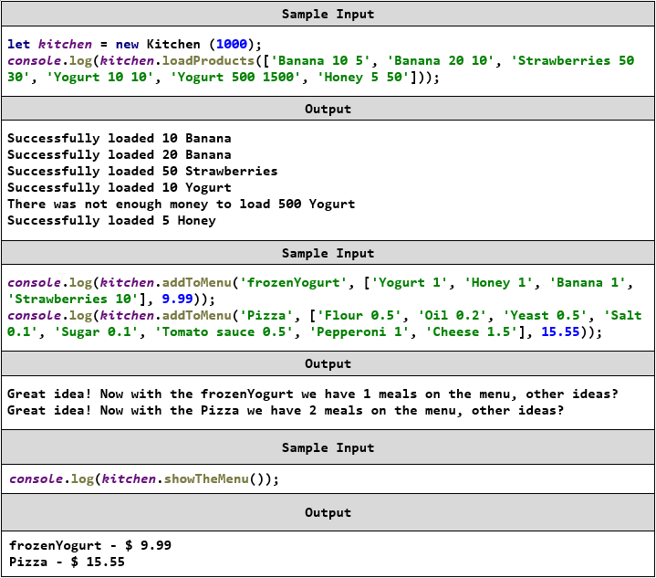

Exercise: Classes
=================

Problems for exercises and homework for the ["JavaScript Advanced" course \@
SoftUni](https://softuni.bg/courses/js-advanced). Submit your solutions in the
SoftUni judge system at
<https://judge.softuni.bg/Contests/1534/Exercise-Classes>.

01\. Data Class
----------

Write a **class** that holds data about an HTTP **Request**. It has the
following properties:

-   **method** (String)

-   **uri** (String)

-   **version** (String)

-   **message** (String)

-   **response** (String)

-   **fulfilled** (Boolean)

The first four properties (**method**, **uri**, **version**, **message**) are
set trough the **constructor**, in the listed order. The **response** property
is initialized to **undefined** and the **fulfilled** property is initially set
to **false**.

### Constraints

-   The constructor of your class will receive **valid parameters**.

-   Submit the class definition as is, **without** wrapping it in any function.

### Examples

### Hints

Using ES6 syntax, a class can be defined similar to a function, using the
**class** keyword:

At this point, the **class** can already **be instantiated**, but it won’t hold
anything useful, since it doesn’t have a constructor. A **constructor** is a
function that **initializes** the object’s **context** and attaches **values**
to it. It is defined with the keyword **constructor** inside the body of the
class definition and it follows the syntax of regular JS functions - it can take
**arguments** and execute **logic**. Any variables we want to be attached to the
**instance** must be prefixed with the **this** identifier:

The description mentions some of the properties need to be set via the
constructor - this means the constructor must receive them as parameters. We
modify it to take four named parameters that we then assign to the local
variables:

Note the input parameters have the same names as the instance variables - this
isn’t necessary, but it’s easier to read. There will be no name collision,
because the **this** identifier tells the interpreter to look for a variable in
a different context, so **this.method** is not the same as **method**.

Our class is complete and can be submitted in
[Judge](https://judge.softuni.bg/Contests/Practice/Index/1534#0).

02\. Tickets
-------

Write a program that manages a database of tickets. A ticket has a
**destination,** a **price** and a **status**. Your program will receive **two
arguments** - the first is an **array of strings** for ticket descriptions and
the second is a **string**, representing a **sorting criterion**. The ticket
descriptions have the following format:

**\<destinationName\>\|\<price\>\|\<status\>**

Store each ticket and at the end of execution **return** a sorted summary of all
tickets, sorted by either **destination**, **price** or **status**, depending on
the **second parameter** that your program received. Always sort in ascending
order (default behavior for **alphabetical** sort). If two tickets compare the
same, use order of appearance. See the examples for more information.

### Input

Your program will receive two parameters - an **array of strings** and a
**single string**.

### Output

**Return** a **sorted array** of all the tickets that where registered.

### Examples

03\. Unity
-----

Rats are uniting.

Create a class **Rat**, which holds the functionality to unite with other
objects of the same type. Make it so that the object holds all the other objects
it has connected to.

The class should have a **name**, which is a **string**, and it should be
**initialized with it**.

The class should also hold a function **unite(otherRat)**, which unites the
**first object** with the **given one**. An object should store all of the
objects it has united to. The function should only add the object if it is an
object of the class **Rat**. In any other case it should **do nothing**.

The class should also hold a function **getRats()** which returns all the rats
it has united to, in a list.

Implement functionality for **toString()** function… which returns a string
representation of the object and all of the objects its united with, each on a
new line. On the first line put the object’s name and on the next several lines
put the united objects’ names, each with a padding of “**\#\#**”.

### Example

### Hints

Submit your solution as a **class representation only**! No need for IIFEs or
wrapping of classes.

04\. Length Limit
------------

Create a class **Stringer**, which holds **single string** and a **length**
property. The class should be initialized with a **string**, and an **initial
length.** The class should always keep the **initial state** of its **given
string**.

Name the two properties **innerString** and **innerLength**.

There should also be functionality for increasing and decreasing the initial
**length** property.  
Implement function **increase(length)** and **decrease(length)**, which
manipulate the length property with the **given value**.

The length property is **a numeric value** and should not fall below **0**. It
should not throw any errors, but if an attempt to decrease it below 0 is done,
it should be automatically set to **0**.

You should also implement functionality for **toString()** function, which
returns the string, the object was initialized with. If the length of the string
is greater than the **length property**, the string should be cut to from right
to left, so that it has the **same length** as the **length property**, and you
should add **3 dots** after it, if such **truncation** was **done**.

If the length property is **0**, just return **3 dots.**

### Examples

### Hints

Store the initial string in a property, and do not change it. Upon calling the
**toString()** function, truncate it to the **desired value** and return it.

Submit your solution as a class representation only! No need for IIFEs or
wrapping of classes.

05\. \*Extensible Class
------------------

Your task here is to deliver a **class** that can be **extended**. Implement an
**extend(template)** method that would copy **all** of the properties of
**template** to the **instance** (not to all instances, just the one from which
the method was called) and if the property is a function, add it to the object’s
**prototype** instead.

In addition, the base class needs to have an **ID property** that is **unique**
and **autoincremented** sequentally for every new instance.

### Input / Output

The **extend()** function of your **class** will receive a valid object as
**input parameter**, and has **no** output.

Structure your code as an **IIFE** that **returns** the class.

### Examples

### Hints

You may have to keep track of the last assigned ID in a **closure** that is
accessible by the constructor. Constructor functions offer direct access to
their prototypes - you can view and modify them with **className.prototype**.

06\. Sorted List
-----------

Implement a **class**, which **keeps** a list of numbers, sorted in **ascending
order**. It must support the following functionality:

-   **add(elemenent)** - adds a new element to the collection

-   **remove(index)** - removes the element at position **index**

-   **get(index)** - returns the value of the element at position **index**

-   **size** - number of elements stored in the collection

The **correct order** of the elements must be kept **at all times**, regardless
of which operation is called. **Removing** and **retrieving** elements
**shouldn’t work** if the provided index points **outside the length** of the
collection (either throw an error or do nothing). Note the **size** of the
collection is **not** a function.

### Input / Output

All function that expect **input** will receive data as **parameters**.
Functions that have **validation** will be tested with both **valid and
invalid** data. Any result expected from a function should be **returned** as
it’s result.  
Your **add** and **remove functions** should **return** an **class instance**
with the required functionality as it’s result.

Submit the class definition as is, **without** wrapping it in any function.

07\. Instance Validation
-------------------

Write a class for a checking account that validates it’s created with valid
parameters. A **CheckingAccount** has a **clientId**, **email**, **firstName**,
**lastName**. Each parameter must meet specific requirements:

-   **clientId** - Must be a string representing a **6-digit number**; if
    invalid, throw a **TypeError** with the message "**Client ID must be a
    6-digit number**"

-   **email** - Must contain at least one **alphanumeric character**, followed
    by the **\@** symbol, followed by **one** or **more** letters or periods;
    all letters must be **Latin**; if invalid, throw a **TypeError** with
    message "**Invalid e-mail**"

-   **firstName**, **lastName** - Must be at least **3** and at most **20**
    characters long, containing **only** Latin letters;

    -   If the **length** is invalid, throw a **TypeError** with message:

     "{**First**/**Last**} name must be between 3 and 20 characters long"

-   If invalid **characters** are used, throw a **TypeError** with message:

    **"{First/Last} name must contain only Latin characters"** (replace
    **First**/**Last** with the relevant word)

All checks must happen in the **order** in which **they are listed** - if more
than one parameter is **invalid**, throw an error for the first encountered.
Note that **error messages** must be **exact**.

Submit your solution containing a single class definition.

### Examples

JS Advanced - Retake Exam: 18.11.2018
=====================================

08\. \*\*Kitchen
--------------

Write a class **Kitchen** which has the following functionality:

### Constructor

Should have 4 properties:

-   budget

-   menu

-   productsInStock

-   actionsHistory

At initialization of the **Kitchen** class, the constructor accepts **only** the
**budget!** The rest of the properties must be **empty**!

### Methods:

#### loadProducts() 

-   Accept 1 property **products** (**array from strings**).

    -   **Every element** into this array is information about product **in
        format**:  
        **"{productName} {productQuantity} {productPrice}"**

    -   They are separated by a **single space**  
        **Example**: ["**Banana 10 5**", **"Strawberries 50 30", "Honey 5
        50"…**]

-   This method **appends products** into our products in stock
    (**productsInStock**) *under the following circumstances:*

-   **If the budget allows us to buy the current product**, we add it to
    **productsInStock** keeping **the name** and **quantity** of **the meal**
    and we **deduct the price of the product** from **our budget.** If the
    current product already exists into **productsInStock** just add the new
    quantity

-   And finally, **whether or not** we have **added** a product to stock or
    **not**, we **record** our **action** in the **actionsHistory**:

-   *If we were able to add the current product:*

    "**Successfully loaded {productQuantity} {productName}**"

-   *If we not:*

    "**There was not enough money to load {productQuantity} {productName}**"

-   This method must **return all actions joined by a new line!**

#### addToMenu()

-   Accept 3 properties **meal** (string)**, needed products** (array from
    strings) and **price** (number).

-   Every element into **needed products** is in format:

    **"{productName} {productQuantity}"**

-   They are separated by a **single space**!

-   This method **appends a new meal** into our **menu and returns** the
    following message:

    **"Great idea! Now with the {meal} we have {the number of all means in the
    menu} meals in the menu, other ideas?"**

-   **If** we **do not have** the **given meal** into our **menu**, we added it
    **keeping all** that we are given as information. Otherwise if we already
    have this meal print the **message**:

    **" The {meal} is already in our menu, try something different."**

#### showTheMenu()

-   This method just **prints all meals** from our **menu separated by a new
    line** in format:

    **{meal} - \$ {meal price}**

    **{meal} - \$ {meal price}**

    **{meal} - \$ {meal price}**

    **…**

    At the end **trim the result!**

-   If our menu **is empty**, just print the **message**:

    "**Our menu is not ready yet, please come later...**"

#### makeTheOrder()

-   Accept 1 property **meal** (string).

-   This method **searches the menu** for a **certain meal**.

-   If **we do not have** the **given meal**, print the following **message**:

    "**There is not {meal} yet in our menu, do you want to order something
    else?**"

-   **Otherwise** if we **have this meal** in **the menu**, we need to check if
    we have the **needed products** to make it! If we **do not have all needed
    products** for this meal, print the following **message**:

    **"For the time being, we cannot complete your order ({meal}), we are very
    sorry..."**

-   If we **have this meal in the menu** and also, we **have all needed
    products** to make it, print the following message:

    "**Your order ({meal}) will be completed in the next 30 minutes and will
    cost you {the current price of the meal}."**

-   You also **need to remove all used products** from those in stock and **add
    the price** of the meal to the **total budget**.

### Submission

Submit only the **Kitchen class** as **JavaScript code**.

### Examples

