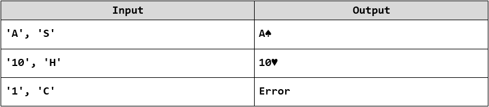

Lab: Unit Testing and Modules
=============================

Problems for exercises and homework for the ["JavaScript Advanced" course \@
SoftUni](https://softuni.bg/courses/js-advanced). Submit your solutions in the
SoftUni judge system at
<https://judge.softuni.bg/Contests/1531/Lab-Unit-Testing-and-Modules>.

Error Handling
==============

01\. Sub Sum
-------

Write a function to sum a **range** of **numeric elements** from an array.

The function takes **three parameters** - the first is an **array**, the second
is the **start index** and the third is the **end index**. Both indexes are
**inclusive**. Have in mind that the array elements **may not be** of **type
Number** and **cast everything**. Implement the following **error handling**:

-   If the **first element** is not an array, **return NaN**

-   If the **start index** is less than zero, consider its value to be a
    **zero**

-   If the **end index** is outside the bounds of the array, assume it points to
    the **last index of the array**

### Input / Output

Your function must take **three parameters**. As output, **return the sum**.

### Examples

02\. Playing Cards
-------------

Create a JS **factory function** that returns a **Card object** to hold a card’s
**face** and **suit**, both set through the **constructor**. **Throw an error**
if the card is **initialized** with **invalid face** or **suit** or if an
attempt is made to change the **face** or **suit** of an **existing instance to
an invalid** value.

-   Valid card faces are: 2, 3, 4, 5, 6, 7, 8, 9, 10, J, Q, K, A

-   Valid card suits are: S (♠), H (♥), D (♦), C (♣)

Both face and suit are expected as an **uppercase string**. The class also needs
to have a **toString()** method that **prints** the card’s face and suit **as a
string**. Use the following UTF code literals to represent the suits:

-   \\u2660 – Spades (♠)

-   \\u2665 – Hearts (♥)

-   \\u2666 – Diamonds (♦)

-   \\u2663 – Clubs (♣)

### Input / Output

The factory function takes **two string parameters**. The **toString()** method
of the returned object must **return a string**.

### Examples

03\. Deck of Cards
-------------

Write a function that takes **a deck of cards** as an **array of strings** and
**prints** them as a **sequence** of cards (**space separated**). Use the
solution from the **previous task** to generate the cards.

Print "**Invalid card: [card]**" when an **invalid card** definition is passed
as input.

### Input / Output

The function takes an **array of strings** as parameter. **Print** the list of cards as **string**, **separated by space**.

### Examples

Unit Testing
============

You are required to **submit only the unit tests** for the **object/function**
you are testing.

04\. Sum of Numbers
--------------

Write tests to check the functionality of the following code:

Your tests will be supplied with a function named **'sum()'**. It should meet
the following requirements:

-   Take an **array of numbers** as argument

-   **Return** the **sum** of the values of **all elements** inside the array

05\. Check for Symmetry
------------------

Write tests to check the functionality of the following code:

Your tests will be supplied with a function named **'isSymmetric()'**. It should
meet the following requirements:

-   Take an **array** as argument

-   **Return false** for any input that isn’t of the **correct type**

-   **Return true** if the input array is **symmetric**

-   Otherwise, **return false**

06\. RGB to Hex
----------

Write tests to check the functionality of the following code:

Your tests will be supplied with a function named **'rgbToHexColor()'**, which
takes **three arguments**. It should meet the following requirements:

-   Take three **integer numbers**, representing the red, green and blue values
    of an RGB color, each **within range [0…255]**

-   **Return** the same color in hexadecimal format as a **string** (e.g.
    '\#FF9EAA')

-   **Return undefined** if **any** of the input parameters are of **invalid
    type** or **not** in the **expected range**

07\. Add / Subtract
--------------

Write tests to check the functionality of the following code:

Your tests will be supplied with a function named **'createCalculator()'**. It
should meet the following requirements:

-   **Return a module** (**object**), containing the functions **add()**,
    **subtract()** and **get()** as **properties**

-   Keep an **internal sum** which **can’t be modified** from the outside

-   The functions **add()** and **subtract()** take a parameter that can be
    **parsed as a number** (either a number or a string containing a number)
    that is added or subtracted from the **internal sum**

-   The function **get() returns** the value of the **internal sum**
