Exercise: Unit Testing and Modules
==================================

Problems for exercises and homework for the ["JavaScript Advanced" course \@
SoftUni](https://softuni.bg/courses/js-advanced). Submit your solutions in the
SoftUni judge system at
<https://judge.softuni.bg/Contests/1532/Exercise-Unit-Testing-and-Modules>

Error Handling
==============

01\. Request Validator
-----------------

Write a function that **validates** an **HTTP request object**. The object has
the properties **method**, **uri**, **version** and **message**. Your function
will receive **the object as a parameter** and has to **verify** that **each
property** meets the following **requirements**:

-   **method** - can be **GET**, **POST**, **DELETE** or **CONNECT**

-   **uri** - must be a valid resource address or an asterisk (**\***); a
    resource address is a combination of alphanumeric characters and periods;
    all letters are Latin; the **URI cannot** be an empty string

-   **version** - can be **HTTP/0.9**, **HTTP/1.0**, **HTTP/1.1** or
    **HTTP/2.0** supplied as a string

-   **message** - may contain **any number** or non-special characters;special
    characters are **\<**, **\>**, **\\**, **&**, **'**, **"**

If a request is **valid**, return it **unchanged**.

If any part **fails** the check, **throw an Error** with message "**Invalid
request header: Invalid {Method/URI/Version/Message}**".

Replace the part in curly braces with the relevant word. Note that some of the
**properties may be missing**, in which case the request is **invalid**. Check
the properties **in the order** in which they are listed above. If **more than**
one property is **invalid**, **throw an error** for the **first** encountered.

### Input / Output

Your function will receive an **object** as a parameter. **Return** the same
object or **throw an Error** as described above as an output.

### Examples

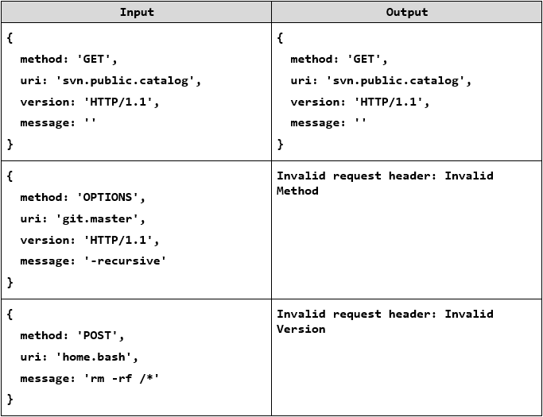

Unit Testing
============

You are required to **submit only the unit tests** for the
**object**/**function** you are testing.

02\. Even or Odd
-----------

You need to write **unit tests** for a function **isOddOrEven()** that checks
whether the **length** of a passed in **string** is **even** or **odd**.

If the passed parameter is **NOT** a string **return undefined**. If the
parameter is a string **return** either **"even"** or **"odd"** based on the
**length** of the string.

### JS Code

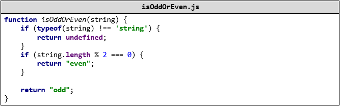

### Hints

We can clearly see there are three outcomes for the function:

-   Returning **undefined**

-   Returning **"even"**

-   Returning **"odd"**

Write one or two tests passing parameters that are **NOT** of **type string** to
the function and **expecting** it to **return undefined**.

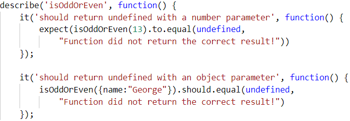

After we have checked the validation it's time to check whether the function
works correctly with valid arguments. Write a test for each of the cases:

One where we pass a string with **even** length:

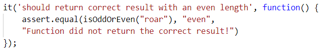

And one where we pass a string with an **odd** length:

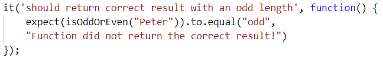

Finally make an extra test passing **multiple different strings** in a row to
ensure the function works correctly:

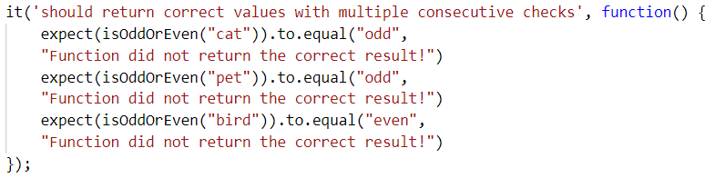

03\. Char Lookup
-----------

Write **unit tests** for a function that **retrieves a character** at a given
**index** from a passed in **string**.

You are given a function named **lookupChar()**, which has the following
functionality:

-   **lookupChar(string, index)** - accepts a **string** and an **integer** (the
    **index** of the char we want to lookup) :

    -   If the **first parameter** is **NOT a string** or the **second
        parameter** is **NOT a number** - **return undefined**.

    -   If **both parameters** are of the **correct type** but the value of the
        **index is incorrect** (bigger than or equal to the string length or a
        negative number) - **return "Incorrect index"**.

    -   If **both parameters** have **correct types** and **values** -
        **return** the **character at the specified index** in the string.

### JS Code

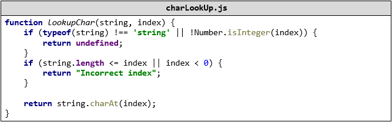

### Hints

А good first step in testing a method is usually to determine all exit
conditions. Reading through the specification or taking a look at the
implementation we can easily determine **3 main exit conditions**:

-   Returning **undefined**

-   Returning an **empty string**

-   Returning the **char at the specified index**

Now that we have our exit conditions we should start checking in what situations
we can reach them. If any of the parameters are of **incorrect type**,
**undefined** should be returned.

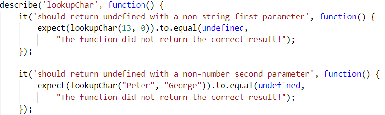

If we take a closer look at the implementation, we see that the check uses
**Number.isInteger()** instead of **typeof(index === number)** to check the
index. While **typeof** would protect us from getting passed an index that is a
non-number, it won’t protect us from being passed a **floating-point number**.
The specification says that **index** needs to be an **integer**, since floating
point numbers won’t work as indexes.

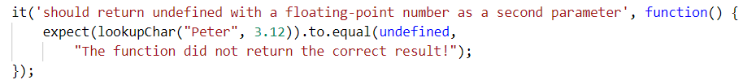

Moving on to the next **exit condition** - returning an **empty string** if we
get passed an index that is a **negative number** or an index which is **outside
of the bounds** of the string.

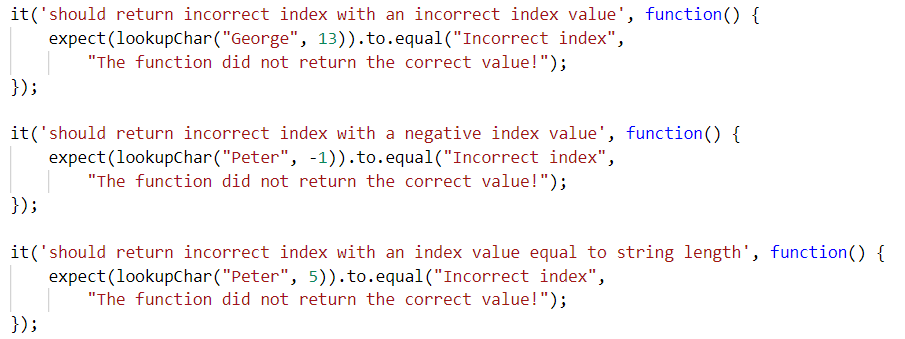

For the last exit condition - **returning a correct result**. A simple check for
the returned value will be enough.

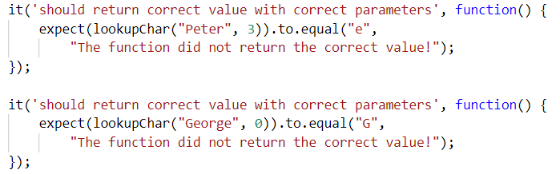

  
With these last two tests we have covered the **lookupChar()** function.

04\. Math Enforcer
-------------

Your task is to test an object named **mathEnforcer**, which should have the
following functionality:

-   **addFive(num)** - A function that accepts a **single** parameter:

    -   If the **parameter** is **NOT a number**, the funtion should return
        **undefined**.

    -   If the **parameter** is a **number**, **add 5** to it, and **return the
        result**.

-   **subtractTen(num)** - A function that accepts a **single** parameter:

    -   If the **parameter** is **NOT a number**, the function should return
        **undefined**.

    -   If the **parameter** is a **number**, **subtract 10** from it, and
        **return the result**.

-   **sum(num1, num2)** - A function that accepts **two** parameters:

    -   If **any** of the 2 parameters is **NOT a number**, the function should
        return **undefined**.

    -   If **both** parameters are **numbers**, the function should **return
        their sum**.

### JS Code

You are provided with an implementation of the **mathEnforcer** object:

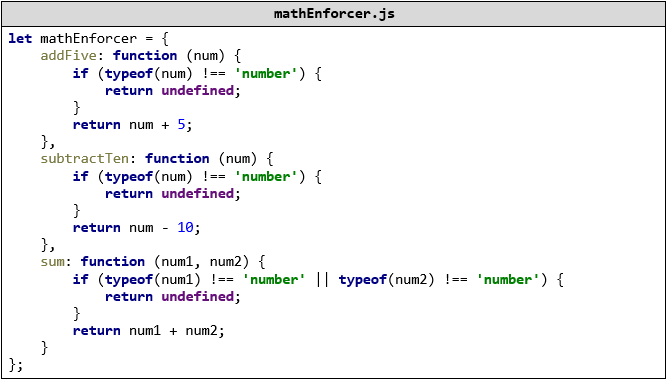

The methods should function correctly for **positive**, **negative** and
**floating-point** numbers. In case of **floating-point** numbers the result
should be considered correct if it is **within 0.01** of the correct value.

### Screenshots

When testing a **more complex** object write a **nested describe** for each
function:

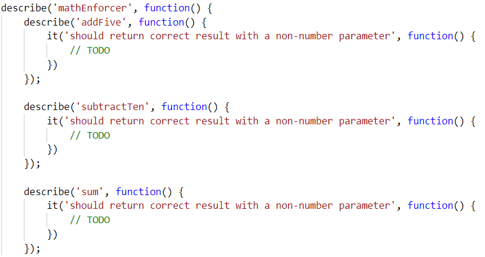

Your tests will be supplied with a variable named **"mathEnforcer"** which
contains the mentioned above logic. All test cases you write should reference
this variable.

### Hints

-   Test how the program behaves when passing in **negative** values.

-   Test the program with floating-point numbers (use Chai’s **closeTo()**
    method to compare floating-point numbers).

Unit testing on Classes
=======================

05\. String Builder
--------------

You are given the following **JavaScript class**:

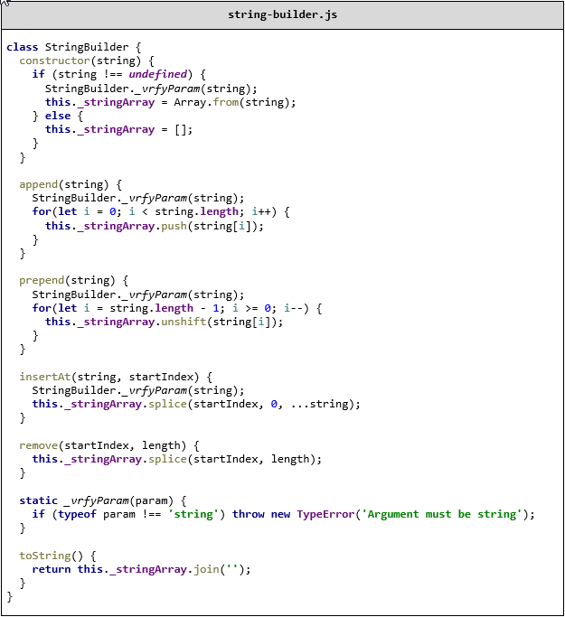

### Functionality

The above code defines a **class** that holds **characters** (strings with
length 1) in an array. An **instance** of the class should support the following
operations:

-   Can be **instantiated** with a passed in **string** argument or **without**
    anything

-   Function **append(string)** - **converts** the passed in **string** argument
    to an **array** and adds it to the **end** of the storage

-   Function **prepend**(**string**) - **converts** the passed in **string**
    argument to an **array** and adds it to the **beginning** of the storage

-   Function **insertAt(string, index)** - **converts** the passed in **string**
    argument to an **array** and adds it at the **given** index (there is **no**
    need to check if the index is in range)

-   Function **remove(startIndex, length)** - **removes** elements from the
    storage, starting at the given index (**inclusive**), **length** number of
    characters (there is **no** need to check if the index is in range)

-   Function **toString()** - **returns** a string with **all** elements joined
    by an **empty** string

-   All passed in **arguments** should be **strings.** If any of them are
    **not**, **throws** a type **error** with the following message: "**Argument
    must be a string**"

### Example

This is an example how this code is **intended to be used**:

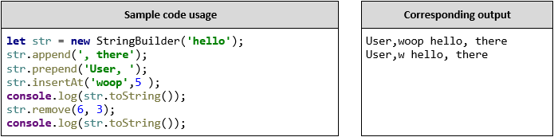

### Your Task

Using **Mocha** and **Chai** write **JS unit tests** to test the entire
functionality of the **StringBuilder** class. Make sure it is **correctly
defined as a class** and instances of it have all the required functionality.

06\. Payment Package
---------------

You are given the following **JavaScript class**:

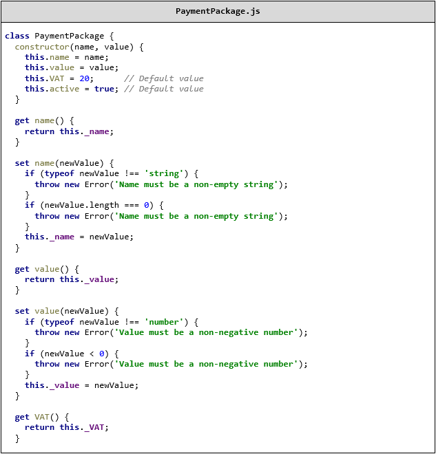
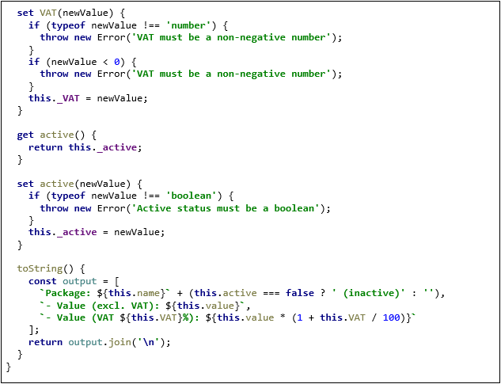

### Functionality

The above code defines a **class** that contains information about a **payment
package**. An **instance** of the class should support the following operations:

-   Can be **instantiated** with two parameters - a string name and number value

-   Accessor **name** - used to get and set the value of name

-   Accessor **value** - used to get and set the value of value

-   Accessor **VAT** - used to get and set the value of VAT

-   Accessor **active** - used to get and set the value of active

-   Function **toString()** - return a string, containing an overview of the
    instance; if the package is **not active**, append the label
    "**(inactive)**" to the printed **name**

When creating an instance, or changing any of the property values, the
parameters are validated. They must follow these rules:

-   **name** - non-empty string

-   **value** - non-negative number

-   **VAT** - non-negative number

-   **active** - Boolean

If any of the requirements aren’t met, the operation must throw an error.

*Scroll down for examples and details about submitting to Judge.*

### Example

This is an example how this code is **intended to be used**:

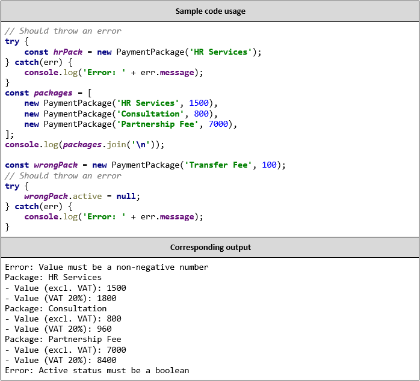

### Your Task

Using **Mocha** and **Chai** write **unit tests** to test the entire
functionality of the **PaymentPackage** class. Make sure instances of it have
all the required functionality and validation.

JS Advanced - Retake Exam: 18.11.2018
=====================================

07\. \*\*Warehouse - Unit Testing
------------------------------

You are given the following JavaScript class:

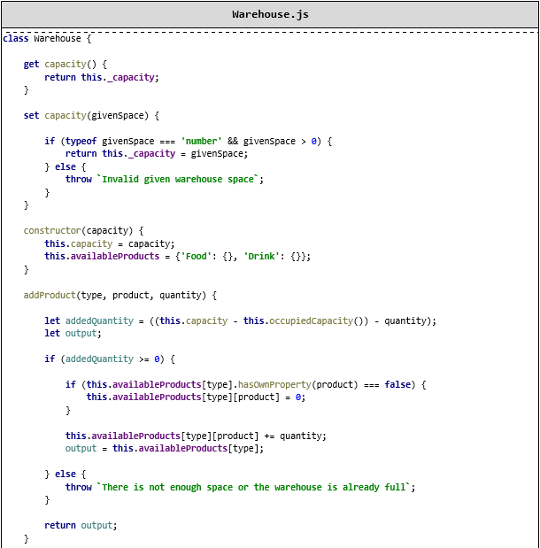
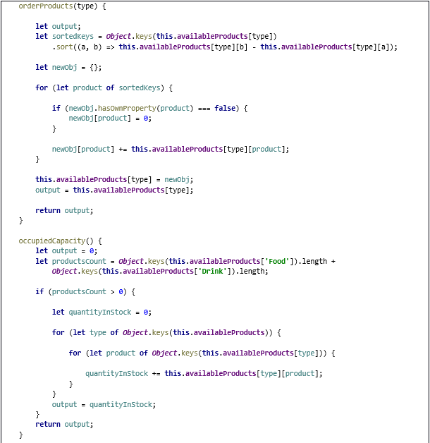
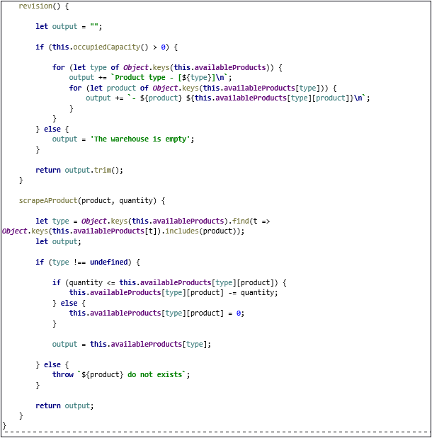

### Functionality

An **instance** of the **Vacation** class should support the following operations:

-   If the **constructor** gets a **negative number** or **0 should throw a string:**  
**"Invalid given warehouse space"**

#### addProduct(type, product, quantity) 

-   **Adds** the given product if there is space in the warehouse and **return the object with the given type with already added products.** In these cases when the product is added more than 1 time, the quantity should be **sum**. When there is **no place** for the current product, you should **throw** a string that says:

-   **"There is not enough space or the warehouse is already full"**

#### orderProducts(type) 

-   **Sorts all products** of a given **type in descending order** by the **quantity.**

#### occupiedCapacity() 

-   **Returns** a number, which represents the **already occupied** place in the warehouse.

#### revision()

-   **Returns** a string in which we print **all products** of **each type**, into the following **format**:

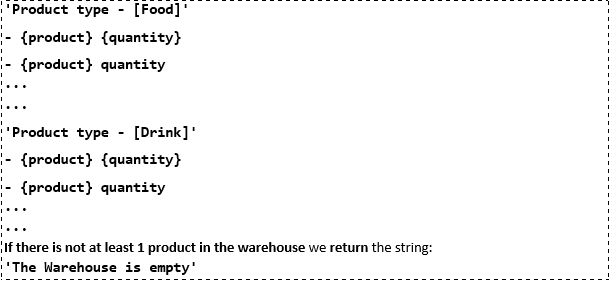

#### scrapeAProduct(product, quantity)

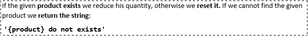

**'{product} do not exists'**

### TODO

Using **Mocha** and **Chai** write **JS unit tests** to test the entire functionality of the **Vacation** class.