Lab: Strings and Regular Expressions
====================================

Problems for in-class lab for the ["JavaScript Advanced" course \@
SoftUni](https://softuni.bg/courses/js-advanced). Submit your solutions in the
SoftUni judge system at
<https://judge.softuni.bg/Contests/1803/Lab-String-and-RegExp>.

01\. Pascal or Camel Case
--------------------

Write a function that takes **two string parameters** as an input.

-   **The first parameter** will be the text that you need to modify depending
    on the second parameter. The words in it will **always** be **separated by
    space**.

-   **The second parameter** will be either "**Camel Case**" or "**Pascal
    Case**". In case of a different input, you should print **"Error!"**

Convert the first string to either of the cases. The **output** should consist
of only **one word** - the string you have modified. For more information, see
the examples below:

### Example

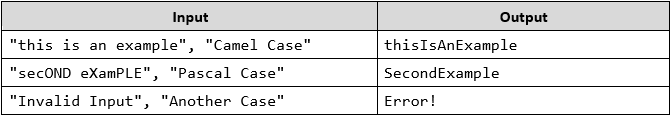

### Hints

First, take the two values from the input fields:

Then, write a function that generates the result:

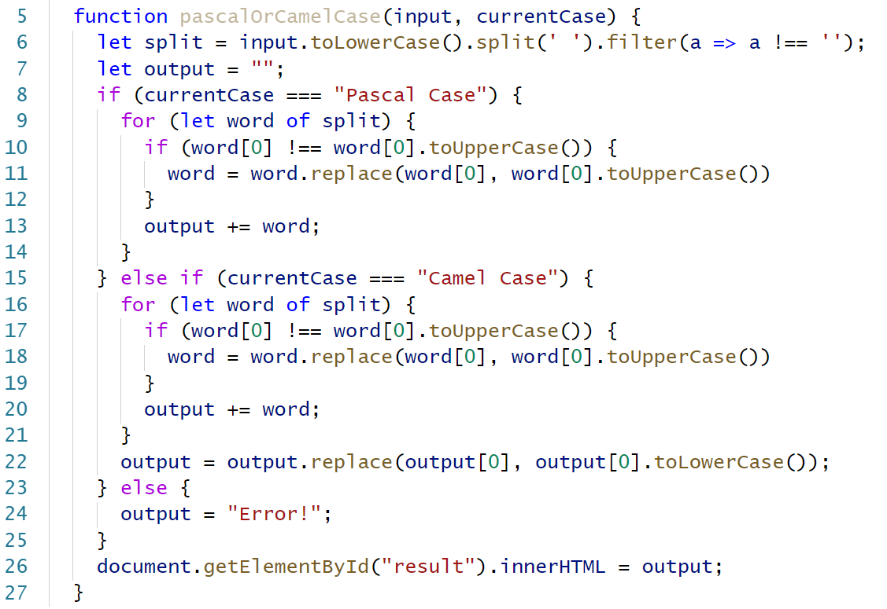

-   First, convert all the **letters to lower-case**

-   Depending on the command, make the input either **Pascal Case** or **Camel
    Case**

-   If another command is received, print **"Error!"**

    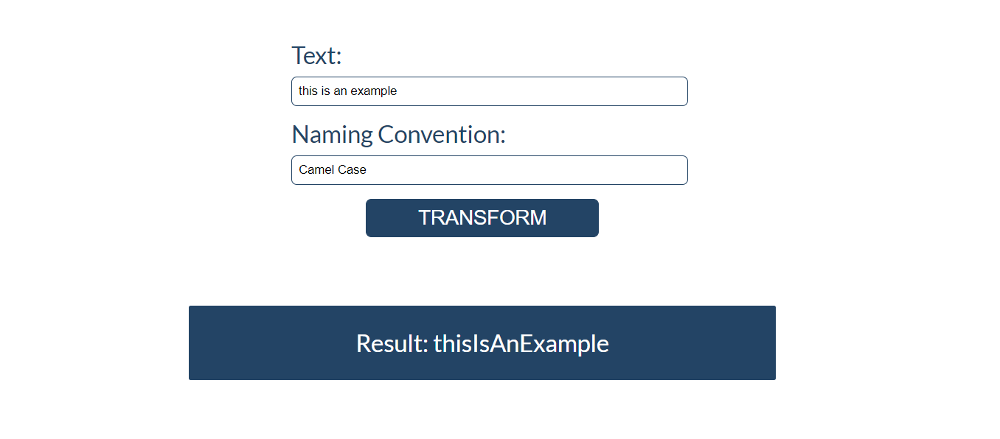

02\. Find ASCII Equivalent
---------------------

Write a function which receives **one string parameter** as an input. It will
contain different words and numbers which will **always** be **separated by
space**. Your job is to find **all the numbers** and convert them to their
**ASCII char** equivalent and find **all the words** and convert **each letter**
to its **ASCII number**. If there are **other symbols** such as "%", "\@", "!"
etc., **convert** them to their ASCII number **as well**.

The **output** should consist of each number that corresponds to each letter
from the ASCII table for each word, on **separate lines**, **separated by
space**. The final word to print is received by **appending all the chars**,
converted from the input numbers.

For more information, see the example below:

### Example

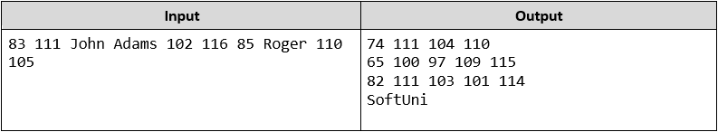

### Hints

First, get the input and the result:

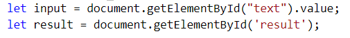

Then, create a function that generates the result:

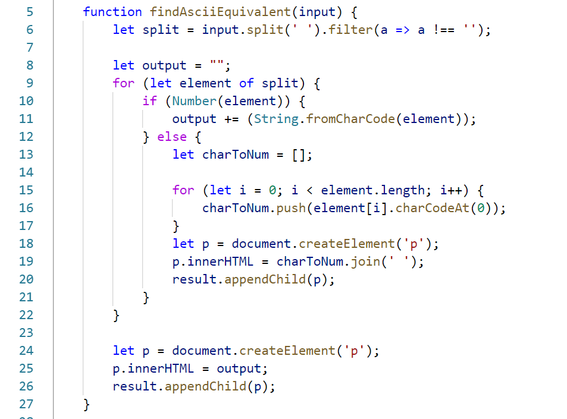

-   If the current **element is a number**, convert it to **character**

-   Otherwise, loop through each **character** and **convert it into number**

-   Finally, append the result

    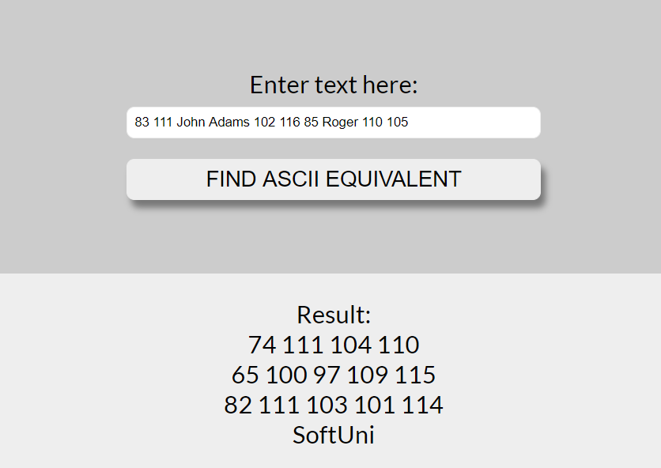

03\. Split String Equally
--------------------

Write a function that takes **two parameters** as an input.

-   The **first parameter** will be of type **string**

-   The **second parameter** will always be **a positive integer**, **bigger
    than 0**

Your task is to **split the string equally by the number** you have received,
**separated by space**. However, if the string **cannot** be split into equal
parts, fill the last sequence until its **length** is **equal** to the **second
parameter**, starting from the **beginning** of the string.

For more information, see the examples below:

### Example

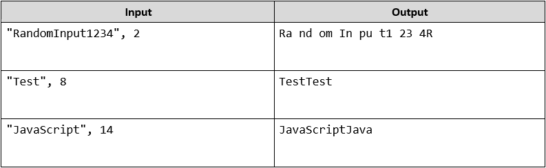

### Hints

First, get the two input fields:

Then, create the function that splits the resulting string:

-   Split the string into separate parts

-   Add them to an array

-   Set the result to equal that array joined by a space

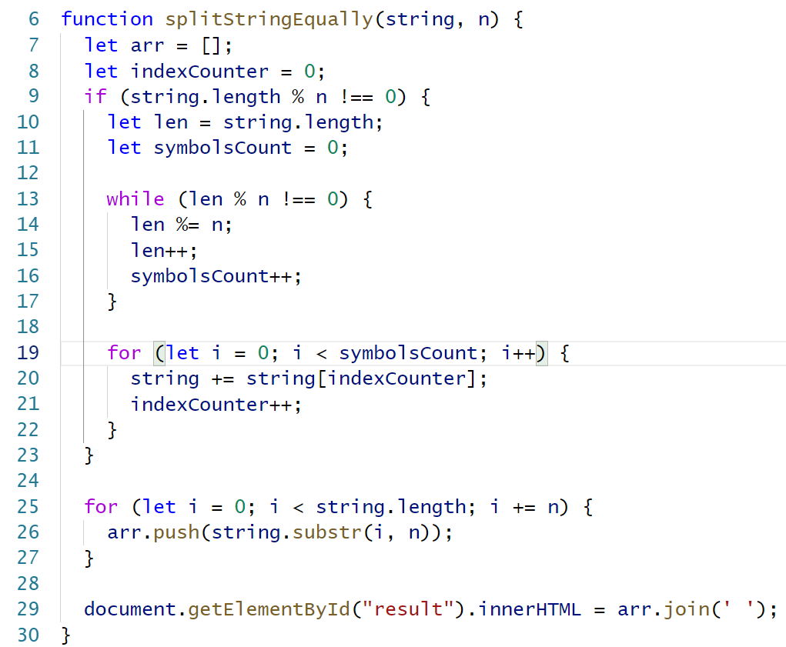

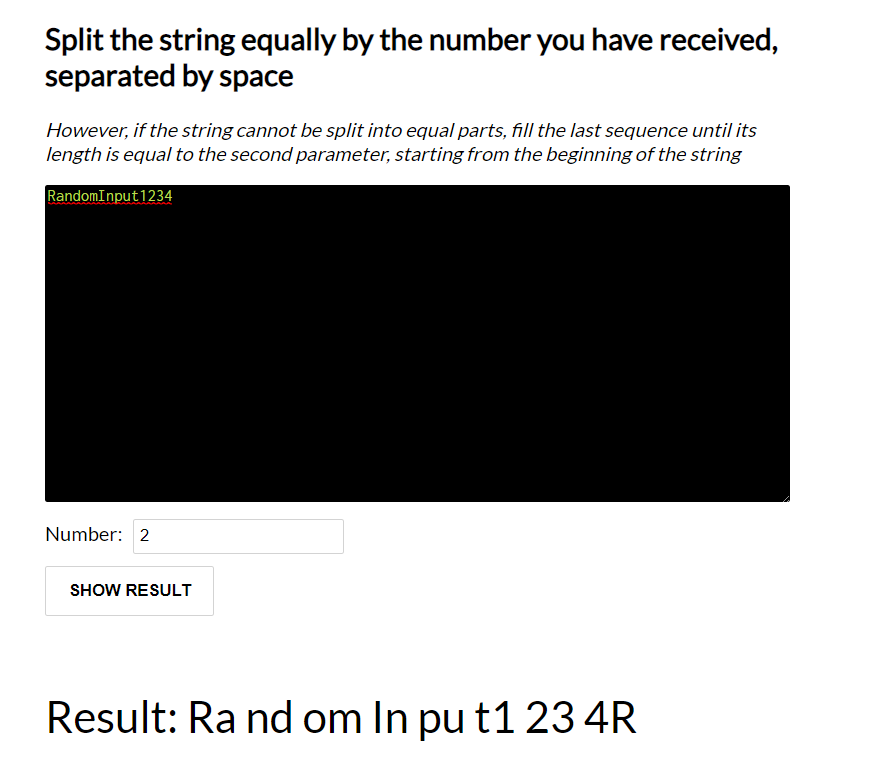

04\. Replace a Certain Word
----------------------

Write a function that receives **two parameters** as an input.

-   The **first parameter** will be **a string** - the **word** that will be
    **used for replacing**.

-   The **second parameter** will be **an array of strings**.

The word that needs to be **replaced** in each of the strings will **always** be
found in the **first string** of the array **at the second index**. Your task is
to **replace every word with the given** one from the input. Have in mind that
the cases are **case-insensitive**.

Print **each** of the strings from the array on a **new \<p\> element**.

For more information, see the examples below:

### Example

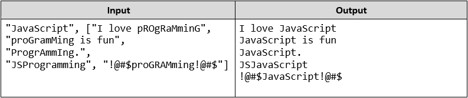

### Hints

-   Get the input fields

-   Create a separate function that replaces each element of the array with the
    given string (use **RegEx**)

-   Add paragraphs to the **\<span\>** containing the new strings

    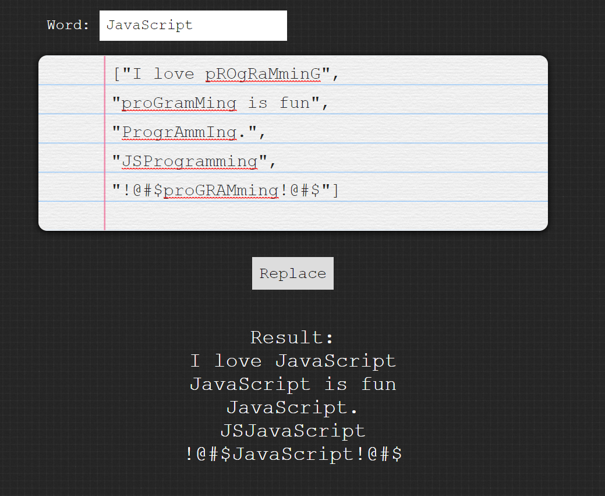

05\. Extract User Data
-----------------

Write a function that receives **an array of strings** as an input.

Your task is to **extract** all **valid user data** from each of the strings.
**Valid data** consists of:

-   It will always start with a **name**. A valid name will always consist of
    **first name** and **surname separated by space**. Note that the first name
    will **always start with an uppercase letter** and can be followed by
    lowercase ones (**but not necessarily**). The surname will always start with
    a **capital letter**, followed by **one or more** lowercase ones.

-   The name will be followed by **a phone number**. A valid phone number will
    be in the following format: *+359 2 569 789*, *+359 3 759 846*,
    *+359-5-789-359*. Note that it will **always start with +359** and the
    digits can be separated by **either spaces** or **dashes** but **NOT** both.

-   The phone number will be followed by **an email**. A valid email can consist
    of only **lowercase Latin letters** or **digits**, followed by **\@** and
    **one or more lowercase Latin letters**. There will always be **a dot before
    the domain**, which can consist of **at least** two lowercase Latin letters **BUT** no more than three.

Note that the data will be **always separated by a single space**.

In case part of the above described data is **missing** or is **invalid**, print "**Invalid data**" on the console. Otherwise, print each of the extracted information **on a new line** in the following format:

- **Name: {extractеdName}**

- **Phone Number: {extractedPhoneNumber}**

- **Email: {extractedEmail}**

- **- - -**

For more information, see the examples below:

### Example

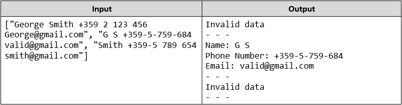

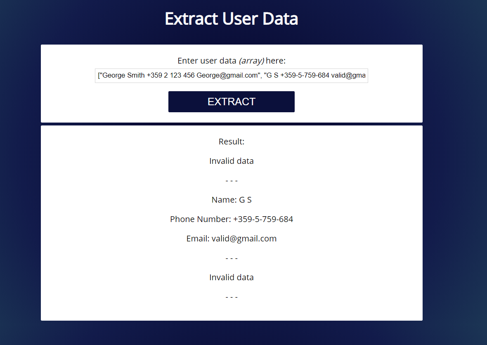
