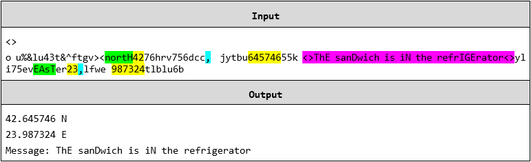

Exercise: Strings and Regular Expressions
=========================================

Problems for in-class lab for the ["JavaScript Advanced" course \@
SoftUni](https://softuni.bg/courses/js-advanced). Submit your solutions in the
SoftUni judge system at
<https://judge.softuni.bg/Contests/1804/Exercise-String-and-RegExp>.

01\. Binary Decoding
---------------

You will receive a **string** from **zeros** and **ones**. Write a function that converts it into text.

To do that, you need to:

-   **Calculate the weight** of the string (**sum of all the ones**).

     -   The result of that sum should be **a single digit** (e.g '**10011101111100111111001101111**' here the sum is 21, but since we need only one digit, we sum 2 and 1 and get 3).

-   **Remove** from the **start** and the **end** the **calculated sum** and
    **split** the remaining string into groups of 8 characters.

-   Convert each segment of binary code into **decimals** to get the **ASCII
    code** of each element.

-   Print the result in the "**result**" span (only the letters and spaces).

-   *Be careful about unwanted characters!*

-   The input should consist only **alphabetical symbols**.

### Example

02\. Expedition Problems
---------------

*The expedition is over, and everyone has returned successfully to the rest house. However, it turns out that one person from the group has fallen behind. He sent a message to the leader, but his device was broken, and the message contains unwanted symbols, which prevent it from being read. Since the leader has no knowledge of programming, he has assigned the task of decrypting to you.*

You will receive a text (**string**), which can contain **all the ASCII symbols**, **including new lines** and **tabs**. The **location** of the lost person and his **message** must be retrieved from this string. The text contains a **keyword** that indicates the **beginning** and the **end** of the **message**. The **geographical coordinates** come as **a pair** of longitude ("**east**") and latitude ("**north**") and each coordinate should meet the following conditions:

1. It should start with "**north**"/"**east**", **case-insensitive**;

2. The next symbols should be **2 digits**, which form the **whole part of the
degrees**;

3. The whole part of the degrees is separated from the decimal part by "**,**" and
there may be any characters between them, **except** "**,**"

4. The **decimal part** consists of **6 digits**

In case there is **more than one** longitude or latitude in the text, take **the
latter**. The message is surrounded by the **keyword**, which will be the
**first argument** from the input. The second argument from the input will be
the **text**, containing **both the location** and **the message** of the lost
person. See the examples below to understand how it works.

### Input

The first argument contains the keyword and the second argument contains the text. There will always be **at least one pair of coordinates**.

### Output

Print the latitude in a **paragraph** in the span with id **"result"** in the following format:

**\<degrees\>.\<decimal part\> N**

Print the second in a **paragraph** in the span with id **"result"** in the following format:

**\<degrees\>.\<decimal part\> E**

On the last line, print the message in the following format:

**Message: \<message\>**

### Example

### Hints

03\. James Bond
----------

You are the spy master of a guild of spies. Since you are constantly being
stalked, your spies communicate with you by sending **encoded messages**.

You will receive a **special key** and some **lines of text** which you must
combine in order to **encode the messages**.

The special key:

-   Will only consist of **one or more English letters**

-   Must be preceded by either a **space** or the **start of the string**

-   May appear in **any casing** (both lower and uppercase letters)

Valid encoded messages should:

-   Immediately follow the **special key** and should be separated from it only by
**one or more spaces**

-   Be **at least 8 symbols long** and can only consist of the following symbols:  
**!**, **%**, **\$**, **\#** or **Capital English letters**

-   Be followed by a **space**, a **dot (.)**, a **comma (,)** or the **end of the string**.

After finding the correct **encoded messages**, you must **decode** and **replace them in the original text**. The **decoding** should meet the following requirements:

-   The symbol **!** is converted to **1**

-   The symbol **%** is converted to **2**

-   The symbol **\#** is converted to **3**

-   The symbol **\$** is converted to **4**

-   **Capital English letters** are converted to **lower case**

### Constraints

-   A pair of a **special key** and **encoded message** will never be split between
multiple lines

-   The preceding space before a **special key** will never overlap with a trailing
space after an **encoded message**

-   There will never be an **encoded message** equal to the **special key**

### Input

The **input** comes as an array of strings - the first element is the **special
key**, each element after it is a **line of text**

### Output

The **output** should be displayed in the DOM - consisting of the entire text
with the **correct encoded messages,** replaced with their **decoded** versions.
Each **line of text** should be in a new paragraph in the "**result**" span.

### Examples

### Hints

04\. Airport Check
-------------

*Your next task is to extract information about a flight.*

You will be given a single string, separated by a comma. The **first** part of
the string will be the text you need to extract information from. The **second**
part will be the **information you need to print**.

The information to extract is as follows:

**Passenger name**:

-   Starts with a **space** (' ')

-   Consists of either **2 or 3 names** (**upper and lower-case letters**)

-   The names should be **separated by a single dash ('-')**

    -   Each name should **start with an upper-case letter**

    -   If there are **3 names**, **the second one should end with a dot ('.')**

    -   If there are **2 names**, **the second one should NOT contain any dots**

-   Ends with a **space (' ')**

    **Valid** examples with **2 names**: **' George-Adams ', ' G-A '**

    **Valid** examples with **3 names**: **' G-A.-Adams ', ' Valid-V.-Name '**

**Airport:**

-   Starts with a **space (' ')**

-   Should consist of **3 upper-case letters**, the symbol '**/**' and **3 more
    upper-case letters**

-   Ends with a **space (' ')**

    **Valid** examples of airports are: **' SOF/VAR ', ' VIE/AIR '**

**Flight number**:

-   Starts with a **space (' ')**

-   Followed by **1 to 3 upper-case letters**

-   Followed by **1 to 5 digits**

-   Ends with a **space (' ')**

    **Valid** examples of flight numbers are: **' DWF24 ', ' S43159 ', ' OE314'**

**Company**:

-   Starts with dash and space **'- '**

-   Followed by **one or more letters** (**starting with an upper-case letter**)

-   Followed by **'\*'**

-   Followed by **one or more letters** again (**starting with an upper-case
    letter**)

-   Ends with a space **(' ')**

    **Valid** examples of companies are: **'- Wizz\*Air ', '- X\*Y '**

### Input

A single string, separated by a comma

### Output

**There are four different types of output,** depending on the **second**
parameter:

**'name'** - print **'Mr/Ms, {name}, have a nice flight!'**

'**flight'** - print **'Your flight number {flightNumber} is from {fromAirport}
to {toAirport}.'**

**'company'** - print **'Have a nice flight with {companyName}.'**

**'all'** - print **'Mr/Ms, {name}, your flight number {flightNumber} is from
{fromAirport} to {toAirport}. Have a nice flight with {company}.'**

The name should be printed **without the '-'** (if any) and **with spaces
instead**:  
**' STEF-T.-Stefanov ' -\> 'STEF T. Stefanov'**.

The **company** should be printed **without the '- '** and the **'\*'**:

**' - Wizz\*Air ' -\> 'Wizz Air'.**

The **flight number** should be printed **without the spaces in the front and
back**:

**' OS806 ' -\> 'OS806'**

Display the output in the "**result**" span

### Examples

