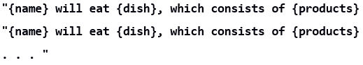

JS Advanced Exam - 10\.12\.2019
===================

Exam problems for the ["JavaScript Advanced" course \@
SoftUni](https://softuni.bg/courses/js-advanced). Submit your solutions in the
SoftUni Judge system at <https://judge.softuni.bg/Contests/Compete/Index/1850#0>
.

01\. Christmas Gifts Delivery (DOM Manipulation)
---------------------

**Use the given skeleton to solve this problem.**

**Note: You have NO permission to change directly the given HTML (index.html file).**

### Your Task

Write the missing JavaScript code to make the Christmas Gifs Delivery
application work as expected.

You should be able to **add** new gifts to the list of gifts.

Each product has **name**. When you click the **[Add gift]** button, a new
**list item** should be added to the **List of gifts**. To each list item you
should put a **class “gift”**. Upon clicking the **[Add gift]** button you
should **sort** the gifts **in alphabetical order** and you should **clear the
input field.**

The new item should have the **following structure**:

Append two buttons to each list item

Add class **“gift”** to each list item

**[Send]** button with id **“sendButton”**

**[Discard]** button with id **“discardButton”**

When you click the **[Send]** button you should move the list item to the **Sent
gifts** section. **Important!** Do not move the entire list item, but only the
name of the gift. You should leave the buttons behind.

When you click the **[Discard]** button you should move the list item to the
**Discarded** gifts section.

**Important!** Do not move the entire list item, but only the name of the gift.
You should leave the buttons behind.

02\. Christmas movies
--------------------

Use the provided **ChristmasMovies class** to solve this problem.

### Your Task

Using **Mocha** and **Chai** write **JS Unit Tests** to test the entire
functionality of the **ChristmasMovies class**. Make sure instances of it have
all the required functionality and validation. You may use the following code as
a template:

### Functionality

**movies.js** defines a **class** that contains information about some
**Christmas movies**. An **instance** of the class should support the following
operations:

-   **Instantiation** with **no parameters,** and **properties** called
    "**movieCollection**"(**empty array**), "**watched**" (**empty object)** and
    **“actors” (empty array)**.

-   Method **buyMovie()** - receives **two** parameters: a **string**
    (**movieName**) and an **array (actors)**. If you don’t have the movie in
    your collection, you should add it in in format **{name: movieName, actors:
    [actors]}**, where there are only **unique actors** and return a proper
    message. Otherwise an error should be **thrown**.

-   Method **discardMovie() one** parameter: a **string** (**movieName**)**.**
    If you have the movie in your collection you should delete it and if the
    movie is watched, you should also remove it from the watched list and return
    a proper message. If you don’t have the movie in the collection, an error is
    thrown.

-   Method **watchMovie() - receives one parameter:** a **string**
    (**movieName**). If you have the movie in your collection and is still not
    in the watched list, you should put it there as a key and value pair where
    the movie name is the key and the value is set to 1. However, if it already
    is watched you should just increase the counter. Otherwise, a new error is
    thrown.

-   Method **favouriteMovie()** - receives **no** parameters. If there are no
    movies in your watched list a new error is thrown. Otherwise, a message is
    returned in a proper format.

-   Method **mostStarredActors()** - receives **no** parameters. If there are no
    movies in your collection a new error is thrown. Otherwise, a message is
    returned in a proper format.

### Examples

### Submission

Submit your tests inside a **describe()** statement, as shown above.

03\. Christmas Dinner
-------------------

### Your Task

Write a ChristmasDinner class, which supports the described functionality below.

### Functionality

#### constructor()

Should have these **4** properties:

-   **budget** - number - comes from the constructor

-   **dishes -** empty array

-   **products -** empty array

-   **guests -** empty object

**Important!** Use accessors to validate that the budget (the budget cannot be
negative number). If the class is initialized with negative budget throw an
error with the following message:

"**The budget cannot be a negative number**"

#### shopping([product])

In this method you should go shopping for the needed products to prepare for the
dinner. The **product** will come as an array that has the type of the product and the price for it

-   If you don’t have enough money to buy the product, you should throw an error

"**Not enough money to buy this product"**

-   Otherwise you should push the type of the product in the products array,
    decrease the budget with the price of the product and return a message:

    "**You have successfully bought {type}!"**

#### recipes({recipe})

In this method you will receive a recipe in the following format: **{
recipeName: string, productsList: array of strings }.**

-   The products require to prepare the meal are in contained the
    **productList**. If all the products from the **productList** are present in
    the products array you should push an object in the following format: **{
    recipeName, productList }** to the dishes array and return a message:

    "**{recipeName} has been successfully cooked!**"

-   If one or more products needed to make the meal are absent from the products, throw an error:
   **"We do not have this product"**

#### inviteGuests(name, dish)

In this **method** you would invite guests to the dinner. The **name** is string and so is the **dish**

-   If the dish is not present in the dishes array, throw a new error:
   **"We do not have this dish"**

-   And if the guest is already present in the guest object, throw a new error:
   **"This guest has already been invited"**

-   Otherwise create a **new key and value pair** to the guest object with key
    the **name** of the guest and **value - the dish** in the format: **{
    {guestName}: {dish} }** and return a message:
   **"You have successfully invited {name}!"**

#### showAttendance()

This function should return a sting with all the guest, the dish they are having
and the products the dish is made of, separated by a comma and space (product, product) in the following format:

### Submission

Submit only your **ChristmasDinner class.**

### Examples

This is an example how the code is **intended to be used**:

