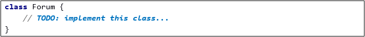

JS Advanced Exam - 26\.10\.2019
====================================

Exam problems for the ["JavaScript Advanced" course \@
SoftUni](https://softuni.bg/courses/js-advanced). Submit your solutions in the
SoftUni Judge system at <https://judge.softuni.bg/Contests/Compete/Index/1850#0>
.

01\. Ski Inventory (DOM Manipulation)
-----------------

**Use the given skeleton to solve this problem.**

**Note: You have NO permission to change directly the given HTML (index.html file).**

### Your Task

Write the missing JavaScript code to make the Ski Inventory application work as
expected.

You should be able to **add** new products to the inventory.

Each product have **name**, **quantity** and **price**. When you click the
**[Add]** button, a new **list item** should be added to the **Available
Products**.

The new item should have the **following structure**:

Your App should have a **filter** functionality. This means that every time you
press **the filter button** you should filter the items (**case insensitive**).
Show those items that contain the string from the **filter input field** and
hide all that do not match.

When you click the **[Add to Client's List]** button you should **add** that
item to My Products section **ul** in the following format:

Every time you add new item to My Products you should **increase** the **Total
Price** with the price of the item and **decrease available** products with
**1**. If there are **no more** available products, you should **remove** this
item from the **Available Products ul**.

And last when you click the **[Buy]** button, you should **empty the ul** in My
Products section and set the **Total Price to 0.00**.

02\. Ski Resort
--------------

Use the provided **SkiResort class** to solve this problem.

### Your Task

Using **Mocha** and **Chai** write **JS Unit Tests** to test the entire
functionality of the **Ski Resort class**. Make sure instances of it have all
the required functionality and validation. You may use the following code as a
template:

### Functionality

**solution.js** defines a **class** that contains information about a **ski
resort**. An **instance** of the class should support the following operations:

-   **Instantiation** with **one parameter** - a **string** representing the
    **ski resort name,** and an **additional properties** called
    "**voters**"(**number** with **value 0 by default**) and "**hotels**" (
    **empty array by default)**.

-   Getter **bestHotel** - **Returns** the best hotel in a given format or if
    there is **no votes** yet **return** a proper **message**

-   Function **build()** - receives **two** parameters: a **string**
    (**hotelName**) and a **number** (**beds**). If the **name** is **empty
    string** or the **beds** are **less than 1** an **error** should be
    **thrown** . Otherwise the function should add the hotel to the hotels array
    and **return the proper message**.

-   Function **book()** receives **two** parameters: a **string**
    (**hotelName**) and a **number** (**beds**)**.** If the name is valid and
    there are free beds in that hotel you should decrease the number beds of the
    hotel with the given beds you want to book. If booking is **successful** you
    should **return** the **proper message**, otherwise an **error** should be
    thrown.

-   Function **leave()** - receives three parameters: a **string**
    (**hotelName**) and **two** numbers - **beds** and **points**. If the
    parameters are valid and there is a hotel with that name the proper
    **message** should be **returned**. Otherwise **throw** an **error**.

-   Function **averageGrade()** - receives **no** parameters - if there **aren’t
    any votes** the proper **message** should be **returned**. Otherwise,
    **return** the average grade of all the hotels in the **proper format**.

### Examples

### Submission

Submit your tests inside a **describe()** statement, as shown above.

03\. Ski Forum
-------------

### Your Task

Write a Forum class, which supports the described functionality below.

### Functionality

#### constructor()

Should have these **3 private** properties:

-   **users** - empty array

-   **questions - empty array**

-   **id** - **number with initial value 1**

#### register({username}, {password}, {repeatPassword}, {email})

This function should register new user and add it to the users array.

-   If one of the passed parameters is empty string (""), this function should
    throw an error with the following message:

     **"Input can not be empty"**

-   If password is different from the repeat password, an error with the
    following message should be thrown:

      **"Passwords do not match"**

-   If an user with such username or email is already registered, an error with
    the following message should be thrown:

     **"This user already exists!"**

-   If registration is successful the function should return the following
    message:

    **"{username} with {email} was registered successfully!"**

#### login({username}, {password})

This **function** should log in an existing user.

-   If there is no registered user with that username, an error with the
    following message should be thrown:

    **"There is no such user"**

-   If the username and the password match with those of a registered user, this
    function should return the following message:

    **"Hello! You have logged in successfully"**

#### logout({username}, {password})

This **function** should log out a logged user.

-   If there is no registered user with that username, an error with the
    following message should be thrown:

    **"There is no such user"**

-   If the username and the password match with those of a registered user, this
    function should return the following message:

    **"You have logged out successfully"**

#### postQuestion({username}, {question})

This function should post a new question with id, equal to the private field's
id value .Every time a new question is added the id is incremented.

-   If there is no user with that username, or he isn't logged in, an error with
    the following message should be thrown:

#### "You should be logged in to post questions"

-   If the question is equal to empty string (""), an error with the following
    message should be thrown:

#### "Invalid question"

-   If a question can be posted, you should add it to the questions array and
    return the following message:

    **"Your question has been posted successfully"**

#### postAnswer({username}, {questionId}, {answer})

This function should post an answer to the question with the given id.

-   If there is no user with that username, or he isn't logged in, an error with
    the following message should be thrown:

    **"You should be logged in to post answers"**

-   If the answer is equal to empty string (""), an error with the following
    message should be thrown:

    **"Invalid answer"**

-   If there is no question with the given id, an error with the following
    message should be thrown:

    **"There is no such question"**

The function should return the following message:
**"Your answer has been posted successfully"**

#### showQuestions()

This function should return a sting with all the questions and their answers in the following format:

### Submission

Submit only your **Forum class.**

### Examples

This is an example how the code is **intended to be used**:

