JS Advanced Exam - 08\.08\.2019
============================

Exam problems for the [JavaScript Essentials” course \@
SoftUni](https://softuni.bg/courses/js-essentials). Submit your solutions in the
SoftUni Judge system at
<https://judge.softuni.bg/Contests/Practice/Index/1772#0>.

01\. BookUni
---------------

**Use the provided skeleton to solve this problem.**

**You can't, and you have no permission to change directly the given html code (index.html file).**

### Your Task

**Write the missing JavaScript code** to make the **Book Store (BookUni)** work
as expected:

-   When **all fields (title, year and price)** are **filled with correct
    input**

    -   **Title** is **non**-**empty strings**

    -   **Year** and **Price** need to be **positive numbers**

-   Upon pressing the **[Add new book] button**, a new book should appear in the
    bookshelf section. Create new **div element** with **class book** (for every
    created book) which hold:

    -   **paragraph** with text content of the given book title and the given
        book year in format: **"{bookTitle} [{bookYear}]"**

    -   **button** with text content "**Buy it only for {bookPrice} BGN**" and
        **functionality** when is being clicked the **current book should be
        removed** from the current section and the **total store profit** is
        **increased** with the given **book price**.

    -   (**only applies to new books**) **button** with text content "**Move to
        old section**" which have the **functionality** when is being clicked
        the current book should be **moved** from the new books section to the
        **old books section**.

### Constraints

Every price should be **rounded** to the **second decimal part (**a.k.a
**toFixed(2)**)

Every **old book price** has **15% discount** from the **initial value** (When
being **created** into the **old books sections** or being **moved** from the
new books section to **the old books section**)

Each **book's year equal** or **higher** than **2000** is consider for a **new
book.**

### Submission

Submit only yours **solve()** function.

### Examples

#### Create a new book

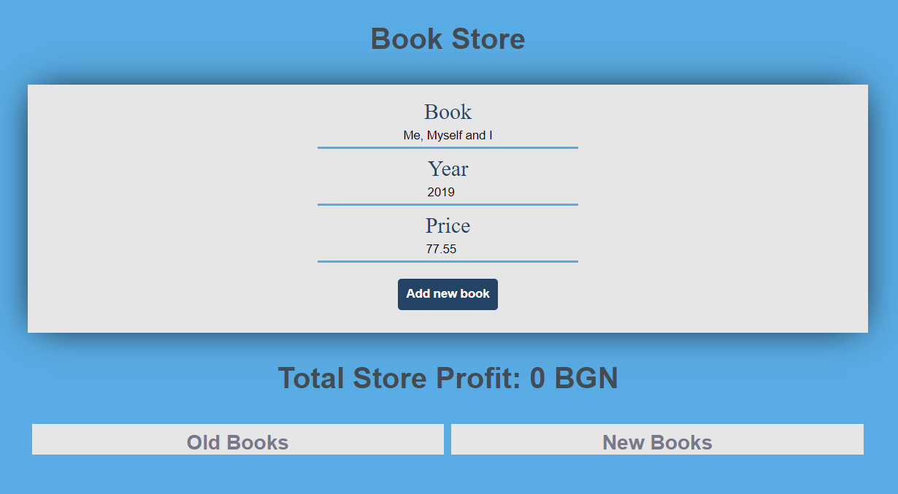

**After** we hit the **[Add] button**

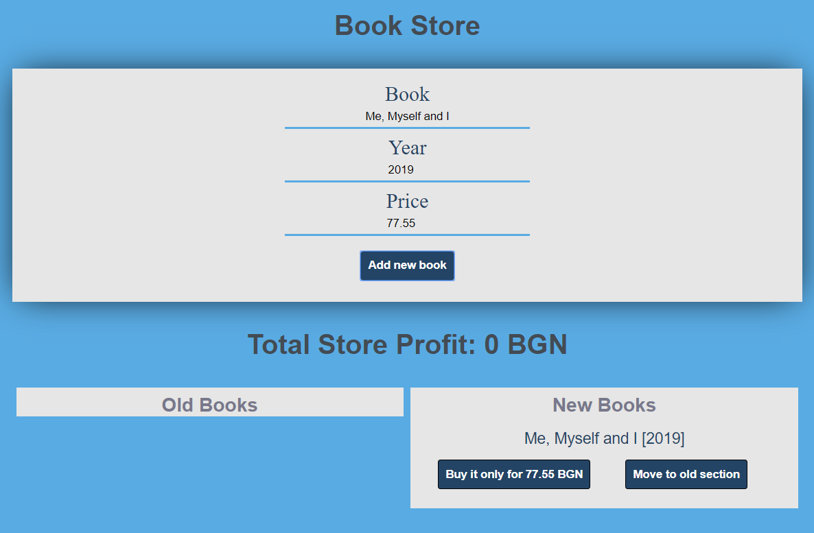

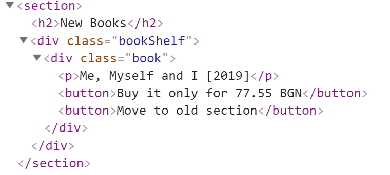

#### Create an old book

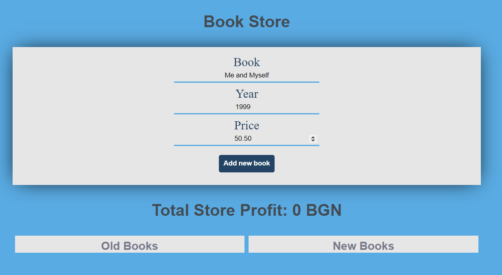

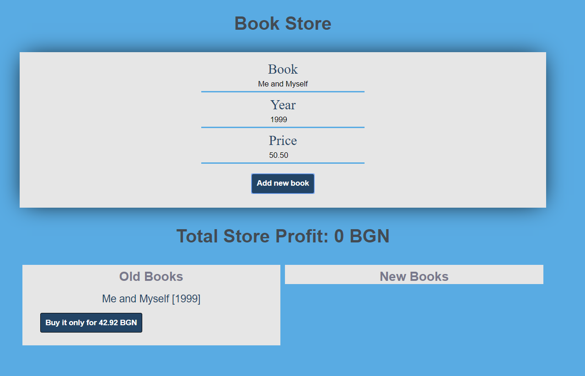

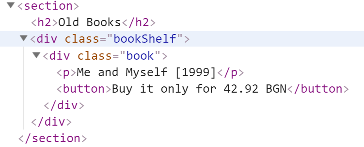

#### Buy a book

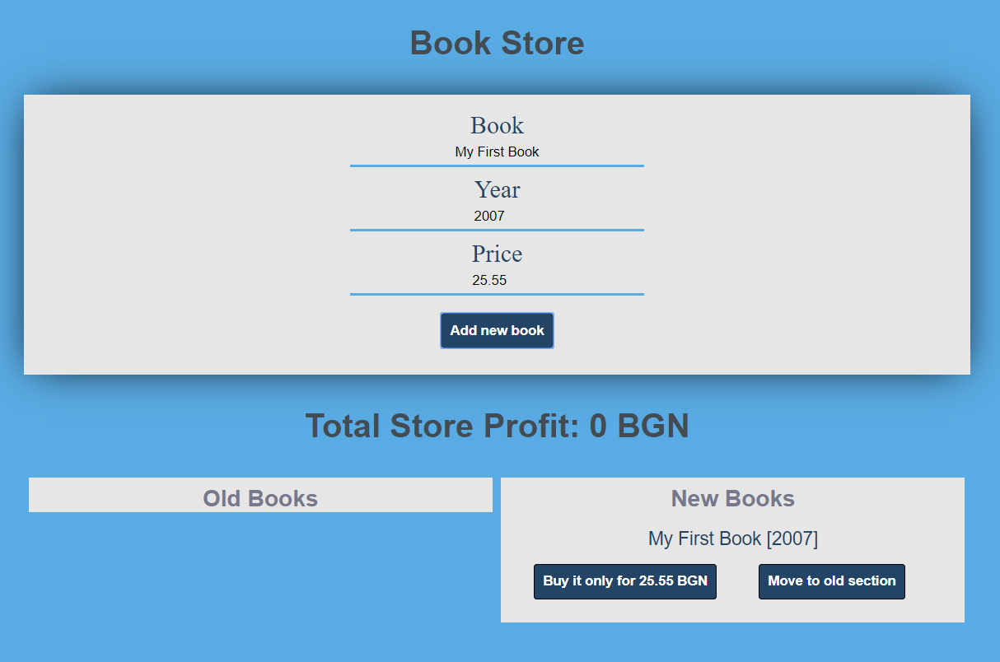

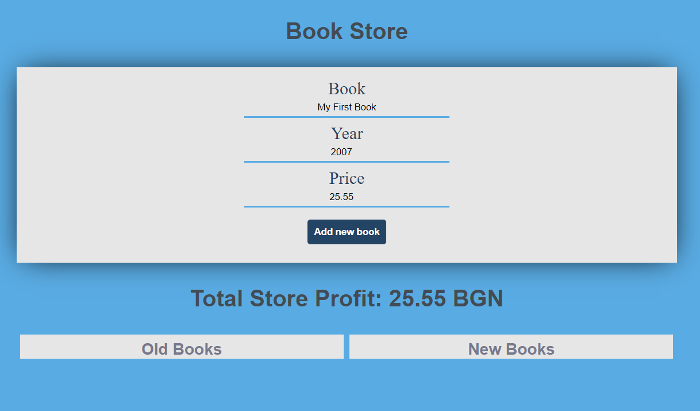

#### Move new book to the old section

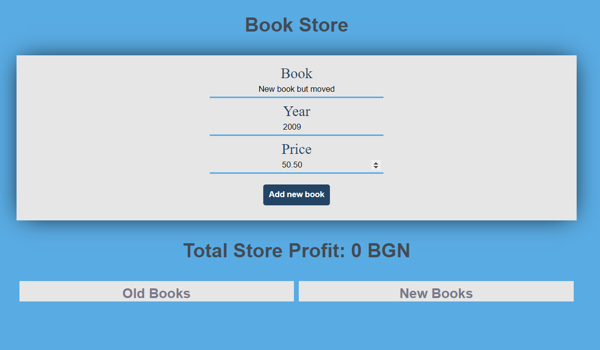

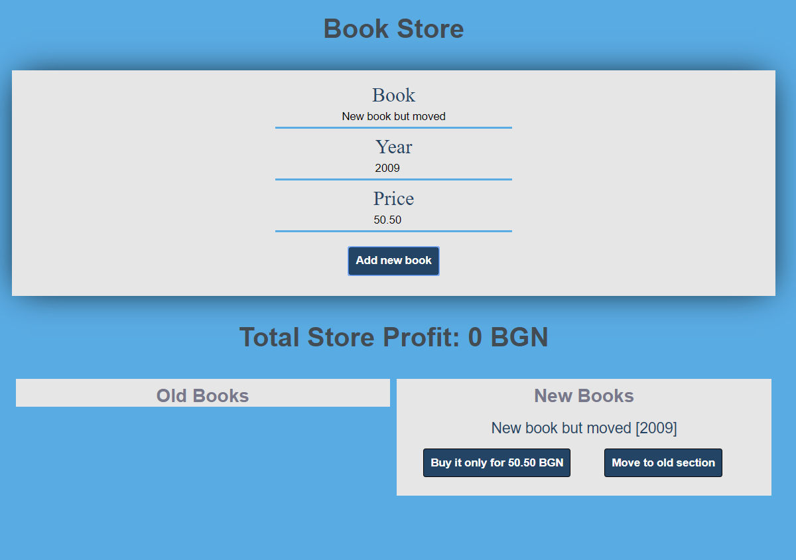

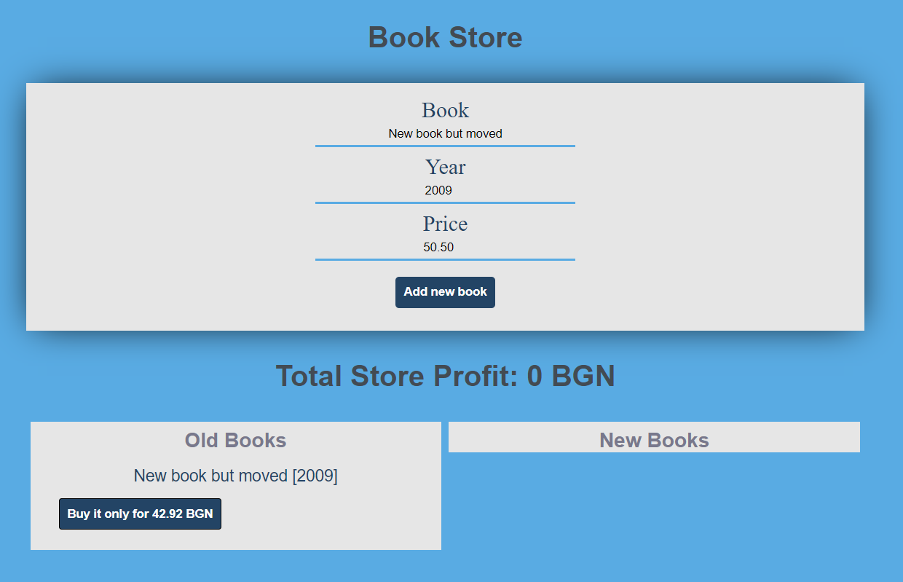

02\. Book Store
--------------

Use the provided **BookStore class** to solve this problem.

### Your Task

Using **Mocha** and **Chai** write **JS Unit Tests** to test the entire functionality of the **BookStore class**. Make sure instances of it have all the required functionality and validation. You may use the following code as a template:

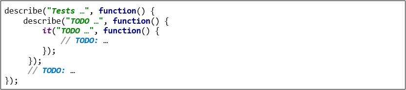

### Functionality

**bookStore.js** defines a **class** that contains information about a **book
store**. An **instance** of the class should support the following operations:

-   **Instantiation** with **one parameter** - a **string** representing the
    **bookstore name,** and an **additional properties** called "**books**" and
    "**workers**" - an **empty arrays by default**.

-   Function **stockBooks()** - receives **one** parameter - **newBooks** (an
    **array** of **strings**). This function adds **each of the elements** from
    the input into the **book's property**.

-   Function **hire()** - receives **two** parameters: a **string** (**name**)
    and another **string** (**position**). If the worker is **already hired**
    the function **throws** an **error**, otherwise the worker is **hired**, and
    a proper **message** is **returned**.

-   Function **fire()** - receives **one** parameter - **workerName.** If there
    is an employee with that name, he is fired, and a proper message is returned
    . Otherwise, an **error** is **thrown**.

-   Function **sellBook()** - receives two parameters: a **string** (**title**)
    and another **string** (**workerName**). If the book is in **stock** and the
    given worker name is **present** in the workers property, the book is
    **sold,** and the current worker **books sold counter** is **increased** by
    1 . Otherwise, an **errors** is **thrown**.

-   Function **printWorkers()** - This function **prints all workers.**

**Check the given class for more clarity!**

### Examples

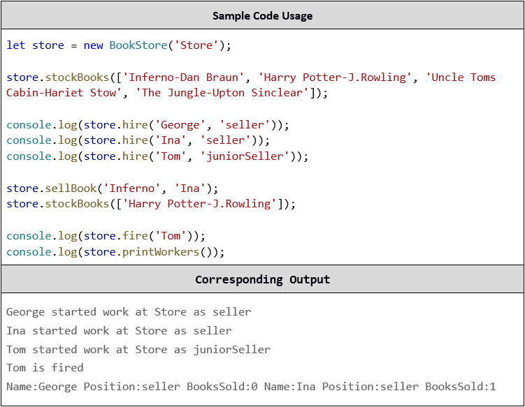

### Submission

Submit your tests inside a **describe()** statement, as shown above.

03\. Library
--------------

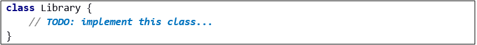

### Your Task

Write a Library class which supports the described functionality below.

### Functionality

#### constructor()

Receives **1** parameters at initialization of the class (**libraryName**),
where library name is a **string.**

Should have at least these **3** properties:

-   **libraryName** - **string** (should be the same as the received
    **libraryName**)

-   **subscribers** - **empty array**

-   **subscriptionTypes** - object with properties **normal, special** and **vip**

    -   The number of books that a person with **normal** subscription can
        receive is equal to the **length of the libraryName**

    -   The number of books that a person with **special** subscription can
        receive is equal to the **length of the libraryName multiplied by 2
        (libraryName \* 2)**

    -   A person with **vip** subscription can receive unlimited
        (**Number.MAX_SAFE_INTEGER**) amount of books

#### subscribe(name, type)

This **function** receives **2 string** parameters - **name** and **type**

-   If the given subscription **type** is not **normal**, **special** or
    **vip**, a new error should be **thrown** with the following message: **"The
    type {type} is invalid"**

-   If the person **is not subscribed**, you should make **new subscriber
    object** with properties

    -   **name** (the subscriber name)

    -   **type** (the subscription type)

    -   **books** (an empty array by default)

and add it to the library subscribers' array.

-   If there is a person with that **name** in the **subscribers** list, you
    should just **change** his subscription **type** with the given type.

*This function should return the current subscriber.*

#### unsubscribe(name)

This **function** receives **1** parameter **name** and should **unsubscribe**
an **already subscribed** person in the library (**remove** the person with the
**given name** from the **subscriber's property**).

-   If there **is no subscriber** with that **name,** a **new error** should be
    **thrown** with the following message: "**There is no such subscriber as
    {name}**"

-   If **subscribers property** contains a person with the **given name**, that
    person should be **removed** from the array.

**This function should return the library's subscribers list**

#### receiveBook(subscriberName, bookTitle, bookAuthor)

This function receives **3** parameters **(subscriberName, bookTitle** and
**bookAuthor**) and should **add** a book to the **subscriber's** book list.

-   If there is **no** such subscriber in the **subscriber's** array, a new
    error should be **thrown** with the following message: **"There is no such
    subscriber as {name}"**

-   If there is a subscriber with that name you should **check** his
    subscription **type**:

    -   If his subscription type **allows** him to **receive** more book you
        should **add** a new **book object** with properties **title** and
        **author** to his books array

    -   Otherwise a new error should be thrown, with the following message:
     **"You have reached your subscription limit {subTypeLimit}!"**

*This function should return the subscriber with the given name.*

#### showInfo ()

This function should **return a string with all the subscribers** with their
books joined by (**", "**) in the following format:

**"Subscriber: {subscriberName}, Type: {subscriptionType}\\n**
**Received books: {title} by {author}, {title2} by {author2}…"**

If the subscriber's property in the Library is empty just **return** the
following string:

**"{libraryName} has no information about any subscribers"**

### Submission

Submit only your **Library class.**

### Examples

This is an example how the code is **intended to be used**:

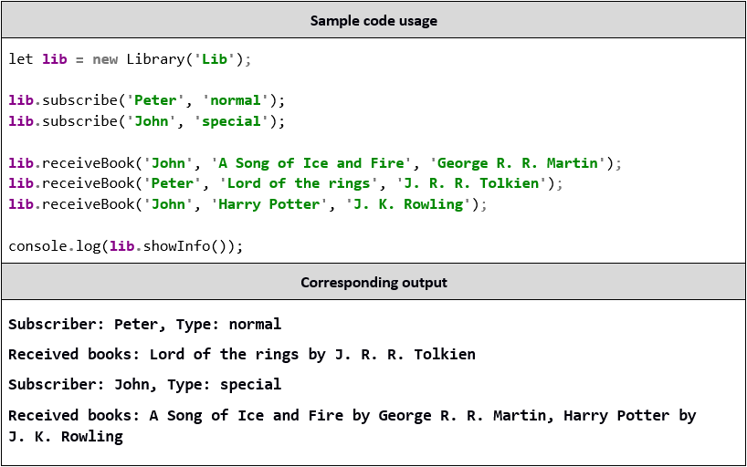