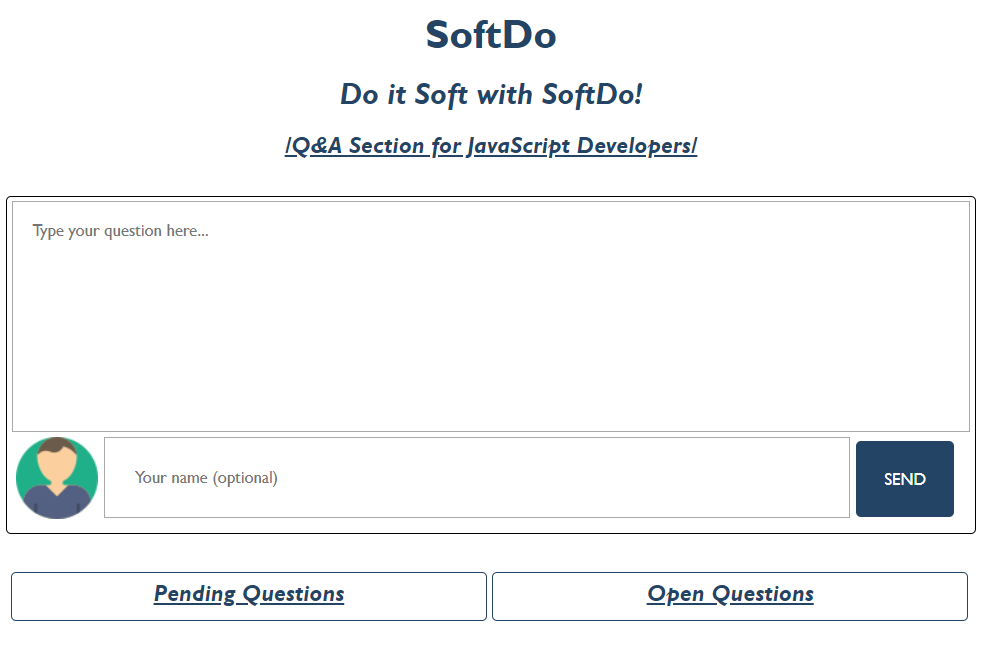

JS Advanced Exam - 07\.07\.2019
====================================

Exam problems for the ["JavaScript Advanced" course \@
SoftUni](https://softuni.bg/courses/js-advanced). Submit your solutions in the
SoftUni Judge system at
<https://judge.softuni.bg/Contests/Compete/Index/1715#0>.

01\. SoftDo (DOM Manipulation)
---------------------------

**Use the given skeleton to solve this problem.**

**Note: You have NO permission to change directly the given HTML (index.html file).**

### Your Task

Write the missing JavaScript code to make the SoftDo application work as expected.

#### [Ask Question]

When the **textarea** *(Type your question here…)* is filled with some question
and the button [**SEND**] is clicked, the current question should be displayed
in the [**Pending Questions**] **section.** The input field for the username is
**NOT required** - if it is filled, show the **given username** under the
question, otherwise, the username is **Anonymous**.

##### [Ask Question as an Anonymous User *(input field is empty)]*

##### [Ask Question with Username *(input field is filled with some username)]*

##### [Pending Question]

**Each** pending question:

-   Children elements must be wrapped in a **div** element with class
    "**pendingQuestion**"

    -   First child is **img** which is same for every user (Anonymous or not).
        The user icon is provided in the skeleton resources (**images folder**).
        Each **img** should have **src**, **width** and **height attributes**.

    -   Second child is a **span** element which holds the **username** (the
        given one from the input field or the Anonymous one).

    -   Third child is а **p element**, which is the given question from the
        **textarea**.

    -   The last (fourth child) is a **div** element with **class**
        "**actions**" which is а parent element of the two buttons
        ([**Archive**] and [**Open**])

        -   [**Archive**] button has class "**archive**" and text content
            "**Archive**"

        -   [**Open**] button has **class** "**open**" and text content
            "**Open**"

-   Should be appended to the **div** with id "**pendingQuestions**"

Clicking on the [**Archive**] **button** should **remove** the current question
(**div** element).

#### [Open Question]

If the [**Open**] **button** is clicked, the current question should be **moved
(Append)** from the "**pendingQuestions**" section to the "**openQuestions**"
section.

##### [Open a Question *(Moved from the [Pending] to the [Open] section)]*

##### [Open Question Structure]

**Each** open question:

-   Children elements must be wrapped in a **div element** with class
    "**openQuestion**"

    -   First child is **img** which is same for every user (Anonymous or not).
        The user icon is provided in the skeleton resources (**images folder**).
        Each **img** should have **src**, **width** and **height attribute**

    -   Second child is a **span element** which holds the **username** (the
        given one from the input field or the Anonymous one)

    -   Third child is a **p element**, which is the given question from the
        **textarea**

    -   Fourth child is a **div element** with **class** "**actions**" which is
        a parent element of the [**Reply**] **button**

        -   [**Reply**] **button** has **class** "**reply"** and text content
            "**Reply**"

    -   The last child here is a **div element** with class "**replySection**"
        which is a parent element of the **input**, **button** and **ol**
        elements:

        -   **Input element** should have **class** "**replyInput**", **type**
            "**text**" and **placeholder** "**Reply to this question here...**"
            *Set in that order!*

        -   **Button** element should have **class** "**replyButton**" and text
            content "**Send**"

        -   The ordered list **(ol element)** should **two** attributes
            (**class** "**reply**" and **type** "**1**") *Set in that order!*

-   Should be appended to the **div** with id "**openQuestions**"

**Keep in mind** when the pending question is moved (appended) to the open
questions section, the current question structure should be like the example
above (The elements must be created inside the **replySection** but the section
should **not be displayed**)

#### [Reply to the question]

By default, every **div element** with class "**replySection**" has **CSS
styles** which are **property display**-**value none** (**display: none**), but
if some of the [**Reply**] **buttons** are clicked, the current **replySection**
must be shown (The **display property** must be **changed** to **block**
(**display: block**). If the button [**Back**] is clicked again (when the
section is displayed), the styles must be changed again to **display:none.**

If the **input field** in the "**replySection"** is filled with some text
(answer to the current question) and the [**Send**] button is clicked, the
current answer (the input value) must be appended to the ordered list (**ol
element**) like text content on list item (**li element**)

02\. PizzUni
-------------

**Use the provided PizzUni class to solve this problem.**

### Your Task

Using **Mocha** and **Chai** write **unit tests** to test the entire
functionality of the **PizzUni class**. Make sure instances of it have all the
**required functionality** and **validation**. You may use the following code as a template:

### Functionality

The code inside the **pizzuniClass.js** file defines a class that contains
information about an auto service. An instance of the class should support the
following operations:

#### constructor()

An instance of **PizzUni class** should have the following **3 properties**:

-   **registeredUsers** - by default is an **empty array**

-   **availableProducts** - by default is an **object** that must have only 2
    properties:

    -   **pizzas** - array with **3 strings:**  
        ("Italian Style", "Barbeque Classic" and "Classic Margherita")

    -   **drinks** - array with **3 strings** ("Coca-Cola", "Fanta" and "Water")

-   **orders** - by default is an **empty array**

#### registerUser({email})

This function **registers** a user by the given email (**string**) into
**registeredUsers property**

-   Receives a **string** (email)

-   If the email is **already used** for registration before that, the expected
    behavior of the class is to **throw an error** with the following message:  
    \`**This email address (\${email}) is already being used!**\`

-   Otherwise, the given email is successfully registered to the
    **registeredUsers property** as an object. That object holds the given
    **email** and **orderHistory** which by default is an **empty array.**

-   At the end, the **current object** should be **returned**.

#### makeAnOrder()

This function **makes an order** from an **already registered** user and
**saves** the **current order** into their **orderHistory** property.

-   Receives 3 parameters - **email**, **orderedPizza** and **orderedDrink**

    -   If the incoming email is **NOT** registered in the **registeredUsers
        property**, the following error should be thrown:  
        "**You must be registered to make orders!**";

-   An order is considered **valid** when the incoming **orderedPizza** is one
    of the **pizzas** in the **availableProducts property**. If it is not the
    following error is thrown:  
    "**You must order at least 1 Pizza to finish the order.**".

-   The **orderedDrink** is **not required.** But if it is ordered, the drink
    should be one of the **drinks** in the **availableProducts property**.

-   When the **order is valid** a new **object** which holds information about
    the current order (**the ordered pizza** and **the ordered drink, if any**)
    is pushed in the registered user **orderHistory property.** Also, a new
    **object** which holds information like (**ordered pizza**, **ordered
    drink** (if any), **email** and **status** which is **pending**) is pushed
    in the **orders** property.

-   The following function **returns** a **number** (the **index** of the order
    in the **orders** array)

#### completeOrder()

This function **changes** the **status** of the **first object** with status
"**pending**" to "**completed'** in the **orders** property and **returns** the
**current object**.

#### detailsAboutMyOrder({id})

-   Receives a **number** (id) which is the **index** for the current order

-   If the current **order id** (index) is valid, the function returns the
    status of that order in format:  
    "**Status of your order: {pending/completed}**"

#### doesTheUserExist({email})

-   Receives a **string** (email) and **returns** an **object** with all the
    registered users with that email

### Submission

Submit your tests inside a **describe()** statement, as shown above.

03\. Computer
---------------------

### Your Task

Write a **Computer class** which supports the described functionality below.

### Functionality

#### constructor()

Receives **3** parameters at initialization of the class (**ramMemory, cpuGHz,
hddMemory**), where each of them is a **number.**

Should have these **5** properties:

-   **ramMemory** - **number** (should be the same as the received
    **ramMemory**)

-   **cpuGHz** - **number** (should be the same as the received **cpuGHz**)

-   **hddMemory** - **number** (should be the same as the received
    **hddMemory**)

-   **taskManager** – **empty array**

-   **installedPrograms** - **empty array**

#### installAProgram({name}, {requiredSpace})

This **function** should **install a new program** on the computer and **save**
it in the **installedPrograms property**.

-   If the **total hddMemory** is **exceeded** while trying to install a new
    program, **new error** should be **thrown** with the following message:  
    "**There is not enough space on the hard drive**"

-   If there is available space to install the given program, a **new object**
    with the given **name** and **requiredSpace** should be created and stored
    to the **installedPrograms array property.**

Keep in mind that when you successfully install a program you must **decrease**
the total **hdd memory** on the computer with the **capacity** for the
**currently installed program**!

The following function should **return** the **newly created object**.

#### uninstallAProgram({name})

This **function** should **uninstall** an **already installed** program on the
computer (**remove** the **first program** with the **given name** from the
**installedPrograms property**).

-   If there **are no installed** programs with the **given name,** a **new
    error** should be **thrown** with the following message:  
    "**Control panel is not responding**"

-   If **installedPrograms property** contains an object with the **given
    name**, that object should be **removed** from the array.

Also logically reversed move is to **increase** the total **hdd memory** with
the **capacity** of the **currently uninstalled program**!

This function should **return** the **installedPrograms array** where the given
program name is excluded.

#### openAProgram({name})

This **function** should **open** an already installed program on the computer.

Receives a **string** (name of that program)

-   If the given **name** is **not** present in the **installedPrograms
    property**, a **new error** should be **thrown** with the following message:  
    "**The \${name} is not recognized**"

-   If the given name is an installed program and it is already open, a new
    error should be thrown with the following message:  
    **The \${name} is already open**"

To open an installed program, you must **calculate** how much **RAM memory** and
**CPU usage** the program will need.

To find out how much:

-   **ram memory** the current program will need, use the following formula:  
    **(programRequiredSpace / totalRamMemory) \* 1.5**

-   **cpu usage** the current program will need, use the following formula:  
    **( ( programRequiredSpace / CPU GHz ) / 500) \* 1.5**

>   *Keep in mind the both formulas calculate a numbers in percent (%) for the current ram and cpu usage.*

If the **total ram usage reaches or exceeds 100%** (*the ram usage for all
opened programs*), the function should throw a **new error** with the following
message:  
**"{programName} caused out of memory exception**"

If the **total cpu usage reaches or exceeds 100%** (*the cpu usage for all
opened programs*), the function should throw a **new error** with the following
message:  
"**{programName} caused out of cpu exception**"

*If both (ram usage and cpu usage) reaches or exceeds 100% return the ram memory
exception case.*

When **ram** and **cpu usages** is **calculated**, create a **new object** with:

-   **name** (name of the program)

-   **ramUsage** (current ram usage that the program uses in %)

-   **cpuUsage** (current cpu usage that the program uses in %).

*The properties must be exactly as they are mentioned! Also, you don’t have to
round the numbers!*

When the object is created, push it in the **taskManager array property.**

The function must **return** the **newly created object.**

#### taskManagerView()

This **function** prints all opened programs (the objects in the **taskManager
array property**). Keep in mind that the percentages for (**cpu** and **ram
usages**) must be shown **without** any **decimal part** (You can use the
**.toFixed(0)**).

-   If there is no opened program, the function **returns** a **string** with
    the following message:  
    "**All running smooth so far**"

-   If there is at least one opened program, visualize it in the following
    format:  
    "**Name - {programName} \| Usage - CPU: {cpuUsage}%, RAM: {ramUsage}%**"

If there is more than one opened program, each of them must be in **new line**.

This function **returns** a **string** in the format mentioned above.

### Submission

Submit only your **Computer class.**

### Examples

This is an example how the code is **intended to be used**:

