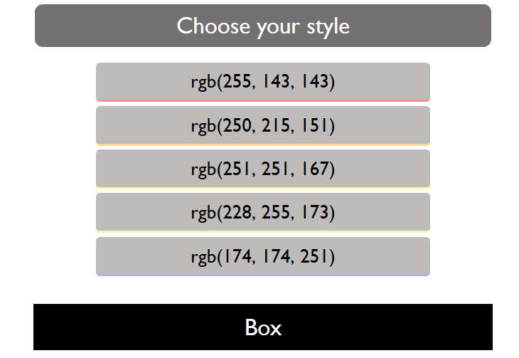

Lab: This
=========

Problems for the in-class lab for the ["JavaScript Applications" course \@
SoftUni](https://softuni.bg/courses/js-applications)

Submit your solutions in the SoftUni judge system at
[https://judge.softuni.bg/Contests/Practice/Index/1854 -
0](https://judge.softuni.bg/Contests/Practice/Index/1854#0)

01\. Area and Volume Calculator
-------------------

Write a function which **calculates** the **area** and the **volume** of a
figure, which is **defined** by its **coordinates**  
(**x**, **y**, **z**).

### Input

You will receive **3** parameters - the **functions area** and **vol** and a
**string**, which contains the figures' coordinates.

**For more information check the examples.**

### Output

The output should be **returned** as an **array of objects**. Each object has
**two properties**: the figure's **area** and **volume**.

**[**

**{ area: \${area1}, volume: \${volume1} },**

**{ area: \${area2}, volume: \${volume2} },**

**. . .**

**]**

### Note:

**Submit only the solve function.**

### Examples

02\. Person
-----------------

Write a JS program which takes **first** & **last** names as **parameters** and
returns an object with **firstName**, **lastName** and **fullName** (
**"{firstName} {lastName}"** ) properties which should be all **accessibles**,
we discovered that "accessible" also means "mutable". This means that:

-   If .**firstName** or .**lastName** have changed, then .**fullName** should
    also be changed.

-   If .**fullName** is changed, then .**firstName** and .**lastName** should
    also be changed.

-   If **fullName** is **invalid**, you should not change the other properties.
    A **valid full name** is in the format

    **"{firstName} {lastName}"**

**Note:** For more information check the examples below.

### Examples

03\. ArrayMap
--------

Write a function that takes **2 parameters** (**array** and a **function**) that
uses **.reduce()** to implement a simple version of **.map().**

### Input

You will receive **2** parameters - an **array**, and a **function**.

### Output

The output should be **returned** as a **new array** (changed according to the
given function).

**For more information check the examples below.**

### Examples

04\. Dropdown Menu
-------------

### Use the given skeleton to solve this problem.

### *Note: You have NO permission to change directly the given HTML (index.html file).*

### Your Task

Write the missing JavaScript code to make the **Dropdown Menu** application work
as expected.

When you **click** on the [Choose your style] button, the elements of the menu
should become visible.

When you click on one of the items the background color of the box below should
be changed to the RGB, which is displayed in the list item

When the **[Choose your style]** button **is clicked** again, you should hide
the list items, and the box should be returned to its initial state.

05\. Spy
----------------

Write a function that takes **2 parameters target**(an object) and **method**(a
string) and tracks **how many times** the method of an object is **called**.

### Input

**target**: an **object** containing the **method**

**method**: a **string** with the **name of the method** on target to spy on

### Output

The output should be **returned** as an **object** with property **count**, which holds how many times the provided method is invoked.

### Examples

