Exercise: This
==============

Problems for in-class lab for the [“JavaScript Advanced” course \@
SoftUni](https://softuni.bg/courses/javascript-advanced).

Submit your solutions in the SoftUni judge system at
<https://judge.softuni.bg/Contests/330/>.

01\. Company
-------------------

### Your Task

Write a Company class, which supports the described functionality below.

### Functionality

#### constructor()

Should have these **1** property:

-   **departments** - empty array

#### addEmployee({username}, {salary}, {position}, {department})

This function should add a new employee to the department with the given name.

-   If one of the passed parameters is empty string (""), undefined or null,
    this function should throw an error with the following message:

    **"Invalid input!"**

-   If salary is less than 0, this function should throw an error with the
    following message:

    **"Invalid input!"**

-   If the new employee is hired successfully, you should add him into the
    departments array and return the following message:

    **" New employee is hired. Name: {name}. Position: {position}"**

#### bestDepartment()

This **function** should print the department with the highest average salary
and its employees sorted by their salary by descending and by name in the
following format:

**"Best Department is: {best department's name}**

**Average salary: {best department's average salary}**

**{employee1} {salary} {position}**

**{employee2} {salary} {position}**

*{employee3} {salary} {position}**

**. . ."**

### Submission

Submit only your **Company class.**

### Examples

This is an example how the code is **intended to be used**:

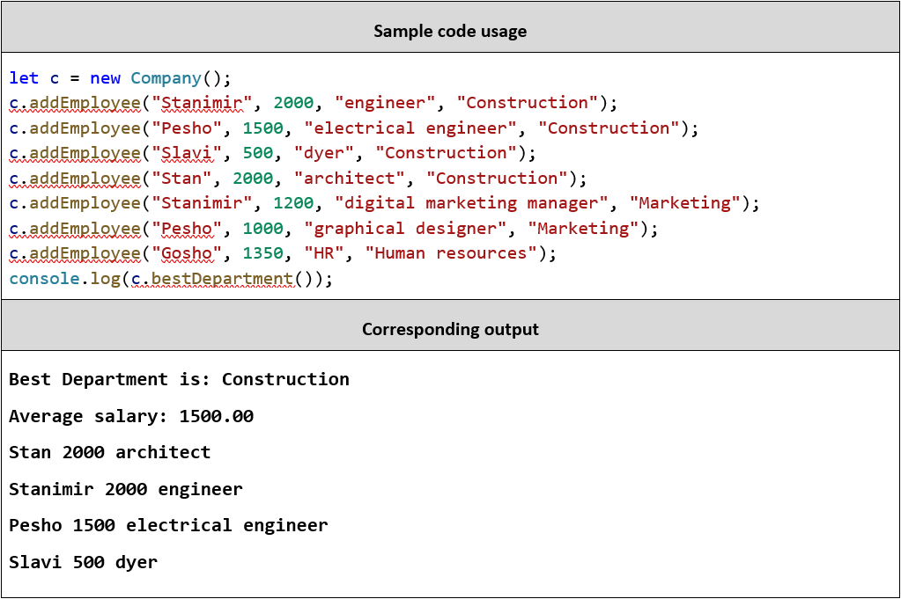

02\. Fibonacci
------------

Write a JS function that when called, returns the next Fibonacci number,
starting at 0, 1. Use a **closure** to keep the current number.

### Input

There will be no input.

### Output

The **output** must be a Fibonacci number and must be **returned** from the
function.

### Examples

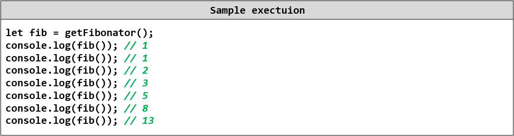

03\. HEX
------------

### Your Task

Write a Hex class, which supports the described functionality below.

### Functionality

#### constructor({value})

Should have these **1** property:

-   **value** - number

#### valueOf()

This function should return the value property of the Hex class.

#### toString()

This **function** will show its hexidecimal value starting with "0x"

#### plus({number})

This function should add a number or Hex object and return a new Hex object.

#### minus({number})

This function should subtract a number or Hex object and return a new Hex
object.

#### parse({string})

Create a parse class method that can **parse** Hexidecimal numbers and convert
them to standard decimal numbers.

### Submission

Submit only your **Hex class.**

### Examples

This is an example how the code is **intended to be used**:

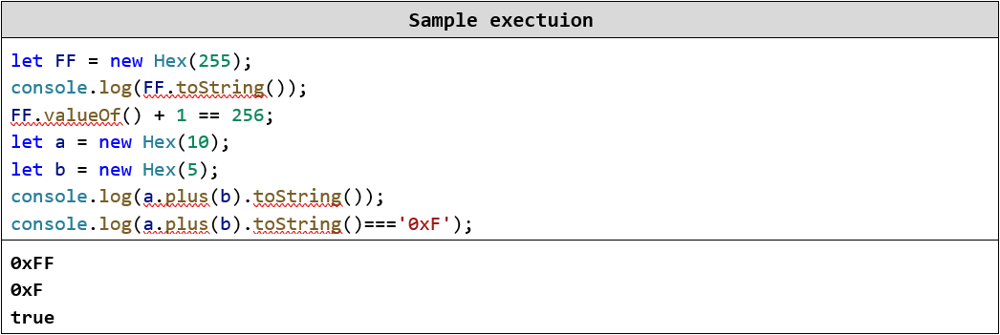

04\. Table
-----

### Use the given skeleton to solve this problem.

### *Note: You have NO permission to change directly the given HTML (index.html file).*

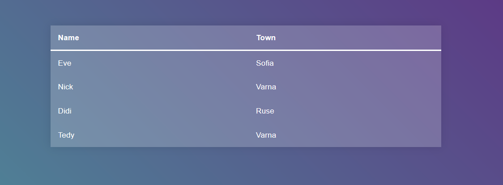

### Your Task

Write the missing JavaScript code to make the **Table** application work as
expected.

When you **click** on an item from the table you should change its **background
color** to "\#413f5e".

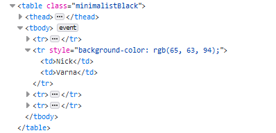

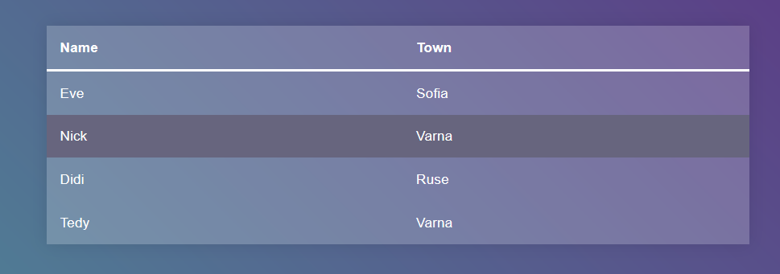

If the item you've clicked **already has** a **style** property you should
**remove** it.

If one of the elements is **clicked** and you click **another** the first
element's style property should be **removed** and you should **change** the
**background color** of the **newly clicked** item.

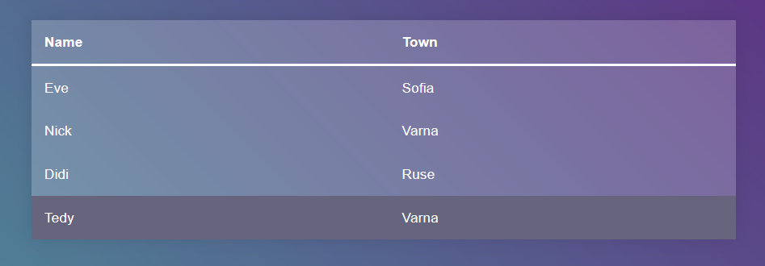

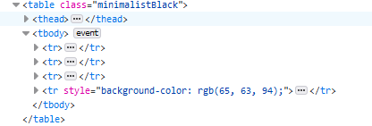

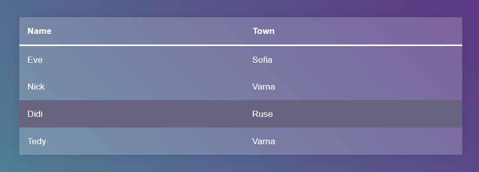

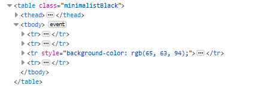

**Note:** You **shouldn't** change the head of the table, even if it is clicked.

05\. Next Article
------------

Write a JS program that sequentially **displays articles** on a web page when
the user **clicks** a button. You will receive an **array of strings** that will
initialize the program. You need to return a function that keeps the initial
array in its closure and every time it’s called, it takes the first element from
the array and displays it on the web page, inside a div with ID "**content**".
If there are no more elements left, your function should do nothing.

### HTML and JavaScript Code

You are given the following **HTML** code:

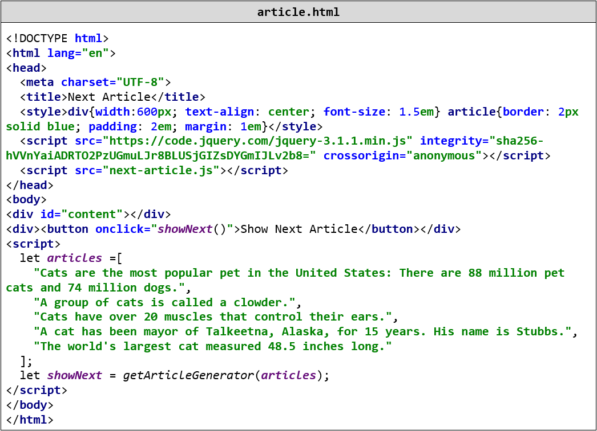

It comes together with the following **JavaScript** code:

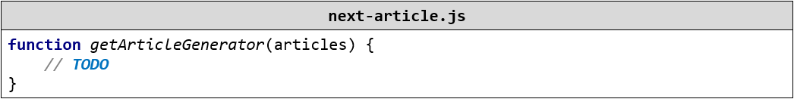

Your function will be called automatically, there is **no need** to attach any
event listeners.

### Input

You will receive and **array** of strings.

### Output

Return a **function** that displays the array elements on the web page.

### Examples

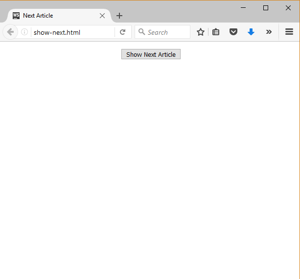

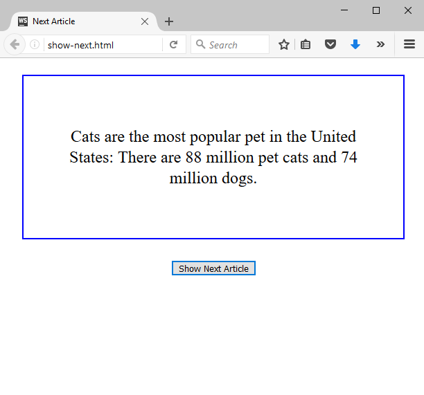

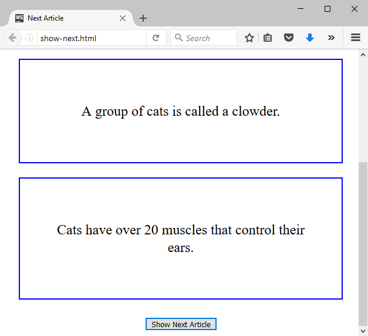