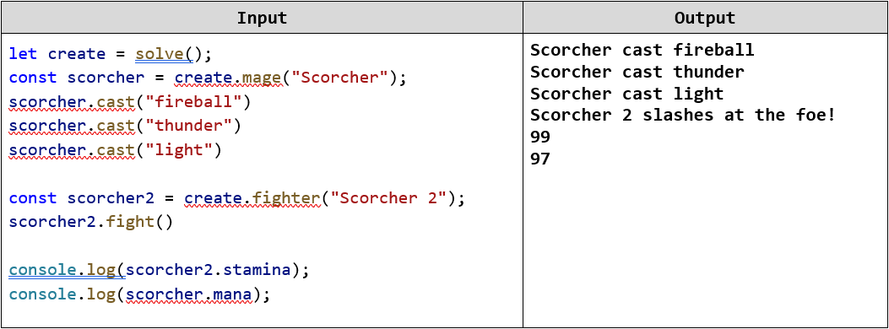
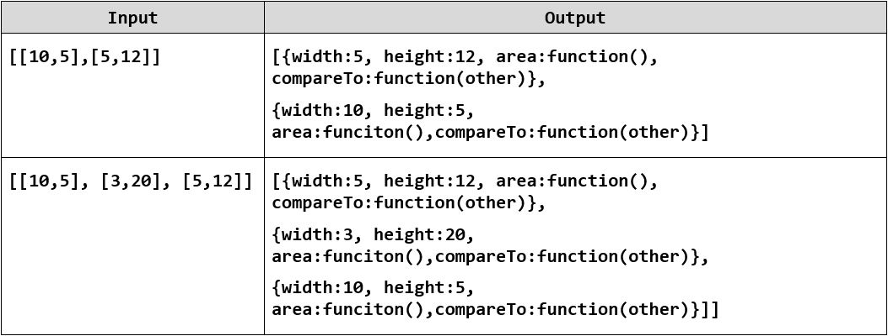
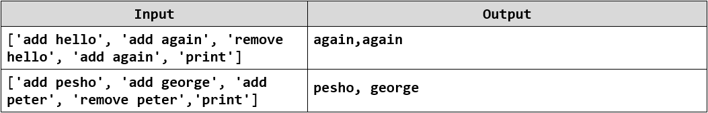
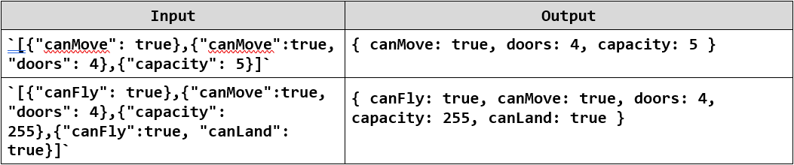
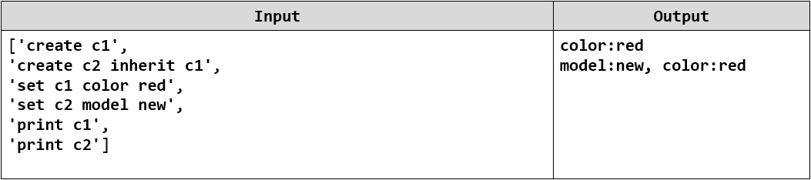
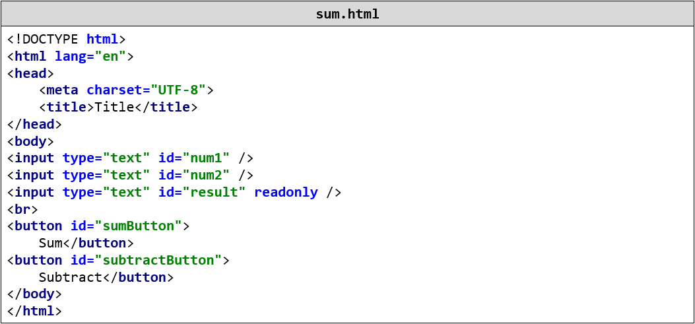

Lab: Object Composition
=======================

Problems for exercises and homework for the ["JavaScript Applications" course \@
SoftUni](https://softuni.bg/courses/js-applications).

Submit your solutions in the SoftUni judge system at
<https://judge.softuni.bg/Contests/1545>.

01\. Heroes
------

Create a function **returns** an **object** with 2 methods (**mage** and
**fighter**). This object should be able to **create** heroes (fighters and
mages). Every hero has a **state**.

-   Fighters have **name**, **health = 100** and **stamina = 100** and every
    fighter can fight. When he **fights** his **stamina decreases** by **1** and
    the following message is **printed** on the console:

    **\`\${fighter's name} slashes at the foe!\`**

-   Mages also have state (**name**, **health = 100** and **mana = 100**). Every
    mage can **cast spells**. When a spell is casted the mage's **mana
    decreases** by **1** and the following message is **printed** on the
    console:

    **\`\${mage's name} cast \${spell}\`**

### Examples

02\. Order Rectangles
----------------

You will be passed a few pairs of **widths** and **heights** of rectangles,
create **objects** to represent the rectangles. The objects should additionally
have two functions **area** - that returns the area of the rectangle and
**compareTo** - that compares the current rectangle with another and produces a
number signifying if the current rectangle is **smaller** (negative number),
**equal** (0) or **larger** (positive number) than the other rectangle.

### Input

The input will come as an **array of arrays** - every nested array will contain
exactly 2 numbers the **width** and the **height** of the rectangle.

### Output

The output must consist of an array of **rectangles** (objects) sorted by their
**area** in **descending** order as a **first** criteria and by their **width**
in **descending** order as a **second** criteria.

### Examples

03\. List Processor
--------------

Using a closure, create an inner object to process list commands. The commands
supported should be the following:

-   **add \<string\>** - adds the following string in an inner collection.

-   **remove \<string\>** - removes all occurrences of the supplied
    **\<string\>** from the inner collection.

-   **print** - prints all elements of the inner collection joined by **","**.

### Input

The **input** will come as an **array of strings** - each string represents a
**command** to be executed from the command execution engine.

### Output

For every print command - you should print on the console the inner collection
joined by **","**

### Examples

04\. Object Factory
--------------

Write a function that can **compose objects**. You will **receive** a **string**
and your goal is to create a **new object** with all the **unique** properties
you were **given**. For more information check the examples below.

### Input

The **input** will come as a **string**, which represents an array of objects.

### Output

You should print the **newly created object**.

### Examples

05\. Cars
--------

Write a closure that can create and modify objects. All created objects should
be **kept** and be accessible by **name**. You should support the following
functionality:

-   **create \<name\>** - creates an object with the supplied **\<name\>**

-   **create \<name\> inherits \<parentName\>** - creates an object with the
    given **\<name\>**, that inherits from the parent object with the
    **\<parentName\>**

-   **set \<name\> \<key\> \<value\>** - sets the property with key equal to
    **\<key\>** to **\<value\>** in the object with the supplied **\<name\>**.

-   **print \<name\>** - prints the object with the supplied **\<name\>** in the
    format **"\<key1\>:\<value1\>,\<key2\>:\<value2\>…"** - the printing should
    also print all **inherited properties** from parent objects. Inherited
    properties should come after own properties.

### Input

The **input** will come as an **array of strings** - each string represents a
**command** to be executed from your closure.

### Output

For every **print** command - you should print on the console all properties of
the object in the above mentioned format.

### Constraints

-   **All commands will always be valid, there will be no nonexistent or
    incorrect input.**

### Examples

06\. Sum
------------

Create a function which returns an object that can modify the DOM. The returned
object should support the following functionality:

-   **init(selector1, selector2, resultSelector)** - initializes the object to
    work with the elements corresponding to the supplied selectors.

-   **add()** - **adds** the numerical value of the element corresponding to
    **selector1** to the numerical value of the element corresponding to
    **selector2** and then writes the result in the element corresponding to
    **resultSelector**

-   **subtract()** - **subtracts** the numerical value of the element
    corresponding to **selector2** from the numerical value of the element
    corresponding to **selector1** and then writes the result in the element
    corresponding to **resultSelector**

### Input

There will be no input your function must only provide an object.

### Output

Your function should return an object that meets the specified requirements.

### Constraints

-   **All commands will always be valid, there will be no nonexistent or
    incorrect input.**

-   **All selectors will point to single textbox elements.**

### HTML

You are given the following HTML for testing purposes:

