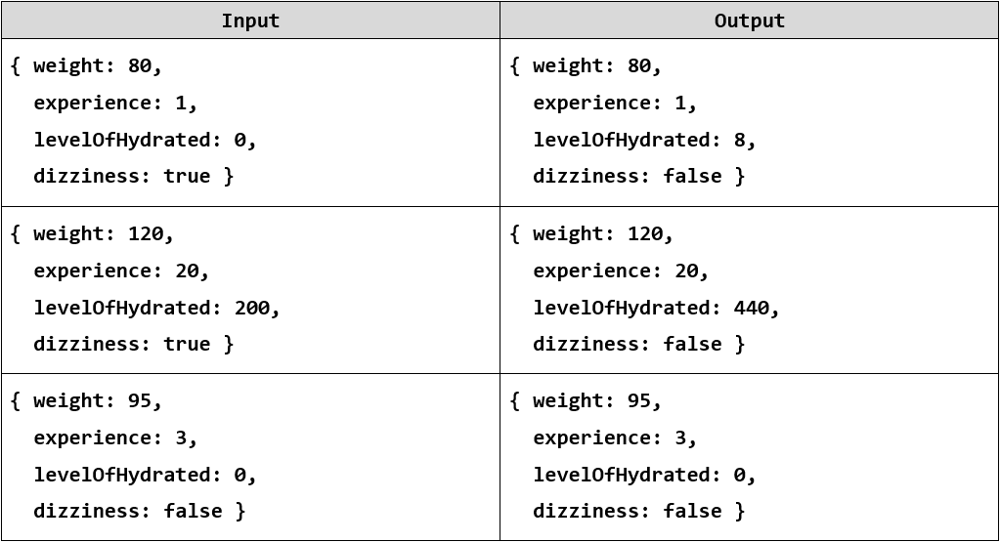
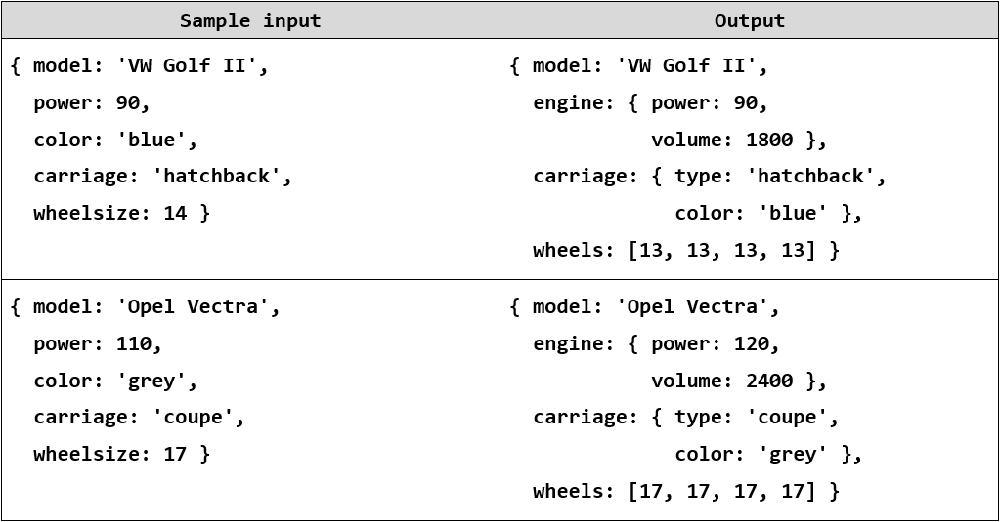
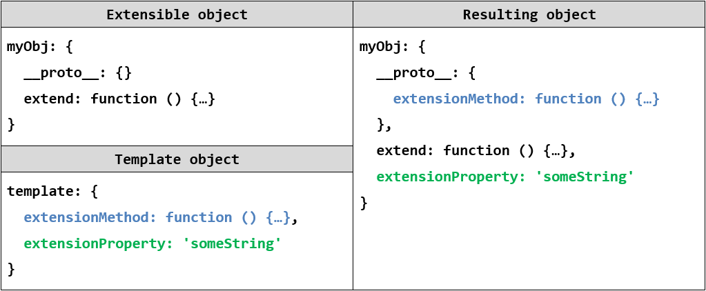
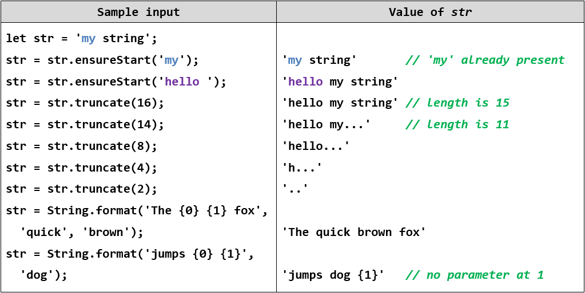

Exercise: Object Composition
============================

Problems for exercises and homework for the ["JavaScript Advanced" course \@
SoftUni](https://softuni.bg/courses/js-advanced). Submit your solutions in the
SoftUni judge system at <https://judge.softuni.bg/Contests/1546>.

01\. Array Extension
---------------

Extend the build-in **Array** object with additional functionality. Implement
the following functionality:

-   **last()** - returns the last element of the array

-   **skip(n)** - returns a new array which includes all original elements,
    except the first **n** elements; **n** is a **Number** parameter

-   **take(n)** - returns a new array containing the first **n** elements from
    the original array; **n** is a **Number** parameter

-   **sum()** - returns a sum of all array elements

-   **average()** - returns the average of all array elements

### Input / Output

Input for functions that expect it will be passed as valid parameters. Output
from functions should be their **return** value.

### Constraints

Structure your code as an **IIFE**.

02\. Construction Crew
-----------------

Write a program that receives a **worker** object as a parameter and modifies
its properties. Workers have the following structure:

{ weight: Number,

experience: Number,

levelOfHydrated: Number,

dizziness: Boolean }

Weight is expressed in **kilograms**, **experience** in **years** and
**levelOfHydrated** is in **milliliters**. If you receive a worker who’s
**dizziness** property is set to **true** it means he needs to intake some
**water** in order to be able to work correctly. The required amount is 0.1ml
per **kilogram** per year of **experience**. The required amount must be
**added** to the **existing amount**. Once the water is administered, change the
**dizziness** property to **false**.

Workers who **do not have dizziness** should **not** be modified in any way.
Return them as they were.

### Input

Your function will receive a valid **object** as **parameter**.

### Output

Return the **same object** that was passed in, **modified** as necessary.

### Examples

03\. Car Factory
-----------

Write a program that assembles a car by **given requirements** out of **existing
components**. The client will place an order in the form of an **object
describing** the car. You need to **determine** which parts to use to fulfil the
client’s order. You have the following parts in storage:

An **engine** has **power** (given in horsepower) and **volume** (given in cubic
centimeters). Both of these values are **numbers**. When selecting an engine,
pick the **smallest possible** that still meets the requirements.

Small engine: { power: 90, volume: 1800 }

Normal engine: { power: 120, volume: 2400 }

Monster engine: { power: 200, volume: 3500 }

A **carriage** has a **type** and **color**. Both of these values are
**strings**. You have two types of carriages in storage and can paint it **any
color**.

Hatchback: { type: 'hatchback', color: \<as required\> }

Coupe: { type: 'coupe', color: \<as required\> }

The **wheels** will be represented by an **array** of 4 **numbers**, each number
represents the **diameter** of the wheel in inches. The size can only be an
**odd number**. Round **down** any requirements you receive to the nearest odd
number.

### Input

You will receive an **object** as an **argument** to your function. The format
will be as follows:

{ model: \<model name\>,

power: \<minimum power\>,

color: \<color\>,

carriage: \<carriage type\>,

wheelsize: \<size\> }

### Output

**Return** the resulting car **object** as a result of your function. See the
examples for details.

### Examples

04\. Extensible Object
-----------------

Create an object that can clone the functionality of another object into itself.
Implement an **extend(template)** function that would copy all of the properties
of template to the parent object and if the property is a function, add it to
the object’s prototype instead.

### Input / Output

Your code should **return** the extensible **object instance**. The **extend()**
function of your object will receive a valid object as **input parameter**, and
has **no** output.

### Examples

Note that **\__proto_\_** is a hidden property, representing the object’s
**prototype** - depending on your test environment, you may not have access to
it directly, but you can use other functions to do that.

### Hints

To gain access to the prototype of an instance, use the
**Object.getPrototypeOf()** function. To make a function shared between all
instances, it’ll have to be attached to the prototype instead of the instance.

05\. String Extension
----------------

Extend the build-in String object with additional functionality. Implement the
following functions:

-   **ensureStart(str)** - append **str** to the beginning of a string, **only**
    if it’s **not** already present

-   **ensureEnd(str)** - append **str** to the end of a string, **only** if it’s
    **not** already present

-   **isEmpty()** - return **true** if the string is **empty**, **false**
    otherwise

-   **truncate(n)** - truncates the string to **n** characters by **removing
    words** and appends an ellipsis (three periods) to the end. If a string is
    less than **n** characters long, return the **same string**. If it is
    longer, split the string where a **space** occurs and append an ellipsis to
    it so that the **total length** is less than or equal to **n**. If **no
    space** occurs anywhere in the string, return **n - 3** characters and an
    ellipsis. If **n** is less than 4, return **n** amount of periods.

-   **format(string, …params)** - static method to replace placeholders with
    parameters. A placeholder is a number surrounded by curly braces. If
    parameter index cannot be found for a certain placeholder, do not modify it.
    Note static methods are attached to the **String object** instead of it’s
    prototype. See the examples for more info.

Note strings are **immutable**, so your functions will return new strings as a
result.

### Input / Output

Your main code should be structured as an IIFE **without** input or output - it
should modify the existing **String prototype** instead.

Input and output of the **extension functions** should be as described above.

### Examples

06\. \*Sorted List
-------------

Implement a collection, which keeps a list of numbers, sorted in **ascending
order**. It must support the following functionality:

-   **add(elemenent)** - adds a new element to the collection

-   **remove(index)** - removes the element at position **index**

-   **get(index)** - returns the value of the element at position **index**

-   **size** - number of elements stored in the collection

The **correct order** of the element must be kept **at all times**, regardless
of which operation is called. **Removing** and **retrieving** elements
**shouldn’t** work if the provided index points **outside the length** of the
collection (either throw an error or do nothing). Note the **size** of the
collection is **NOT** a function. Write your code such that the first function
in your solution **returns an instance** of your Sorted List.

### Input / Output

All function that expect **input** as **parameters** will receive valid data.
Any result expected from a function should be **returned** as it’s result. Your
**main function** should **return** an **object instance** with the required
functionality as it’s result.

07\. \*Bug Tracker
--------------

Create a program for managing bug reports. It must perform as a self-contained
module with exposed functionality. Whenever a new element is added, deleted or
changed with a command, the HTML should be updated automatically. A bug report
has the following structure:

{ ID: Number,

author: String,

description: String,

reproducible: Boolean,

severity: Number,

status: String }

The **ID** of each report has to be a **unique** number, starting from **zero**
and increasing **sequentially**. The module needs to implement the following
**functions**:

-   **report(author, description, reproducible, severity)** - **create** a new
    bug report and store it. The **ID** is assigned automatically to the next
    available number and the **status** defaults to **'Open'**

-   **setStatus(id, newStatus)** - change the status of a bug registered in the
    system to **newStatus** by given **ID**

-   **remove(id)** - delete a bug report by given **ID**

-   **sort(method)** - change the order in which bug reports are displayed on
    the webpage. The **method** argument is a string and can be either
    **'author'**, **'severity'** or **'ID'**. Always sort in ascending order
    (default behavior for alphabetical sort). The default sorting method is by
    **'ID'**.

-   **output(selector)** - set the HTML element inside which the result is to be
    displayed to **selector**

Use the following structure for each HTML report:

### Input

Input will be passed to each applicable function as **parameters** in the
correct format.

### Output

Your solution must **expose** a **module** with all required functions bundled
in it (**return** it as a result of your main function). The HTML should be
**modified** as specified.
