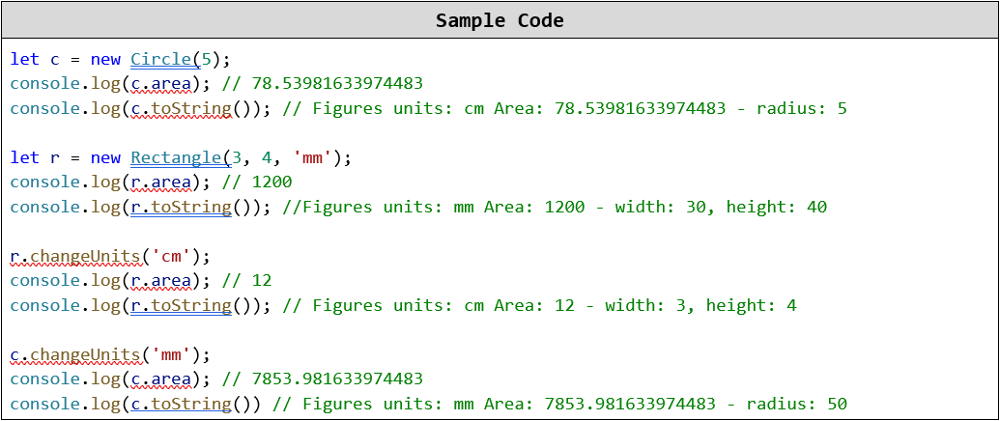

Lab: Prototypes and Inheritance
===============================

Problems for exercises and homework for the ["JavaScript Applications" course \@
SoftUni](https://softuni.bg/courses/js-applications). Submit your solutions in
the SoftUni Judge system at
<https://judge.softuni.bg/Contests/Practice/Index/1676#0>

01\. Person and Teacher
------------------

Write a class **Person** and a class **Teacher** which extends **Person**.

-   The **Person** class should have a **name** and an **email**

-   The **Teacher** class should have a **name**, an **email**, and a
    **subject**

### Input \\ Output

There will be **NO** input. Your function should return an object containing the
classes **Person** and **Teacher**.

02\. Inheriting and Replacing ToString
---------------------------------

Extend the **Person** and **Teacher** from the previous task and add a class
**Student** inheriting from **Person**. Add **toString()** functions to all
classes, the formats should be as follows:

-   **Person** - returns "**Person (name: {name}, email: {email})**"

-   **Student** - returns "**Student (name: {name}, email: {email}, course:
    {course})**"

-   **Teacher** - returns "**Teacher (name: {name}, email:{email},
    subject:{subject})**"

Try to reuse code by using the **toString()** function of the base class.

### Input / Output

There will be **NO** input. Your function should return an object containing the
classes **Person**, **Teacher** and **Student**.

03\. Extend Prototype
----------------

Write a function which receives a **class** and attaches to it a property
**species** and a function **toSpeciesString()**. When called, the function
returns a string with format:

"I am a \<species\>. \<toString()\>"

The function **toString()** is called from the current instance (call using
**this**).

### Input / Output

Your function will receive a **class** whose prototype it should extend. There
is **NO** output, your function should only attach the properties to the given
class’ prototype.

04\. Class Hierarchy
---------------

Write a function that returns **3** classes - **Figure**, **Circle** and
**Rectangle**.

**Figure**:

-   Should have property units ("**m**", "**cm**", "**mm**") with default value
    "**cm**"

-   Has method **changeUnits** that sets different units for that figure

**Circle**:

-   Extends **Figure**

-   Has a property **radius**

-   Overrides **area** getter to return the area of the Circle (PI \* r \* r)

-   **toString()** - should return a string representation of the figure in the
    format

     **"Figures units: {type} Area: {area} - radius: {radius}"**

Rectangle:

-   Extends **Figure**

-   Has properties **width** and **height**

-   Overrides **area** getter to return the area of the **Rectangle** (width \*
    height)

-   **toString()** - should return a string representation of the figure in the
    format

    **"Figures units: {type} Area: {area} - width: {width}, height: {height}"**

### Note: *All parameters passed in the constructors are in centimeters ("cm")*

### Input / Output

There will be **no** input. Your function should return an object containing the
**Figure**, **Circle** and **Rectangle** classes.

### Examples

