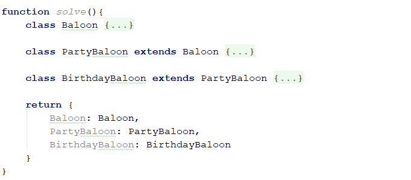
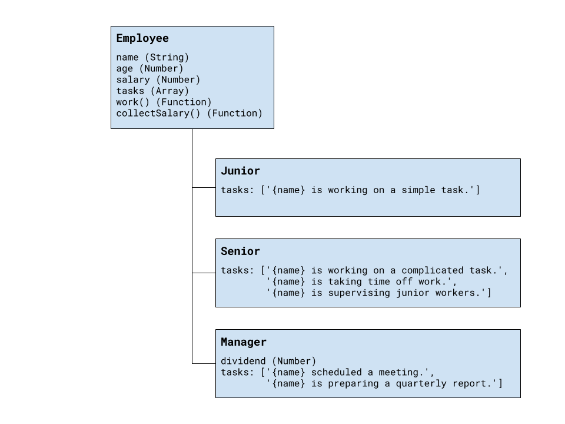
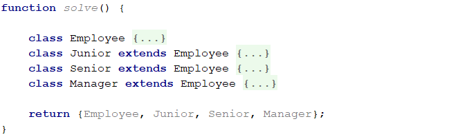
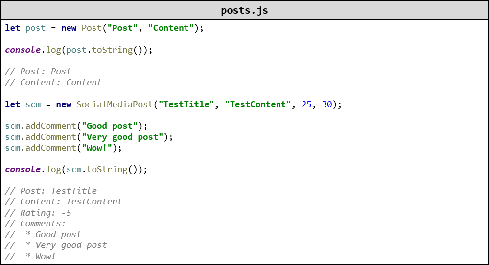
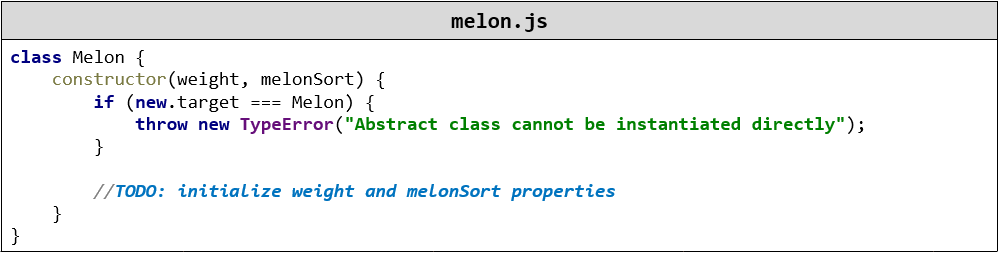
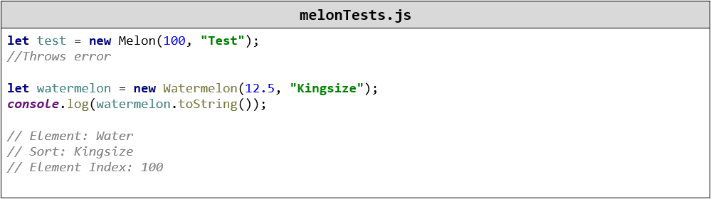
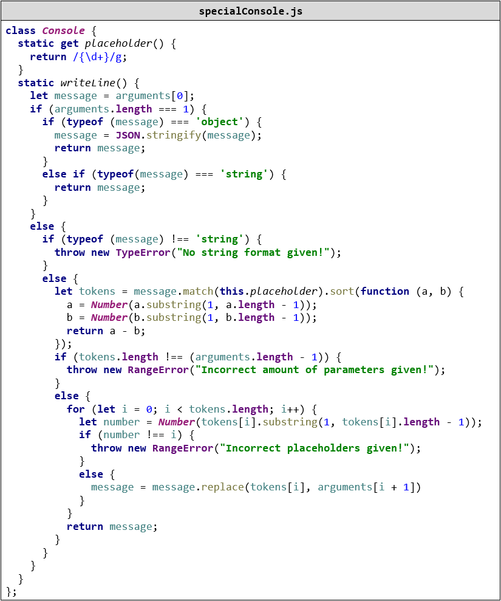
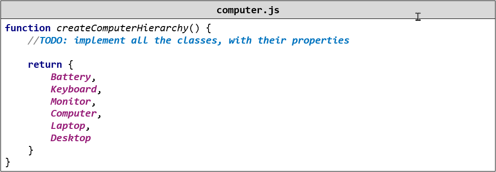
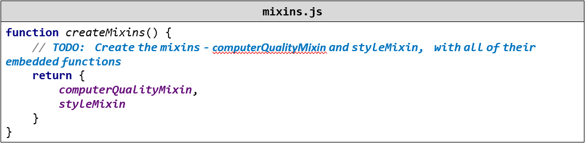

Exercises: Prototypes and Inheritance
=====================================

Problems for exercises and homework for the ["JavaScript Advanced" course \@
SoftUni](https://softuni.bg/courses/js-advanced). Submit your solutions in the
SoftUni judge system at
<https://judge.softuni.bg/Contests/Practice/Index/1677#0>.

01\. Balloons
-------------

You have been tasked to create several classes for balloons.

Implement a class **Balloon**, which is initialized with a **color** (String)
and **gasWeight** (Number). These two arguments should be **public members**.

Implement another class **PartyBalloon**, which inherits the **Balloon** class
and is initialized with **2 additional parameters** - **ribbonColor** (String)
and **ribbonLength** (Number).  
The **PartyBalloon** class should have a **property ribbon**, which is an object
with **color** and **length** - the ones given upon initialization. The ribbon
property should have a **getter**.

Implement another class **BirthdayBalloon**, which inherits the **PartyBalloon**
class and is initialized with **1 extra parameter** - **text** (String). The
**text** should be a property and should have a **getter**.

Submit a **function (NOT IIFE)**, which holds all classes, and returns them as
an object.

02\. People
------

Define several classes, that represent a company’s employee records. Every
employee has a **name** and **age**, a **salary** and a list of **tasks**, while
every position has specific properties not present in the others. Place all
common functionality in a **parent abstract** class. Follow the diagram bellow:

Every position has different tasks. In addition to all common properties, the
manager position has a **dividend** he can collect along with his salary.

All employees have a **work()** function that when called cycles trough the list
responsibilities for that position and prints the current one. When all tasks
have been printed, the list starts over from the beginning. Employees can also
collect **salary**, which outputs the amount, plus any **bonuses**.

Your program needs to expose a module, containing the three classes **Junior**,
**Senior** and **Manager**. The properties **name** and **age** are set trough
the constructor, while the **salary** and a manager’s **dividend** are initially
set to zero and can be changed later. The list of tasks is filled by each
position. The resulting objects also expose the functions **work()** and
**collectSalary()**. When **work()** is called, one of the following lines is
printed on the console, depending on the current task in the list:

"{employee name} is working on a simple task."

"{employee name} is working on a complicated task."

"{employee name} is taking time off work."

"{employee name} is supervising junior workers."

"{employee name} scheduled a meeting."

"{employee name} is preparing a quarterly report."

And when **collectSalary()** is called, print the following:

"{employee name} received {salary + bonuses} this month."

### Input / Output

Any input will be passed as valid arguments, where applicable. Print any output
that is required to the console as a **string**.

Submit your code as a revealing module, containing the **three classes**. Any
definitions need to be named exactly as described above.

03\. Posts
-----

Your need to create several classes for **Posts**.

Implement the following classes:

-   **Post**, which is initialized with **title** (String) and **content**
    (String)

    -   The **2** arguments should be **public members**

    -   The **Post** class should also have **toString()** function which
        returns the following result:

        **"Post: {postTitle}"**  
        **"Content: {postContent}"**  

-   **SocialMediaPost**, which inherits the **Post** class and should be
    initialized with **2 additional arguments - likes** (Number) and
    **dislikes** (Number). The class should hold:

    -   **comments(**Strings**)** - an array of strings

    -   **addComment(**comment**)**- a function, which **adds** comments to that
        array

    -   The class should extend the **toString()** function of the **Post**
        class, and should return the following result:

         **"Post: {postTitle}"**  
         **"Content: {postContent}"**  
         **"Rating: {postLikes - postDislikes}"**  
         **"Comments:"**  
         **" \* {comment1}"**  
         **" \* {comment2}"**  
         **. . .**

In case **there are no comments**, return information only about the
**title**, **content** and **rating** of the **post**.

-   **BlogPost**, which inherits the **Post** class:

    -   The **BlogPost** class should be initialized with **1 additional
        argument** - **views(**Number**)**.

    -   The **BlogPost** class should hold

        \- **view()** - which **increments** the **views** of the object with
        **1**, every time it is called. The function should **return the
        object**, so that **chaining is supported**.

    -   The **BlogPost** class should extend the **toString()** function of the
        **Post** class, and should return the following result:

        **"Post: {postTitle}"**  
        **"Content: {postContent}"**  
        **"Views: {postViews}"**

### Example

Submit a **function (NOT IIFE)**, which holds all classes, and returns them as
an object.

04\. Elemelons
---------

If **Watermelons** exist, **Firemelons**, **Earthmelons** and **Airmelons**
should also exist. Create **classes** for **Elemelons**.

Create an **abstract class** for the Elemelons. Name it **Melon**.

The **Melon** class should be initialized with **weight** (Number) and
**melonSort** (String). The 2 arguments should be **public members**.

Create classes **Watermelon**, **Firemelon**, **Earthmelon**, **Airmelon**. Each
of them should **inherit** the **abstract class Melon** and its functionality.

Aside from the abstract functionality, **each** of the **Elemelons** should have
property:

-   **elementIndex** (Number) - **equal** to its **weight \*** the **string
    length** of its **melonSort**. The property should have only a **getter**.

All of the classes should hold a **toString()** function, which returns the
following result for them:

"Element: {Water/Fire/Earth/Air}"  
"Sort: {elemelonSort}"  
"Element Index: {elemelonElementIndex}"

Create one more class which is called **Melolemonmelon**, which inherits **one**
of the **4 elemelons**, **regardless of which**.  
The **Melolemonmelon has no element**, but it can **morph** into any of the
others.

-   Implement a function **morph()**, which **changes the current element** of
    the **Melolemonmelon**, **each time** it is called

-   Upon initialization, the **initial element** is **Water**. From then it
    should go in the following order**: Fire, Earth, Air, Water, Fire…** and so
    on

-   The **toString()** function should remain the same as its parent class

To create an abstract class you must make sure that that class **cannot** be
instantiated directly. Put the following code in the constructor of the
**Melon** class, before all else.

### Example

Submit a **function (NOT IIFE)**, which holds all classes, and returns them as
an object.

5\. \*C\# Console
-------------

Write **Mocha Unit tests** to verify the functionality of a JavaScript
implementation of the C\# Console **class**. If you've written some code in C\#,
you would know that you can format text using placeholders, an example would
look like this:

Console.WriteLine("The sum of {0} and {1} is {2}", 3, 4, 7);

Here the first placeholder **{0}** is exchanged for the first parameter passed
after the text template - **3**. The second placeholder **{1}** for the second
parameter - **4** and so on.

You will be provied with a class **Console** which has similar functionality to
the C\# one. The **Console** should have a static method writeLine which
supports the following:

-   **writeLine(string)** - if only a single argument is passed and it is a
    string, the function should simply return it.

-   **writeLine(object)** - if only a single parameter is passed and it is an
    object - return the **JSON** representation of the object.

-   **writeLine(templateString, parameters)** - It should support the following:

    -   If multiple arguments are passed, but the first is not a string - throw
        a **TypeError**.

    -   If the number of **parameters** does not correspond to the number of
        placeholders in the template string - throw a **RangeError**.

    -   If the placeholders have indexes not withing the **parameters**
        range(for instance we have a placeholder **{13}** and only 5 params)
        throw a **RangeError**.

    -   If multiple arguments are passed and the first is a string, find all
        placeholders from the string and **exchange** them with the supplied
        **parameters**.

Any cases not mentioned above, do not need to be checked.

### Constraints

-   All arguments in the **writeLine(templateString, parameters)** will be
    **strings**.

-   There will never be two placeholders with the same number.

### JS Code

To ease you in the process, you are provided with an implementation which meets
all of the specification requirements for the **Console** object:

Your tests will be supplied a class named **"Console"** which contains the
above-mentioned logic, all test cases you write should reference this variable.
Submit in the Judge your code containing Mocha tests testing the above
functionality.

06\. \*Computer
----------

You need to implement the class hierarchy for a computer business, here are the
classes you should create and support:

-   **Keyboard** class that contains:

    -   **manufacturer** - string property for the name of the manufacturer

    -   **responseTime** - number property for the response time of the Keyboard

-   **Monitor** class that contains:

    -   **manufacturer** - string property for the name of the manufacturer

    -   **width** - number property for the width of the screen

    -   **height** - number property for the height of the screen

-   **Battery** class that contains:

    -   **manufacturer** - string property for the name of the manufacturer

    -   **expectedLife** - number property for the expected years of life of the
        battery

-   **Computer** - **abstract** class that contains:

    -   **manufacturer** - string property for the name of the manufacturer

    -   **processorSpeed** - a number property containing the speed of the
        processor in GHz

    -   **ram** - a number property containing the RAM of the computer in
        Gigabytes

    -   **hardDiskSpace** - a number property containing the hard disk space in
        Terabytes

-   **Laptop** - class **extending** the **Computer** class that contains:

    -   **weight** - a number property containing the weight of the Laptop in
        Kilograms

    -   **color** - a string property containing the color of the Laptop

    -   **battery** - an instance of the **Battery** class containing the
        laptop's battery. There should be a **getter** and a **setter** for the
        property and validation that the passed in argument is actually an
        instance of the Battery class.

-   **Desktop** - concrete class **extending** the **Computer** class that
    contains:

    -   **keyboard** - an instance of the **Keyboard** class containing the
        Desktop PC's Keyboard. There should be a **getter** and a **setter** for
        the property and validation that the passed in argument is actually an
        instance of the Keyboard class.

    -   **monitor** - an instance of the **Monitor** class containing the
        Desktop PC's Monitor. There should be a **getter** and a **setter** for
        the property and validation that the passed in argument is an instance
        of the **Monitor** class.

Attempting to instantiate an abstract class should throw an **Error**,
attempting to pass an object that is not of the expected instance (ex. an object
that is not an instance of Battery to the laptop as a battery) should throw a
**TypeError**.

### Example

You are asked to submit **ONLY the function** that returns an object containing
the above-mentioned classes.

### Bonus:

In order to achieve a better code reuse, it's a good idea to have a base
abstract class containing common information - check the classes, what common
characteristics do they share that can be grouped in a common base class.

07\. \*\*Mixins
----------

Using the classes from the last task, write two mixins (functions which attach
some functionality to passed in classes' prototypes) to extend their
functionality. You need to support the following mixins:

-   **computerQualityMixin(classToExtend)** - a function that attaches the
    following functions to the prototype of the passed in class.

    -   **getQuality()** - returns a number equal to the computer's
        **(processorSpeed + RAM + hardDiskSpace) / 3**

    -   **isFast()** - if **processorSpeed \> (ram / 4)** returns **true**,
        otherwise **false**

    -   **isRoomy()**-if **hardDiskSpace \> Math.floor(ram \* processorSpeed)**
        returns **true**, otherwise **false**

-   **styleMixin(classToExtend)** - a function that attaches the following
    functions to the prototype of the passed in class:

    -   **isFullSet()** - if the computer's **manufacturer**, **keyboard's
        manufacturer** and **monitor's manufacturer** all have the same name
        returns **true**, otherwise **false**.

    -   **isClassy()** - if the computer battery's expected life is **3** years
        or **more** and the computer's color is either **"Silver"** or
        **"Black"** and the computer's weight is **less** than **3** kilograms
        returns **true**, otherwise returns **false**.

### Examples

You are asked to submit **ONLY the function** that returns an object containing
the above mentioned mixins.
