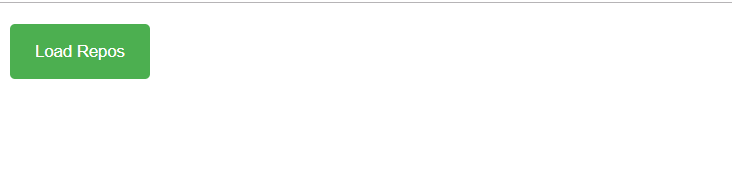
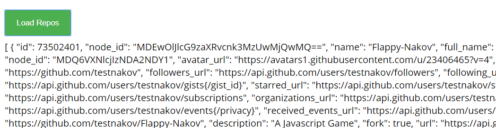
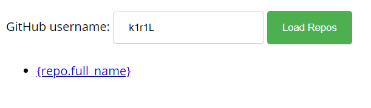
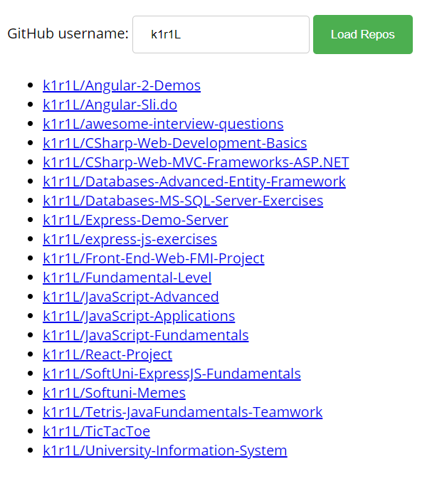

Lab: REST Services and AJAX
===========================

Problems for in-class lab for the "[JavaScript Applications" course \@
SoftUni](https://softuni.bg/opencourses/js-apps).

01\. XHR (XmlHttpRequest)
-----------------------

Your task is to **write** a JS function that **loads** a github repository
**asynchronously with AJAX**. You should **create** an instance of
**XmlHttpRequest** and attach an **onreadystatechange** event to it. (An
EventHandler that is called whenever the readyState attribute changes). In your
event handler, when the **readyState** attribute reaches a value of **4** (it is
ready), replace the text content of a **div** element with **id "res"** with the
value of the **responseText** property of the request. **Do not format** the
response in any way.

[More on
XmlHttpRequest.open()](https://developer.mozilla.org/en-US/docs/Web/API/XMLHttpRequest/open)

*Skeleton will be provided in the Resources folder.*

### Examples

02\. Github Repos
---------------

Your task is to **write** a JS function that **executes** an **AJAX** request
with **Fetch API** and loads all user **github repositories** by a given
username (taken from an input field with **id "username"**) into a **list**
(each repository as a **list-item**) with **id** "**repos**". Use the properties
**full_name** and **html_url** of the returned objects to create a link to each
repo’s GitHub page. If an **error** occurs (like 404 “Not Found”), **append** to
the list a list-item with **text** the current instead. Clear the contents of
the list before any new content is appended. See the **highlighted lines** of
the skeleton for formatting details of each list item.

*Skeleton will be provided in the Resources folder.*

### Examples

