Exercise: REST Services and AJAX
================================

Problems for exercises and homework for the ["JavaScript Applications" course \@
SoftUni](https://softuni.bg/courses/js-applications). 

Submit your solutions in
the SoftUni Page -
<https://softuni.bg/trainings/2347/js-apps-july-2019#lesson-11778>

01\. Bus Stop
-----------------

Write a JS program that displays arrival times for all buses by a given bus stop
ID when a button is clicked. *Use the skeleton from the provided resources.*

When the button with ID **'submit'** is clicked, the name of the bus stop
appears and the list bellow gets filled with all the buses that are expected and
their time of arrival. Take the **value** of the input field with id
**'stopId'**. Submit a **GET** request to
**https://judgetests.firebaseio.com/businfo/{stopId}.json** (replace the
highlighted part with the correct value) and parse the response. You will
receive a JSON object in the format:

stopId: {

name: stopName,

buses: { busId: time, … }

}

Place the name property as text inside the div with ID **'stopName'** and each
bus as a list item with text:

**"Bus {busId} arrives in {time}"**

Replace all highlighted parts with the relevant value from the response. If the
request is not successful, or the information is not in the expected format,
display **"Error"** as **stopName** and nothing in the list. The list should be
cleared before every request is sent.

### Examples

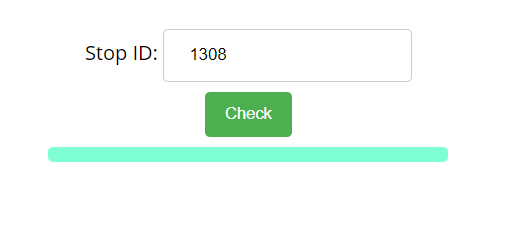

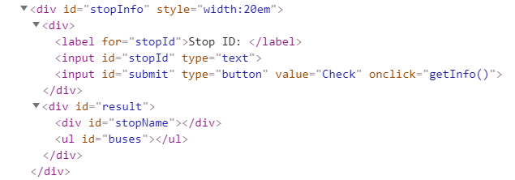

When the button is clicked, the results are displayed in the corresponding
elements:

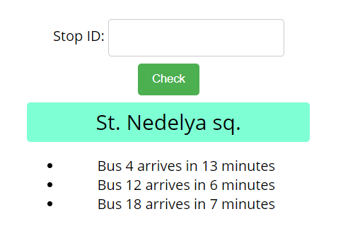

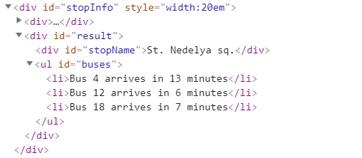

If an error occurs, the stop name changes to Error:

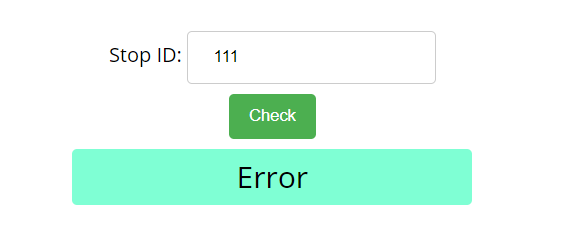

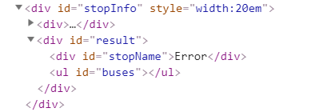

### Hints

The webhost will respond with valid data to IDs 1287, 1308, 1327 and 2334.

02\. Bus Schedule
------------

Write a JS program that tracks the progress of a bus on it’s route and announces
it inside an info box. The program should display which is the upcoming stop and
once the bus arrives, to request from the server the name of the next one. *Use
the skeleton from the provided resources.*

The bus has two states – **moving** and **stopped**. When it is **stopped**,
only the button “**Depart**” is **enabled**, while the info box shows the name
of the **current** stop. When it is **moving**, only the button “**Arrive**” is
**enabled**, while the info box shows the name of the **upcoming** stop.
Initially, the info box shows "**Not Connected**" and the "**Arrive**" button is
**disabled**. The ID of the first stop is "**depot**".

When the "**Depart**" button is clicked, make a **GET** request to the server
with the ID of the current stop to address
**https://judgetests.firebaseio.com/schedule/{currentId}.json** (replace the
highlighted part with the relevant value). As a response, you will receive a
JSON object in the following format:

stopId {

name: stopName,

next: nextStopId

}

Update the info box with the information from the response, disable the “Depart”
button and enable the “Arrive” button. The info box text should look like this
(replace the highlighted part with the relevant value):

Next stop {stopName}

When the "**Arrive**" button is clicked, update the text, disable the “Arrive”
button and enable the “Depart” button. The info box text should look like this
(replace the highlighted part with the relevant value):

Arriving at {stopName}

Clicking the buttons successfully will cycle through the entire schedule. If
invalid data is received, show "**Error**" inside the info box and **disable**
both buttons.

### Examples

Initially, the info box shows “Not Connected” and the arrive button is disabled.

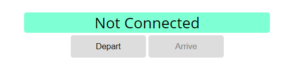

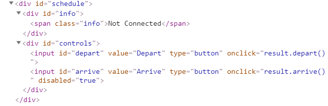

When Depart is clicked, a request is made with the first ID. The info box is
updated with the new information and the buttons are changed:

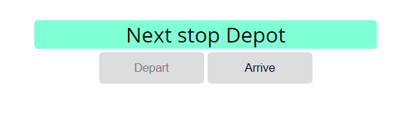

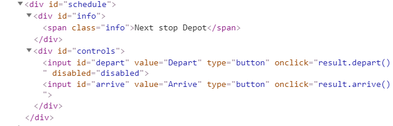

Clicking Arrive, changes the info box and swaps the buttons. This allows Depart
to be clicked again, which makes a new request and updates the information:

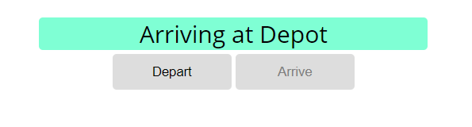

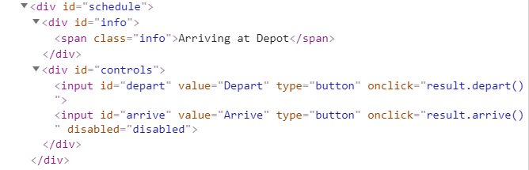

03\. Phonebook
---------

Write a JS program that can load, create and delete entries from a Phonebook.
You will be given an HTML template to which you must bind the needed
functionality.

*Use the skeleton from the provided resources.*

When the **[Load]** button is clicked, a **GET** request should be made to the
server to get all phonebook entries. Each received entry should be in a **li**
inside the **ul** with **id="phonebook"** in the following format with text
**"\<person\>: \<phone\> "** and a **[Delete]** button attached. Pressing the
**[Delete]** button should send a **DELETE** request to the server and delete
the entry. The received response will be an object in the following format:  
**{\<key\>:{person:\<person\>, phone:\<phone\>}, \<key2\>:{person:\<person2\>,
phone:\<phone2\>,…}** where **\<key\>** is an unique key given by the server and
**\<person\>** and **\<phone\>** are the actual values.

When the **[Create]** button is clicked, a new **POST** request should be made
to the server with the information from the Person and Phone textboxes, the
Person and Phone textboxes should be cleared and the Phonebook should be
automatically reloaded (like if the **[Load]** button was pressed).

The data sent on a **POST** request should be a valid JSON object, containing
properties **person** and **phone.** Example format:  
**{**

**"person": "\<person\>",**

**"phone": "\<phone\>"**  
**}**

The **url** to which your program should make requests is:

**'https://phonebook-nakov.firebaseio.com/phonebook'**

**GET** and **POST** requests should go to
**https://phonebook-nakov.firebaseio.com/phonebook.json**, while **DELETE**
requests should go to
**https://phonebook-nakov.firebaseio.com/phonebook/\<key\>.json**, where
**\<key\>** is the unique key of the entry (you can find out the **key** from
the key property in the **GET** request)

**You may create your own app** in Firebase.

### Screenshots:

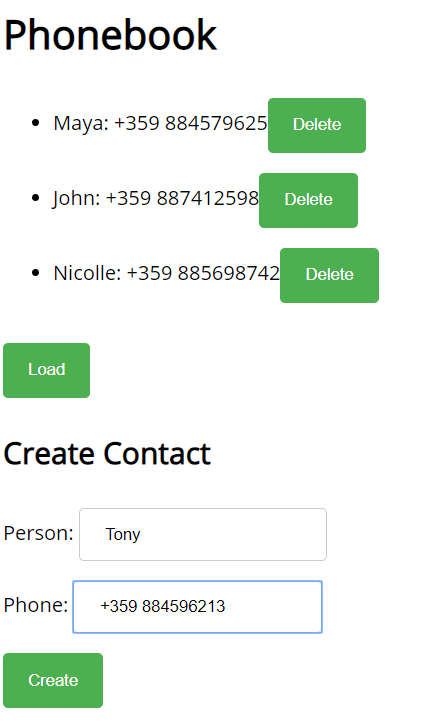

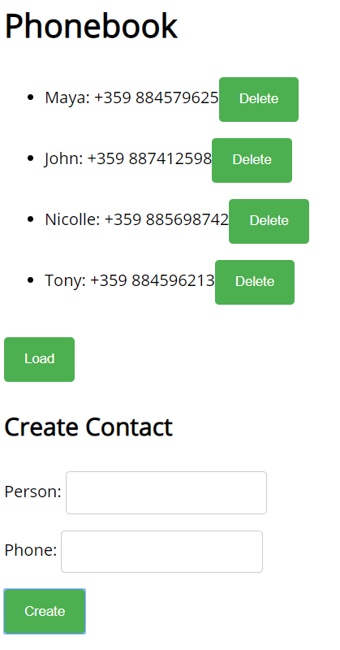

04\. Messenger
-------------

Write a JS program that records and displays messages. The user can post a
message, supplying a name and content and retrieve all currently recorded
messages.  
*Use the skeleton from the provided resources*

**Firebase url** for the requests -
<https://rest-messanger.firebaseio.com/messanger>

When [**Send**] **button** is clicked you should create a **new object** and
send a **post request** to the firebase url. Use the following message
structure:

{

author: authorName,

content: msgText,

}

The key associated with each message object is not important - when making a
**POST** request with the message object as parameter, Firebase will
automatically assign a random key.

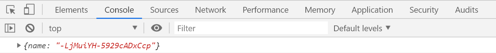

If you click over [**Refresh**] **button** you should **get all** messages with
**GET request** and display them into the textarea. Use the following message
format:  
"**{author}: {message}**"

### Examples

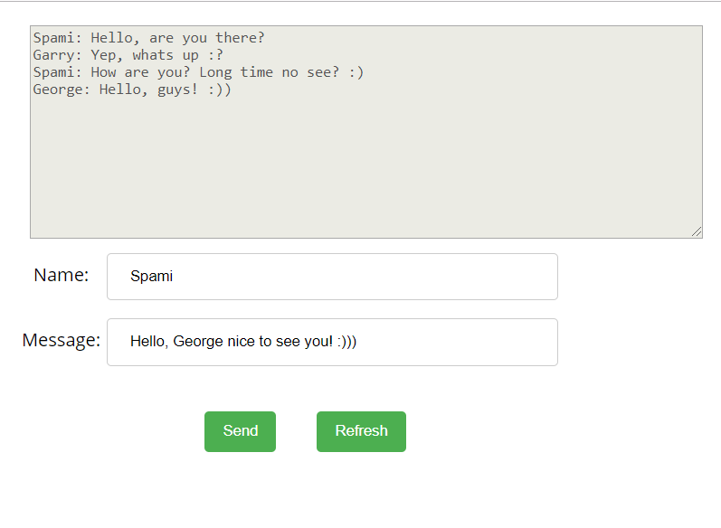

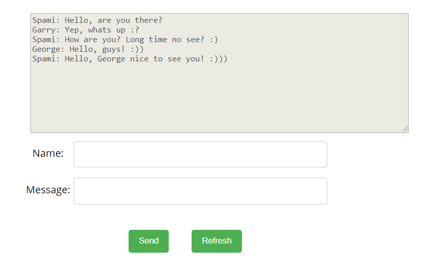