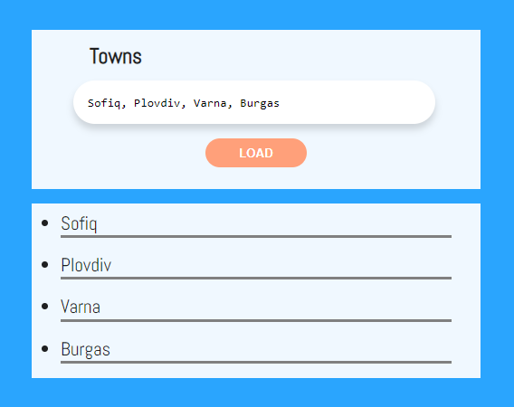
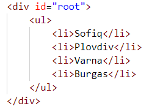
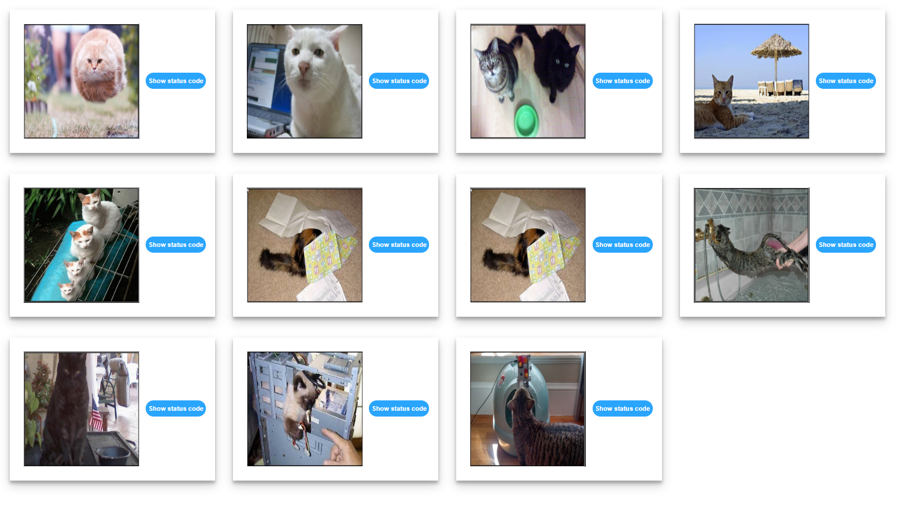
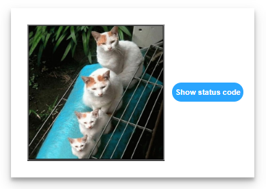
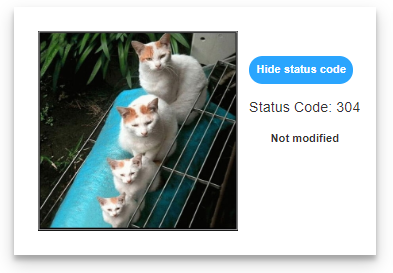
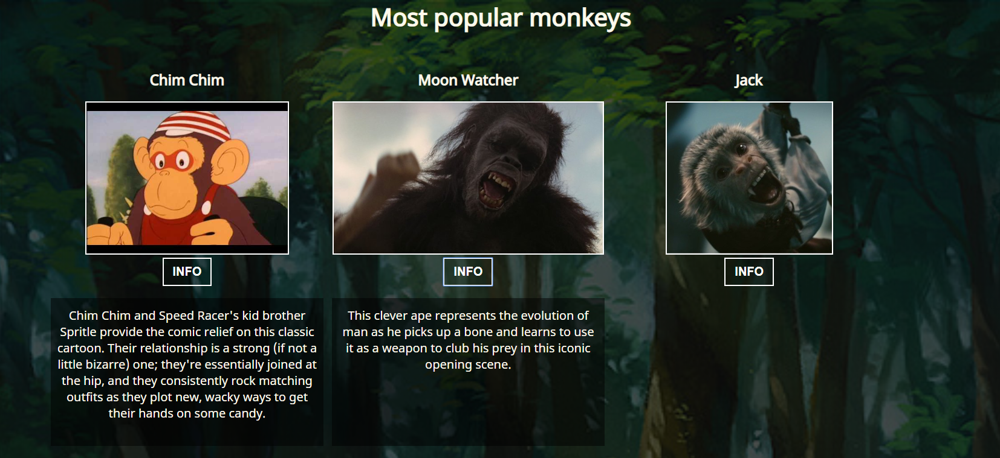

Exercises: Templating
=====================

Problems for exercises and homework for the ["JavaScript Applications" course \@
SoftUni](https://softuni.bg/trainings/2347/js-apps-july-2019).

01\. List Towns
----------

You are a given an **input field** with a **button**. In the input field you
should enter **elements separated** by comma and whitespace ("**,** "). Your
task is to create a simple **template** that defines a **list** of towns. Each
**town** comes from the **input** field.

In your **attachEvents()** function you **should** attach a click event to the
**button** with **id "btnLoadTowns"** and **render** the **towns** that come
from the input field in the **HTML template** with **id "towns-template".**

### Screenshots 

This is how the HTML looks like:

02\. HTTP Status Cats
----------------

We all love cats. They are also a fun way to learn all the HTTP status codes.

Your task is to **refactor** the given **HTML** and to create a **template** to
represent **each** cat card block on it's own. After you have **created** the
templete **render** it into the div with **id "allCats".**

A **cat** has an **id, statusCode, statusMessage** and **imageLocation**. The
cats are **seeded** using the **function** from the js **file** named
**"catSeeder.js"**

Each card block has a **button** that **unveils** status code information
**connected** to each cat. You should **toggle** the button and change it's text
from "**Show status code**" to "**Hide status code**".

### Screenshots 

03\. Popular Monkeys
---------------

You are provided with a **skeleton.** Your task is to implement the function in
the **'monkeysTemplate.js'** file to render the six most popular monkeys in the
browser. You should also add an **event** to each **'Info'** button to show the
**details** about the monkey. Each monkey also has a **name** and an **image**.
Explore the **'monkeys.js'**file for more details. At the end the page should
look like this:

