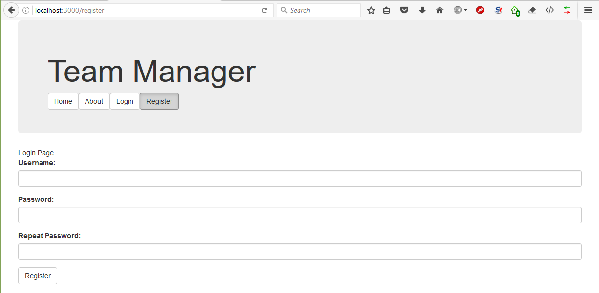

Exercise: Routing 
==================

Lab problem for the [“JavaScript Applications” course \@
SoftUni](https://softuni.bg/courses/javascript-applications).

Team Manager
============

Create a JS application for managing teams. Use Handlebars for rendering,
Sammy.js for routing and Kinvey as a backend provider. Structure your work so
that it is easy to manage. The example is styled using
[Bootstrap](http://getbootstrap.com/).

App Structure
-------------

-   **Home Page** – show relevant info, depending on the status of the user

-   **Catalog** – a list of all registered teams

-   **About** – dummy page that would hold information about the app

-   **Register User**

-   **Create Team**

-   **Edit Team**

-   **View Team Details** – a detailed page that shows all members of the team
    and management controls

Create a header that is shared across all pages and place links to the relevant
sections in it.

CRUD Operations
---------------

The app must support user registration, login and logout. Store the user
credential in **session storage**. Once logged in, the user is free to browse
all registered teams and **join** or **create** a new team. At any point, the
user is able to **leave** the team he is a member of. The user can only join
**one** team at a time. Also when a user **creates** a team he **automatically**
joins it. He **cannnot** create a team **again** unless he leaves the newly
created team.

Entity Structure
----------------

A team has a **name** and a **comment** that are displayed while browsing. A
user has a **username**. You may create databases and entries as you see fit. A
sample collection structure is as follows:

teams {

name,

comment

}

Add a column **teamId** to the default **users** collection, showing which team
they have joined currently. When determining whether a person is the owner of a
team, look at the property **\_acl.creator** of the team record.

### Screenshots

Use this information as a guideline. You may style and structure your solution
differently, so long as the required functionality is present.

Home page when the user is logged in and a header, that is shared across all
pages.

User registration form

Login form

Home page view for a registered user. Note the header navigation has changed to
reflect that.

Team browser.

Create team and edit team forms are identical.  

Team details with option to join the team and a list of all current members.

Team management. If the user is a member, they can leave the team. If the user
is the creator, they can edit it.
