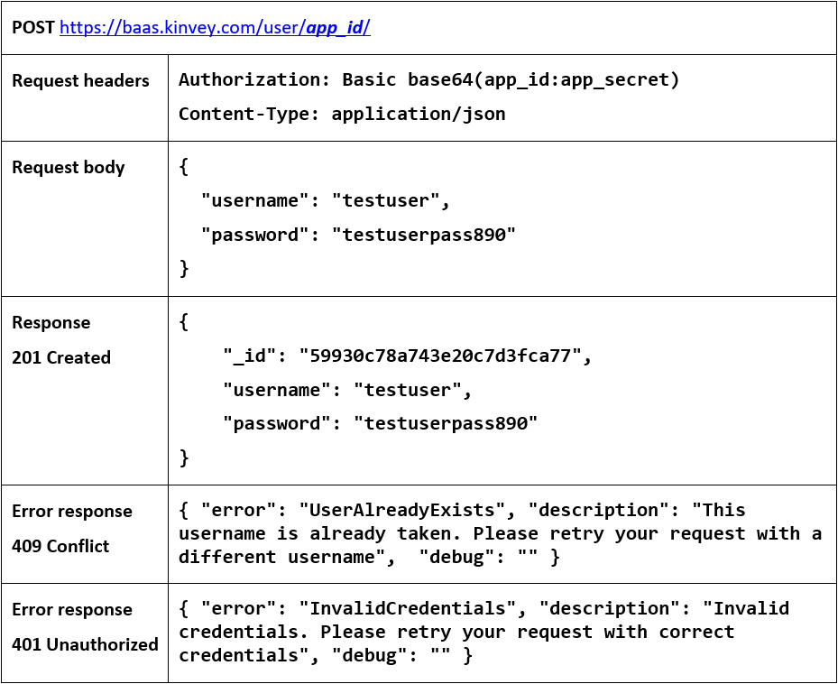
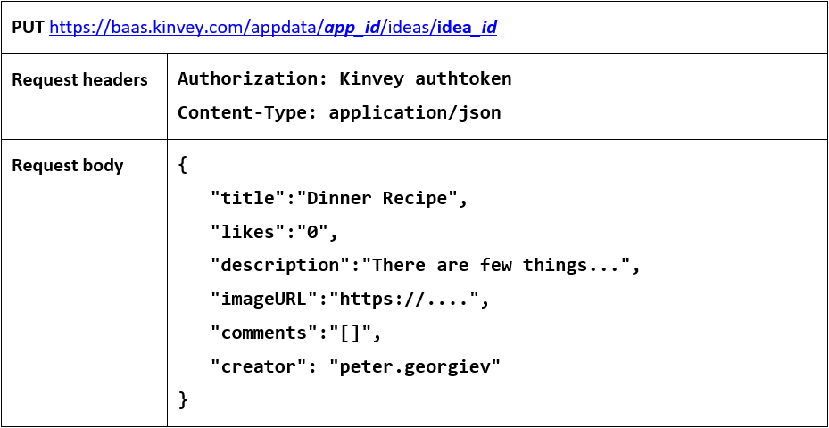
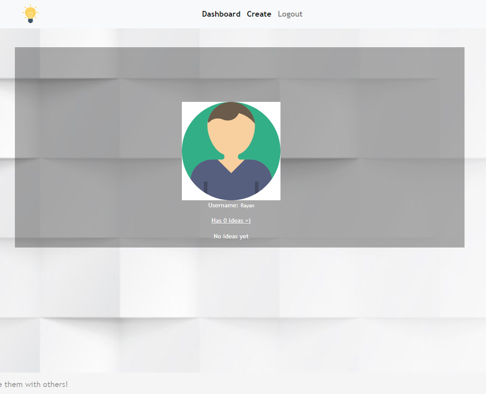

JS Applications Exam - SoftTerest SPA (13.12.2019)
=====================================

You are assigned to implement a **Web application** (SPA) using HTML5,
JavaScript, AJAX, REST and JSON with cloud-based backend (Kinvey). Using
libraries like **jQuery**, **Handlebars** and **Sammy** is allowed but is not
obligatory. The app keeps **users** and **ideas**. **Guests** should be able to
**register** and **login**. Logged-in users should be able to view **all
ideas**, **create ideas**, **like and comment ideas**, see **details** about an
**idea** and **logout**. Logged-in users should also be able to **edit** or
**delete** the ideas **they have created**. There should also be a **section**
where users can **see only the ideas they have created**.

1\. Create a Kinvey REST Service
----------------------------

Register at **Kinvey.com** and create application to keep your data in the
cloud.

Create a collection called **ideas.** Each **idea** has a **name**,
**description**, **organizer, comments** and **likes** (starting from 0).

In order to be able to keep track of the likes and to add comments, you need to
give all users permission **to edit this collection**. So, go to the
**properties** of the collection.

Then go to the **permissions** and **edit** them to look like this:

2\. Test the Kinvey REST Services
-----------------------------

Using **Postman** or other HTTP client tool (you can use Kinvey's built-in **API
Console**), test the REST service end points:

### User Registration (Sign Up)

The request needs "**Basic**" **authentication.** Use the Kinvey **App Key** and
**App Secret** as credentials.

### User Login

Successful login returns an **authtoken** which is later used to authenticate
the CRUD operations.

### User Logout

To logout, you need to provide the **authtoken** given by login/register as
"**Kinvey**" authorization header.

### List All Ideas

### Create Idea

### Edit Idea

### Delete Idea

### Like Idea

### My Ideas

3\. SoftTerest - HTML and CSS
-------------------------

You have been given the web design of the application as **HTML** + **CSS**
files.

-   Initially all views and forms are shown by the HTML. Your application may
    **hide**/**show elements** by CSS (**display: none**) or
    **delete**/**reattach** from and to the DOM all unneeded elements, or just
    display the views it needs to display.

-   You may render the views/forms/components with **jQuery** or **Handlebars**.

**Important**: Don’t change the elements’ **class names** and **ids**. Don’t
rename form fields/link names/ids. You are **allowed** to add **data
attributes** to any elements. You may modify **href attributes** of links and
add **action/method attributes** to **forms**, to allow the use of a routing
library.

SoftTerest - Client-Side Web Application
----------------------------------------

**Design** and **implement** a client-side front-end app (SPA) for managing
**ideas**. Implement the functionality described below.

### (BONUS) Notifications (5 pts)

The application should notify the users about the result of their actions.

-   In case of a **successful** action, a **notification message (green)**
    should be shown, which disappears automatically after 5 seconds or manually
    when the user clicks it.

    

-   In case of **error**, an **error notification message (red)** should be
    shown, which disappears on user click.

    

-   During the **AJAX calls** a **loading notification message (blue)** should
    be shown. It should disappear automatically as soon as the AJAX call is
    completed.

    

-   **NOTE**: You get all the points if **all** the notifications have the
    **exact content** as described in each section above.

### Navigation Bar (5 pts)

Navigation links should correctly change the current page (view).

-   Clicking on the links in the **NavBar** should display the view behind the
    link (views are represented as sections in the HTML code).

-   Your application may **hide**/**show elements** by CSS (**display: none**)
    or **delete**/**reattach** from and to the DOM all unneeded elements, or
    just display the views it needs to display.

-   The Logged-in user navbar should contain the following elements: **Icon**
    (**icon.jpg**) which is a **link** to the **Home page**, [**Create**],
    [**Logout**].

    

    The Icon should be a link that navigates to the **currently logged in user’s
    profile**.

-   The guest users navbar should contain the following elements: : **Icon**
    (**icon.jpg**) which is a **link** to the **Home page,** [**Register**] and
    [**Login**].

    

### Home Page (Guest) (5 pts)

The initial page (view) should display the **guest navigation bar** ("**Home**"
(icon), "**Register**"and "**Login**") + **Guest Home Page** + **Footer**.

### Register User (5 pts)

By given **username** and **password,** the app should register a new user in
the system.

-   (BONUS) The following validations should be made:

    -   The **username** should be **at least 3 characters** long

    -   The **password** should be **at least 3 characters** long

    -   The **repeat password** should be **equal to the password**

-   After a **successful registration**, a notification message **"User
    registration successful."** should be displayed and the app should
    **redirect** to the **home page with the right navbar**.

-   In case of **error** (eg. invalid username/password), an appropriate error
    **message** should be displayed, and the user should be able to **try** to
    register again.

-   Keep the user session data in the browser's **local storage**.

Register once and create/Like awesome ideas!

### Login User (5 pts)

By given **username** and **password,** the app should login an existing user.

-   After a **successful login**, a notification message **"Login successful."**
    should be shown and the user home screen should be displayed.

-   In case of **error**, an appropriate error message should be displayed and
    the user should be able to fill in the login form again.

-   Keep the user session data in the browser's **local storage**.

-   Clear **all** input fields after a **successful** login.

You are one step away from awesome ideas!

### Logout (5 pts)

Successfully logged in users should be able to **logout** from the app.

-   After a **successful** logout, a **notification** message **"Logout
    successful."** should be displayed and the **anonymous screen** should be
    shown

-   The **"logout" REST service** at the back-end **must** be called at logout

-   All local information in the browser (**user session data**) about the
    current user should be deleted

### Dashboard (30 pts)

Successfully logged-in users should be able to see the **Dashboard**. They
should be able to see all created ideas.

If there are **NO** such ideas, the following view should be displayed:

### Create (10 pts)

Logged-in users should be able to **Create** ideas.

Clicking the [**Create**] **link** in the **NavBar** should **display** the
**Create page**.

-   (Bonus) The form should contain the following validations:

    -   The **title** should be **at least 6 characters** long.

    -   The **description** should be **at least 10 characters** long.

    -   The **image** should start with **"http://"** or **"https://"**.

    -   **By default**, every newly created idea must have additional
        information:

        -   **Creator:** string representing the current idea creator;

        -   **Likes:** number starting from 0;

        -   **Comments:** empty array

    -   After a **successful** idea creation, a notification message **"Idea
        created successfully."** should be displayed and the **Dashboard**
        should be shown.

-   The inputs fields in the form **should be cleared.**

-   The newly organizer idea should be stored in the Kinvey collection
    "**ideas**".

### Details Idea (10 pts)

Logged-in users should be able to **view details** about ideas.

Clicking the [**Details**] **link** in of a **particular idea** should
**display** the **Idea Details page**.

-   If the currently logged-in user is the organizer of the idea, [**Delete**]
    **button** should be set to **visible**, otherwise there should be 2 buttons
    [**Like**] and [**Comment**].

-   If there are no comments you should display **"No comments yet"**

### Comment on Idea (10 pts)

Logged-in users should be able to **comment** ideas.

Clicking the [**Comment**] **link** of a **particular idea** on the **Idea
Details page** should **get the comment from the textarea and display it in the
proper section.**

**NOTE**: A user should **NOT** be able to comment an **idea**, created by
**himself**.

-   Every comment shoud be displayed as follows: **{current user} : {comment}**

### Like Idea (10 pts)

Logged-in users should be able to **Like** ideas, created by **other users**.

**NOTE**: A user should **NOT** be able to Like an **idea**, created by
**himself**.

Clicking the [**Like**] **link** of an **idea** (on the **Idea Details page**)
should **increase** the property for the **likes** of the corresponding idea.  
Users can **Like ideas** multiple times**.**

### Delete Idea (5 pts)

Logged-in users should be able to **delete their** ideas.

Clicking the [**Delete**] **link** of an **idea** (on the **Idea Details page**)
should **delete** the **idea**.

-   After **successful idea delete** a notification message **"Idea deleted
    successfully."** should be displayed and the **Dashboard** should be
    **shown**

### (BONUS) Profile Page (5 pts)

Logged-in users should be able to **view their profile**.

Clicking the **Icon link** on the **navigation bar** should **display** the  
**User Profile page**:

-   Each user profile should display user info - **profile picture**,
    **username** and **ideas information**

    -   **"Has {count} ideas**"

    -   The **names** of **all ideas** which the user has **created**.

-   In case of **no ideas**, display "**No ideas yet**".

### (BONUS) Sorting: (5 pts)

The ideas in the **home page** (for **registered** users), should be sorted in
**descending** order by **likes.**
