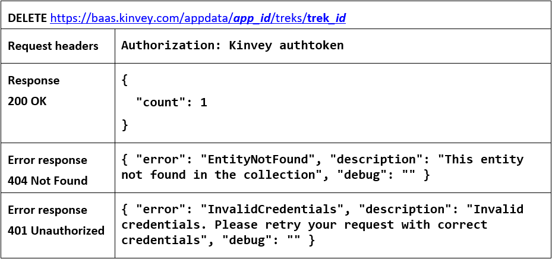

JS Applications Exam - The Trekking Zone SPA (07.12.2019)
============================================

You are assigned to implement a **Web application** (SPA) using HTML5,
JavaScript, AJAX, REST and JSON with cloud-based backend (Kinvey). Using
libraries like **jQuery**, **Handlebars** and **Sammy** is allowed but is **not
obligatory**. The app keeps **users** and **treks**. **Guests** should be able
to **register** and **login**. Logged-in users should be able to view **all
treks**, **create treks**, **like treks**, see **details** about a **trek** and
**logout**. Logged-in users should also be able to **edit** or **delete** the
treks **they have created**. There should also be a **section** where users can
**see only the treks they have created**.

1\. Create a Kinvey REST Service
----------------------------

Register at **Kinvey.com** and create application to keep your data in the
cloud.

Create a collection called **treks.** Each **trek** has a **location**,
**date**, **description**, **organizer** and **likes** (starting from 0).

In order to be able to keep track of the likes of the trek, you need to give all
users permission **to edit this collection**. So, go to the **properties** of
the collection.

Then go to the **permissions** and **edit** them to look like this:

2\. Test the Kinvey REST Services
-----------------------------

Using **Postman** or other HTTP client tool (you can use Kinvey's built-in **API
Console**), test the REST service end points:

### User Registration (Sign Up)

The request needs "**Basic**" **authentication.** Use the Kinvey **App Key** and
**App Secret** as credentials.

### User Login

Successful login returns an **authtoken** which is later used to authenticate
the CRUD operations.

### User Logout

To logout, you need to provide the **authtoken** given by login/register as
"**Kinvey**" authorization header.

### List All Treks

### Create Trek

### Edit Trek

### Delete Trek

### Like Trek

### My Treks

3\. The Trekking Zone - HTML and CSS
--------------------------------

You have been given the web design of the application as **HTML** + **CSS**
files.

-   Initially all views and forms are shown by the HTML. Your application may
    **hide**/**show elements** by CSS (**display: none**) or
    **delete**/**reattach** from and to the DOM all unneeded elements, or just
    display the views it needs to display.

-   You may render the views/forms/components with **jQuery** or **Handlebars**.

**Important**: Don’t change the elements’ **class names** and **ids**. Don’t
rename form fields/link names/ids. You are **allowed** to add **data
attributes** to any elements. You may modify **href attributes** of links and
add **action/method attributes** to **forms**, to allow the use of a routing
library.

4\. The Trekking Zone - Client-Side Web Application
-----------------------------------------------

**Design** and **implement** a client-side front-end app (SPA) for managing
**treks**. Implement the functionality described below.

### Navigation Bar (5 pts)

Navigation links should correctly change the current page (view).

-   Clicking on the links in the **NavBar** should display the view behind the
    link (views are represented as sections in the HTML code).

-   Your application may **hide**/**show elements** by CSS (**display: none**)
    or **delete**/**reattach** from and to the DOM all unneeded elements, or
    just display the views it needs to display.

-   The Logged-in user navbar should contain the following elements: **Icon**
    (**icon.jpg**) which is a **link** to the **Home page**, [**Request Trek**],
    the user caption ("{**username**}"), [**Logout**].

    

    The user caption should be a link that navigates to the **currently logged
    in user’s profile**.

The guest users navbar should contain the following elements: : **Icon**
(**icon.jpg**) which is a **link** to the **Home page** and [**Login**].

### Home Page (Guest) (5 pts)

The initial page (view) should display the **guest navigation bar** ("**Home**"
(icon) and "**Login**") + **Guest Home Page** + **Footer**.

### Register User (5 pts)

By given **username** and **password,** the app should register a new user in
the system.

-   (Bonus) The following validations should be made:

    -   The **username** should be **at least 3 characters** long

    -   The **password** should be **at least 6 characters** long

    -   The **repeat password** should be **equal to the password**

-   (Bonus) After a **successful registration**, a notification message
    **"Successfully registered user."** should be displayed and the app should
    **redirect** to the **home page with the right navbar**.

-   In case of **error** (eg. invalid username/password), an appropriate error
    **message** should be displayed, and the user should be able to **try** to
    register again.

-   Keep the user local data in the browser's **local storage**.

Register once and create/like awesome treks!

### Login User (5 pts)

By given **username** and **password,** the app should login an existing user.

-   (Bonus) After a **successful login**, a notification message **"Successfully
    logged user."** should be shown and the user home screen should be
    displayed.

-   In case of **error**, an appropriate error message should be displayed and
    the user should be able to fill in the login form again.

-   Keep the user local data in the browser's **local storage**.

-   Clear **all** input fields after a **successful** login.

You are one step away from awesome treks!

### Logout (5 pts)

Successfully logged in users should be able to **logout** from the app.

-   (Bonus) After a **successful** logout, a **notification** message **"Logout
    successful."** should be displayed and the **anonymous screen** should be
    shown

-   The **"logout" REST service** at the back-end **must** be called at logout

-   All local information in the browser (**user local data**) about the current
    user should be deleted

### Home Page (30 pts)

Successfully logged-in users should be welcomed by the **Home page**. They
should be able to see all created (organized) treks.

If there are **NO** such treks, the following view should be displayed:

[**Create the first trek?**] **button** should refer to the **request trek
form**

### Request Trek (10 pts)

Logged-in users should be able to **Create (organize)** treks.

Clicking the [**Request Trek**] **link** in the **NavBar** should **display**
the **Request Trek page**.

-   (Bonus) The form should contain the following validations:

    -   The **trek name** should be **at least 6 characters** long.

    -   The **description** should be **at least 10 characters** long.

    -   After a **successful** trek creation, a notification message **"Trek
        created successfully."** should be displayed and the **Home page**
        should be shown.

-   **By default**, every newly created trek must have additional information:

    -   **Organizer:** string representing the current trek creator;

    -   **Likes:** number starting from 0;

-   The inputs fields in the form **should be cleared.**

-   The newly organizer trek should be stored in the Kinvey collection
    "**treks**".

### Details Trek (10 pts)

Logged-in users should be able to **view details** about treks.

Clicking the [**More**] **link** in of a **particular trek** should **display**
the **Trek Details page**.

-   If the currently logged-in user is the organizer of the trek, the [**Edit**]
    and [**Close**] **buttons** should be set to **visible**, otherwise there
    should be only 1 button [**Like**].

### Edit Trek (10 pts)

Logged-in users should be able to **edit** their **own** treks.

Clicking the [**Edit the trek**] **link** of a **particular trek** on the **Trek
Details page** should **display** the **Edit Trek page**:

-   (Bonus) After a **successful edit**, a notification message "**Trek edited
    successfully.**" should be **displayed**, and the user should be redirected
    to the **Home page**.

### Like Trek (10 pts)

Logged-in users should be able to **Like** treks, organized by **other users**.

**NOTE**: A user should **NOT** be able to like a **trek**, organized by
**himself**.

Clicking the [**Like the trek**] **link** of an **trek** (on the **Trek Details
page**) should **increase** the property for the **likes** the corresponding
trek.  
Users can **like treks** multiple times**.**

-   (Bonus) After **successfully liking** a **trek**, a notification message
    **"You liked the trek successfully."** should be displayed.

### Delete Trek (5 pts)

Logged-in users should be able to **delete their** treks.

Clicking the [**Close the trek**] **link** of an **trek** (on the **Trek Details
page**) should **delete** the **trek**.

-   (Bonus) After **successful trek delete** a notification message **"You
    closed the trek successfully."** should be displayed

After **successful trek delete** you should show the **Home page**

### (BONUS) Notifications (5 pts)

The application should notify the users about the result of their actions.

-   In case of a **successful** action, a **notification message (green)**
    should be shown, which disappears automatically after 5 seconds or manually
    when the user clicks it.

    

-   In case of **error**, an **error notification message (red)** should be
    shown, which disappears on user click.

    

-   During the **AJAX calls** a **loading notification message (blue)** should
    be shown. It should disappear automatically as soon as the AJAX call is
    completed.

    

-   **NOTE**: You get all the points if **all** the notifications have the
    **exact content** as described in each section above.

### (BONUS) User Profile (5 pts)

Logged-in users should be able to **view their profile**.

Clicking the **user caption** ({**USERNAME**}) **link** on the **navigation
bar** should **display** the  
**User Profile page**:

-   Each user profile should display user info - **profile picture**,
    **username** and **organization information**

    -   **"Wished {count} treks =)**"

    -   The **names** of **all treks** which the user has **organized**.

-   In case of **no treks**, display "**No treks**".

### (BONUS) Sorting: (5 pts)

The treks in the **home page** (for **registered** users), should be sorted in
**descending** order by **likes.**

### (BONUS) Validations: (5 pts)