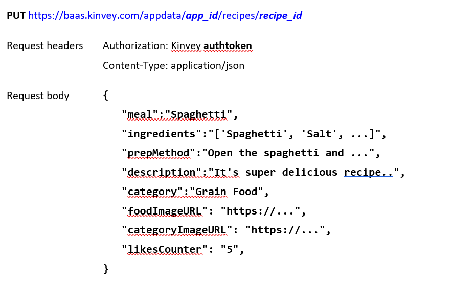
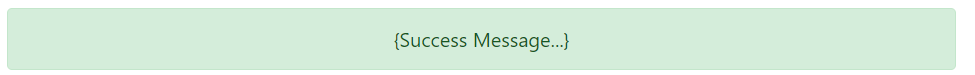

JS Apps Exam - CookUni Single Page Application
==============================================

Using libraries like **jQuery**, **Handlebars** and **Sammy** is allowed but not
obligatory. You are assigned to implement a **Web application** (SPA) using
HTML5, JavaScript, AJAX, and JSON with cloud-based backend (**Kinvey**). The
application should store **users** and **recipes**. **Users** should be able to
**register**, **login**, **logout** and **view all recipes**. They should also
be able to **create**, **view**, **like** and **archive recipes,** depending on
their **authentication**.

1\. Create a Kinvey REST Services
-----------------------------

Register at **Kinvey.com** and create an application to keep your data in the
cloud.

Create a collection called **recipes.** Each **recipe** has a **meal**,
**ingredients**, **prepMethod**, **description, foodImageURL, category,
categoryImageURL** and **likesCounter** (starting from 0).

In order to be able to keep track of the likes of each recipe, you need to give
all users permission **to edit this collection**. So, go to the **properties**
of the collection.

Then go to the **permissions** section and **edit** them to look like this:

2\. Test the Kinvey REST Services
-----------------------------

Using **Postman** or other HTTP client tool (you can use Kinvey's built-in **API
Console**), test the REST service end points:

### User Registration (Sign Up)

Every user should have **username**, **password**, **firstName** and **lastName**

*The request needs "Basic" authentication. Use the Kinvey App Key and App Secret
as credentials.*

### User Login (Sign In)

*Successful login returns an "authtoken" which is later used to authenticate the
CRUD operations.*

### User Logout

### List All Recipes

### Create Recipe

### Delete Recipe

### Edit Recipe

### Like Recipe

3\. CookUni - HTML and CSS
----------------------

You are given the Web design of the application as **HTML** + **CSS** files.

-   Initially all views and forms are shown in the HTML. You can **hide** them
    by using CSS (**display:none**), **delete** from the DOM all unnecessary
    elements or just display the views that need to be displayed.

-   You may render the views / forms / components with **jQuery** or
    **Handlebars**.

**Important:** Don't change the elements' **class name** and **id**. Don't
rename form fields / link names / ids. You can add **data attributes** to any
elements, modify **href attributes** of links and add **action/method
attributes** to forms (to allow the usage of a routing library).

4\. CookUni - Client-Side Web Application
-------------------------------------

**Design** and **implement** a client-side front-end app (SPA) for managing
**recipes**. Implement the functionality described below.

### Notifications - 5 Points

The application should notify the users about the result of their actions.

-   In case of a **successful** action, a **notification message (green)**
    should be shown. It should disappear automatically after 5 seconds or
    manually when the user clicks it.

    

-   In case of **error**, an **error notification message (red)** should be
    shown. It should disappear on user click.

    

-   During the **AJAX calls** a **loading notification message (blue)** should
    be shown. It should disappear automatically **as soon as** the AJAX call is
    completed.

    

-   **NOTE**: You get all the points if **all** the notifications have the
    **exact content** as described in each section above.

### Navigation Bar (Header) - 5 Points

Implement a **header** for the app: navigation links should correctly change the
current screen (view).

-   Clicking on the links in the **header** should display the corresponding
    views for the links (views are sections in the HTML code).

-   You can **hide** them with CSS (**display:none**), **delete** from the DOM
    all unnecessary elements or just display the views that need to be
    displayed.

-   The given "**CookUni**", "**Home**", "**Login**" and "**Register**" should
    be visible only for **anonymous** users.

-   **Logged in users** should see "**CookUni", "Home", "Welcome, {firstName
    lastName}!**", "**Share recipe**", and "**Logout**"

### Footer 

*The footer for all pages is the same and every view should have it!*

### Home Page (Anonymous) - 5 Points

The initial screen should display the **Anonymous header** ("**Home**",
"**Login**" and "**Register**") + **Anonymous Home page** + **Footer**

### Register Page (Sign Up) - 5 Points

By given **First name**, **Last name**, **Username** and **Password,** the app
should register a new user in the system.

-   The following validations should be made:

    -   The **first** and **last name** should be **at least 2 characters** long

    -   The **username** should be **at least 3 characters** long

    -   The **password** should be **at least 6 characters** long

    -   The **repeat password** should be **equal to the password**

-   After a **successful registration**, a notification message **"User
    registration successful."** should be displayed and the app should
    **redirect** to the **home page** with the **right navbar**.

-   In case of **error** (eg. invalid username/password), an appropriate error
    **message** should be  
    displayed, and the user should be able to **try** to register again.

-   Keep the **user session** data in the browser's **session storage**.

#### Successful register notification

#### Error register notification

### Login Page (Sign In) - 5 Points

By given **username** and **password,** the app should login an existing user.

-   After a **successful login**, a notification message **"Login successful."**
    should be shown and the **user home screen** should be displayed.

-   In case of **error**, an appropriate error message should be displayed, and
    the user should be able to fill in the login form again.

-   Keep the user session data in the browser's **session storage**.

-   Clear **all** input fields after a **successful** login.

#### Successful login notification

#### Error login notification

### Logout - 5 Points

Successfully logged in users should be able to **logout** from the app.

-   After a **successful** logout, a **notification** message **"Logout
    successful."** should be displayed and the **anonymous screen** should be
    shown

-   The **"logout" REST service** at the back-end **must** be called at logout.

-   All local information in the browser (**user session data**) about the
    current user should be deleted.

### Home Page - 35 Points

#### (Logged in with no recipes)

Successfully logged in users should be welcomed by the **home screen**. The
right header should be visible ("**Home"**, "**Welcome, {firstName lastName}!",
"Share Recipe", "Logout"**). They should also be able to see all created/shared
recipes. If there are **no** such recipes, the following view should be
displayed.

#### Home Page (Logged in with recipes)

Successfully logged in users should be welcomed by the **home screen**. The
right header should be visible ("**Home"**, "**Welcome, {firstName lastName}!",
"Share Recipe", "Logout"**). Also, they should be able to see all created/shared
recipes If there is **at least one**, the following view should be displayed:

**Each recipe** should have **3 elements**, "**Food Category Image**",
"**Meal**" and "**Food Category**"

#### Home Page (recipe hover)

**On hover**, the "**Ingredients**", "**Food Image**" and "**View the recipe**"
**link** should be displayed.

### Share Recipe (Create recipe) - 10 Points

Logged in users can **create/share** recipes. Clicking the **[Share recipe] link
in the navbar** should open a form.

-   The following validations should be made:

    -   The **meal** ("**string**") should be **at least 4 characters** long.

    -   The **ingredients** ("**array**") should **at least 2** (2 elements/2
        ingredients)

    -   The **preparation method** and **description** ("**strings**") should be
        **at least 10**  
        **characters** long each.

    -   The **foodImageURL** ("**string**") should start with **"http://"** or
        **"https://"**.

    -   And **one** of the following **categories** should be selected:

        -   **Vegetables and legumes/beans**

        -   **Fruits**

        -   **Grain Food**

        -   **Milk, cheese, eggs and alternatives**

        -   **Lean meats and poultry, fish and alternatives**

    -   **By default**, every newly created recipe should have additional
        information:

        -   **likesCounter:** number starting from 0;

        -   **categoryImageURL:** string representing the current food category
            URL.

    -   After a **successful** shared recipe, a notification message **"Recipe
        shared**  
        **successfully!"** should be displayed and the **home view** should be
        shown.

-   The input fields in the form **should be cleared.**

-   The newly shared recipe should be stored in the Kinvey collection
    "**recipes**".

### View Recipe (Recipe Details) - 5 Points

Users **should** be able to **view details for every recipe**. Clicking the
[**View the recipe**] button on the hovered recipe should **display another
view, depending on the authorization.** If the currently logged in user is **the
same** as the user who shared that recipe, the **[Archive] [Edit] buttons should
be visible,** otherwise the [**Like**] **button** should be shown.

### Edit Recipe - 10 Points

Logged-in users should be able to **edit their recipes**.

Clicking the [**Edit**] **button** on a **particular recipe** should display the
**Edit Recipe page** with the already filled in information (the old one). After
a **successfully edited recipe**, an appropriate notification should be
**displayed** and the user should be **redirected** to the **home page**.

### Archive (Delete) Recipe - 5 Points

Users can **archive** their **own** shared recipes, by clicking the
[**Archive**] button. After a successfully archived recipe:

-   The current recipe should be **deleted** from the page and the Kinvey's
    **recipes** collection

-   A notification with the following message should be shown: "**Your recipe
    was archived.**" and the user should be redirected to the **home page**.

### Like Recipe - 5 Points

Users can **like others shared recipes**, by clicking the [**Like**] button.
After a successfully liked recipe:

-   The current recipe's **likesCounter** should be **increased by 1**

-   A notification with the following message should be shown: "**You liked that
    recipe.**" and the user should be redirected to the **home page**.
