JS Applications Exam - UniEnt SPA
=================================

You are assigned to implement a **Web application** (SPA) using HTML5,
JavaScript, AJAX, REST and JSON with cloud-based backend (Kinvey). Using
libraries like **jQuery**, **Handlebars** and **Sammy** is allowed but is not
obligatory. The app keeps **users** and **events**. **Guests** should be able to
**register** and **login**. Logged-in users should be able to view **all
events**, **create events**, **join events**, see **details** about a **event**
and **logout**. Logged-in users should also be able to **edit** or **delete**
the events **they have created**. There should also be a **section** where users
can **see only the events they have created**.

1\. Create a Kinvey REST Service
----------------------------

Register at **Kinvey.com** and create application to keep your data in the
cloud.

Create a collection called **events.** Each **event** has a **name**, **date**,
**description**, **organizer** and **people interested in** (starting from 0).

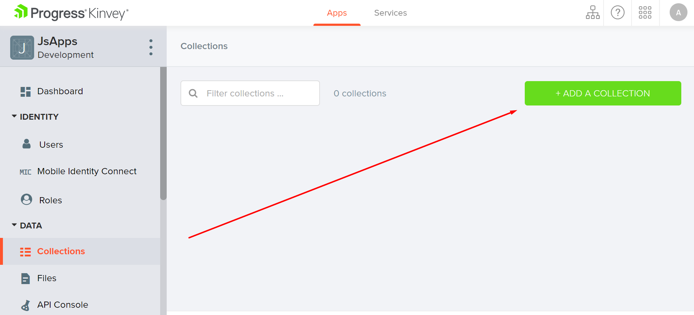

In order to be able to keep track of the people interested in an event, you need
to give all users permission **to edit this collection**. So, go to the
**properties** of the collection.

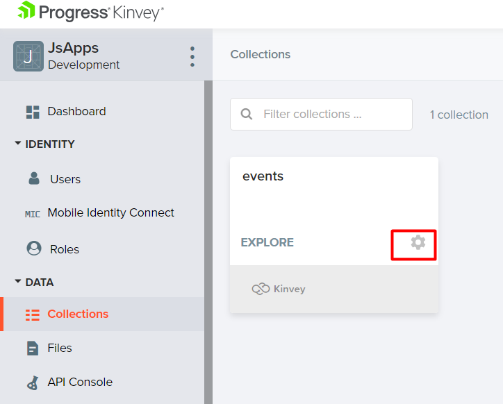

Then go to the **permissions** and **edit** them to look like this:

Test the Kinvey REST Services
-----------------------------

Using **Postman** or other HTTP client tool (you can use Kinvey's built-in **API
Console**), test the REST service end points:

### User Registration (Sign Up)

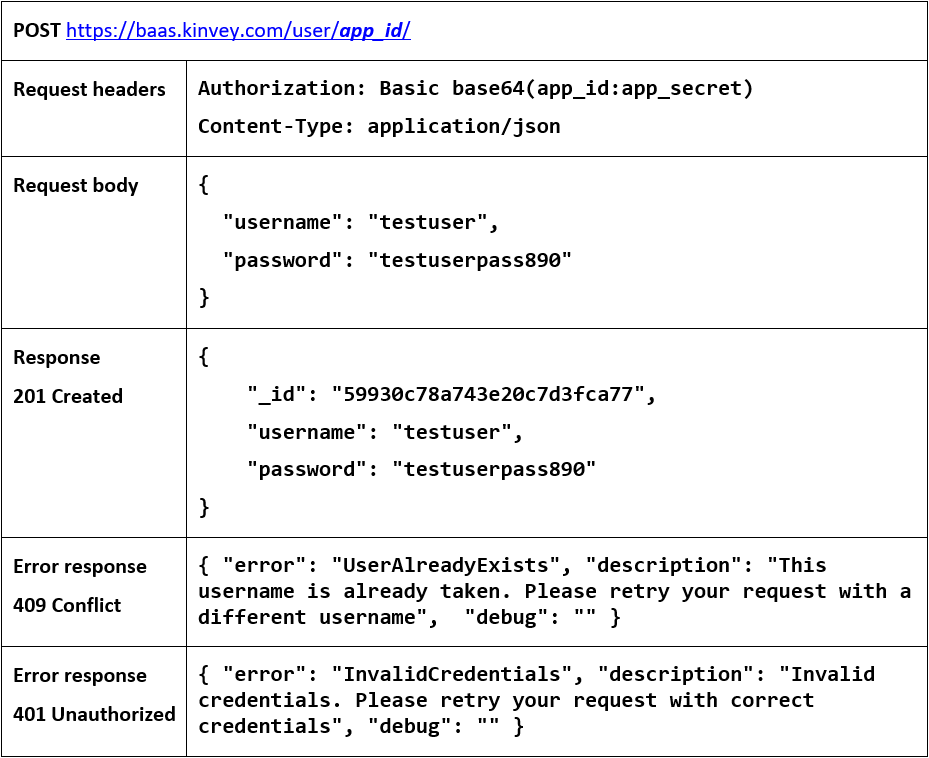

The request needs "**Basic**" **authentication.** Use the Kinvey **App Key** and
**App Secret** as credentials.

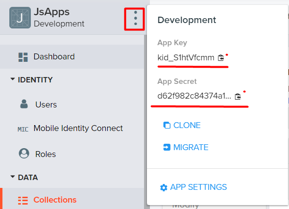

### User Login

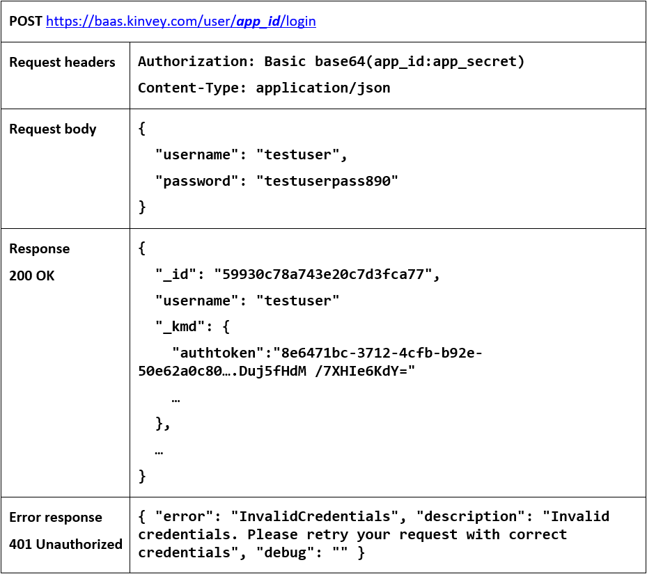

Successful login returns an **authtoken** which is later used to authenticate
the CRUD operations.

### User Logout

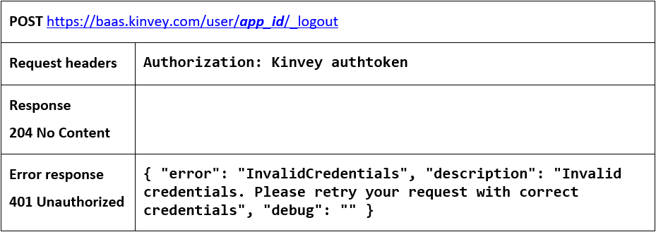

To logout, you need to provide the **authtoken** given by login/register as
"**Kinvey**" authorization header.

### List All Events

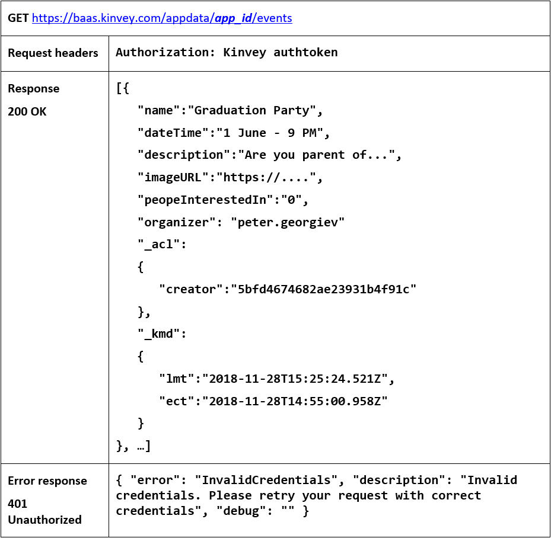

### Create Event

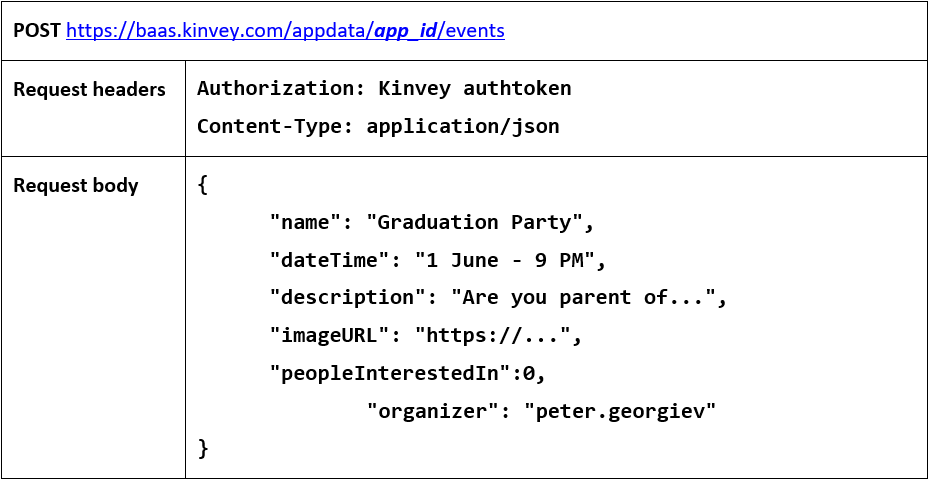
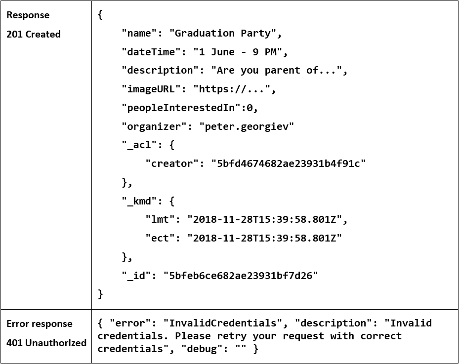

### Edit Event

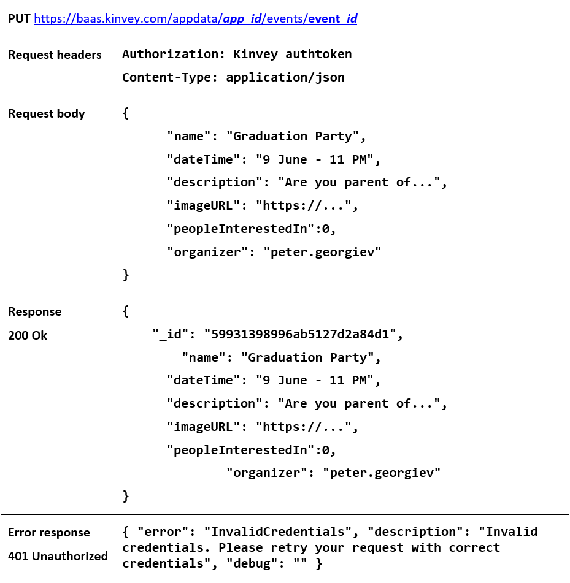

### Delete Event

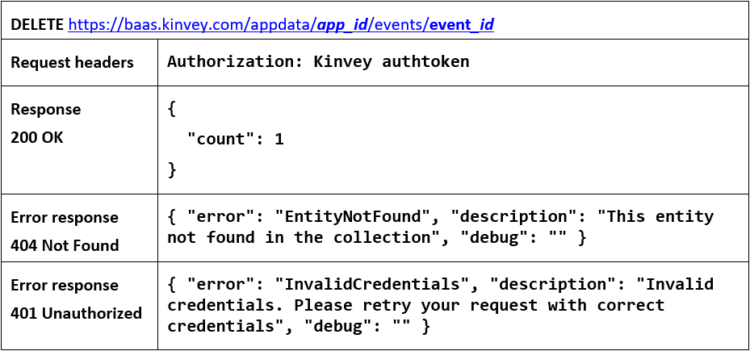

### Join Event

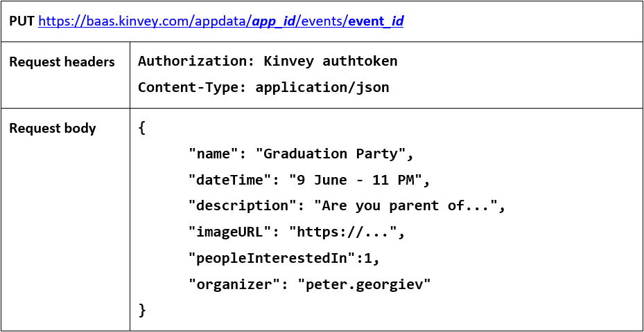
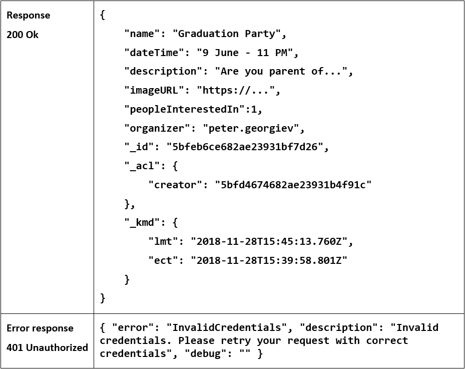

### My Events

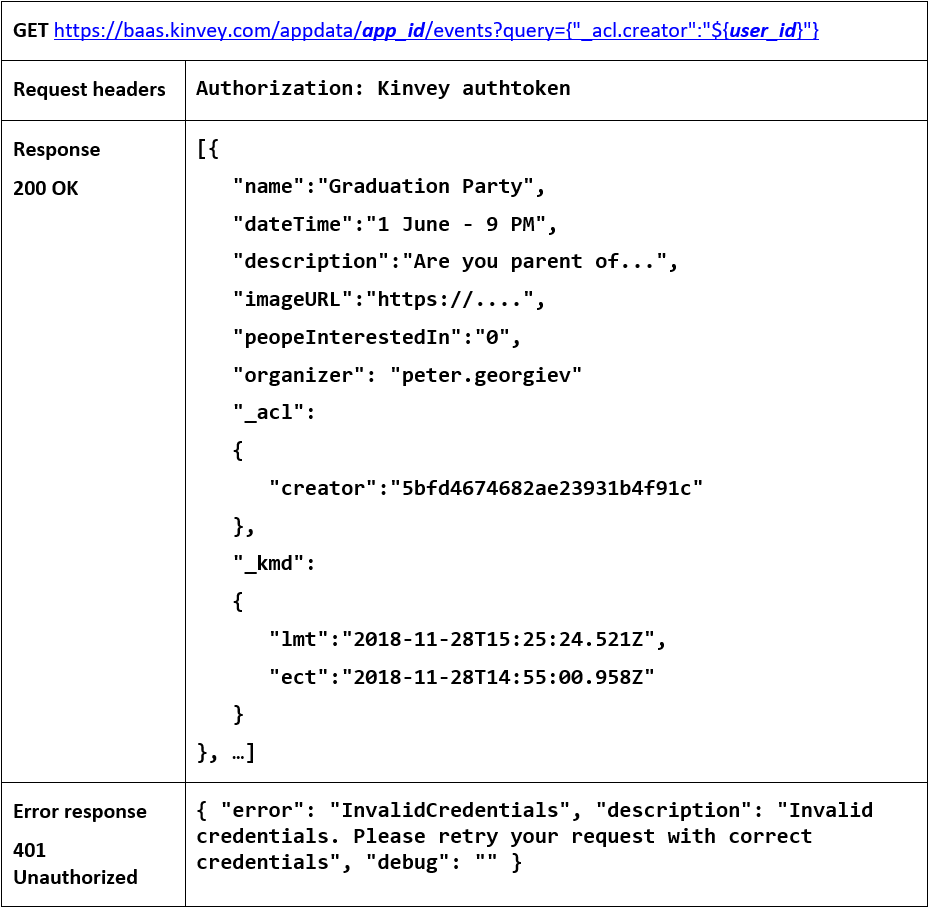

3\. UniEnt - HTML and CSS
---------------------

You have been given the web design of the application as **HTML** + **CSS**
files.

-   Initially all views and forms are shown by the HTML. Your application may
    **hide**/**show elements** by CSS (**display: none**) or
    **delete**/**reattach** from and to the DOM all unneeded elements, or just
    display the views it needs to display.

-   You may render the views/forms/components with **jQuery** or **Handlebars**.

**Important**: Don’t change the elements’ **class names** and **ids**. Don’t
rename form fields/link names/ids. You are **allowed** to add **data
attributes** to any elements. You may modify **href attributes** of links and
add **action/method attributes** to **forms**, to allow the use of a routing
library.

4\. UniEnt - Client-Side Web Application
------------------------------------

**Design** and **implement** a client-side front-end app (SPA) for managing
**events**. Implement the functionality described below.

### Notifications (5 pts)

The application should notify the users about the result of their actions.

-   In case of a **successful** action, a **notification message (green)**
    should be shown, which disappears automatically after 5 seconds or manually
    when the user clicks it.

    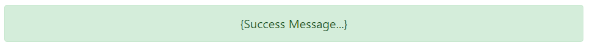

-   In case of **error**, an **error notification message (red)** should be
    shown, which disappears on user click.

    

-   During the **AJAX calls** a **loading notification message (blue)** should
    be shown. It should disappear automatically as soon as the AJAX call is
    completed.

    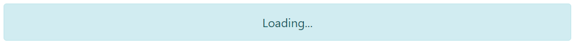

-   **NOTE**: You get all the points if **all** the notifications have the
    **exact content** as described in each section above.

### Navigation Bar (5 pts)

Navigation links should correctly change the current page (view).

-   Clicking on the links in the **NavBar** should display the view behind the
    link (views are represented as sections in the HTML code).

-   Your application may **hide**/**show elements** by CSS (**display: none**)
    or **delete**/**reattach** from and to the DOM all unneeded elements, or
    just display the views it needs to display.

-   The Logged-in user navbar should contain the following elements: **Icon**
    (**icon.jpg**) which is a **link** to the **Home page**, [**Organize
    Event**], the user caption ("{**username**}"), [**Logout**].

    -   The user caption should be a link that navigates to the **currently
        logged in user’s profile**.

        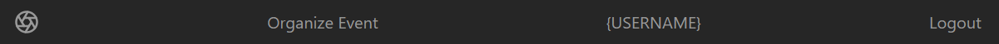

-   The guest users navbar should contain the following elements: : **Icon**
    (**icon.jpg**) which is a **link** to the **Home page** and [**Login**].

    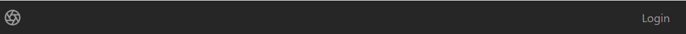

### Home Page (Guest) (5 pts)

The initial page (view) should display the **guest navigation bar** ("**Home**"
(icon) and "**Login**") + **Guest Home Page** + **Footer**.

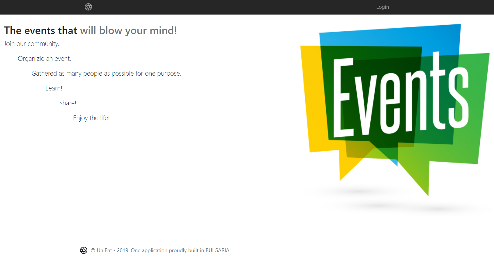

### Register User (5 pts)

By given **username** and **password,** the app should register a new user in
the system.

-   The following validations should be made:

    -   The **username** should be **at least 3 characters** long

    -   The **password** should be **at least 6 characters** long

    -   The **repeat password** should be **equal to the password**

-   After a **successful registration**, a notification message **"User
    registration successful."** should be displayed and the app should
    **redirect** to the **home page with the right navbar**.

-   In case of **error** (eg. invalid username/password), an appropriate error
    **message** should be displayed, and the user should be able to **try** to
    register again.

-   Keep the user session data in the browser's **session storage**.

Register once and create/join awesome events!

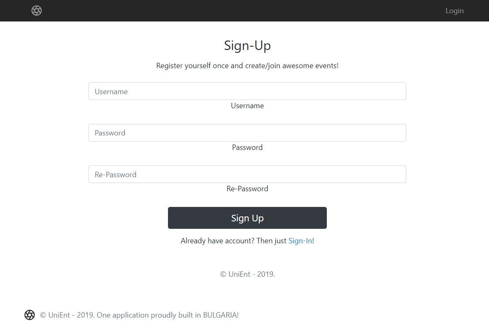

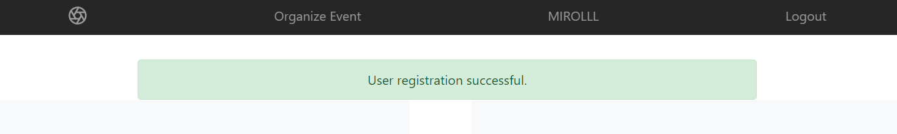

### Login User (5 pts)

By given **username** and **password,** the app should login an existing user.

-   After a **successful login**, a notification message **"Login successful."**
    should be shown and the user home screen should be displayed.

-   In case of **error**, an appropriate error message should be displayed and
    the user should be able to fill in the login form again.

-   Keep the user session data in the browser's **session storage**.

-   Clear **all** input fields after a **successful** login.

You are one step away from awesome events!

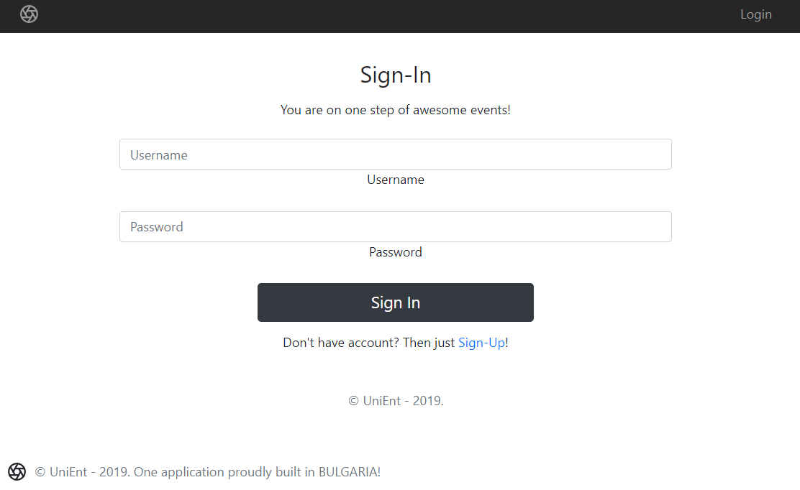

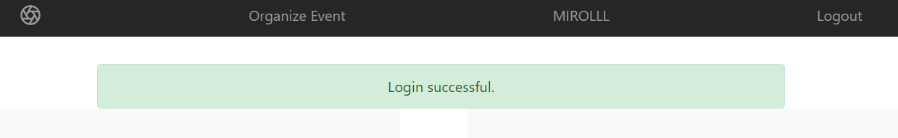

### Logout (5 pts)

Successfully logged in users should be able to **logout** from the app.

-   After a **successful** logout, a **notification** message **"Logout
    successful."** should be displayed and the **anonymous screen** should be
    shown

-   The **"logout" REST service** at the back-end **must** be called at logout

-   All local information in the browser (**user session data**) about the
    current user should be deleted

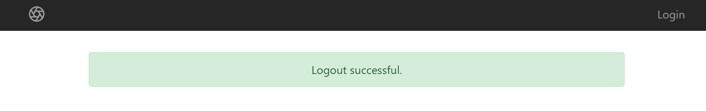

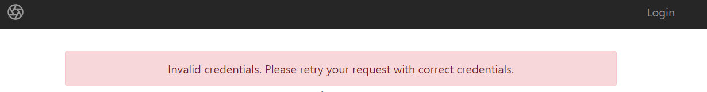

### Home Page (30 pts)

Successfully logged-in users should be welcomed by the **Home page**. They
should be able to see all created (organized) events.

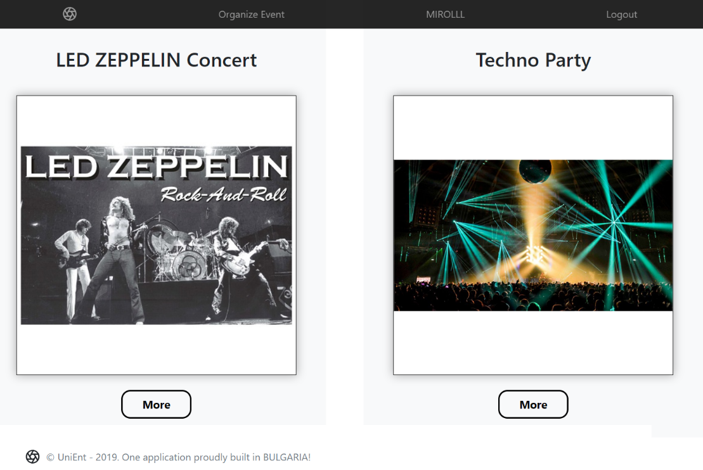

If there are **NO** such events, the following view should be displayed:

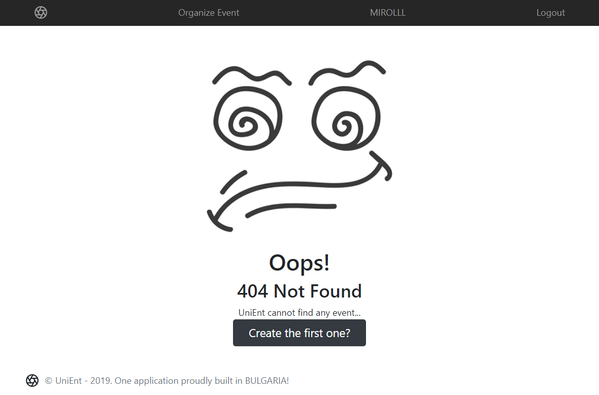

[**Create the first one?**] **button** should refer to the **organize event
form**

### Organize Event (10 pts)

Logged-in users should be able to **Create (organize)** events.

Clicking the [**Organize Event**] **link** in the **NavBar** should **display**
the **Organize Event page**.

-   The form should contain the following validations:

    -   The **event name** should be **at least 6 characters** long.

    -   The **date** should be in **string** format (24 February; 24 March - 10
        PM;).

    -   The **description** should be **at least 10 characters** long.

    -   The **image** should start with **"http://"** or **"https://"**.

    -   **By default**, every newly created event must have additional
        information:

        -   **Organizer:** string representing the current event creator;

        -   **People interested in:** number starting from 0;

    -   After a **successful** event creation, a notification message **"Event
        created successfully."** should be displayed and the **Home page**
        should be shown.

-   The inputs fields in the form **should be cleared.**

-   The newly organizer event should be stored in the Kinvey collection
    "**events**".

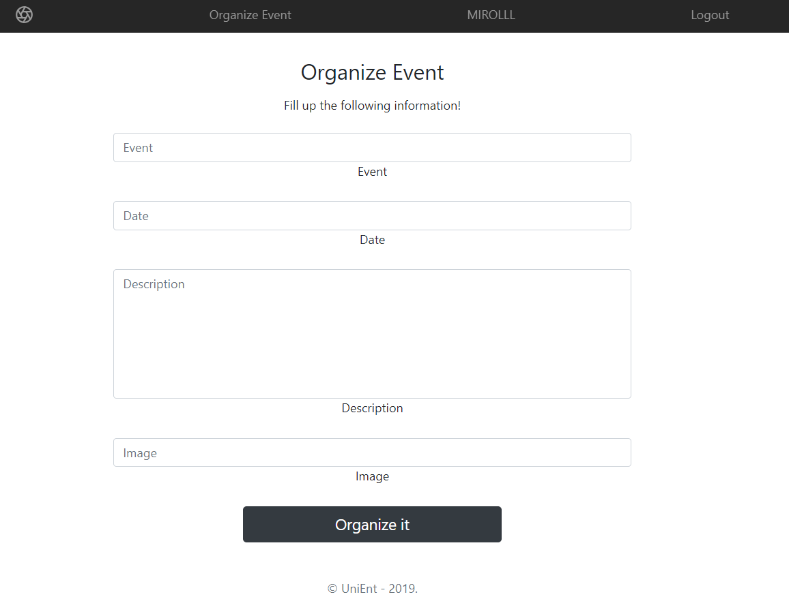

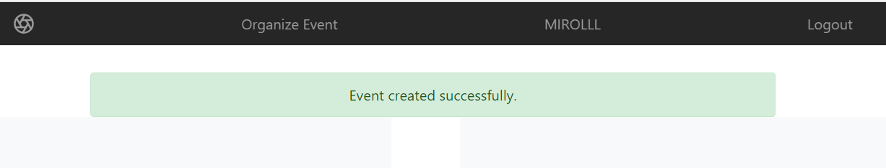

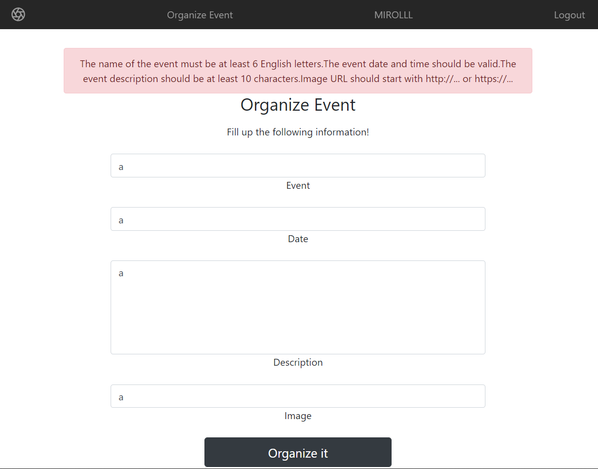

### Details Event (5 pts)

Logged-in users should be able to **view details** about events.

Clicking the [**More**] **link** in of a **particular event** should **display**
the **Event Details page**.

-   If the currently logged-in user is the organizer of the event, the
    [**Edit**] and [**Close**] **buttons** should be set to **visible**,
    otherwise there should be only 1 button [**Join**].

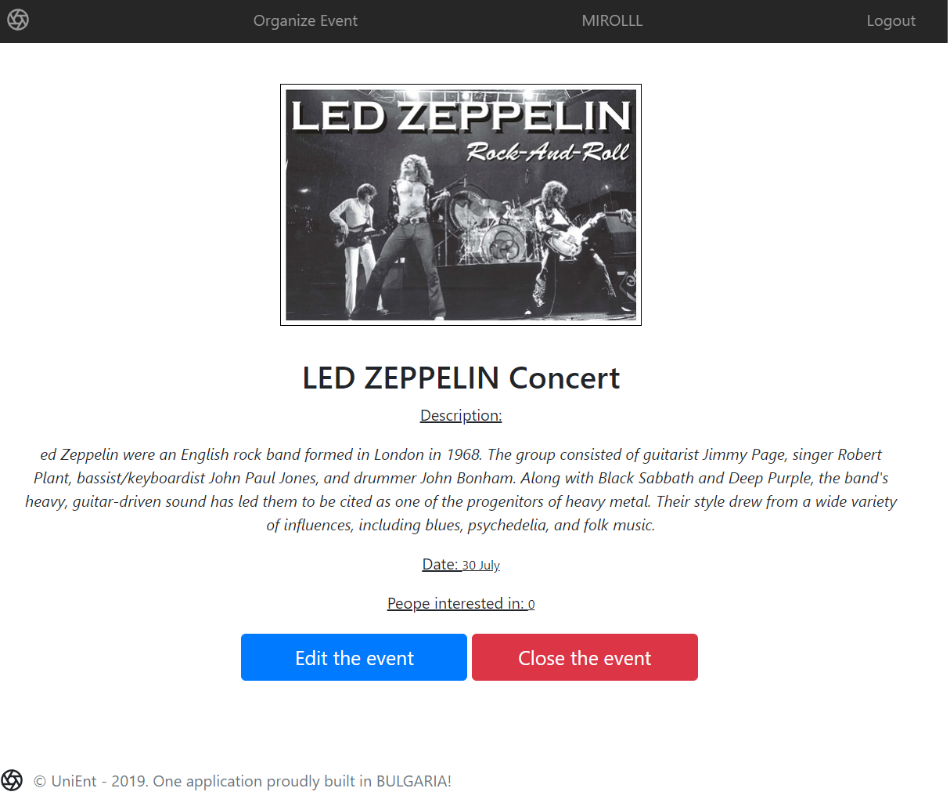

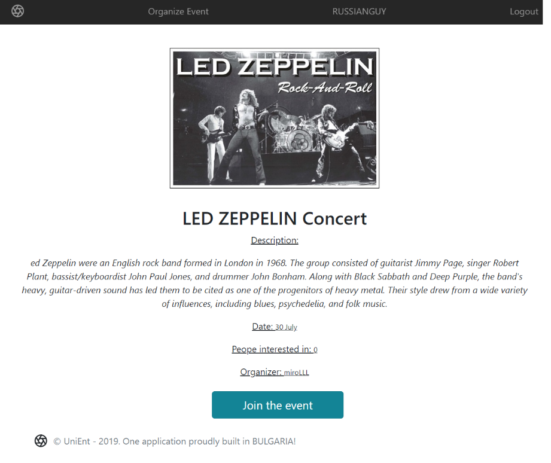

### Edit Event (5 pts)

Logged-in users should be able to **edit** their **own** events.

Clicking the [**Edit the event**] **link** of a **particular event** on the
**Event Details page** should **display** the **Edit Event page**:

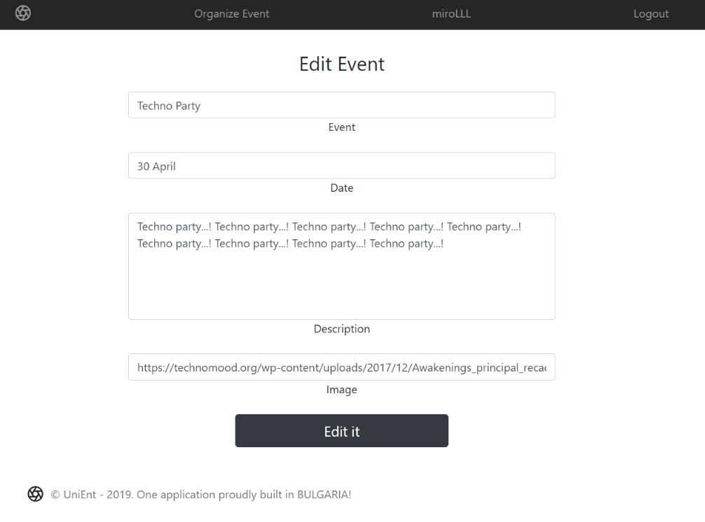

-   After a **successful edit**, a notification message "**Event edited
    successfully.**" should be **displayed**, and the user should be redirected
    to the **Home page**.

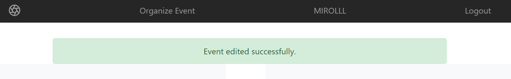

### Join Event (5 pts)

Logged-in users should be able to **Join** events, organized by **other users**.

**NOTE**: A user should **NOT** be able to join an **event**, organized by
**himself**.

Clicking the [**Join the event**] **link** of an **event** (on the **Event
Details page**) should **increase** the property for the **people interested
in** the corresponding event.  
Users can **join events** multiple times**.**

-   After **successfully joining** an **event**, a notification message **"You
    join the event successfully."** should be displayed.

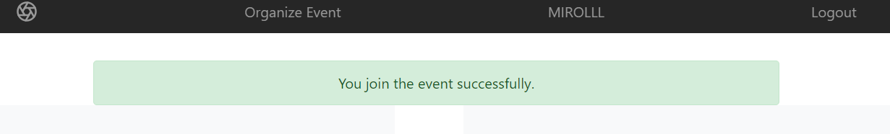

### Delete Event (5 pts)

Logged-in users should be able to **delete their** events.

Clicking the [**Close the event**] **link** of an **event** (on the **Event
Details page**) should **delete** the **event**.

-   After **successful event delete** a notification message **"Event closed
    successfully."** should be displayed and the **Home page** should be
    **shown**

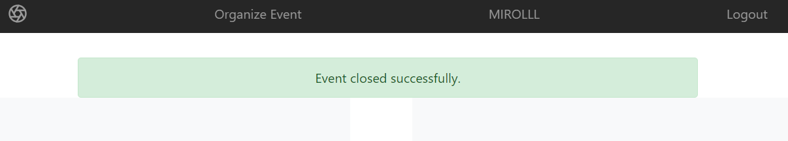

### User Profile (10 pts)

Logged-in users should be able to **view their profile**.

Clicking the **user caption** ({**USERNAME**}) **link** on the **navigation
bar** should **display** the  
**User Profile page**:

-   Each user profile should display user info - **profile picture**,
    **username** and **organization information**

    -   **"Organizer of {count} events**"

    -   The **names** of **all events** which the user has **organized**.

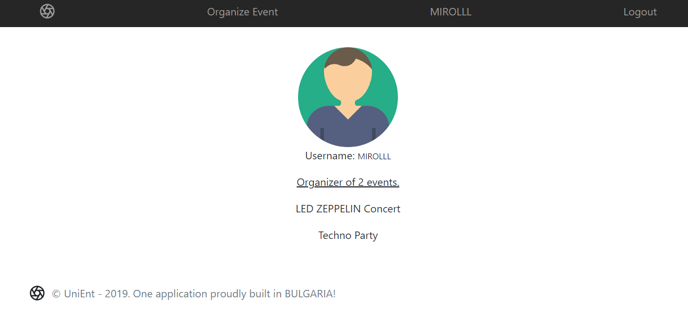

-   In case of **no events**, display "**No events**".

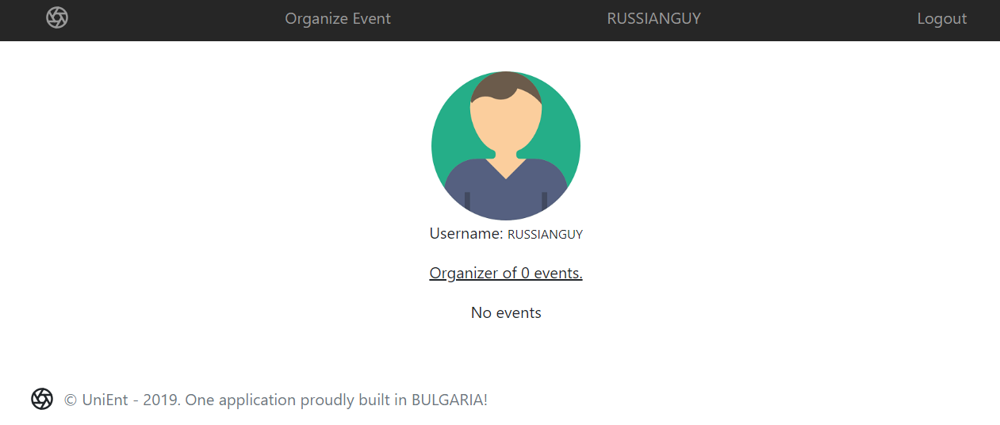

### (BONUS) Sorting: (5 pts)

The events in the **home page** (for **registered** users), should be sorted in
**descending** order by **people interested in.**
