**Workshop: Cubicle - Part 1**
========================

"*Cubicle*" is a place, where you can browse some of the most popular rubik
cubes in the world and add some new cubes that you have discovered.

**Folder Structure View**
---------------------

You're provided with a project structure skeleton like this:

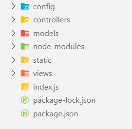

This structure includes the following configurations:

### Config Folder View

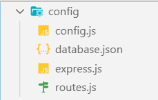

**Config.js**

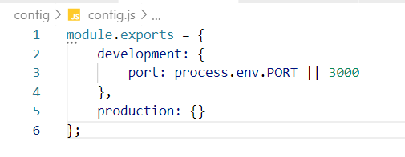

**Database.json**

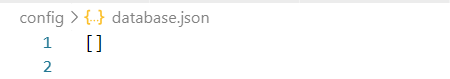

**Express.js**

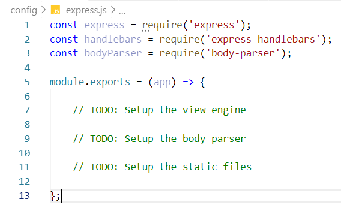

**Routes.js**

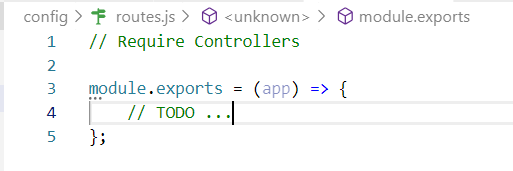

**Index.js**

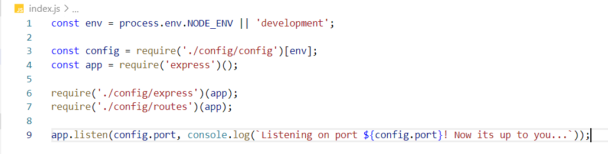

**Install Dependencies**
---------------

Run **'npm install'** to install all the dependencies.

1\. Create Model
------

1\.1 Cube Model
------

Each cube should have the following properties (for now it could be an ES6
class):

-   **Id** - number

-   **Name** – string

-   **Description** – string

-   **Image URL** – string

-   **Difficulty Level**– number

2\. Storage
-------

Store the cubes inside a **/config/database.json**

3\. Create Routes
-------------

You should implement the following routes:

-   **/** - the main page (should visualize all the cubes in the database and a
    search field)

-   **/about** – should render the about page

-   **/create** – should render the create cube form

-   **/details/:id** – should render the details page about selected cube

-   **Any other** - should render the 404 not found page

### Main Page

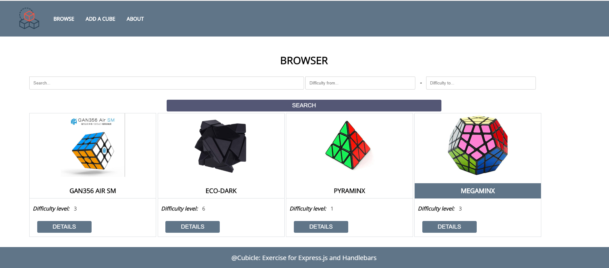

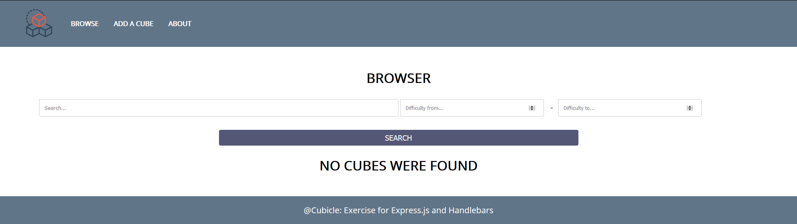

### About Page

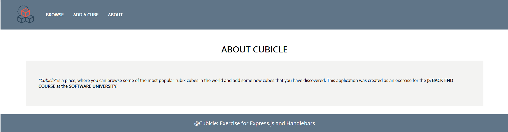

### Create Page

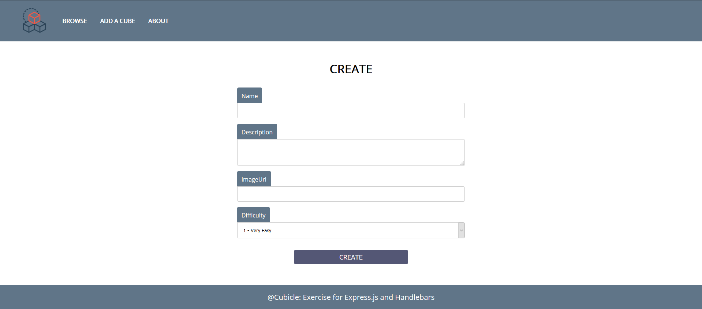

### Details Page

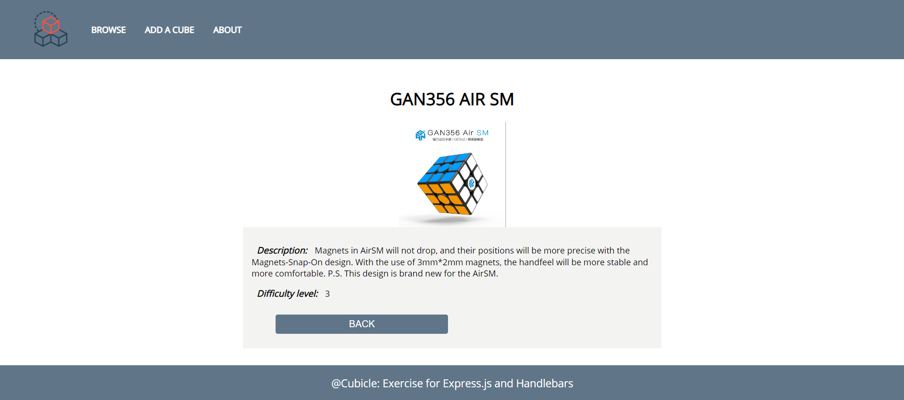

### Not Found Page

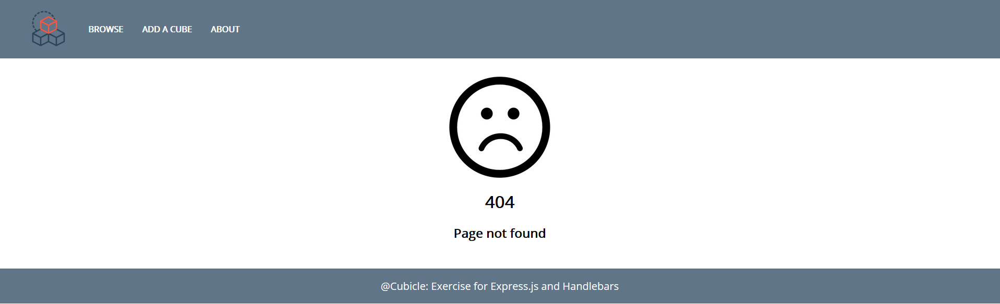

4\. Create Templates
----------------

Use the provided HTML to create templates using Handlebars. Identify the dynamic
parts and use appropriate syntax for interpolating and rendering the application
context.

5\. \*Search
--------

Implement searching logic. Use the following validation:

-   If the user searches **only** a string and **NO difficulty**, render **all
    difficulties**

If the search does *NOT* meet the requirements, just **redirect** to the home
page **('/')**
