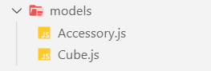
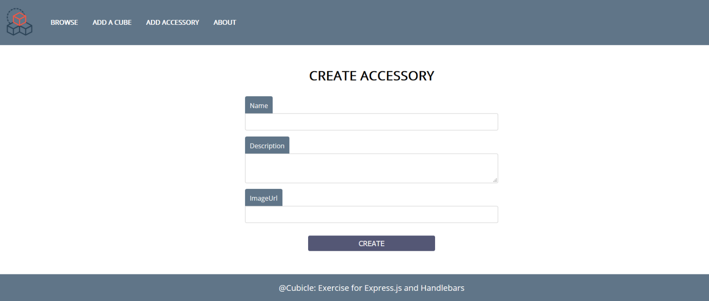
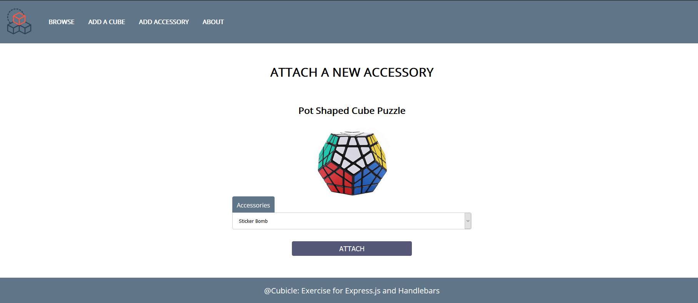
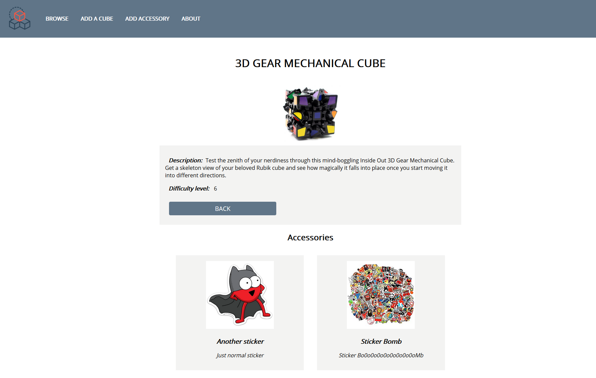

**Workshop: Cubicle – Part 2**
===================

"*Cubicle*" is a place, where you can browse some of the most popular Rubik
cubes in the world and add some new cubes that you have discovered.

**Main Task**
---------

If you able to complete the previous task, good job! Now it's time to
**upgrade** your app and **implement** a few new features. For instance, to
replace the way you **store** data using **MongoDB** and **Mongoose**,
**creating** and **attaching new accessories** to each **cube**, make some
**relations** between them and **include** a few more **pages**.

**Installing Dependencies**
------

As you already know, you should **install** a bunch new things so you could be
able to continue with this part of the workshop.

Here's the list:

1.  [MongoDB Download Center](https://www.mongodb.com/download-center) - You can
    check the [Installation
    Instructions](https://docs.mongodb.com/manual/tutorial/install-mongodb-on-windows/)
    as well

2.  [MongoDB Node.JS Driver](https://www.npmjs.com/package/mongodb)

3.  [Mongoose](https://www.npmjs.com/package/mongoose) - **Very useful**
    [Mongoose Documentation](https://mongoosejs.com/docs/guide.html)

4.  [Robo 3T](https://robomongo.org/download)

**Database Connection with ExpressJS**
----------------------------------

Your **database**.**json** file inside **config folder** will be **modified**,
because you **no longer** will **store** the data in **json** file. So, make
sure inside it, the **mongoose connection** via **MongoDB connection string** is
**made** and **exported.**

The **index.js** file should **require** the exported mongoose connection
(**database**) before the server starts.

**Model**
-------

If you follow the previous structure you probably created ES6 class Model for
each cube in this format:

-   **Id** - number

-   **Name** - string

-   **Description** - string

-   **Image URL** - string

-   **Difficulty Level** - number

Now it's time to refactor this ES6 class to **Mongoose Schema**, so each
**Cube** has the following structure:

-   Id - (**ObjectId)**

-   Name - (**String**, **required**)

-   Description - (**String**, **required, max length validation**)

-   ImageUrl - (**String**, **required**, **http/https validation**)

-   Difficulty Level - (**Number**, **required**, **min and max valid range**)

-   Accessories - (**ObjectId**, **ref Accessories Model**)

And create another model (**Accessory**) in the following format:

-   Id - (**ObjectId**)

-   Name - (**String**, **required**)

-   ImageUrl - (**String**, **required**, **http/https validation**)

-   Description - (**String**, **required**, **max length validation**)

-   Cubes - (**ObjectId**, **ref Cubes Model**)

Your models folder should look like:

**Database Persistence**
--------------------

**All pages** in the application should persist data to **MongoDB** & work with
**MongoDB**

**Additional Pages**
----------------

You should implement **2** new routes:

-   **/create/accessory** - should render the create accessory form

-   **/attach/accessory/:id** - should render the accessory page about attaching
    new accessory for cube

And **update the view** on **/details/:id** route, that render the cube's
details

Use the provided
[Resources](http://svn.softuni.org/admin/svn/js-web/Sept-2019/JS-Back-End/04.%20JS-Back-End-NoSQL-and-MongoDB/04.%20Cubicle-Workshop-Part-2-Resources.zip)
to create the additional templates using Handlebars (The authentication here is
the same as above - **username: student**, **password: student**). Identify the
dynamic parts and use appropriate syntax for interpolating and rendering the
application context. Replace the old **CSS** file with the given one.

**Create Accessory Page View**

**Attach new accessory view**

*Note that, the options inside the select element must be only these ones which
the current cube doesn’t have attached to itself.*

**Updated Details Page View**

