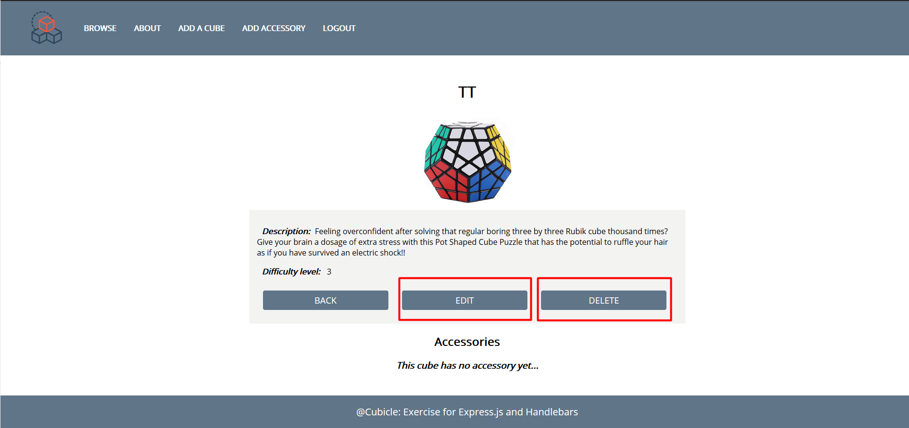
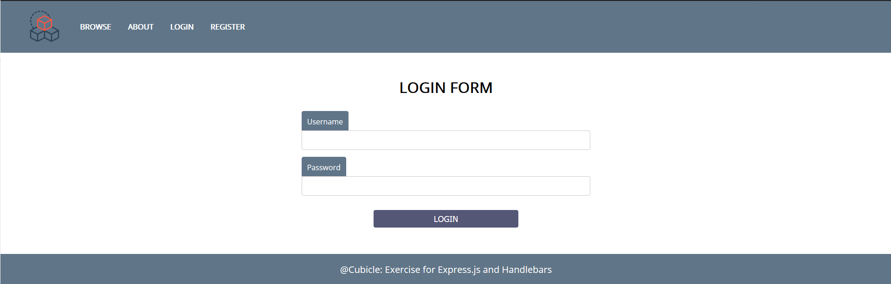
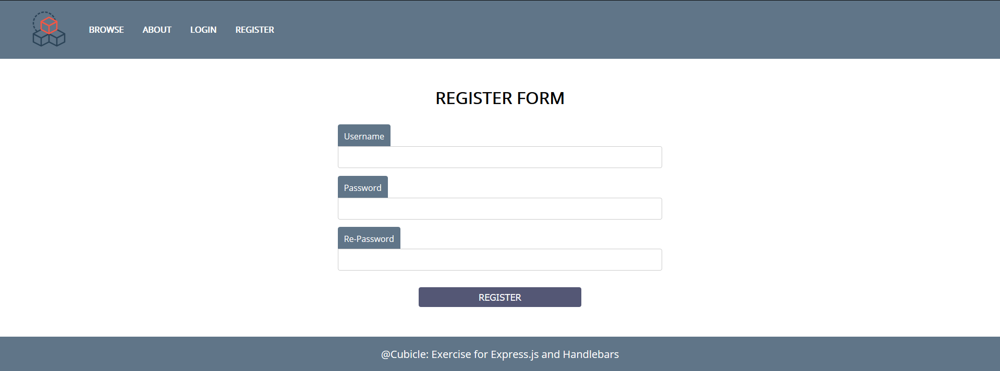
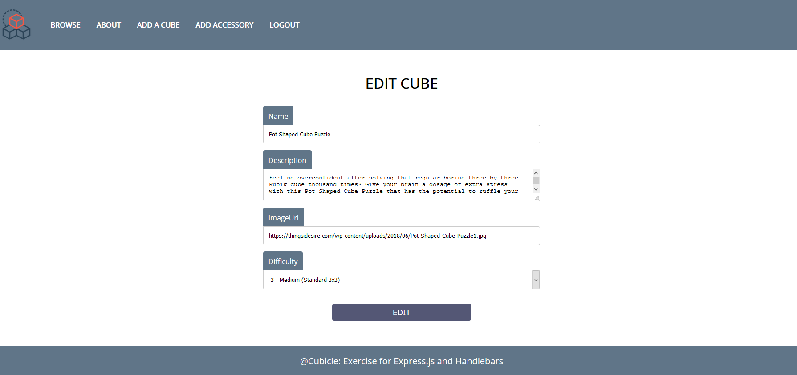
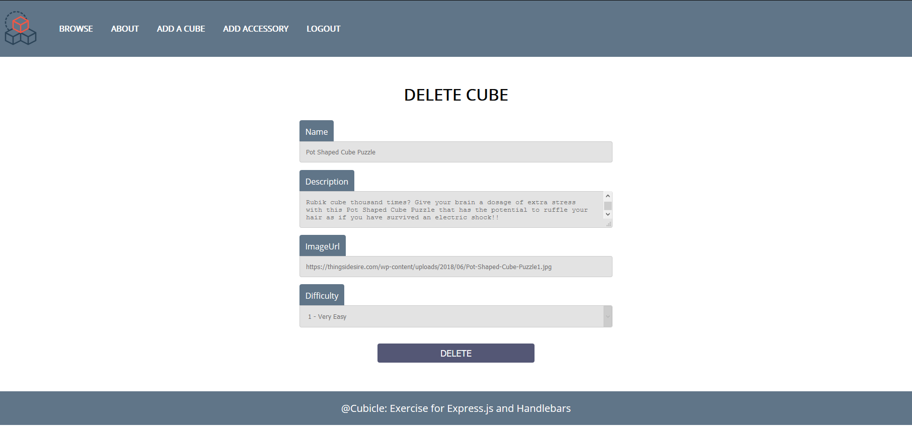

**Workshop: Cubicle – Part 3**
===============

"*Cubicle*" is a place, where you can browse some of the most popular Rubik
cubes in the world and add some new cubes that you have discovered.

If you missed the first two parts of this workshop, make sure you complete them
before you continue because all parts of this workshop are related to each
other.

**Main Task**
-----------

Now it's time to implement **user service** in your app, so people can
**register**, **login** and **logout**. And each cube can be **edited** or
**deleted**. Some of the functionality should **requires authentication** such
as (create cube, create accessory) and **authorization** (such as edit and
delete). Also, all **routes** should be **protected**!

**Installing Dependencies**
-----------

You should install a few more packages which you will use. They are:

1.  [jsonwebtoken](https://www.npmjs.com/package/jsonwebtoken) - allows you to
    decode, verify and generate JWT

2.  [bcrypt](https://www.npmjs.com/package/bcrypt) - a library to help you hash
    passwords

3.  [cookie-parser](https://www.npmjs.com/package/cookie-parser) - parse
    **cookie header** and populate **req.cookies** with an object keyed by the
    cookie names (if you choose to store the **jwt** as а **cookie**)

**Model**
-----

The User Model structure:

-   **Id** - ObjectId

-   **username** - string

-   **password** - string (**hashed**) - Use **bcrypt** to **hash** and
    **compare** the password

Make sure, when you successfully create a new user into the database, you
generate a **jsonwebtoken** and use it later for **authentication** and
**authorization**.

Also, you have to add an additional property on **Cube Model,** which is
**creatorId** (type: **String** and its **required**), so you can keep tracking
every cube's creator.

**Routes Protection**
-----------------

Make sure the **anonymous** (guest) users **can't reach** the functionality
which requires authentication, such as create cube view. And **already logged
in** users have generated and stored **jwt**, **can** see the correct navigation
and **can't reach** the login and register form. If some of these scenarios is
happen, make sure the current user is redirected to the home page.

**Authentication**
------

**Guest** users can **see** and **access** the following urls**:**

-   **Home page (Browse)**

-   **About page**

-   **Login page**

-   **Register page**

-   **Cube details page**

and **can't access** and **see** everyone else...

**Logged** in users can **see** and **access** the following urls:

-   **Home page (Browse)**

-   **About page**

-   **Add cube**

-   **Add accessory**

-   **Logout**

-   **Cube details page**

-   **Cube accessories page**

-   **Edit Cube page**

-   **Delete Cube page**

**Authorization**
---------

Only **authorized** users should see the [**Edit**] and [**Delete**] buttons and
if the **currently logged in user is the creator of this cube**. Otherwise they
should be **hidden**.

**Additional Pages**
----------------

You should implement **4** new routes:

-   **/login** - should render the login form

-   **/register** - should render the register form

-   **/edit** – should render the edit form

-   **/delete** – should render the delete form

    Make sure when you access /**edit** and /**delete** routes, they show the
    current cube information.

Use the provided
[RESOURCES](http://svn.softuni.org/admin/svn/js-web/Sept-2019/JS-Back-End/05.%20JS-Back-End-Sessions-and-Authentication/05.%20Sessions-and-Authentication-Workshop-Resources.zip)
to create the additional templates using Handlebars (Use **username: student**,
**password: student** credentials to do that). Identify the dynamic parts and
use appropriate syntax for interpolating and rendering the application context.
Replace the old **CSS** file with the given one.

**Login Page**

**Register Page**

**Edit Cube Page**

**Delete Cube Page**

