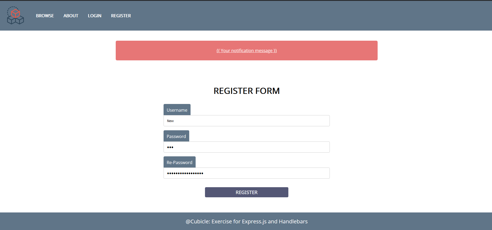
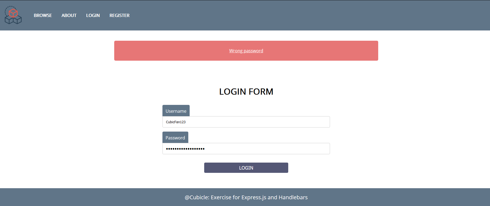
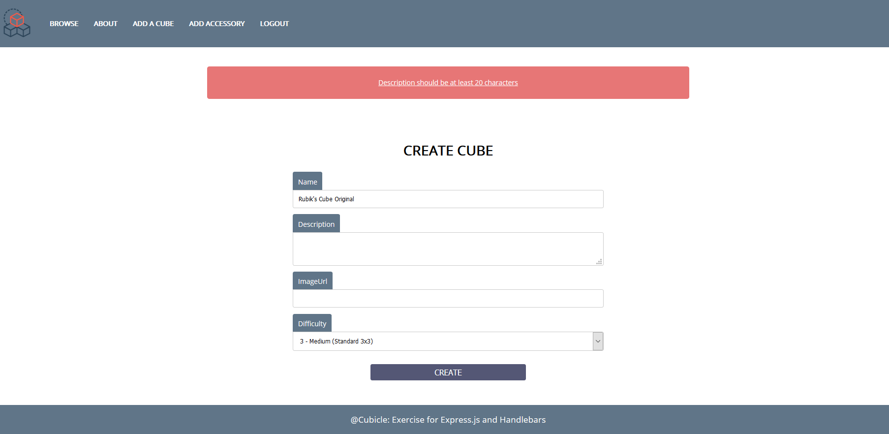
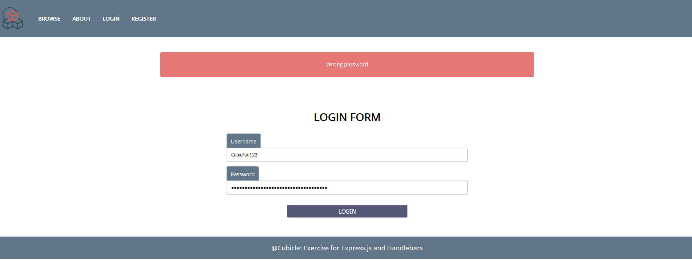
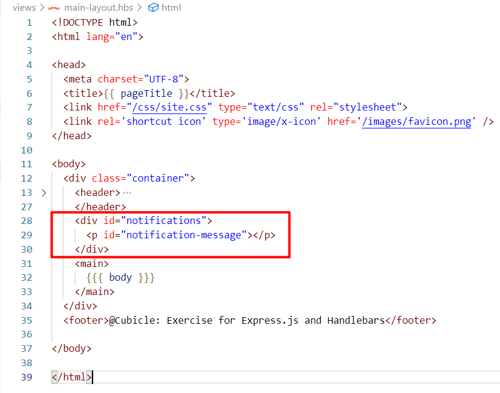

**Workshop: Cubicle – Part 4**
=================

"*Cubicle*" is a place, where you can browse some of the most popular Rubik's
cubes in the world and add some new cubes that you have discovered.

This is the final part of the workshop, so if you missed some part, make sure
you complete it before you continue because all parts of this workshop are
related to each other.

**Main Task**
--------------

As a final step you should implement some validation, notification to improve
the user experience and protect the data that is stored into the database.

**Installing Dependencies**
---------------

You can use [express-validator](https://www.npmjs.com/package/express-validator)
to do some **validation** and **sanitization** or continue using Mongoose to do
validations as well.

**Validations**
-----------

User
--------

Before some user register or login, implement the following validations:

-   **Username**

    -   Should be **unique** (add "**unique: true"** property to each **User
        Model** username)

    -   Should consist only with **English letters** and **digits**

    -   Should be at least **5 characters** long

-   **Password**

    -   Should consist only with **English letters** and **digits**

    -   Should be at least **8 characters** long

-   **Re-Password** - (only in Register Page)

    -   Should be the **same** as the given password

**Cube and Accessory**
--------------

The **cube** and **accessory** forms also should have some validation:

-   **Name** - At least **5 characters long**, who could be **English letters**,
    **digits** and **whitespaces**

-   **Description** - At least 20 characters, who could be **English letters**,
    **digits** and **whitespaces**

-   **ImageUrl -** Referring to actual picture (starts with **http://**... or
    **https://**...)

**Error Handling**
----------

In case of errors, for instance If the given username is **already taken, does
not exists** or the given **password** (while login) is **incorrect**, handle
the error properly and show an appropriate notification.

**Template Update**
------

If you want to use the notifications which are shown in the pictures, you should
modify a little your **main layout hbs** file. Create a **div** with
**id**="**notifications"**, between the **header** and the **main** element,
which holds a single **paragraph** with **id**="**notification-message**". Check
the picture below:

Also, you should append the following styles into the **site.css** file
