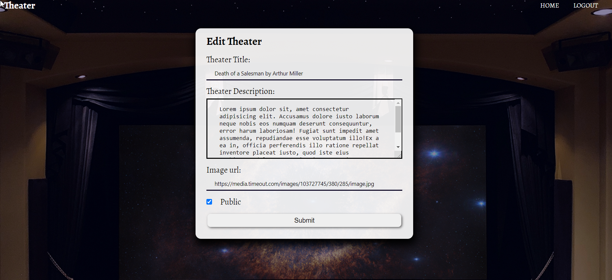

**Express.js Exam – Theater**
-------------------------

**1\. Exam Rules**
-------------

-   You have 4 hours **from 14:00 to 18:00**

-   When you are ready, **delete** the *node_modules* folder, make sure all
    dependencies are listed in the *package.json* file and submit your archived
    project at: [SoftUni
    Judge](https://judge.softuni.bg/Contests/2457/JS-Back-End-Exam-28-June)

-   You are provided with **HTML & CSS** resources, which you **CAN modify**

-   Use **Express.js** as a back-end framework

-   Use **MongoDB** as a database with **mongoose**

-   You can use whatever **view engine** you like (Handlebars, EJS, Pug etc.…)

-   Keep in mind that the points listed below, are the maximum point you can
    receive for a given functionality!

**2\. Application Overview**
--------------------

Get familiar with the provided **HTML & CSS** and create an application for
**theaters.**

**3\. Functional Requirements**
-----------------------

The **Functionality Requirements** describe the functionality that the
**Application** must support.

### Guest (Not Logged In)

The **application** should provide **Guest** (not logged in) users with the
functionality to **login**, **register** and **view** the **Guest Home** page.

### Users (Logged In)

The **application** should provide **Users** (logged in) with the functionality
to **view all the plays which are listed**, **play details page** and **they
should be able to like a play**. Plays can be **public** or **not.** Users can
access **only public plays.**

**4\. Database Models (10 Pts)**
----------------

The **Database** of the **Tutorials** application needs to support **2
entities**

### User

-   **Username - string (required), unique**

-   **Password - string (required)**

-   **Liked Plays - a collection of Plays**

### Play

-   **Title - string (required), unique**

-   **Description - string (required), max length of 50 symbols,**

-   **Image Url - string (required),**

-   **Is Public - boolean, default - false,**

-   **Created at – Date or String, required**

-   **Users Liked - a collection of Users**

Implement the entities with the **correct datatypes**.

**5\. Application Pages (70 Pts)**
----------

### Guest Pages (15 Pts)

These are the pages and functionalities, accessible by **Guests (logged out
users).**

### Home Page (Logged Out User)

List the **top three (3) public plays ordered** by the **count** of likes in
**descending** order.

If there are no plays in the database yet, display **"No plays yet..."**

### Register Page (Logged Out User)

Register a user inside the database with **username** and **password**. Both
**passwords** must **match**!

### Login Page (Logged Out User)

### User Pages (55 Pts)

These are the **templates** and **functionalities**, accessible by **Users**
(**logged in** users).

### Home Page (Logged in User)

List **all public** plays sorted in **descending order** by the **created time**
with a button **Details** which leads to a **play details page**.

If there are no plays in the database yet, display **"No plays yet..."**

### Create Play Page (Logged in User)

Enter play **title**, **description**, **image URL** and choose if the play will
be **public** or not. You will receive the value of the checkbox as a string
**"on"** if it's checked or **undefined** if it's not. You have to convert the
received value as Boolean **true** or **false** and save the play in the
database.

### Logged in Details Page (Logged in User)

In the Details of a play section, you should load play **name** and
**description**.

### Not Liked Play (Logged in User)

If the user didn't like the play, you should display **Like button.**

### Liked Play (Logged in User)

**After** the user has liked the play, the **"You have already liked this play!"
span element** should be **shown instead of the [Like] button.**

### Play Creator (Logged in User)

The creator of the play should see **[Delete] [Edit].** The creator should NOT
be able to like his plays!

### Delete Play (Logged in User)

Upon deleting a play (clicking over **[Delete] button**, you should be
**redirected to the home page**.

### Edit Play (Logged in User)

All form fields should be **filled automatically** with the corresponding
information of the selected play.

**6\. Security Requirements (10 Pts)**
---------

The **Security Requirements** are mainly **access** requirements. Configurations
about which users can access specific functionalities and pages.

-   **Guest** (not logged in) users can access **Home** page and functionality.

-   **Guest** (not logged in) users can access **Login** page and functionality.

-   **Guest** (not logged in) users can access **Register** page and
    functionality.

-   **Users** (logged in) can access **Home page (Listed all Plays)**page and
    functionality.

-   **Users** (logged in) can access **Play Details** page and functionality.

    -   **Users** (not play creator) can **Like** a play **once**

    -   **Users** (play creator) can **Edit** and **Delete** the current play

-   **Users** (logged in) can access **Create Play** page and functionality.

-   **Users** (logged in) can access **Logout** functionality.

**7\. Validation and Error Handling (10 Pts)**
--------------

The application should notify the users about result of their actions.

### Login / Register

You should make the following validations:

-   The **username** should be **at least 3 characters** long and should consist
    only **english letters** and **digits**

-   The **password** should be **at least 3 characters** long and should consist
    only **english letters** and **digits**

-   The **repeat password** should be **equal to the password**

### Play

You should make the following validations while **creating** or **editing a
play**:

-   The **title** should **not be empty**

-   The **description** should **not be empty**

The **imageUrl** should **not be empty**

**8\. \*Bonus (10 Pts)**
---------

**[Sort by Likes] -** Filter only the **play with the most likes.**

**[Sort by Date]** - Sort all plays by date from newest to oldest

