**Express.JS Retake Exam - SharedTripp**
====================================

**1\. Exam rules:**
-----------

-   You have 4 hours **from 14:30 to 18:30**

-   When you are ready, delete the *node_modules* folder, make sure all
    dependencies are listed in the *package.json* file and submit your archived
    project at:
    [SoftUni](https://judge.softuni.bg/Contests/Compete/Index/1963#0)

-   You are provided with **HTML & CSS** resources, which you can **modify**

-   Use **Express.js** as a back-end framework

-   Use **MongoDB** as a database with **mongoose**

-   You can use **JWT** to authenticate users or **PassportJS**

-   You can use whatever **view engine** you like (Handlebars, EJS, Pug etc.…)

**2\. Application Overview**
--------------------

Get familiar with the provided **HTML & CSS** and create an application for
**shared tripp's plans**.

**3\. Functional Requirements**
-----------------------

The **Functionality Requirements** describe the functionality that the
**Application** must support.

### Guest (not logged in)

The **application** should provide **Guest** (not logged in) users with the
functionality to **login**, **register** and **view** the **Home** page.

### Users (logged in)

The **application** should provide **Users** (logged in) with the functionality
to:

-   **View home page and all other pages with logged-in navigation**

-   **View all shared tripps**

-   **Create new tripp [Offer Tripp!]**

-   **Access tripp details page [Find Out More!]**

-   **Deleting or joining some tripp depending of user's authentication**

**4\. Database Models (10 pts)**
------------------------

The **Database** of the **SharedTripp** application needs to support **2
entities**

### User

-   **Email - string (required), unique**

-   **Password - string (required)**

-   **Tripps History – a collection of Tripps (reference to the Tripp Model)**

### Tripp

-   **Start Point - string (required),**

-   **End Point – string (required)**

-   **Date – string (required),**

-   **Time – string (required),**

-   **Seats – number (required),**

-   **Description – string (required),**

-   **Car Image – string (required),**

-   **Buddies – Reference to the User model – creator (required)**

Implement the entities with the **correct datatypes**.

**5\. Application Pages (70 pts)**
--------------------------

### Guest Pages (15 pts)

These are the pages and functionalities, accessible by **Guests (logged out
users).**

### Home Page (logged out user)

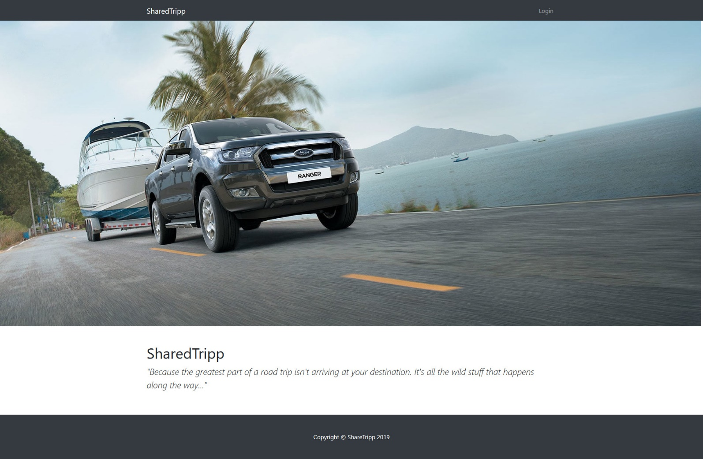

### Login Page (logged out user)

Logging an already registered user with correct email and password

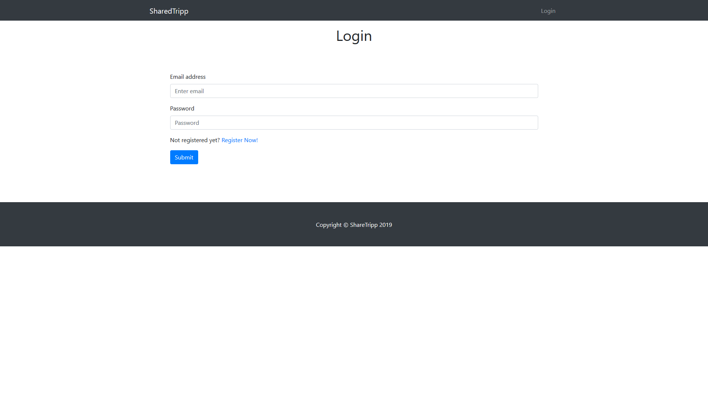

### Register Page (logged out user)

Register a user inside the database with **email**, **password**. Both
**passwords** must **match**!

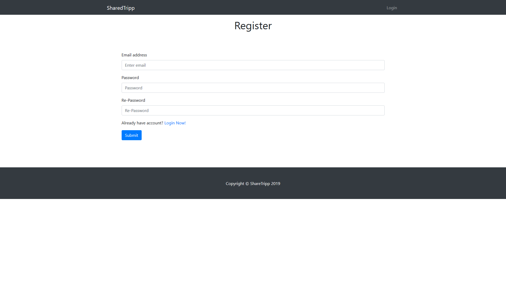

### User Pages (55 pts)

These are the **templates** and **functionalities**, accessible by **Users**
(**logged in** users).

### Home Page (logged in user)

### Shared Tripps

List all **shared tripps**. **Each tripp** should be showing an information
about **tripp's car image, destination** (**from** - **to**), Like in the
picture below:

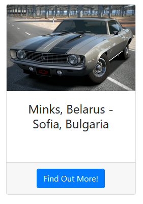

[**Find Out More!**] button should be a link to the **details page** for the
current tripp.

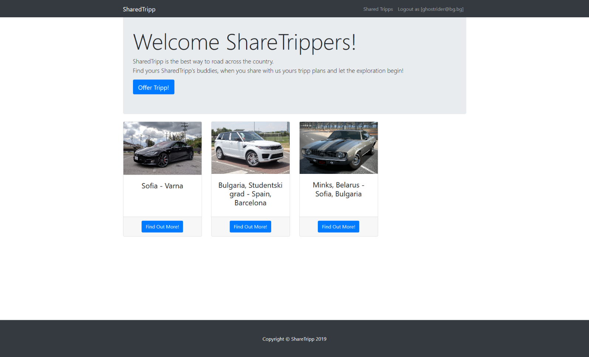

If there are **no shared tripps in the database**, display the following view:

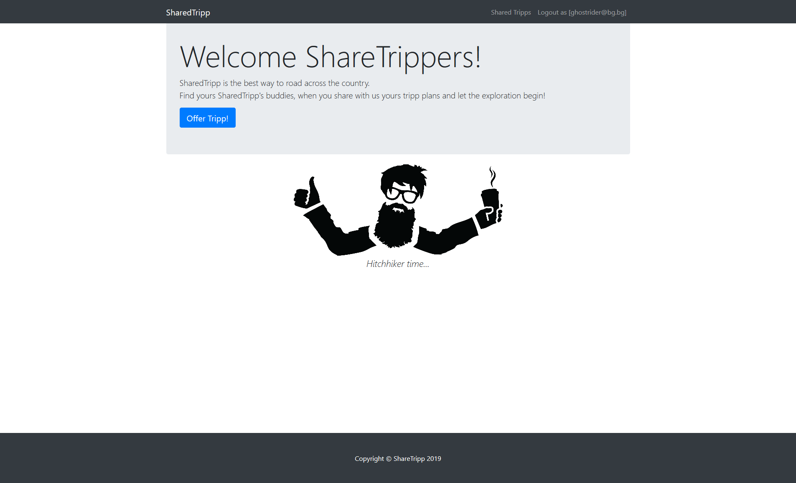

### Offer New Tripp Page (logged in user)

Enter **Tripp**:

-   **Destination -** in (**starting point - end point**) format

-   **DateTime** - in (**date - time**) format

-   **CarImage** - **http** or **https link** to the car

-   **Seats** - **available seats** for this trip

-   **Description** - A little description or something specific for the tripp

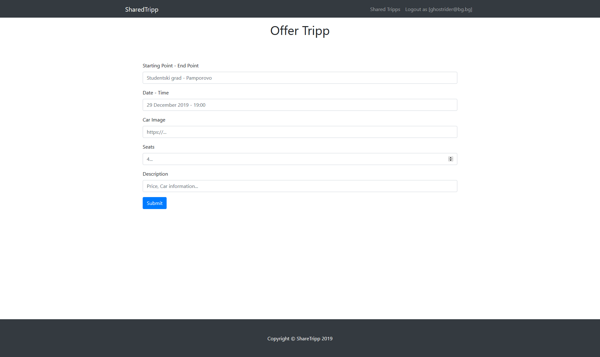

### Find Out More (Tripp Details Page) - (logged in user)

**The find out more** page is accessed by clicking over the [**Find Out More**]
**button's** SharedTripp (if any) and there are shown the tripp's:

-   **Destination (from - to)**

-   **Date and Time (date - time)**

-   **SharedTripp Buddies**

    -   If any, separate them with **space** and **comma** (", ")

    -   If not, display 5 dots separated with space (**". . . . ."**)

    -   Below that, the **email on the driver** should be displayed

-   **Car Image**

-   **Description**

-   **Button** (Depending the status of the currently logged in user)

Check the pictures below for more clarity:

### SharedTripp Details - Driver view

If the currently logged-in user is the driver (user who's created the tripp), he
should see the [**Close this tripp**] which **deletes** the **current trip**.

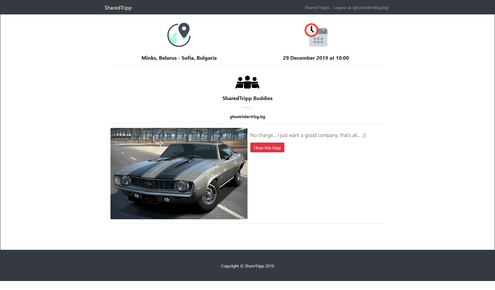

### SharedTripp Details with available seats

If the currently logged-in user is **not the driver** (user that is not the
creator for that tripp) he should see button like [**Join now, {availableSeats}
left**]. If there is at **least 1 seat left**

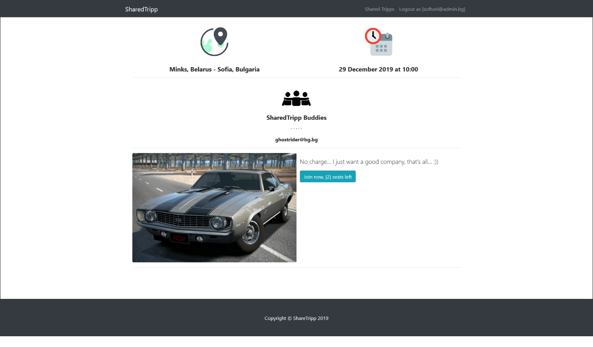

### SharedTripp details - Already joined the tripp

If the currently logged-in user is already joined some tripp, he should see the
[**Already joined. Don't be late**] button.

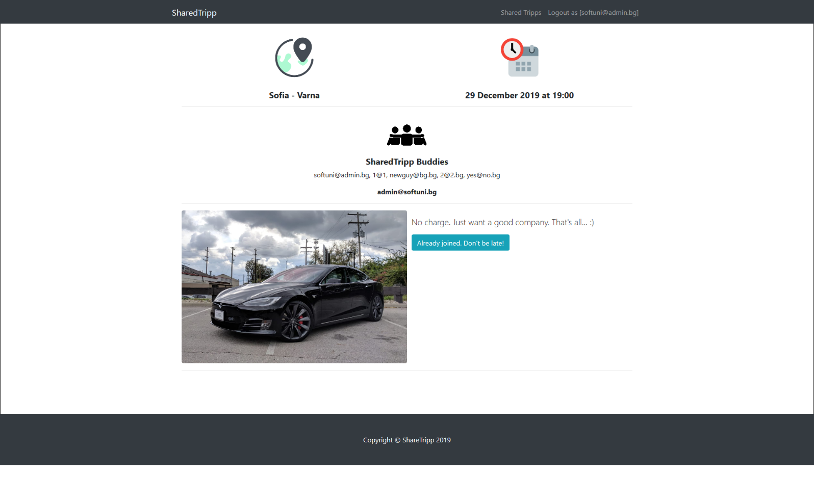

### SharedTripp Details with no available seats

If the currently logged-in user is not the driver and there are no available
seats for the current tripp, he should see the [**No seats available [0]**]
button.

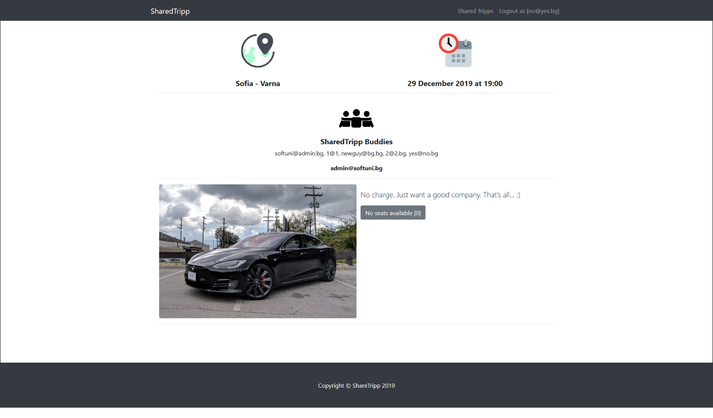

### Join Tripp (logged in user)

**Every logged-in user** which is **not** the current **tripp creator** (driver)
should be able to join tripp (**if seats available**). If he manages to **join
successfully** to some tripp, his **email** should be **added** to the current
trip's **sharedTripp buddies**'s collection and the **seats** for the current
tripp should be **decreased by 1**.

If some user once joined a current tripp, he should see the "**already joined
button"**.

If there are no seats available, he should see the "**no seats available
button**".

Check the pictures above for more clarity.

### Close Tripp (logged in user)

**Every tripp creator** should be able to click over [**Close this tripp**]
**button** and deleting the current tripp from the database.

**6\. Security Requirements (10 pts)**
------------------------------

The **Security Requirements** are mainly **access** requirements. Configurations
about which users can access specific functionalities and pages.

-   **Guest** (not logged in) users can access **Home** page (where users can
    register and login)

-   **Guest** (not logged in) users can access **Login** page and functionality

-   **Guest** (not logged in) users can access **Register** page and
    functionality

-   **Users** (logged in) can access **Shared Tripps page (Listed all tripps)**
    page and functionality

-   **Users** (logged in) can access **Offer Tripp** page and functionality

-   **Users** (logged in) can access **Find Out More** page and functionality

-   **Users** (logged in) can acces to **Join tripp and Delete tripp**
    (depending on the user authorization) functionality in the home page

-   **Users** (logged in) can access **Logout** functionality

Use **JWT** or **PasswortJS** to provide pages and functionality only to
**authorized users**. And **allow actions** like creating offering new trip,
view details about some tripp report etc... only to **authenticated users**.

Use the following view for **invalid paths**:

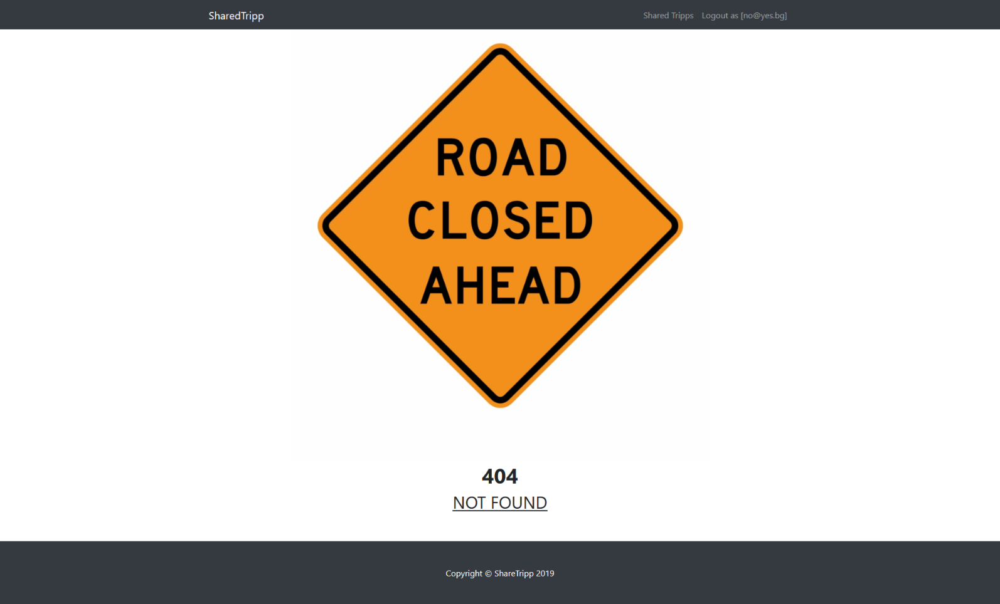

**7\. Validation and Error Handling (10 pts)**
--------------------------------------

The application should notify the users about result of their actions.

### Login / Register

You should make the following validations:

-   The **email** should be **in the following format** (mailboxname **\@**
    domainname) - "**username\@domain.bg**"

-   The **password** should be **at least 6 characters** long

-   The **repeat password** should be **equal to the password**

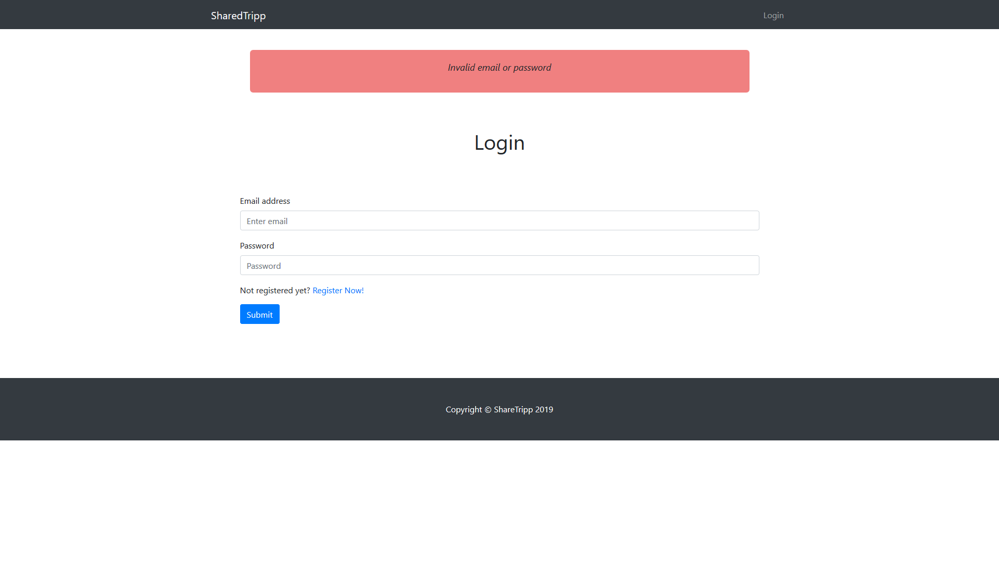

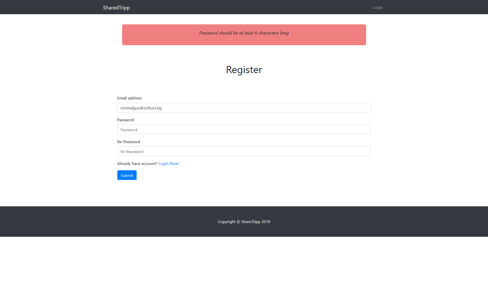

### Tripp

You should make the following validations while **offering tripp**:

-   The **Starting Point - End Point** - **Starting** and **End** point should
    be **at least 4 characters long (each)** and should be separated with single
    space, dash and another single space (**" - "**)

-   The **Date - Time - Date** and **Time** should be **at least 6 characters
    long** (**each**) and should be separated with single space, dash and
    another single space (**" - "**)

-   The **CarImage -** should be **actual link** refering to the car image

-   The **Seats** should be positive number

-   The **description** should be minimum **10 characters** long

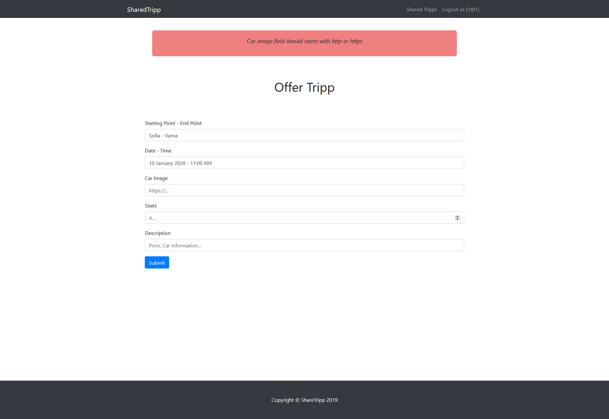
