**Express.JS Regular Exam - MoneyGone**
===================================

**1\. Exam rules:**
-----------

-   You have 4 hours **from 14:00 to 18:00**

-   When you are ready, delete the *node_modules* folder, make sure all
    dependencies are listed in the *package.json* file and submit your archived
    project at:
    [SoftUni](https://judge.softuni.bg/Contests/1846/ExpressJS-26-Oct-2019-Exam)

-   You are provided with **HTML & CSS** resources, which you can **modify**

-   Use **Express.js** as a back-end framework

-   Use **MongoDB** as a database with **mongoose**

-   You can use **JWT** to authenticate users or **PassportJS**

-   You can use whatever **view engine** you like (Handlebars, EJS, Pug etc.…)

**2\. Application Overview**
--------------------

Get familiar with the provided **HTML & CSS** and create an application for
**tracking expenses**.

**3\. Functional Requirements**
-----------------------

The **Functionality Requirements** describe the functionality that the
**Application** must support.

### Guest (not logged in)

The **application** should provide **Guest** (not logged in) users with the
functionality to **login**, **register** and **view** the **Home** page.

### Users (logged in)

The **application** should provide **Users** (logged in) with the functionality
to:

-   **View all the created expenses for the currently logged in user**

-   **Create new expenses**

-   **Access expense report page**

-   **Access account information page**

-   **Logged in users also should can be able to refill their bank accounts**

**4\. Database Models (10 pts)**
------------------------

The **Database** of the **MoneyGone** application needs to support **2 models**

### User

-   **Username - string (required), unique**

-   **Password - string (required)**

-   **Amount – number, (required), default 0**

-   **Expenses – a collection of Expenses**

### Expense

-   **Merchant - string (required),**

-   **Date – date (required), default Now**

-   **Total – number (required),**

-   **Category – string (required),**

-   **Description – string (required), minimum 10 characters, maximum 50
    characters**

-   **Report – boolean (required), false by default**

-   **User – Reference to the User model – creator (required)**

Implement the entities with the **correct datatypes**.

**5\. Application Pages (70 pts)**
--------------------------

### Guest Pages (15 pts)

These are the pages and functionalities, accessible by **Guests (logged out
users).**

### Home Page (logged out user)

### Register Page (logged out user) 

Register a user inside the database with **username**, **password** and starting
amount money. Both **passwords** must **match**!

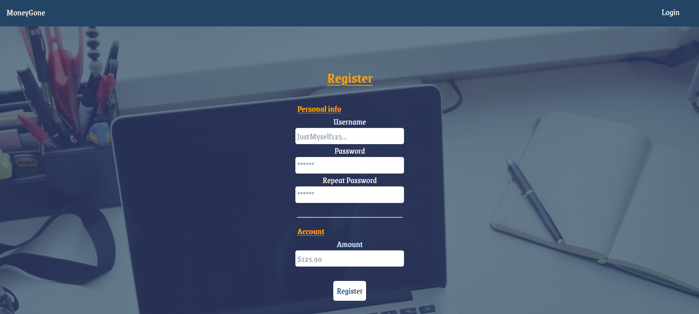

### Login Page (logged out user)

### User Pages (55 pts)

These are the **templates** and **functionalities**, accessible by **Users**
(**logged in** users).

### Home Page (logged in user)

List all **expenses which are created by the currently logged in user**. If some
expense **has** the **report check** while creating, the [**Report**] **button**
should be visible and should refer to the report.

The format for each expense is the following:

| Date | Merchant + Report (Optional) | Amount | Category | Description |
|------|------------------------------|--------|----------|-------------|

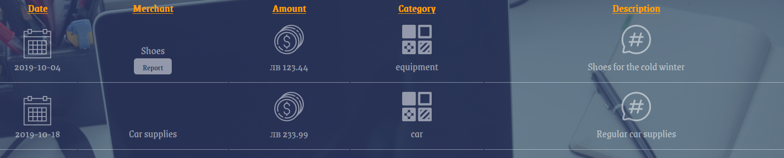

**Hint: Use the provided pictures to achieve the effect shown.**

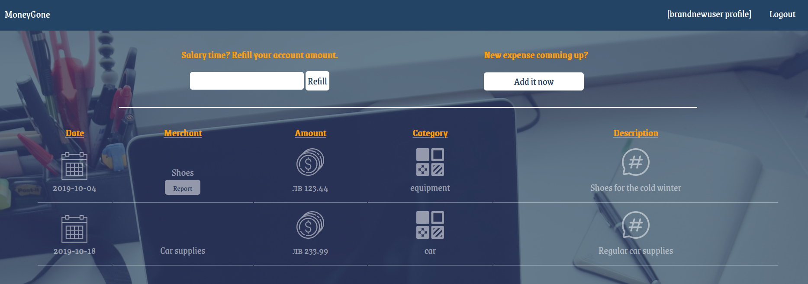

If there are no expenses in the database which the currently logged in user is
created, display **"No expenses founded so far... GOOOD JOB!"**

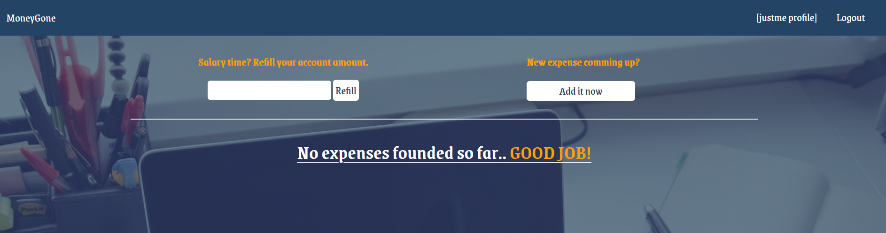

### Create New Expense Page (logged in user)

Enter **Expense**: **merchant**, **total, category, description** and choose
**report** for the expense. You will receive the value of the checkbox as a
string **"on"** if it's checked or **undefined** if it's not. You must convert
the received value as Boolean **true** or **false** and save the expense in the
database.

**Report check** will allow the current expense to be **accessed**, something
like details page called **report expense page**.

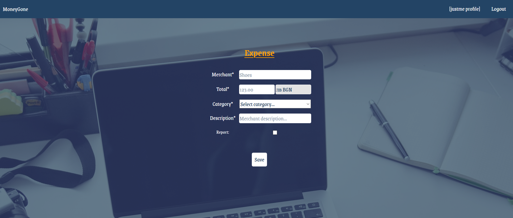

### Logged in Expense Report Page (logged in user)

The report page is accessed by clicking over the [**Report**] **button's**
expense (if any) and there are shown the expense's **id**, **date**,
**category**, **amount**, **merchant**, **description** and **[Stop tracking]
button** (if the check while creating the current expense was checked)

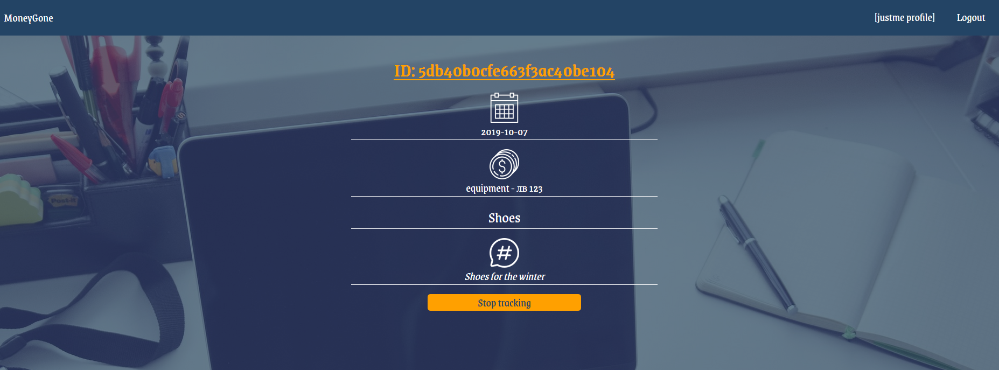

### Stop tracking

Clicking over **[Stop tracking] button** the current expense should be
**deleted** from the database and the user should be **redirected** to **all his
expenses**.

### Refill action (logged in user)

The input field in the home page (where all user expenses are listed) with label
"**Salary time? Refill your account amount.**" Is form which can **increase
(EDIT)** the current user account amount.

### Before refill

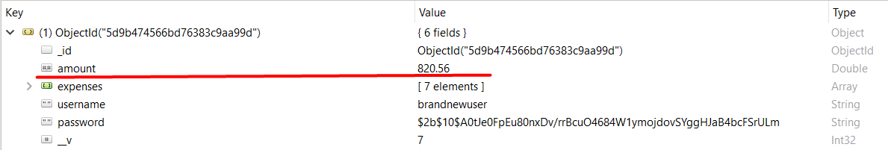

### Refilling

### After refill:

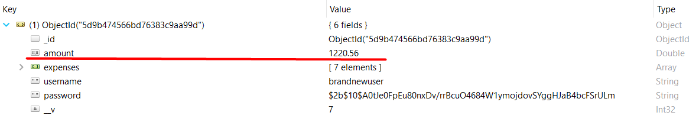

**6\. Security Requirements (10 pts)**
------------------------------

The **Security Requirements** are mainly **access** requirements. Configurations
about which users can access specific functionalities and pages.

-   **Guest** (not logged in) users can access **Home** page (where users can
    register and login)

-   **Guest** (not logged in) users can access **Login** page and functionality

-   **Guest** (not logged in) users can access **Register** page and
    functionality

-   **Users** (logged in) can access **Expenses page (Listed all expenses for
    the currently logged in user)** page and functionality

-   **Users** (logged in) can access **Expense Report** page and functionality
    (if while creating the current expense the report check was selected)

-   **Users** (logged in) can access **Create Expense** page and functionality

-   **Users** (logged in) can acces to **Refill Account Amount** functionality
    in the home page

-   **Users** (logged in) can acces to **Account/Profile page**

-   **Users** (logged in) can access **Logout** functionality

Any **invalid** route like **localhost:3000/hxauhxuahxuahxuahxuahxuha** should
show the following view  

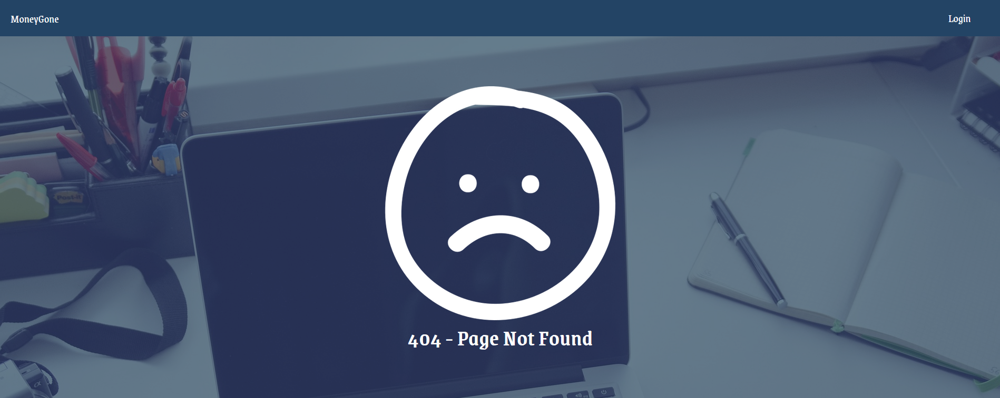

**7\. Validation and Error Handling (10 pts)**
--------------------------------------

The application should notify the users about result of their actions.

### Login / Register

You should make the following validations:

-   The **username** should be **at least 4 characters** long and should consist
    only **english letters** and **digits**

-   The **password** should be **at least 8 characters** long

-   The **repeat password** should be **equal to the password**

-   The **account amount** should be **positive number**, which by **default**
    the value is **0** if while registering the user the field is not filled

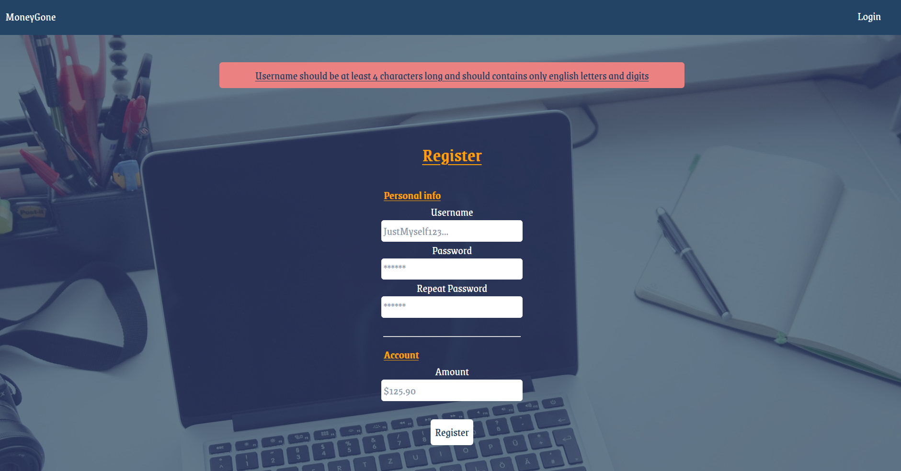

### Expense

You should make the following validations while **creating** expense:

-   The **merchant** should be **at least 4 characters** long

-   The **total** should be **positive number**

-   The **category** should one from the given options

-   The **description** should be minimum **10 characters** long and **50
    characters** maximum

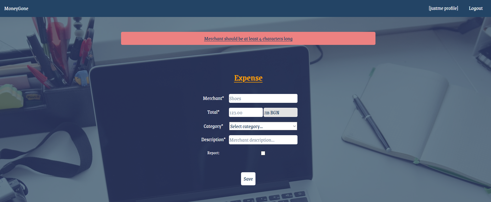

**8\. \*Bonus (10 Pts)**
-------

### Account info / User profile page

The account / profile page accessed by the navigation section **[{user}
profile]**, should show the **total amount** of **all expenses** for the user,
**total merchants** and the **available account amount** on the current user.

