**Express.js Retake Exam – Video Tutorials**
----------------------------------------

**1\. Exam Rules:**
-------------

-   You have 4 hours **from 09:00 to 13:00**

-   When you are ready, delete the *node_modules* folder, make sure all
    dependencies are listed in the *package.json* file and submit your archived
    project at: [SoftUni
    Judge](https://judge.softuni.bg/Contests/1652/ExpressJS-19-April-2019)

-   You are provided with **HTML & CSS** resources, which you can **modify**

-   Use **Express.js** as a back-end framework

-   Use **MongoDB** as a database with **mongoose**

-   You can use whatever **view engine** you like (Handlebars, EJS, Pug etc.…)

**2\. Application Overview**
--------------------

Get familiar with the provided **HTML & CSS** and create an application for
**video tutorials**, **courses** and **course lectures.**

**3\. Functional Requirements**
-----------------------

The **Functionality Requirements** describe the functionality that the
**Application** must support.

#### Guest (Not Logged In)

The **application** should provide **Guest** (not logged in) users with the
functionality to **login**, **register** and **view** the **Home** page.

#### Users (Logged In)

The **application** should provide **Users** (logged in) with the functionality
to **view all the courses which are listed**, **course details page of all
listed courses** and **they should be able to enroll in courses**. **Enrolled
in** users should be able to see **lectures** in that course and the **Play
Video** section. Courses can be **public** or **not.** Users can access **only
public courses.**

**4\. Database Models (10 Pts)**
----------

The **Database** of the **Tutorials** application needs to support **2
entities**

### User

-   **Username - string (required), unique**

-   **Password - string (required)**

-   **Enrolled Courses - a collection of Courses**

### Course

-   **Title - string (required), unique**

-   **Description - string (required), max length of 50 symbols,**

-   **Image Url - string (required),**

-   **Is Public - boolean, default - false,**

-   **Created at – Date or String, required**

-   **Users Enrolled - a collection of Users**

Implement the entities with the **correct datatypes**.

**5\. Application Pages (70 Pts)**
--------------

### Guest Pages (15 Pts)

These are the pages and functionalities, accessible by **Guests (logged out
users).**

### Home Page (Logged Out User)

List the **top three (3) public courses ordered** by the **count** of enrolled
in users in **descending** order.

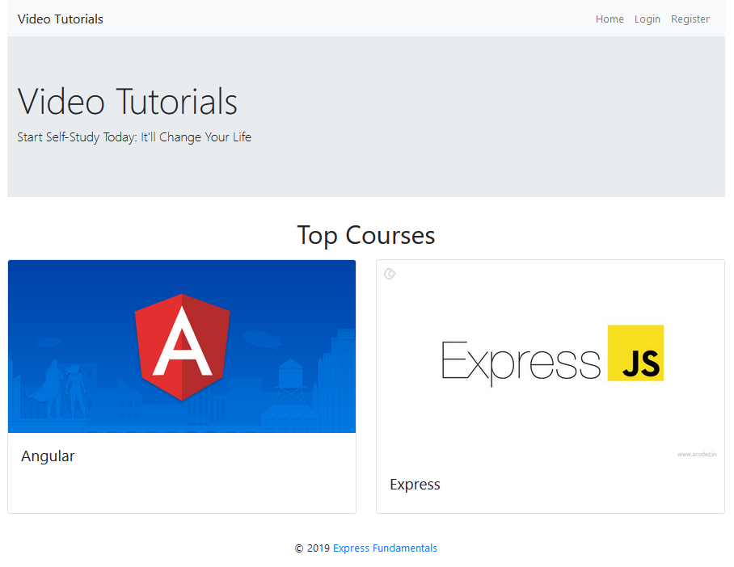

If there are no courses in the database yet, display **"No courses..."**

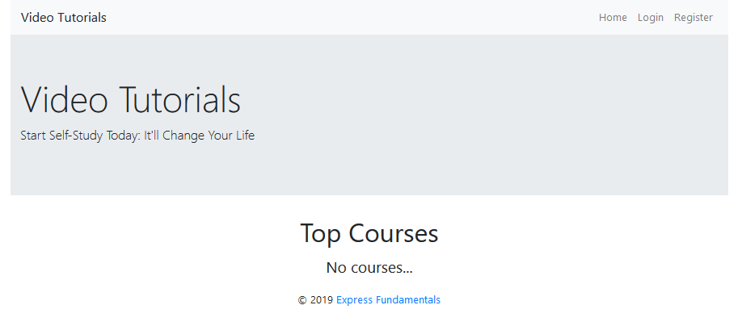

### Register Page (Logged Out User)

Register a user inside the database with **username** and **password**. Both
**passwords** must **match**!

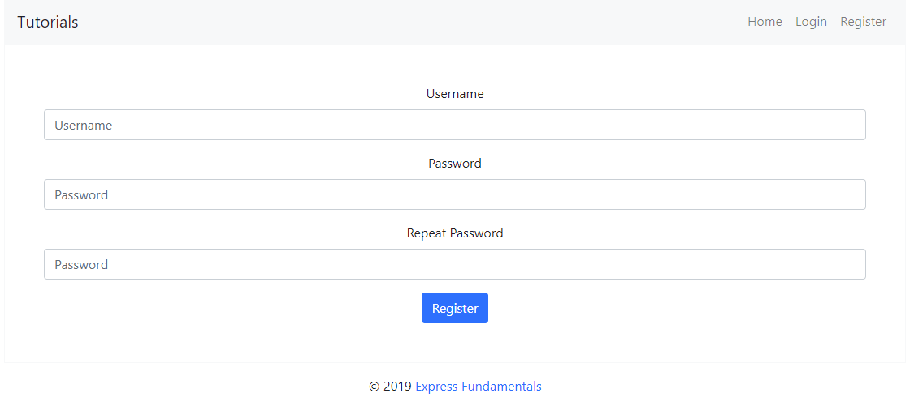

### Login Page (Logged Out User)

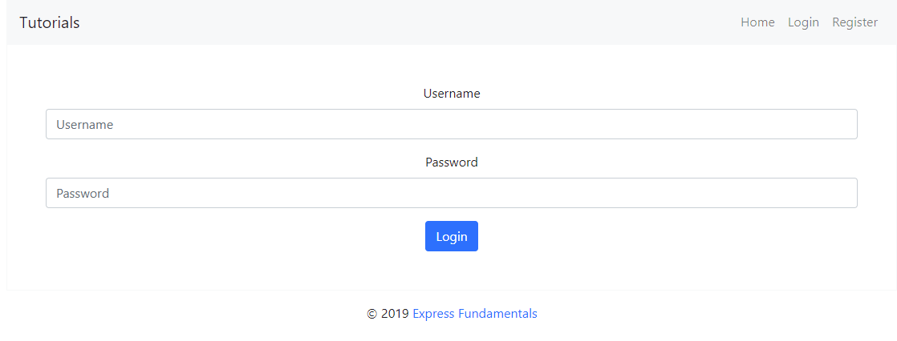

### User Pages (55 Pts)

These are the **templates** and **functionalities**, accessible by **Users**
(**logged in** users).

### Home Page (Logged in User)

List **all public** courses sorted in **descending order** by the **created
time** with a button **Details** which leads to a **course details page**.

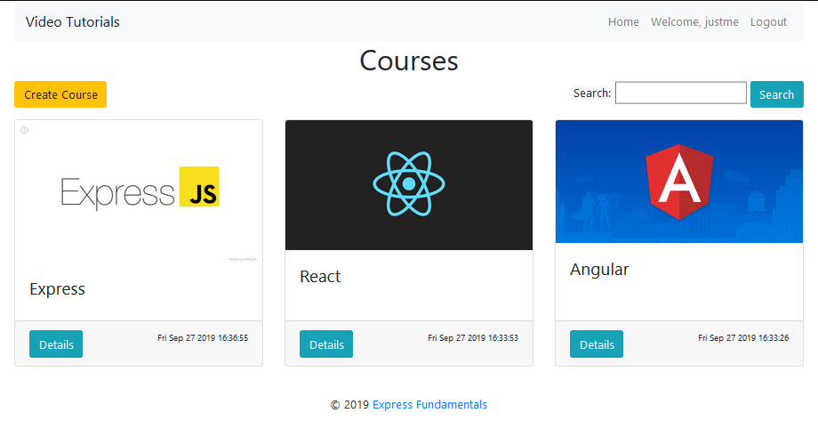

If there are no courses in the database yet, display **"No courses..."**

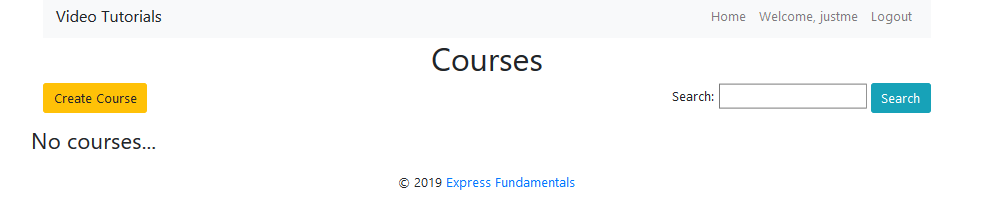

### Create Course Page (Logged in User)

Enter course **title**, **description**, **image URL** and choose if the course
will be **public** or not. You will receive the value of the checkbox as a
string **"on"** if it's checked or **undefined** if it's not. You have to
convert the received value as Boolean **true** or **false** and save the course
in the database.

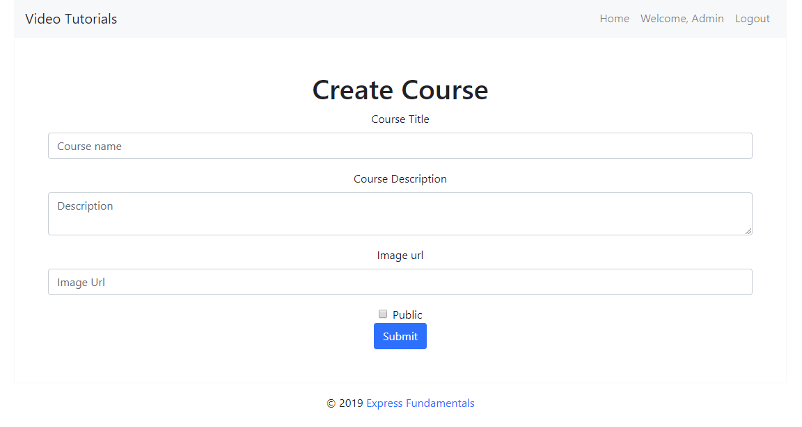

### Logged in Details Page (Logged in User)

In the Details of a course section, you should load course **name** and **description**.

### Not Enrolled in Course (Logged in User)

If the user is **not enrolled** in the course, you should display **Enroll
button.**

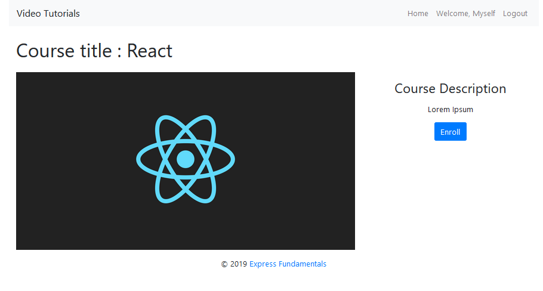

### Enrolled in Course (Logged in User)

**After** the user has enrolled in the course, the **"You are already enrolled"
span element** should be **shown instead of the [Enroll] button.**

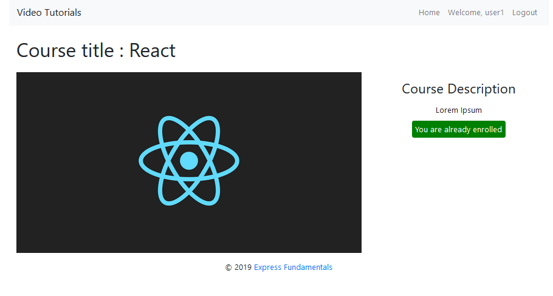

### Course Creator (Logged in User)

The creator of the course should see **[Delete] [Edit]**

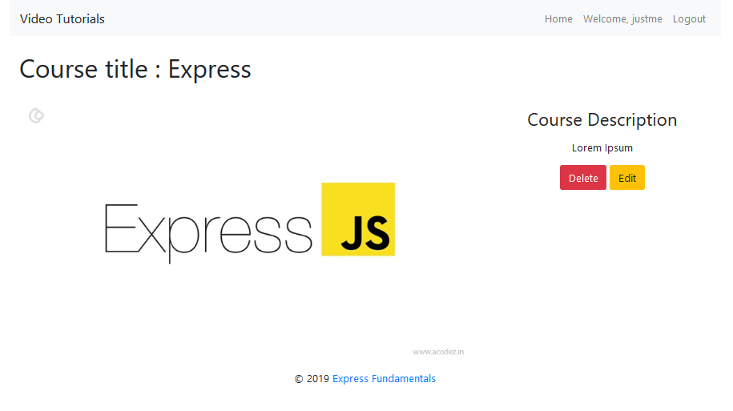

### Delete Course (Logged in User)

Upon deleting a lecture (clicking over **[Delete] button**, you should be
**redirected to the home page**.

### Edit Course (Logged in User)

All form fields should be **filled** with the corresponding information of the
selected course.

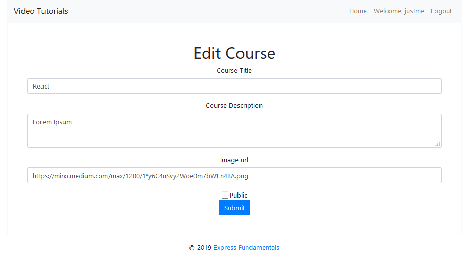

**6\. Security Requirements (10 Pts)**
-------------

The **Security Requirements** are mainly **access** requirements. Configurations
about which users can access specific functionalities and pages.

-   **Guest** (not logged in) users can access **Home** page and functionality.

-   **Guest** (not logged in) users can access **Login** page and functionality.

-   **Guest** (not logged in) users can access **Register** page and
    functionality.

-   **Users** (logged in) can access **Home page (Listed all Courses)**page and
    functionality.

-   **Users** (logged in) can access **Course Details** page and functionality.

    -   **Users** (not course creator) can **Enroll once** for the course

    -   **Users** (course creator) can **Edit** and **Delete** the current
        course

-   **Users** (logged in) can access **Create Course** page and functionality.

-   **Users** (logged in) can access **Logout** functionality.

**7\. Validation and Error Handling (10 Pts)**
-----------------

The application should notify the users about result of their actions.

### Login / Register

You should make the following validations:

-   The **username** should be **at least 5 characters** long and should consist
    only **english letters** and **digits**

-   The **password** should be **at least 5 characters** long and should consist
    only **english letters** and **digits**

-   The **repeat password** should be **equal to the password**

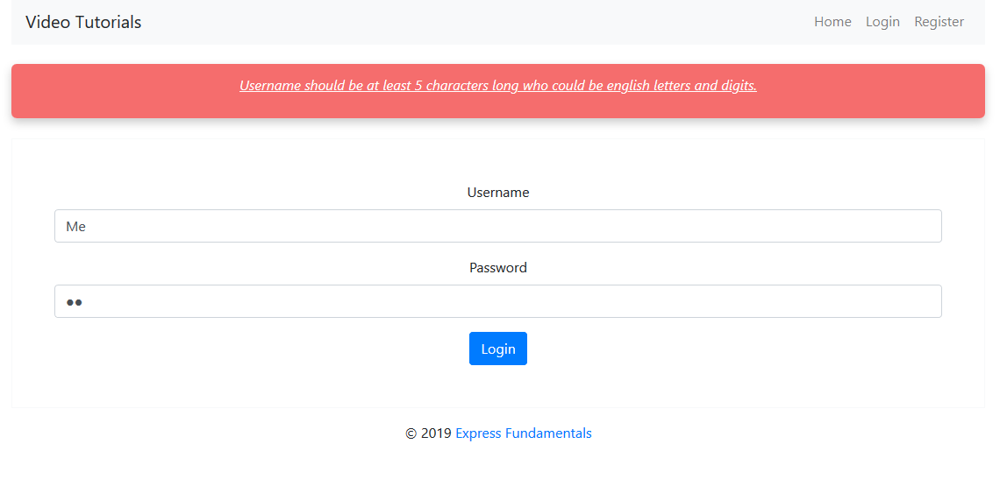

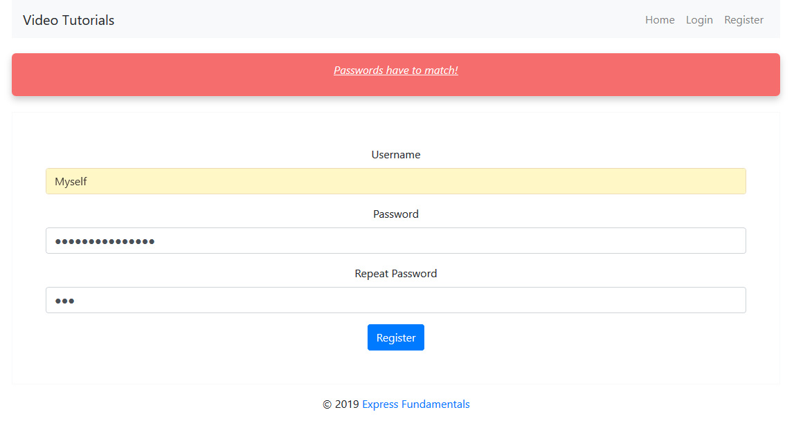

### Course

You should make the following validations while **creating** or **editing a
course**:

-   The **title** should be **at least 4 characters**

-   The **description** should be **at least 20 characters** long

-   The **imageUrl** should be **starts with http or https**

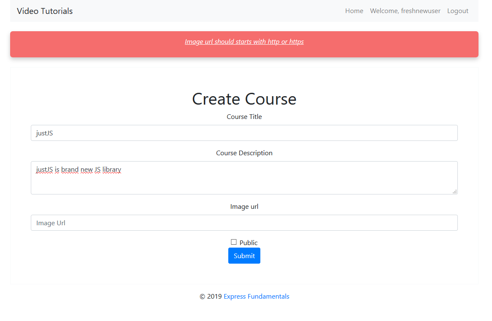

**8\. \*Bonus (10 Pts)**
----

**Search in courses.** Filter only the **courses names** that **include the
searched string** (**case-insensitive**).

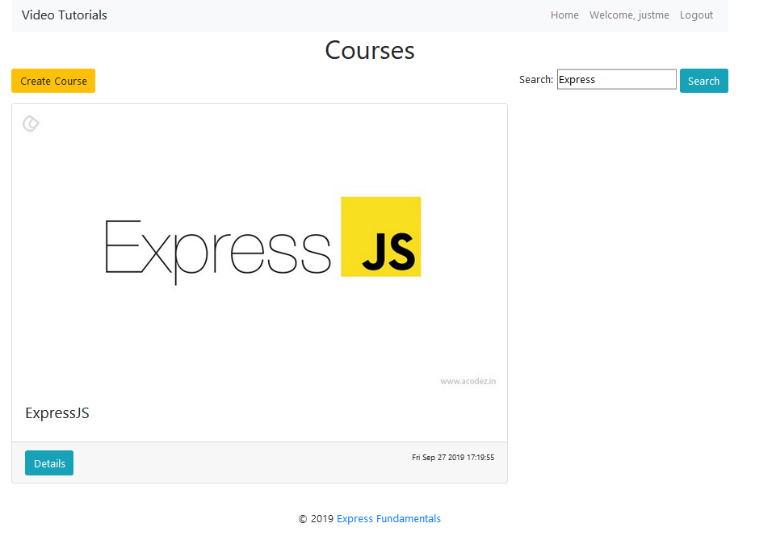
