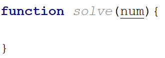
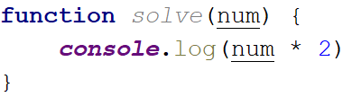
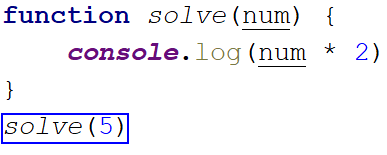
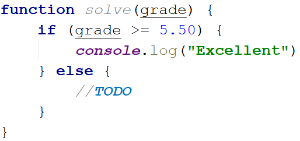
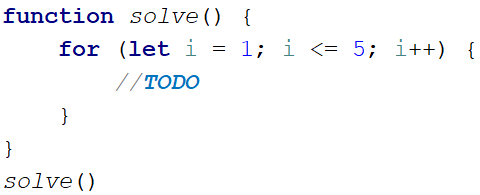
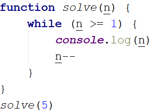
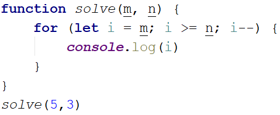
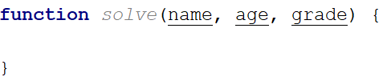
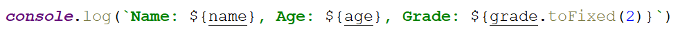

Lab: JS Basic Syntax, Conditional Statements and Loops
======================================================

Problems for in-class lab for the ["Technology Fundamentals" course \@
SoftUni](https://softuni.bg/modules/57/tech-module-4-0) .  
Submit your solutions in the SoftUni judge system at:
<https://judge.softuni.bg/Contests/1189/Lab-Intro-and-Basic-Syntax>

01\. Multiply Number by 2
--------------------

Write a function that receives a number and prints as result that number multiplied by two

### Examples

| **Input** | **Output** |
|-----------|------------|
| 2         | 4          |
| 5         | 10         |
| 20        | 40         |

### Hints

Create a function called **solve** (or some other name). As parameters it will receive a number **num**.  

Print the result inside the function

If you want to test your code locally, you need to call the function

02\. Excellent Grade
---------------

Write a function that receives a single number and checks if the grade is excellent or not. If it is, print "**Excellent**", otherwise print "**Not excellent**"

### Examples

| **Input** | **Output**    |
|-----------|---------------|
| 5.50      | Excellent     |
| 4.35      | Not excellent |

### Hints

Check if the number given is greater or equal to 5.50 and print the
corresponding result

Numbers from 1 to 5
-------------------

Create a function that prints all the numbers from **1 to 5** (inclusive) each on a separate line

### Hints

Create a for loop starting from 1 and continuing until 5 and print the number

03\. Numbers from N to 1
-------------------

Create a function that receives a number **N** and prints all the numbers from **N to 1**. Try using while loop

### Examples

| **Input** | **Output** |
|-----------|------------|
| 5         | 5 4 3 2 1  |
| 3         | 3 2 1      |

### Hints

Create a while loop with condition **N \>= 1**. Print **N** and decrease it with
each step

04\. Numbers from M to N
-------------------

Write a function that receives a number **M** and a number **N** (M will always be bigger than N). Print all numbers from **M to N**

### Examples

| **Input** | **Output** |
|-----------|------------|
| 6 2       | 6          |
|           | 5 4 3 2    |
| 4 1       | 4 3 2 1    |

### Hints

Use for or while loop and print the numbers.

05\. Student Information
-------------------

You will be given **3 parameters** – student name (string), age (number) and
average grade (number). Your task is to print all the info about the student in
the following format. The grade should be formatted to the **second decimal**
point:

"**Name: {student name}, Age: {student age}, Grade: {student grade}**".

### Examples

| **Input**           | **Output**                        |
|---------------------|-----------------------------------|
| 'John', 15, 5.54678 | Name: John, Age: 15, Grade: 5.55  |
| 'Steve', 16, 2.1426 | Name: Steve, Age: 16, Grade: 2.14 |
| 'Marry', 12, 6.00   | Name: Marry, Age: 12, Grade: 6.00 |

### Hint

>   Use **toFixed()** method to format the grade.

1.  First receive the input:

    

2.  Print the output:

    

06\. Month Printer
-------------

Write a program, which takes an **integer** from the console and prints the
corresponding **month**. If the number **is more than 12** or **less than 1**
print "**Error!**"

### Input

You will receive a **single number**.

### Output

If the number is within the boundaries print the corresponding month, otherwise
print "**Error!**"

### Examples

| **Input** | **Output** |   | **Input** | **Output** |
|-----------|------------|---|-----------|------------|
| 2         | February   |   | 13        | Error!     |

07\. Foreign Languages
-----------------

Write a program, which prints the language, that a given country speaks. You can
receive only the following combinations: English **is spoken** in England and
USA; Spanish **is spoken** in Spain, Argentina and Mexico; for the others**,**
we should print "unknown".

### Input

You will receive a **single country name**.

### Output

**Print** the **language**, which the country **speaks**, or if it is
**unknown** for your program, print **"unknown"**.

### Examples

| **Input** | **Output** |   | **Input** | **Output** |
|-----------|------------|---|-----------|------------|
| USA       | English    |   | Germany   | unknown    |

### Hint

Think how you can **merge** multiple cases, in order to **avoid** writing more
code than you need to.

08\. Theatre Promotions
------------------

A theatre **is doing a ticket sale**, but they need a program **to** calculate
the price of a single ticket. If the given age does not fit one of the
categories**,** you should print "Error!". You can see the prices i**n** the
table below:

| **Day / Age** | **0 \<= age \<= 18** | **18 \< age \<= 64** | **64 \< age \<= 122** |
|---------------|----------------------|----------------------|-----------------------|
| **Weekday**   | 12\$                 | 18\$                 | 12\$                  |
| **Weekend**   | 15\$                 | 20\$                 | 15\$                  |
| **Holiday**   | 5\$                  | 12\$                 | 10\$                  |

### Input

The input comes in **two parameters**. The **first** one will be the **type of
day (string)**. The **second** – the **age** of the person (number).

### Output

Print the price of the ticket according to the table, or "**Error!**" if the age
is not in the table.

### Constraints

-   The age will be in the interval **[-1000…1000]**.

-   The type of day will **always be valid**.

### Examples

| **Input**     | **Output** |   | **Input**      | **Output** |   | **Input**     | **Output** |   |
|---------------|------------|---|----------------|------------|---|---------------|------------|---|
| 'Weekday', 42 | 18\$       |   | 'Holiday', -12 | Error!     |   | 'Holiday', 15 | 5\$        |   |

09\. Divisible by 3
--------------

Write a program, which prints all the numbers from **1 to 100**, which are
**divisible by 3**. You have to use a single **for** loop. The program should
not receive input.

10\. Sum of Odd Numbers
------------------

Write a program that prints the next **n odd numbers** (starting from 1) and on
the **last row** prints the **sum of them**.

### Input

You will receive a number – **n**. This number shows how many **odd numbers** you should print.

### Output

Print the next **n** odd numbers, starting from **1**, separated by **new
lines**. On the last line, print the **sum** of these numbers.

### Constraints

-   **n** will be in the interval **[1…100]**

### Examples

| **Input** | **Output**        |   | **Input** | **Output**   |
|-----------|-------------------|---|-----------|--------------|
| 5         | 1 3 5 7 9 Sum: 25 |   | 3         | 1 3 5 Sum: 9 |

11\. Multiplication Table
--------------------

You will receive a **number** as an input from the console. Print the **10 times
table** for this **number**. See the examples below for more information.

### Output

Print every row of the table in the following format:

{number} X {times} = {product}

### Constraints

-   The number will be an **integer** will be in the interval **[1…100]**

### Examples

| **Input** | **Output**                                                                                                    |   | **Input** | **Output**                                                                                                 |
|-----------|---------------------------------------------------------------------------------------------------------------|---|-----------|------------------------------------------------------------------------------------------------------------|
| 5         | 5 X 1 = 5 5 X 2 = 10 5 X 3 = 15 5 X 4 = 20 5 X 5 = 25 5 X 6 = 30 5 X 7 = 35 5 X 8 = 40 5 X 9 = 45 5 X 10 = 50 |   | 2         | 2 X 1 = 2 2 X 2 = 4 2 X 3 = 6 2 X 4 = 8 2 X 5 = 10 2 X 6 = 12 2 X 7 = 14 2 X 8 = 16 2 X 9 = 18 2 X 10 = 20 |
