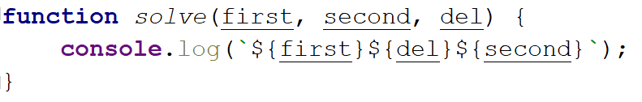
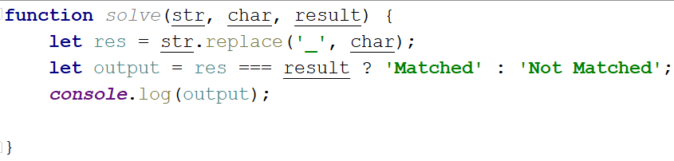
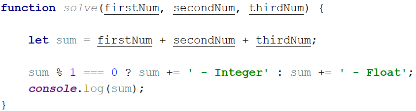
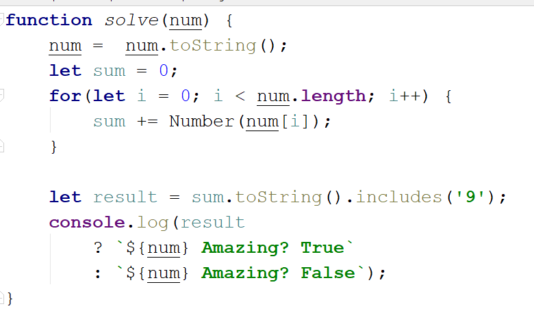
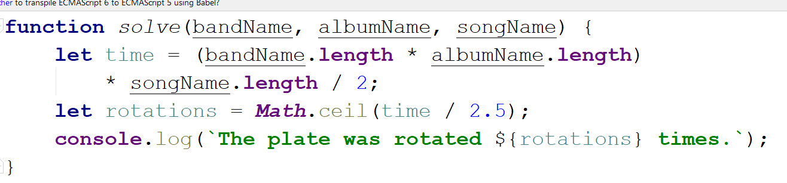
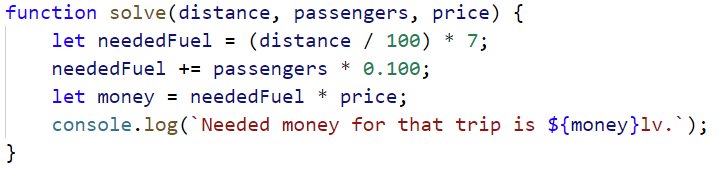
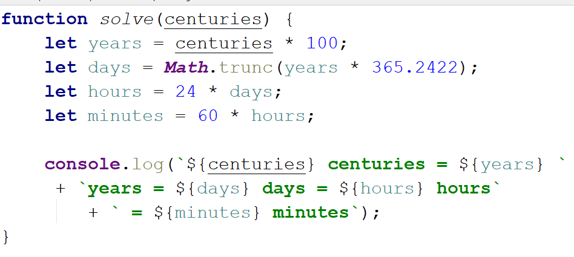
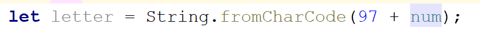

Lab: Data Types and Variables
=============================

Problems for in-class lab for the ["JS Fundamentals " course \@
SoftUni](https://softuni.bg/trainings/2343/js-fundamentals-may-2019).  
Submit your solutions in the SoftUni judge system at:
[Data-Types-and-Variables-Lab](https://judge.softuni.bg/Contests/1242/Data-Types-and-Variables-Lab)

01\. Concatenate Names
------------

Write a **function** which receives two **names** as **string parameters** and a
**delimiter**. Print the names **joined** by the delimiter.

**Examples**

| **Input**               | **Output**    |
|-------------------------|---------------|
| 'John', 'Smith', '-\>'  | John-\>Smith  |
| 'Jan', 'White', '\<-\>' | Jan\<-\>White |
| 'Linda', 'Terry', '=\>' | Linda=\>Terry |

### Hints

Use [string
interpolation](https://developer.mozilla.org/en-US/docs/Web/JavaScript/Reference/Template_literals).

02\. Right Place
-----------

You will receive **3 parameters (string, char, string).**  
First string will be a word with a **missing char** replaced with a underscore
'**\_**'  
You have to **replace** the character with the missing part (**underscore**)
from the first string and **compare** the result with the second string.

If they are equals you should print "**Matched**", otherwise print "**Not
Matched**".

### Examples

| **Input**               | **Output**  |
|-------------------------|-------------|
| 'Str_ng', 'I', 'Strong' | Not Matched |
| 'Str_ng', 'i', 'String' | Matched     |

### Hints

03\. Integer and Float
-----------------

You will receive **3 numbers**. Your task is to find their **sum** and print it
to the console with the addition  
" **- {type of the number (Integer or Float)}**":

### Examples

| **Input**     | **Output**    |
|---------------|---------------|
| 9, 100, 1.1   | 110.1 - Float |
| 100, 200, 303 | 603 - Integer |

### Hints

04\. Amazing Numbers
---------------

Write a **function** which as **input** will receive a **number**.

**Check** and print if it is **amazing** or **not** into the following format:

**"{number} Amazing? {result}"**

An amazing number is one that includes the **digit 9** the sum of its digits.

Examples for amazing numbers are 1233 (1 + 2 + 3 + 3 = 9), 583472 (5 + 8 + 3 + 4 + 7 + 2 = 29)

### Examples

| **Input** | **Output**         |
|-----------|--------------------|
| 1233      | 1233 Amazing? True |
| 999       | 999 Amazing? False |

### Hints

Use **includes()**

05\. Gramophone
----------

Write a **function** which as **input** will receive **3 parameters (strings)**

-   **First string** is the name of the **band**

-   **Second string** is the name of the **album**

-   **The third** is holding a **song** name from the album

You have to find out how many **times** the plate will **rotate** the given song
from the album.

*The plate makes a full rotation every 2.5 seconds.*

The song **duration in seconds** is calculate by the given formula:

**albumName.length \* bandName.length) \* song name.length / 2**

As **output** you should print the following message:

**"The plate was rotated {rotations} times."**

Rotations should be **rounded up**.

### Examples

| **Input**                               | **Output**                       |
|-----------------------------------------|----------------------------------|
| 'Black Sabbath', 'Paranoid', 'War Pigs' | The plate was rotated 167 times. |

### Hints

06\. Fuel Money
----------

Write a **function** which **calculates** how much **money** for fuel will be
needed to drive а bus from one place to another.Consider the following:

-   Calculate **the fuel** by knowing that **an empty bus** can pass **100 km**
    with **7L** diesel.

-   **One person** in that bus excluding the driver increases fuel consumption
    by **100 milliliters**.

-   The **money** is calculated by **multiplying** the **fuel price** with the
    **needed fuel** for the trip.

As **input** you will receive **3 parameters (**the **distance** the bus must
travel**,** the **passengers** in it and the **price** for **1 liter of
diesel)**

As **output** you should print this message: **"Needed money for that trip is
{neededMoney} lv"**

### Examples

| **Input**    | **Output**                              |
|--------------|-----------------------------------------|
| 260, 9, 2.49 | Needed money for that trip is 47.559lv. |
| 90, 14, 2.88 | Needed money for that trip is 22.176lv. |

### Hints

07\. Centuries to Minutes
--------------------

Write program to receive a **number** of **centuries** and convert it to
**years**, **days**, **hours** and **minutes**.

**Examples**

| **Input** | **Output**                                                                |
|-----------|---------------------------------------------------------------------------|
| 1         | 1 centuries = 100 years = 36524 days = 876576 hours = 52594560 minutes    |
| 5         | 5 centuries = 500 years = 182621 days = 4382904 hours = 262974240 minutes |

**Hint**

-   Assume that a year has 365.2422 days at average ([the Tropical
    year](https://en.wikipedia.org/wiki/Tropical_year)).

**Solution**

You might help yourself with the code below:

08\. Special Numbers
---------

Write a program to receive a number **n** and for all numbers in the range
**1…n** print the number and if it is special or not (**True** / **False**).

A **number** is **special** when its **sum of digits is 5, 7 or 11**.

**Examples**

| **Input** | **Output**                                                                                                                                                                             |
|-----------|----------------------------------------------------------------------------------------------------------------------------------------------------------------------------------------|
| 15        | 1 -\> False 2 -\> False 3 -\> False 4 -\> False 5 -\> True 6 -\> False 7 -\> True 8 -\> False 9 -\> False 10 -\> False 11 -\> False 12 -\> False 13 -\> False 14 -\> True 15 -\> False |

**Hints**

To calculate the sum of digits of given number **num**, you might repeat the
following: sum the last digit (**num % 10**) and remove it (**sum = sum / 10**)
until **num** reaches **0**. Use **parseInt()** while dividing to get only
integer numbers.

09\. Triples of Latin Letters
-------------

Write a program to receive a **number n** and print all **triples** of the first
**n small Latin letters**, ordered alphabetically:

**Examples**

| **Input** | **Output**                                                                                                  |
|-----------|-------------------------------------------------------------------------------------------------------------|
| 3         | aaa aab aac aba abb abc aca acb acc baa bab bac bba bbb bbc bca bcb bcc caa cab cac cba cbb cbc cca ccb ccc |

**Hints**

Perform 3 nested loops from **0** to **n**. For each number **num** print its
corresponding Latin letter as follows:

The function **String.fromCharCode()** gets the value in **decimal** and
transforms it to a character from the **ASCII table**.
