Lab: Arrays
===========

Problems for in-class lab for the ["JS Fundamentals - May
2019"](https://softuni.bg/trainings/2343/js-fundamentals-may-2019). Submit your
solutions in the SoftUni judge system at
[judge.softuni.bg/Contests/1243/Arrays-Lab](https://judge.softuni.bg/Contests/1243/Arrays-Lab).

01\. Sum First and Last Array Elements
---------------------------------

Write a function that receives an **array of strings** and prints the sum of **first** and **last** element in that array.

### Examples

| **Input**                | **Output** |
|--------------------------|------------|
| ['20', '30', '40']       | 60         |
| ['10', '17', '22', '33'] | 43         |
| ['11', '58', '69']       | 80         |

### Hints

-   Use the **Number()** function

    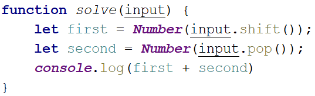

02\. Day of Week
-----------

Write a program which receives a **number** and prints the corresponding **name** of the **day** of week.

If the number is **NOT** a valid day, print '**Invalid day!**'.

### Examples

| **Input** | **Output**   |
|-----------|--------------|
| 3         | Wednesday    |
| 6         | Saturday     |
| 11        | Invalid day! |

### Hints

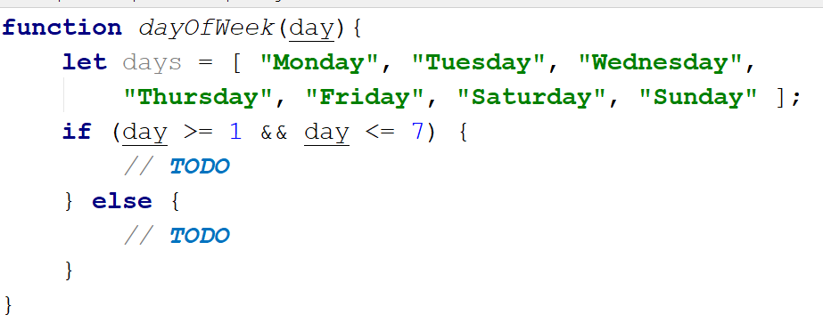

03\. Reverse an Array of Numbers
---------------------------

Write a program which receives a number **n** and an **array** of elements. Your task is to **create** a new array with **n** numbers, **reverse** it and print its elements on a single line, space separated.

### Examples

| **Input**               | **Output** |
|-------------------------|------------|
| 3, [10, 20, 30, 40, 50] | 30 20 10   |
| 4, [-1, 20, 99, 5]      | 5 99 20 -1 |
| 2, [66, 43, 75, 89, 47] | 43 66      |

### Hints

-   Use **push()** to add elements inside the new array

    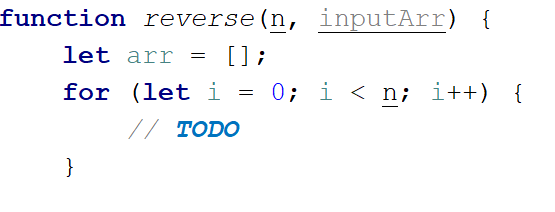

-   Use **string interpolation** for the output

    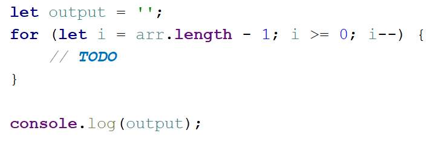

04\. Reverse an Array of Strings
---------------------------

Write a program which receives an **array of strings** (space separated values). Your task is to reverse it and print its elements. **Swap** elements.

### Examples

| **Input**                           | **Output**          | **Comments**                                                                    |
|-------------------------------------|---------------------|---------------------------------------------------------------------------------|
| ['a', 'b', 'c', 'd', 'e']           | e d c b a           | The first element should be **last**, and the last element should be **first**. |
| ['abc', 'def', 'hig', 'klm', 'nop'] | nop klm hig def abc |                                                                                 |
| ['33', '123', '0', 'dd']            | dd 0 123 33         |                                                                                 |

### Hints

-   Loop to the **half-length** of the array

-   Create a function to swap **two elements** inside an array

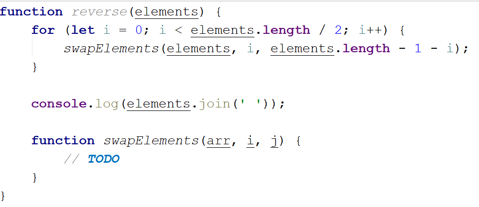

05\. Sum Even Numbers
----------------

Write a program which receives an **array** of strings**, parse** them to numbers and **sum** only the **even** numbers.

### Examples

| **Input**                 | **Output** |
|---------------------------|------------|
| ['1','2','3','4','5','6'] | 12         |
| ['3','5','7','9']         | 0          |
| ['2','4','6','8','10']    | 30         |

### Hints

-   Parse each string to number

    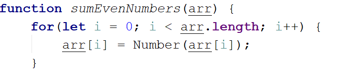

-   Create a variable for the sum

    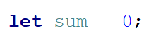

-   Iterate through all elements in the array with **for-of** loop

-   Check if the number is **even**

    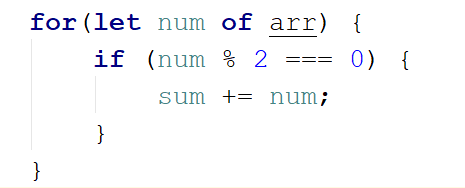

-   Print the total sum

06\. Even and Odd Subtraction
------------------------

Write a program that calculates the **difference** between the sum of the **even** and the sum of the **odd** numbers in an array.

### Examples

| **Input**     | **Output** | **Comments**                              |
|---------------|------------|-------------------------------------------|
| [1,2,3,4,5,6] | 3          | 2 + 4 + 6 = 12, 1 + 3 + 5 = 9, 12 - 9 = 3 |
| [3,5,7,9]     | \-24       |                                           |
| [2,4,6,8,10]  | 30         |                                           |

### Hints

-   Parse each string to number

    

-   Create two variables - for **even** and **odd** sum

    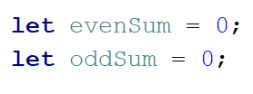

-   Iterate through all elements in the array with **for-of** loop and check if
    the number is odd or even

    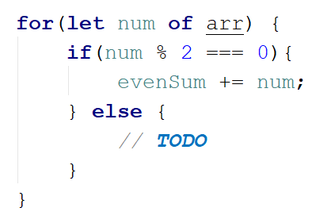

-   Print the difference

07\. Equal Arrays
------------

Write a program which receives **two string arrays** and print on the console whether they are **identical** or NOT.

Arrays are identical if their elements are **equal**. If the arrays are
identical find the **sum** of the first one and print on the console following message:

'**Arrays are identical. Sum: {sum}**'

If the arrays are **NOT identical** find the **first index** where the arrays **differ** and print on the console following message:

'**Arrays are not identical. Found difference at {index} index**'.

### Examples

| **Input**                                    | **Output**                                            |
|----------------------------------------------|-------------------------------------------------------|
| ['10','20','30'], ['10','20','30']           | Arrays are identical. Sum: 60                         |
| ['1','2','3','4','5'], ['1','2','4','4','5'] | Arrays are not identical. Found difference at 2 index |
| ['1'], ['10']                                | Arrays are not identical. Found difference at 0 index |

### Hints

-   First, we receive **two** arrays of strings and parse them.

    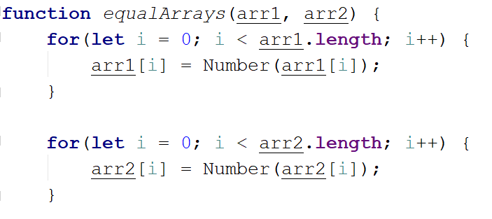

-   Iterate through the arrays and **compare all element**. If the elements are
    **NOT equal** print the required message and break the loop.

    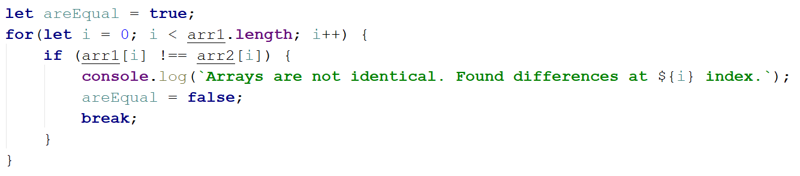

-   Think about how to solve the other part of the problem.

08\. Condense Array to Number
------------------------

Write a program which receives **an array of numbers** and **condense** them by **summing** adjacent couples of elements until a **single number** is obtained.

### Examples

For example, if we have 3 elements **[2, 10, 3]**, we sum the first two and the
second two elements and obtain **{2+10, 10+3} = {12, 13}**, then we sum again
all adjacent elements and obtain **{12+13} = {25}.**

| **Input**   | **Output** | **Comments**                                                               |
|-------------|------------|----------------------------------------------------------------------------|
| [2,10,3]    | 25         | 2 10 3 2+10 10+3 12 13 12 + 13 25                                          |
| [5,0,4,1,2] | 35         | 5 0 4 1 2 5+0 0+4 4+1 1+2 5 4 5 3 5+4 4+5 5+3 9 9 8 9+9 9+8 18 17 18+17 35 |
| [1]         | 1          | 1 is already condensed to number                                           |

### Hints

While we have more than one element in the array **nums[]**, repeat the
following:

-   Allocate a new array **condensed[]** of size **nums.Length-1**.

-   Sum the numbers from **nums[]** to **condensed[]**:

    -   condensed[i] = nums[i] + nums[i+1]

-   nums[] = condensed[]

The process is illustrated below:

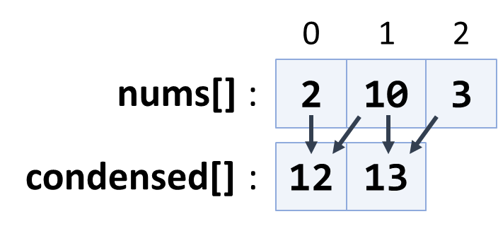

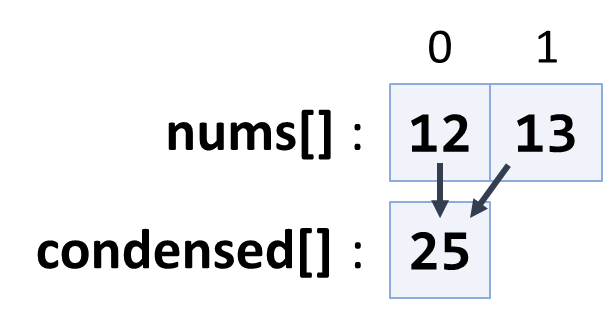
